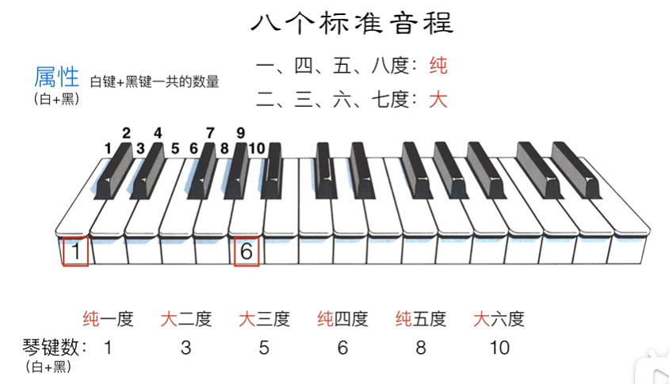
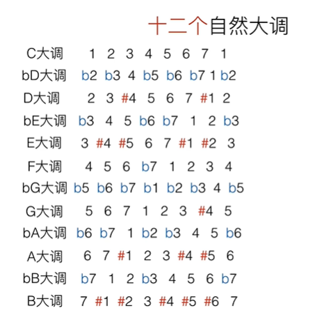

## 音程

### 识别方法

> 这里的**减**五度理解成 5-0.5 就行了
>
> 同理：**加**五度理解成 5+0.5

### 属性

一共有七种属性：纯，大/小，增/减，倍增/倍减

纯：只有一四五八度有

大/小：只有二三六七度有

倍增/倍减：共有属性

### 八个标准音程

## 和弦

### 概念

> 和弦最多七个音：因为再往下会重复do音

### 名称

### 详细分类

## 三和弦

## 七和弦

## 和弦转位

### 三和弦转位

### 七和弦转位

## 自然大调

听起来像12345671的音阶

