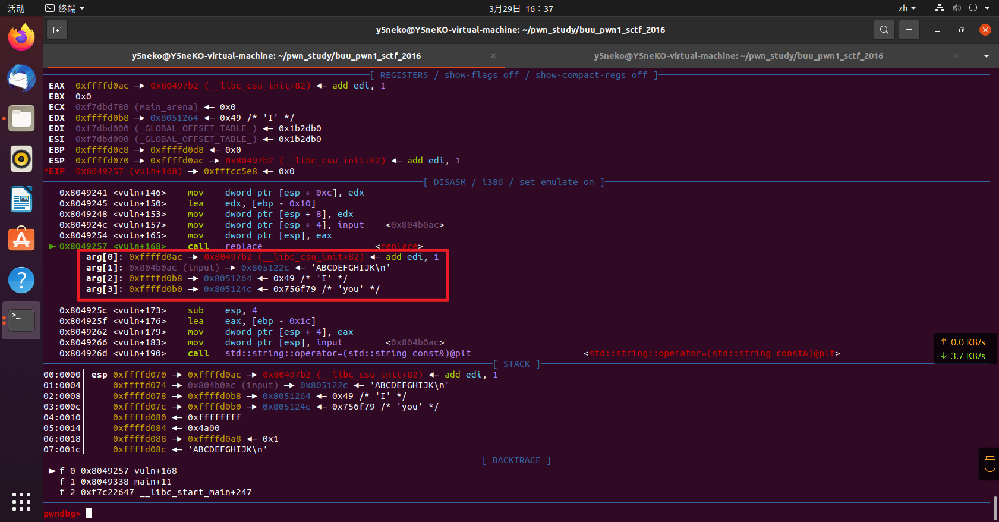

## pwn1_sctf_2016

首先checksec


发现是32位且开启了栈不可执行，ida分析源码，跟进到vuln函数，通过伪代码看出是C++


第13行存在fgets函数向变量s中写入限制长度为32的字符，观察s分配的空间到ebp的距离为0x3c，32位并不足以溢出到目标地址

接着往下，发现replace函数，分析传入的三个参数分别

- 首先第一个变量v4，观察涉及到v4的操作，可以看到20行对v4进行了操作，此时v4传入16行的字符串"you"


- 第二个变量input，是通过我们输入的变量s传递过来的


- 第三个v7，同样的方法，此时v7传入的是18行的字符串"I"


接着跟进replace函数，功能有点太复杂了，通过函数名猜测为字符串替换


27行将v1对变量s重新赋值，而v1在26行接收了replace函数处理后的字符串

正好最后有个printf函数打印处理后的字符串，我们直接执行elf文件，带上刚刚涉及到的几个字符串即可


使用gdb动态调试验证一下




可以看到所有的"I"被替换成了"you"，结合一下27行的strcpy函数，将v1的数据填入了s，至此我们可以构造payload

首先s到ebp的偏移量为0x3c=60个字节，ebp本身有4个字节，fgets获取输入的32个字符，然后I会被替换成you

因此我们需要20个字节"I" + 4字节 + 目标地址

回到ida我们可以找到get_flag函数，地址为0x08048F0D


编写exp如下

```python
from pwn import *

io = process("./pwn1_sctf_2016")

flag_addr = 0x08048F0D
payload = b'I'*20 + b'A'*4 + p32(flag_addr)

io.sendline(payload)
io.interactive()
```


