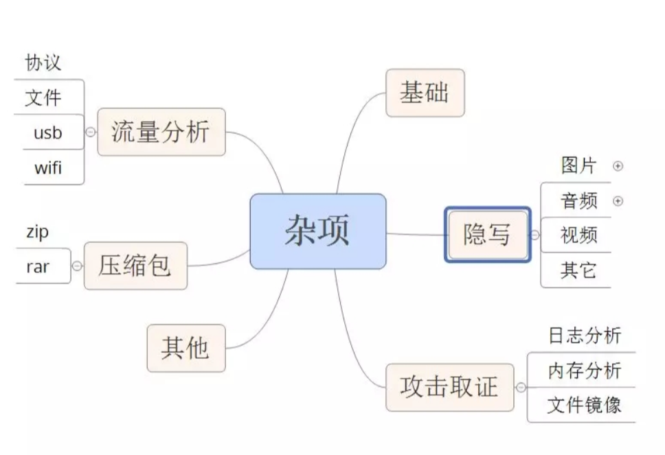
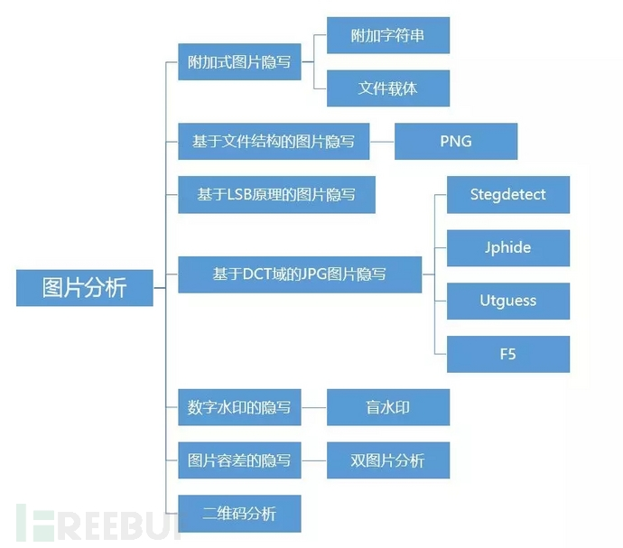
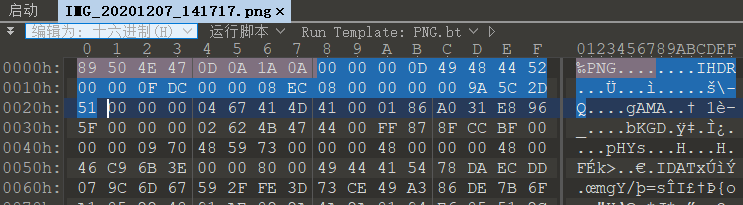
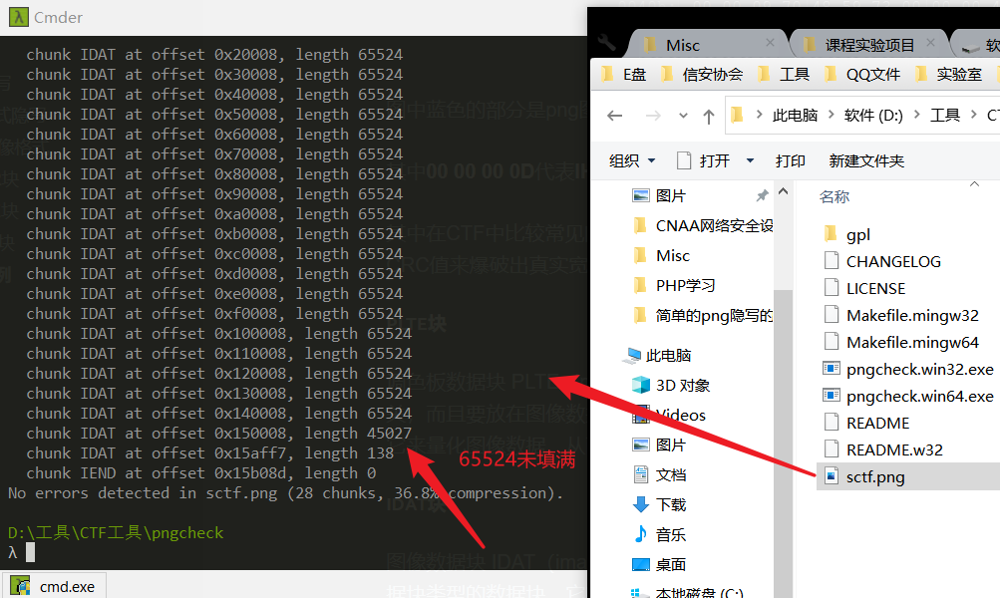
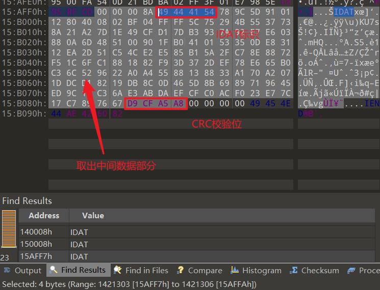
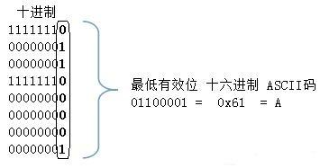
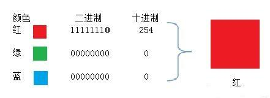

# Misc 隐写题



## 图像隐写



### 附加式隐写

**字符串附加：**直接通过十六进制分析软件查看即可

**文件载体附加：**利用些特殊的方式将图片文件与压缩包文件结合起来的文件，这类的文件一般保存为图片文件格式，可以正常显示图片。由于操作系统识别的过程中是，从文件头标志，到文件的结束标志位，当系统识别到图片的结束标志位后，默认是不再继续识别的，所以我们在通常情况下只能看到它是只是一张图片。

### 文件结构式隐写

#### PNG图像格式

PNG图像格式文件由一个**8字节**的文件头和按照特定结构组织的3个以上的**数据块（chunk）**组成。

PNG文件格式：**文件头（89 59 4E 47 0D 0A 1A 0A）**+数据块+数据块+数据块+......

PNG图片定义了两种类型的数据块，一种是称为**关键数据块**，这是必须的数据块，另一种称为**辅助数据块**，这是可选的数据块。

**关键数据块**定义了4个标准数据块，分别为**IHDR**、**PLTE**、**IDAT**和**IEND**，每个PNG文件都必须包含它们，PNG读写软件也都必须要支持这些数据块。

每个数据块都会包含**长度**、**数据块类型码**、**数据块数据**和**循环冗余校验（CRC）**四个部分。

> CRC域的值是数据块类型码和数据域的数据计算而来的。

##### IHDR块



图中蓝色的部分是png图片的**IHDR数据块**

其中**00 00 00 0D**代表**IHDR**块长度为13，**49 48 44 52**为**IHDR**标识，**00 00 0F DC**代表图片的宽，**00 00 08 EC**代表图片的高

其中在CTF中比较常见的png图片格式隐写是，通过修改IHDR数据块中的宽高使图片显示不完整以隐藏部分信息，一般情况下是通过正常CRC值来爆破出真实宽高，这里有个非常实用的工具：**TweakPNG**，它是用来校验png图片的，直接打开png图片就可以检测。

##### PLTE块

调色板数据块 PLTE（palette chunk）：它包含有与索引彩色图像（indexed-color image）相关的彩色变换数据，它仅与索引彩色图像有关，而且要放在图像数据块（image data chunk）之前。真彩色的 PNG 数据流也可以有调色板数据块，目的是便于非真彩色显示程序用它来量化图像数据，从而显示该图像。

##### IDAT块

图像数据块 IDAT（image data chunk）：它存储实际的数据，在数据流中可包含多个连续顺序的图像数据块。这是一个可以存在多个数据块类型的数据块。它的作用就是存储着图像真正的数据。IDAT采用 LZ77 算法的派生算法进行压缩，可以用 zlib 解压缩。

> IDAT 块只有当上一个块充满时，才会继续一个新的块。

###### 实例

一道ctf题，使用**pngcheck**进行检测



发现倒数第二个IDAT数据块未写满，就往下写了，说明存在异常IDAT数据块，010editor打开图片找到最后一个IDAT数据块



```hex
789C5D91011280400802BF04FFFF5C75294B5537738A21A27D1E49CFD17DB3937A92E7E603880A6D485100901FB0410153350DE83112EA2D51C54CE2E585B15A2FC78E8872F51C6FC1881882F93D372DEF78E665B0C36C529622A0A45588138833A170A2071DDCD18219DB8C0D465D8B6989719645ED9C11C36AE3ABDAEFCFC0ACF023E77C17C7897667
```

经调查**789C**为**zlib**压缩文件头，这里仅展示png隐写部分，剩下步骤省略。

##### IEND块

图像结束数据 IEND（image trailer chunk）：它用来标记 PNG 文件或者数据流已经结束，并且必须要放在文件的尾部。IEND 数据块的长度总是 **00 00 00 00**，数据标识总是 IEND **49 45 4E 44**，因此，CRC 码也总是 **AE 42 60 82**

### LSB隐写

LSB 隐写术，即**最低有效位（Least Significant Bit）隐写术**。是一种比较简单的基于二进制的隐写方式，能将一个完整的文件隐藏进另一张图片中。图像一般都是以**RGB三原色**的方式存储的，存储后R（红）、G（绿）、B（蓝）三组数据按顺序规律排列，每个的取值范围为**0~255**，范围对应的二进制值就是**00000000-11111111**，LSB就是把一个文件的二进制每一位拆分修改到图片的色彩数据的二进制值最低位。



当隐藏信息的载体图片被按照**LSB算法**修改后，对于文件本身，**只是色彩数据每个字节的十进制值存在一个+1或者0的变化**，对应色彩的变化更是**小到肉眼无法发现**。举例最简单的纯红色（RGB 255,0,0），在红色位置修改最低位二进制值后，无明显变化：



#### 注意

该隐写方式**一般**只能用于PNG、BMP这类无损格式，像JPEG这种有损格式是不会有的。

> 判断格式不能看文件扩展名，扩展名并不完全能代表一个图片的格式，需要看文件的二进制数据头

1. **PNG**：89 50 4E 47 0D 0A 1A 0A（文件头）
2. **BMP**：42 4D （B M）（文件头）
3. **JPEG**：FF D8（文件头）、FF D9（文件尾）

该隐写方式在CTF中属于一种比较常见的隐写方式，当你通过二进制查看原图无法发现线索时，就可以考虑算法隐写，就可以试着通过LSB提取信息，判断是否有效。

### F5隐写

### outguess隐写

### Base64隐写

### NTFS流隐写

https://www.freebuf.com/column/205245.html