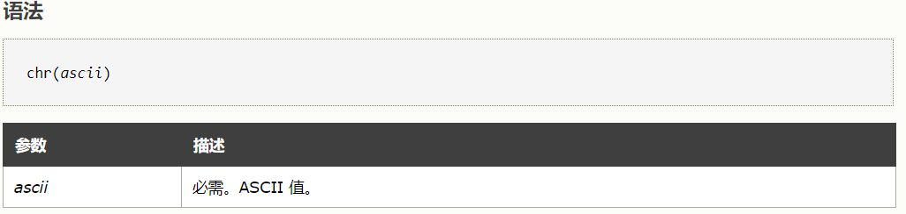

## PHP

### 函数

is_numeric()：函数用于检测变量是否为数字或数字字符串。
方法：
php弱类型比较：字符串和数字比较使用==时,字符串会先转换为数字类型再比较。

### php伪协议

php://filter/convert.base64-encode/resource=xxx.php

### MD5()函数漏洞

```php
$_GET['name'] != $_GET['password'] 
MD5($_GET['name']) == MD5($_GET['password'])
```

方法：
GET传入**a=QNKCDZO&b=240610708**即可绕过

### @parse_str($id)函数缺陷漏洞

@parse_str($id); 这个函数不会检查变量 $id 是否存在，如果通过其他方式传入数据给变量$id ,且当前$id中数据存在，它将会直接覆盖掉。
方法：
参考https://blog.csdn.net/zhangpen130/article/details/103965191

### Linux shell命令执行

对于看到ping或者ping命令却没有弄waf时就要想到命令注入

看到ping命令就可以利用截断来执行新的命令。
首先测试所有的截断符号：

```php
$
;
|
-
(
)
反引号
||
&&
&
}
{
可以当作空格来用：
换行符%0a
回车符%0d
连续指令;
/**/
shell环境变量$IFS
```

### 渲染函数render()

可以通过render()函数判断为模板注入

### 空格绕过waf

假如waf不允许num变量传递字母：

```php
http://www.xxx.com/index.php?num = aaaa   //显示非法输入的话
```

那么我们可以在num前加个空格：

```php
http://www.xxx.com/index.php? num = aaaa
```

这样waf就找不到num这个变量了，因为现在的变量叫“ num”，而不是“num”。但php在解析的时候，会先把空格给去掉，这样我们的代码还能正常运行，还上传了非法字符。

### chr()替代字符

chr() 函数从指定的 ASCII 值返回字符，ASCII 值可被指定为十进制值、八进制值或十六进制值。八进制值被定义为带前置 0，而十六进制值被定义为带前置 0x。

通常可用以绕过检测



### sql注入绕过

绕过方法：

```php
可用来绕过检测关键字
<>
双写 //没有for循环的str_replace
```

