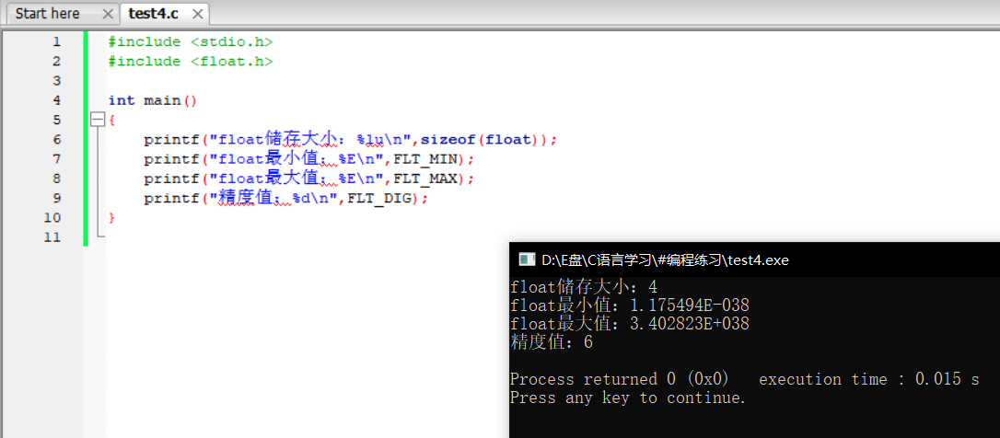
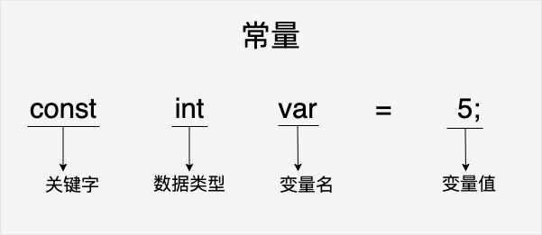
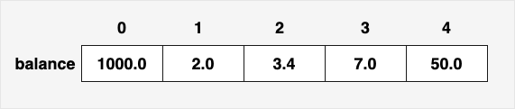

## C语言初级

### 简介

C 语言是一种通用的高级语言，最初是由丹尼斯·里奇在贝尔实验室为开发 UNIX 操作系统而设计的。C 语言最开始是于 1972 年在 DEC PDP-11 计算机上被首次实现。

在 1978 年，布莱恩·柯林汉（Brian Kernighan）和丹尼斯·里奇（Dennis Ritchie）制作了 C 的第一个公开可用的描述，现在被称为 K&R 标准。

UNIX 操作系统，C编译器，和几乎所有的 UNIX 应用程序都是用 C 语言编写的。由于各种原因，C 语言现在已经成为一种广泛使用的专业语言。

- 易于学习。
- 结构化语言。
- 它产生高效率的程序。
- 它可以处理底层的活动。
- 它可以在多种计算机平台上编译。

- 所有的 C 语言程序都需要包含 **main()** 函数。 代码从 **main()** 函数开始执行。
- **/\* ... \*/** 用于注释说明。
- **printf()** 用于格式化输出到屏幕。**printf()** 函数在 **"stdio.h"** 头文件中声明。
- **stdio.h** 是一个头文件 (标准输入输出头文件) , **#include** 是一个预处理命令，用来引入头文件。 当编译器遇到 **printf()** 函数时，如果没有找到 **stdio.h** 头文件，会发生编译错误。
- **return 0;** 语句用于表示退出程序。

### 程序结构

C 程序主要包括以下部分：

- 预处理器指令
- 函数
- 变量
- 语句 & 表达式
- 注释

C 程序由各种令牌组成，令牌可以是关键字、标识符、常量、字符串值，或者是一个符号。例如，下面的 C 语句包括五个令牌：

```c
printf("Hello, World! \n");
```

这五个令牌分别是：

```c
printf
(
"Hello, World! \n"
)
;
```

在 C 程序中，分号是语句结束符。也就是说，每个语句必须以分号结束。它表明一个逻辑实体的结束。

例如，下面是两个不同的语句：

```c
printf("Hello, World! \n");
return 0;
```

**C 语言有两种注释方式：**


```c
// 单行注释
```

以 **//** 开始的单行注释，这种注释可以单独占一行。

```c
/* 单行注释 */
/* 
 多行注释
 多行注释
 多行注释
 */
```

**/\* \*/** 这种格式的注释可以单行或多行。

您不能在注释内嵌套注释，注释也不能出现在字符串或字符值中。

**C 标识符**是用来标识变量、函数，或任何其他用户自定义项目的名称。一个标识符以字母 A-Z 或 a-z 或下划线 _ 开始，后跟零个或多个字母、下划线和数字（0-9）。

**C 标识符**内不允许出现**标点字符**，比如 @、$ 和 %。C 是**区分大小写**的编程语言。因此，在 C 中，*Manpower* 和 *manpower* 是两个不同的标识符。

### 数据类型

在 C 语言中，数据类型指的是用于声明不同类型的变量或函数的一个广泛的系统。变量的类型决定了变量存储占用的空间，以及如何解释存储的位模式。

C 中的类型可分为以下几种：

| 序号 | 类型与描述                                                   |
| :--- | :----------------------------------------------------------- |
| 1    | **基本类型：** 它们是算术类型，包括两种类型：整数类型和浮点类型。 |
| 2    | **枚举类型：** 它们也是算术类型，被用来定义在程序中只能赋予其一定的离散整数值的变量。 |
| 3    | **void 类型：** 类型说明符 *void* 表明没有可用的值。         |
| 4    | **派生类型：** 它们包括：指针类型、数组类型、结构类型、共用体类型和函数类型。 |

#### 整数类型

下表列出了关于标准整数类型的存储大小和值范围的细节：

| 类型           | 存储大小    | 值范围                                               |
| :------------- | :---------- | :--------------------------------------------------- |
| char           | 1 字节      | -128 到 127 或 0 到 255                              |
| unsigned char  | 1 字节      | 0 到 255                                             |
| signed char    | 1 字节      | -128 到 127                                          |
| int            | 2 或 4 字节 | -32,768 到 32,767 或 -2,147,483,648 到 2,147,483,647 |
| unsigned int   | 2 或 4 字节 | 0 到 65,535 或 0 到 4,294,967,295                    |
| short          | 2 字节      | -32,768 到 32,767                                    |
| unsigned short | 2 字节      | 0 到 65,535                                          |
| long           | 4 字节      | -2,147,483,648 到 2,147,483,647                      |
| unsigned long  | 4 字节      | 0 到 4,294,967,295                                   |

> 注意，各种类型的存储大小与系统位数有关，但目前通用的以64位系统为主。
>
> 以下列出了32位系统与64位系统的存储大小的差别（windows 相同）：
>
> 

为了得到某个类型或某个变量在特定平台上的准确大小，您可以使用 sizeof 运算符。表达式 sizeof(type) 得到对象或类型的存储字节大小。下面的实例演示了获取 int 类型的大小：

```c
#include <stdio.h>
#include <limits.h>

int main()
{
    printf("int储存大小：%lu",sizeof(int));
    return 0;
}
```


> **%lu** 为 32 位无符号整数

#### 浮点类型

下表列出了关于标准浮点类型的存储大小、值范围和精度的细节：

| 类型        | 存储大小 | 值范围                 | 精度      |
| :---------- | :------- | :--------------------- | :-------- |
| float       | 4 字节   | 1.2E-38 到 3.4E+38     | 6 位小数  |
| double      | 8 字节   | 2.3E-308 到 1.7E+308   | 15 位小数 |
| long double | 16 字节  | 3.4E-4932 到 1.1E+4932 | 19 位小数 |

头文件 float.h 定义了宏，在程序中可以使用这些值和其他有关实数二进制表示的细节。下面的实例将输出浮点类型占用的存储空间以及它的范围值：

```c
#include <stdio.h>
#include <float.h>

int main()
{
    printf("float储存大小：%lu\n",sizeof(float));
    printf("float最小值：%E\n",FLT_MIN);
    printf("float最大值：%E\n",FLT_MAX);
    printf("精度值：%d\n",FLT_DIG);
}
```



> **%E** 为以指数形式输出单、双精度实数

#### Void类型

void 类型指定没有可用的值。它通常用于以下三种情况下：

| 序号 | 类型与描述                                                   |
| :--- | :----------------------------------------------------------- |
| 1    | **函数返回为空** C 中有各种函数都不返回值，或者您可以说它们返回空。不返回值的函数的返回类型为空。例如 **void exit (int status);** |
| 2    | **函数参数为空** C 中有各种函数不接受任何参数。不带参数的函数可以接受一个 void。例如 **int rand(void);** |
| 3    | **指针指向 void** 类型为 void * 的指针代表对象的地址，而不是类型。例如，内存分配函数 **void \*malloc( size_t size );** 返回指向 void 的指针，可以转换为任何数据类型。 |

#### 双引号与单引号

双引号里面的是字符串 而单引号里面的代表字符，只要是在双引号里面的不代表任何表达式的意义：

假如 int a=10 cout<<"a";这是用双引号，它在屏幕上就是 a

而 int a=10 cout<<a; 这个a就代表表达式a=10在屏幕上是10

而int a=10 cout<<‘a’;将会是65，因为用单引号里面的代表字符，而字符要用ASCII码表示

### 变量

变量其实只不过是程序可操作的存储区的名称。C 中每个变量都有特定的类型，类型决定了变量存储的大小和布局，该范围内的值都可以存储在内存中，运算符可应用于变量上。

变量的名称可以由字母、数字和下划线字符组成。它必须以字母或下划线开头。大写字母和小写字母是不同的，因为 C 是大小写敏感的。

| 类型   | 描述                                                         |
| :----- | :----------------------------------------------------------- |
| char   | 通常是一个字节（八位）, 这是一个整数类型。                   |
| int    | 整型，4 个字节，取值范围 -2147483648 到 2147483647。         |
| float  | 单精度浮点值。单精度是这样的格式，1位符号，8位指数，23位小数。 |
| double | 双精度浮点值。双精度是1位符号，11位指数，52位小数。 |
| void   | 表示类型的缺失。                                             |

#### 变量定义

变量定义就是告诉编译器在何处创建变量的存储，以及如何创建变量的存储。变量定义指定一个数据类型，并包含了该类型的一个或多个变量的列表，如下所示：

```c
type variable_list;
```

在这里，**type** 必须是一个有效的 C 数据类型，可以是 char、w_char、int、float、double 或任何用户自定义的对象，**variable_list** 可以由一个或多个标识符名称组成，多个标识符之间用逗号分隔。下面列出几个有效的声明：

```c
int    i, j, k;
char   c, ch;
float  f, salary;
double d;
```

> 不带初始化的定义：带有静态存储持续时间的变量会被隐式初始化为 **NULL**（所有字节的值都是 0），其他所有变量的初始值是**未定义**的。

#### 变量声明

变量声明向编译器保证变量以指定的类型和名称存在，这样编译器在不需要知道变量完整细节的情况下也能继续进一步的编译。变量声明只在编译时有它的意义，在程序连接时编译器需要实际的变量声明。

变量的声明有两种情况：

- 1、一种是需要建立存储空间的。例如：int a 在声明的时候就已经建立了存储空间。
- 2、另一种是不需要建立存储空间的，通过使用extern关键字声明变量名而不定义它。 例如：extern int a 其中变量 a 可以在别的文件中定义的。
- 除非有extern关键字，否则都是变量的定义。

```c
extern int i; //声明，不是定义
int i; //声明，也是定义
```

下面的实例，其中，变量在头部就已经被声明，但是定义与初始化在主函数内：

```c
#include <stdio.h>

int x;
int y;

int addtwonum()
{
    extern int x;
    extern int y;

    x = 1;
    y = 2;
    return x+y;
}

int main()
{
    int result;
    result = addtwonum();

    printf("result为：%d",result);
    return 0;
}
```


如果需要在**一个源文件**中引用**另外一个源文件**中定义的变量，我们只需在引用的文件中将变量加上 **extern** 关键字的声明即可。

addtwonum.c 文件代码：

```c
#include <stdio.h>
/*外部变量声明*/
extern int x ;
extern int y ;
int addtwonum()
{
    return x+y;
}
```

test.c 文件代码：

```c
#include <stdio.h>
  
/*定义两个全局变量*/
int x=1;
int y=2;
int addtwonum();
int main(void)
{
    int result;
    result = addtwonum();
    printf("result 为: %d\n",result);
    return 0;
}
```


#### 左值右值

C 中有两种类型的表达式：

1. **左值（lvalue）：**指向内存位置的表达式被称为左值（lvalue）表达式。左值可以出现在赋值号的左边或右边。
2. **右值（rvalue）：**术语右值（rvalue）指的是存储在内存中某些地址的数值。右值是不能对其进行赋值的表达式，也就是说，右值可以出现在赋值号的右边，但不能出现在赋值号的左边。

变量是左值，因此可以出现在赋值号的左边。数值型的字面值是右值，因此不能被赋值，不能出现在赋值号的左边。

### 常量

常量是固定值，在程序执行期间不会改变。这些固定的值，又叫做**字面量**。

常量可以是任何的基本数据类型，比如整数常量、浮点常量、字符常量，或字符串字面值，也有枚举常量。

**常量**就像是常规的变量，只不过常量的值在定义后不能进行修改。

#### 整数常量

整数常量可以是**十进制**、**八进制**或**十六进制**的常量。前缀指定基数：0x 或 **0X 表示十六进制**，**0 表示八进制**，**不带前缀**则默认表示十进制。

整数常量也可以带一个后缀，后缀是 U 和 L 的组合，U 表示无符号整数（unsigned），L 表示长整数（long）。后缀可以是大写，也可以是小写，U 和 L 的顺序任意。


#### 浮点常量

浮点常量由**整数部分**、**小数点**、**小数部分**和**指数部分**组成。您可以使用小数形式或者指数形式来表示浮点常量。

当使用小数形式表示时，**必须包含整数部分、小数部分，或同时包含两者**。当使用指数形式表示时， 必须包含小数点、指数，或同时包含两者。带符号的指数是用 e 或 E 引入的。

```c
3.14159       /* 合法的 */
314159E-5L    /* 合法的 */
510E          /* 非法的：不完整的指数 */
210f          /* 非法的：没有小数或指数 */
.e55          /* 非法的：缺少整数或分数 */
```

#### 字符常量

字符常量是括在**单引号**中，例如，'x' 可以存储在 **char** 类型的简单变量中。

字符常量可以是一个普通的字符（例如 'x'）、一个转义序列（例如 '\t'），或一个通用的字符（例如 '\u02C0'）。

在 C 中，有一些特定的字符，当它们前面有反斜杠时，它们就具有特殊的含义，被用来表示如换行符（\n）或制表符（\t）等。(转义字符)


#### 字符串常量

字符串字面值或常量是括在**双引号** "" 中的。一个字符串包含类似于字符常量的字符：**普通的字符**、**转义序列**和**通用的字符**。

您可以使用空格做分隔符，把一个很长的字符串常量进行分行。

下面的实例显示了一些字符串常量。下面这三种形式所显示的字符串是相同的。

```c
"hello, dear"

"hello, \

dear"

"hello, " "d" "ear"
```

#### 定义常量

在 C 中，有两种简单的定义常量的方式：

1. 使用 **#define** 预处理器。
2. 使用 **const** 关键字。

**#define 预处理器**
下面是使用 #define 预处理器定义常量的形式：

```c
#define identifier value
```

**const 关键字**
您可以使用 const 前缀声明指定类型的常量，如下所示：

```c
const type variable = value;
```



> PS：请注意，把常量定义为大写字母形式，是一个很好的编程习惯。

### 存储类

存储类定义 C 程序中变量/函数的范围（可见性）和生命周期。这些说明符放置在它们所修饰的类型之前。下面列出 C 程序中可用的存储类：

- auto
- register
- static
- extern

#### auto存储类

**auto** 存储类是所有局部变量默认的存储类。

auto 只能用在函数内，即 auto 只能修饰局部变量。

#### register 存储类

**register** 存储类用于定义存储在寄存器中而不是 RAM 中的局部变量。这意味着变量的最大尺寸等于寄存器的大小（通常是一个词），且不能对它应用一元的 '&' 运算符（因为它没有内存位置）。

寄存器只用于需要快速访问的变量，比如计数器。还应注意的是，定义 'register' 并不意味着变量将被存储在寄存器中，它意味着变量可能存储在寄存器中，这取决于硬件和实现的限制。

#### static 存储类

**static** 存储类指示编译器在程序的生命周期内保持局部变量的存在，而不需要在每次它进入和离开作用域时进行创建和销毁。因此，使用 static 修饰局部变量可以在函数调用之间保持局部变量的值。

static 修饰符也可以应用于全局变量。当 static 修饰全局变量时，会使变量的作用域限制在声明它的文件内。

全局声明的一个 static 变量或方法可以被任何函数或方法调用，只要这些方法出现在跟 static 变量或方法同一个文件中。

以下实例演示了 static 修饰全局变量和局部变量的应用：

```c
#include <stdio.h>
 
/* 函数声明 */
void func1(void);
 
static int count=10;        /* 全局变量 - static 是默认的 */
 
int main()
{
  while (count--) {
      func1();
  }
  return 0;
}
 
void func1(void)
{
/* 'thingy' 是 'func1' 的局部变量 - 只初始化一次
 * 每次调用函数 'func1' 'thingy' 值不会被重置。
 */                
  static int thingy=5;
  thingy++;
  printf(" thingy 为 %d ， count 为 %d\n", thingy, count);
}
```

实例中 count 作为全局变量可以在函数内使用，thingy 使用 static 修饰后，不会在每次调用时重置。

#### extern 存储类

**extern** 存储类用于提供一个全局变量的引用，全局变量对所有的程序文件都是可见的。当您使用 **extern** 时，对于无法初始化的变量，会把变量名指向一个之前定义过的存储位置。

当您有多个文件且定义了一个可以在其他文件中使用的全局变量或函数时，可以在其他文件中使用 *extern* 来得到已定义的变量或函数的引用。可以这么理解，*extern* 是用来在另一个文件中声明一个全局变量或函数。

extern 修饰符通常用于当有两个或多个文件共享相同的全局变量或函数的时候。

### 运算符

运算符是一种告诉编译器执行特定的数学或逻辑操作的符号。C 语言内置了丰富的运算符，并提供了以下类型的运算符：

- 算术运算符
- 关系运算符
- 逻辑运算符
- 位运算符
- 赋值运算符
- 杂项运算符

#### 算术运算符

下表显示了 C 语言支持的所有算术运算符。假设变量 A 的值为 10，变量 B 的值为 20，则：


**a++和++a的区别**

```c
#include <stdio.h>
 
int main()
{
   int c;
   int a = 10;
   c = a++; 
   printf("先赋值后运算：\n");
   printf("Line 1 - c 的值是 %d\n", c );
   printf("Line 2 - a 的值是 %d\n", a );
   a = 10;
   c = a--; 
   printf("Line 3 - c 的值是 %d\n", c );
   printf("Line 4 - a 的值是 %d\n", a );
 
   printf("先运算后赋值：\n");
   a = 10;
   c = ++a; 
   printf("Line 5 - c 的值是 %d\n", c );
   printf("Line 6 - a 的值是 %d\n", a );
   a = 10;
   c = --a; 
   printf("Line 7 - c 的值是 %d\n", c );
   printf("Line 8 - a 的值是 %d\n", a );
 
}
```

#### 关系运算符


#### 逻辑运算符


#### 位运算符

位运算符作用于位，并逐位执行操作。&、 | 和 ^ 的真值表如下所示：


假设如果 A = 60，且 B = 13，现在以二进制格式表示，它们如下所示：

```c
A = 0011 1100

B = 0000 1101

-----------------

A&B = 0000 1100

A|B = 0011 1101

A^B = 0011 0001

~A  = 1100 0011
```

下表显示了 C 语言支持的位运算符。假设变量 A 的值为 60，变量 B 的值为 13，则：


#### 赋值运算符


#### 杂项运算符 ↦ sizeof & 三元

下表列出了 C 语言支持的其他一些重要的运算符，包括 sizeof 和 ? :。


#### C 中的运算符优先级

运算符的优先级确定表达式中项的组合。这会影响到一个表达式如何计算。某些运算符比其他运算符有更高的优先级，例如，乘除运算符具有比加减运算符更高的优先级。


### 判断

判断结构要求程序员指定一个或多个要评估或测试的条件，以及条件为真时要执行的语句（必需的）和条件为假时要执行的语句（可选的）。

C 语言把任何非零和非空的值假定为 true，把零或 null 假定为 false。

下面是大多数编程语言中典型的判断结构的一般形式：


#### 判断语句

C 语言提供了以下类型的判断语句。点击链接查看每个语句的细节。


#### switch语句

```c
switch(表达式)
{
    case 常量表达式1:语句1;
    case 常量表达式2:语句2;
    ...
    default:语句n+1;
}
```


#### ? : 运算符(三元运算符)

我们已经在前面的章节中讲解了 条件运算符 ? :，可以用来替代 if...else 语句。

```c
Exp1 ? Exp2 : Exp3;
```


### 循环

有的时候，我们可能需要多次执行同一块代码。一般情况下，语句是按顺序执行的：函数中的第一个语句先执行，接着是第二个语句，依此类推。

编程语言提供了更为复杂执行路径的多种控制结构。

循环语句允许我们多次执行一个语句或语句组，下面是大多数编程语言中循环语句的流程图：


#### 循环类型

C 语言提供了以下几种循环类型


> 注意while和do...while的区别

#### 循环控制语句


##### break

C 语言中 **break** 语句有以下两种用法：

1. 当 **break** 语句出现在一个循环内时，循环会立即终止，且程序流将继续执行紧接着循环的下一条语句。
2. 它可用于终止 **switch** 语句中的一个 case。


##### continue

C 语言中的 continue 语句有点像 break 语句。但它不是强制终止，continue 会跳过当前循环中的代码，强迫开始下一次循环。

对于 for 循环，continue 语句执行后自增语句仍然会执行。对于 while 和 do...while 循环，continue 语句重新执行条件判断语句。


##### goto

C 语言中的 **goto** 语句允许把控制无条件转移到同一函数内的被标记的语句。

**注意：**在任何编程语言中，都不建议使用 goto 语句。因为它使得程序的控制流难以跟踪，使程序难以理解和难以修改。任何使用 goto 语句的程序可以改写成不需要使用 goto 语句的写法。


### 函数

函数是一组一起执行一个任务的语句。每个 C 程序都至少有一个函数，即主函数 **main()** ，所有简单的程序都可以定义其他额外的函数。

您可以把代码划分到不同的函数中。如何划分代码到不同的函数中是由您来决定的，但在逻辑上，划分通常是根据每个函数执行一个特定的任务来进行的。

函数**声明**告诉编译器函数的名称、返回类型和参数。函数**定义**提供了函数的实际主体。

#### 定义函数

C 语言中的函数定义的一般形式如下：

```c
return_type function_name( parameter list )
{
   body of the function
}
```

在 C 语言中，函数由一个函数头和一个函数主体组成。下面列出一个函数的所有组成部分：

- **返回类型：**一个函数可以返回一个值。**return_type** 是函数返回的值的数据类型。有些函数执行所需的操作而不返回值，在这种情况下，return_type 是关键字 **void**。
- **函数名称：**这是函数的实际名称。函数名和参数列表一起构成了函数签名。
- **参数：**参数就像是占位符。当函数被调用时，您向参数传递一个值，这个值被称为实际参数。参数列表包括函数参数的类型、顺序、数量。参数是可选的，也就是说，函数可能不包含参数。
- **函数主体：**函数主体包含一组定义函数执行任务的语句。

#### 函数声明

函数**声明**会告诉编译器函数名称及如何调用函数。函数的实际主体可以单独定义。

函数声明包括以下几个部分：

```c
return_type function_name( parameter list );
```

针对上面定义的函数 max()，以下是函数声明：

```c
int max(int num1, int num2);
```

在函数声明中，参数的名称并不重要，只有参数的类型是必需的，因此下面也是有效的声明：

```c
int max(int, int);
```

> 在一个源文件中定义函数且在另一个文件中调用函数时，函数声明是必需的。在这种情况下，您应该在调用函数的文件顶部声明函数。

#### 调用函数

创建 C 函数时，会定义函数做什么，然后通过调用函数来完成已定义的任务。

当程序调用函数时，程序控制权会转移给被调用的函数。被调用的函数执行已定义的任务，当函数的返回语句被执行时，或到达函数的结束括号时，会把程序控制权交还给主程序。

调用函数时，传递所需参数，如果函数返回一个值，则可以存储返回值。

#### 函数参数

如果函数要使用参数，则必须声明接受参数值的变量。这些变量称为函数的**形式参数**。

形式参数就像函数内的其他局部变量，在进入函数时被创建，退出函数时被销毁。

当调用函数时，有两种向函数传递参数的方式：


##### 传值调用

向函数传递参数的**传值调用**方法，把参数的实际值复制给函数的形式参数。在这种情况下，修改函数内的**形式参数不会影响实际参数**。

默认情况下，C 语言使用*传值调用*方法来传递参数。一般来说，这意味着函数内的代码不会改变用于调用函数的实际参数。

##### 引用调用

通过引用传递方式，形参为指向实参地址的指针，当对形参的指向操作时，就相当于**对实参本身进行的操作**。

传递指针可以让多个函数访问指针所引用的对象，而不用把对象声明为全局可访问。

**实例**

```c
/* 函数定义 */
void swap(int *x, int *y)
{
   int temp;
   temp = *x;    /* 保存地址 x 的值 */
   *x = *y;      /* 把 y 赋值给 x */
   *y = temp;    /* 把 temp 赋值给 y */
  
   return;
}
```

### 作用域规则

任何一种编程中，作用域是程序中定义的变量所存在的区域，超过该区域变量就不能被访问。C 语言中有三个地方可以声明变量：

1. 在函数或块内部的**局部**变量
2. 在所有函数外部的**全局**变量
3. 在**形式**参数的函数参数定义中

#### 局部变量

在某个函数或块的内部声明的变量称为局部变量。它们只能被该函数或该代码块内部的语句使用。局部变量在函数外部是不可知的。

#### 全局变量

全局变量是定义在函数外部，通常是在程序的顶部。全局变量在整个程序生命周期内都是有效的，在任意的函数内部能访问全局变量。

全局变量可以被任何函数访问。也就是说，全局变量在声明后整个程序中都是可用的。

> 在程序中，局部变量和全局变量的名称可以相同，但是在函数内，如果两个名字相同，会使用局部变量值，全局变量不会被使用。

#### 形式参数

函数的参数，形式参数，被当作该函数内的局部变量，如果与全局变量同名它们会优先使用。

> **全局变量与局部变量在内存中的区别**：
>
> - 全局变量保存在内存的全局存储区中，占用静态的存储单元；
> - 局部变量保存在栈中，只有在所在函数被调用时才动态地为变量分配存储单元。

#### 初始化局部变量和全局变量

当局部变量被定义时，系统不会对其初始化，您必须自行对其初始化。定义全局变量时，系统会自动对其初始化


正确地初始化变量是一个良好的编程习惯，否则有时候程序可能会产生意想不到的结果，因为未初始化的变量会导致一些在内存位置中已经可用的垃圾值

> 初始化不是必须的，但是推荐初始化

### 数组

C 语言支持**数组**数据结构，它可以存储一个固定大小的相同类型元素的顺序集合。数组是用来存储一系列数据，但它往往被认为是一系列相同类型的变量。

数组的声明并不是声明一个个单独的变量，比如 runoob0、runoob1、...、runoob99，而是声明一个数组变量，比如 runoob，然后使用 runoob[0]、runoob[1]、...、runoob[99] 来代表一个个单独的变量。

所有的数组都是由连续的内存位置组成。最低的地址对应第一个元素，最高的地址对应最后一个元素。


数组中的特定元素可以通过索引访问，第一个索引值为 0。


#### 声明数组

在 C 中要声明一个数组，需要指定元素的类型和元素的数量，如下所示：

```c
type arrayName [ arraySize ];
```

这叫做一维数组。**arraySize** 必须是一个大于零的整数常量，**type** 可以是任意有效的 C 数据类型。例如，要声明一个类型为 double 的包含 10 个元素的数组 **balance**，声明语句如下：

```c
double balance[10];
```

现在 *balance* 是一个可用的数组，可以容纳 10 个类型为 double 的数字。

#### 初始化数组

在 C 中，您可以逐个初始化数组，也可以使用一个初始化语句，如下所示：

```c
double balance[5] = {1000.0, 2.0, 3.4, 7.0, 50.0};
```

大括号 { } 之间的值的数目不能大于我们在数组声明时在方括号 [ ] 中指定的元素数目。

如果您省略掉了数组的大小，数组的大小则为初始化时元素的个数。因此，如果：

```c
double balance[] = {1000.0, 2.0, 3.4, 7.0, 50.0};
```

您将创建一个数组，它与前一个实例中所创建的数组是完全相同的。下面是一个为数组中某个元素赋值的实例：

```c
balance[4] = 50.0;
```

上述的语句把数组中第五个元素的值赋为 50.0。所有的数组都是以 0 作为它们第一个元素的索引，也被称为基索引，数组的最后一个索引是数组的总大小减去 1。以下是上面所讨论的数组的的图形表示：



下图是一个长度为 **10** 的数组，第一个元素的索引值为 **0**，第九个元素 **runoob** 的索引值为 **8**:


#### 访问数组元素

数组元素可以通过数组名称加索引进行访问。元素的索引是放在方括号内，跟在数组名称的后边。例如：

```c
double salary = balance[9];
```

#### 多维数组

C 语言支持多维数组。多维数组声明的一般形式如下：

```c
type name[size1][size2]...[sizeN];
```

例如，下面的声明创建了一个三维 5 . 10 . 4 整型数组：

```c
int threedim[5][10][4];
```

#### 二维数组

多维数组最简单的形式是二维数组。一个二维数组，在本质上，是一个一维数组的列表。声明一个 x 行 y 列的二维整型数组，形式如下：

```c
type arrayName [ x ][ y ];
```

其中，**type** 可以是任意有效的 C 数据类型，**arrayName** 是一个有效的 C 标识符。一个二维数组可以被认为是一个带有 x 行和 y 列的表格。下面是一个二维数组，包含 3 行和 4 列：

```c
int x[3][4];
```


##### 初始化二维数组

多维数组可以通过在括号内为每行指定值来进行初始化。下面是一个带有 3 行 4 列的数组。

```c
int a[3][4] = {  
 {0, 1, 2, 3} ,   /*  初始化索引号为 0 的行 */
 {4, 5, 6, 7} ,   /*  初始化索引号为 1 的行 */
 {8, 9, 10, 11}   /*  初始化索引号为 2 的行 */
};
```

内部嵌套的括号是可选的，下面的初始化与上面是等同的：

```c
int a[3][4] = {0,1,2,3,4,5,6,7,8,9,10,11};
```

##### 访问二维数组元素

二维数组中的元素是通过使用下标（即数组的行索引和列索引）来访问的。例如：

```c
int val = a[2][3];
```

上面的语句将获取数组中第 3 行第 4 个元素。

#### 传递数组给函数

如果您想要在函数中传递一个一维数组作为参数，您必须以下面三种方式来声明函数形式参数，这三种声明方式的结果是一样的，因为每种方式都会告诉编译器将要接收一个整型指针。同样地，您也可以传递一个多维数组作为形式参数。

##### 方式一

形式参数是一个指针（您可以在下一章中学习到有关指针的知识）：

```c
void myFunction(int *param)
{
.
.
.
}
```

##### 方式二

形式参数是一个已定义大小的数组：

```c
void myFunction(int param[10])
{
.
.
.
}
```

##### 方式三

形式参数是一个未定义大小的数组：

```c
void myFunction(int param[])
{
.
.
.
}
```

