## 跨平台原理


**JVM虚拟机**

## 数据类型

**Java是强类型语言**

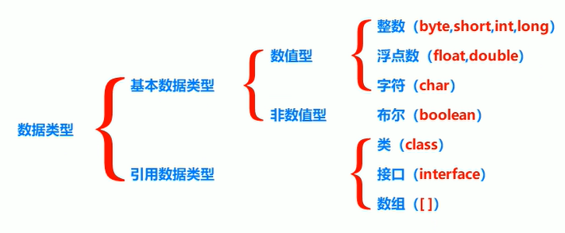

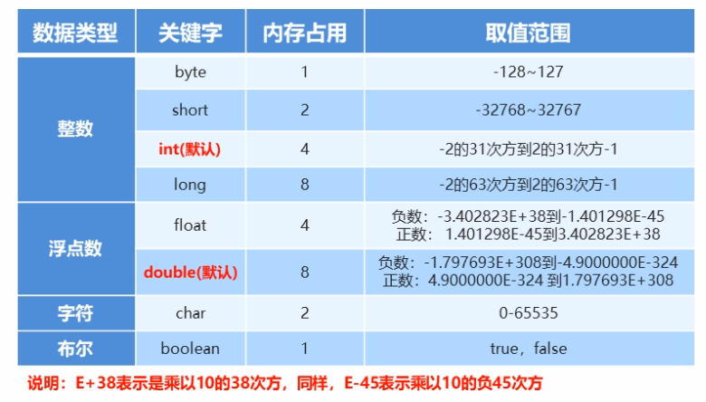

## 标识符定义规则


## 类型转换

### 自动类型转换

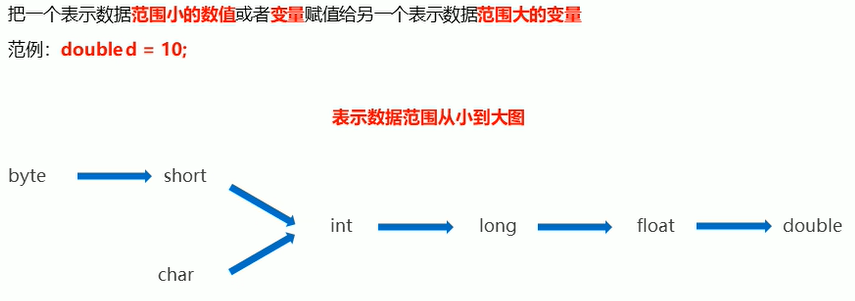

## 运算符

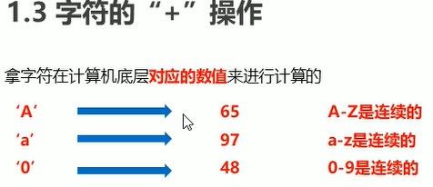

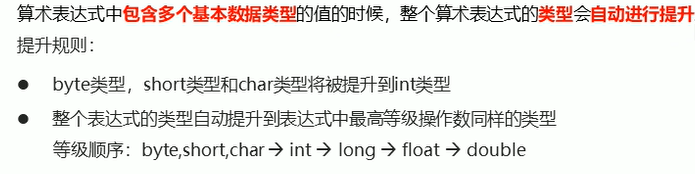

**自动提升后，需要用高优先级的数据类型来接收**

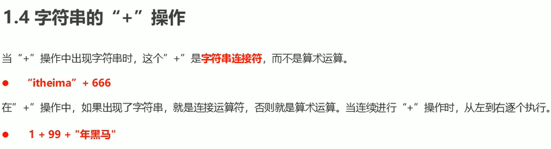

### 赋值运算

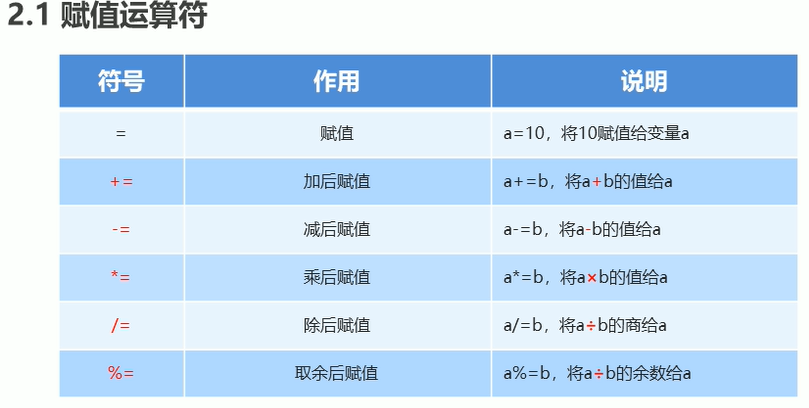

**+=会自动强制转换数据类型**

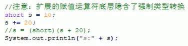

### 关系运算

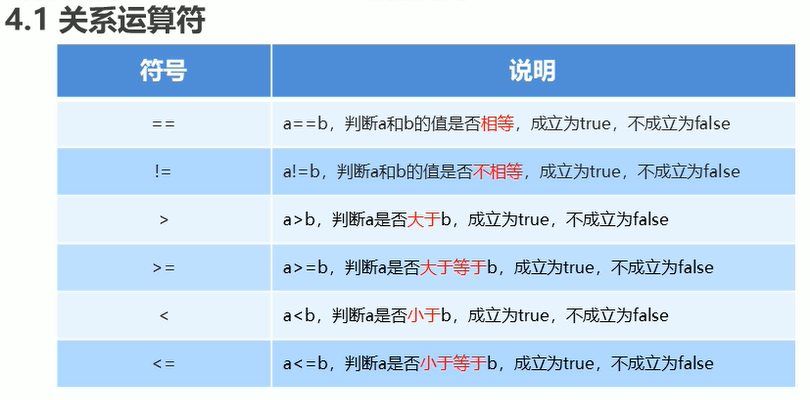

### 逻辑运算

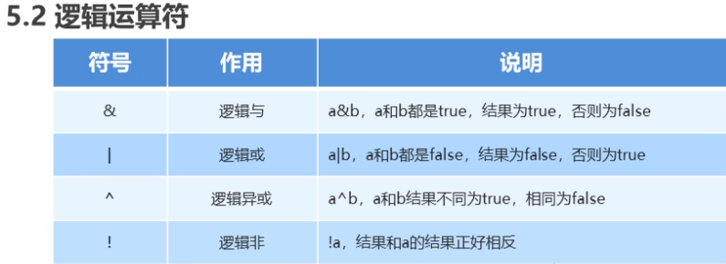

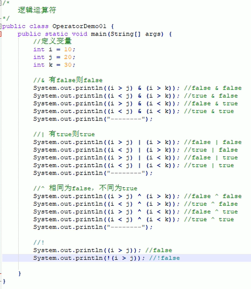

### 短路逻辑运算

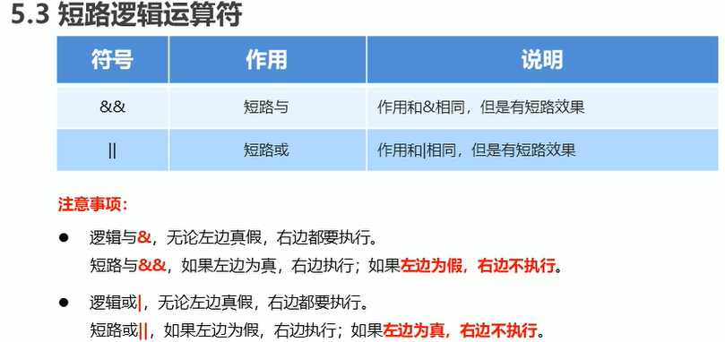

### 三元运算


## 特殊符号

\t：制表符，补齐8个空格字符，用以对齐数据


## 数据输入

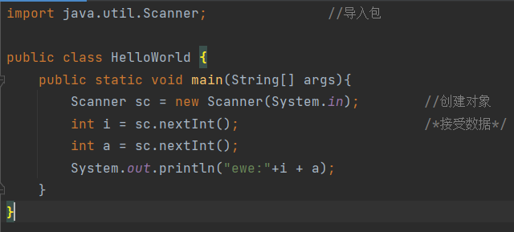

## 流程控制

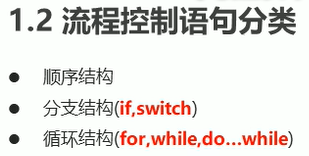

### switch语句

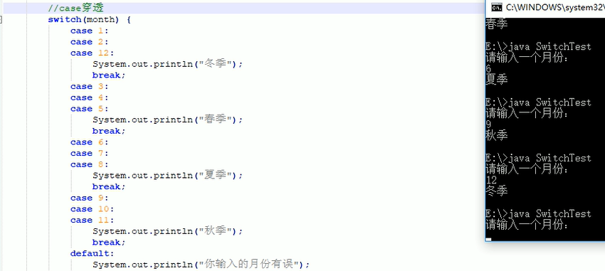

## Random随机

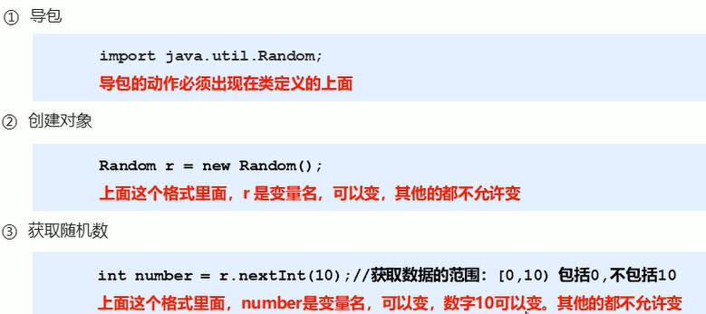

## 数组

### 数组定义格式

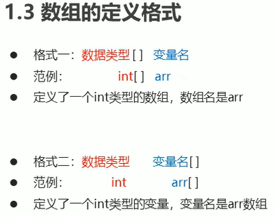

### 动态初始化

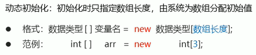

### 静态初始化

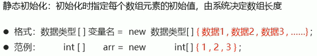

### 索引越界

访问了未分配的索引地址

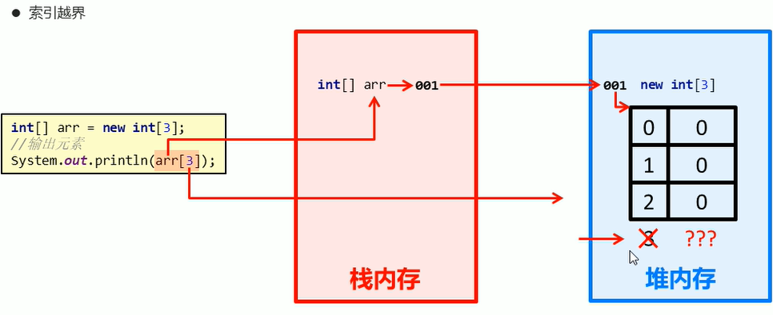

### 空指针异常

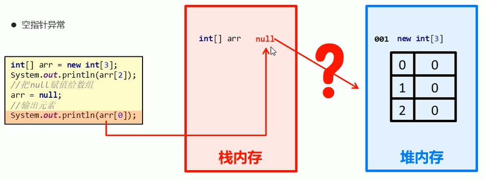

## 内存分配

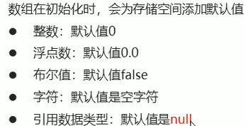

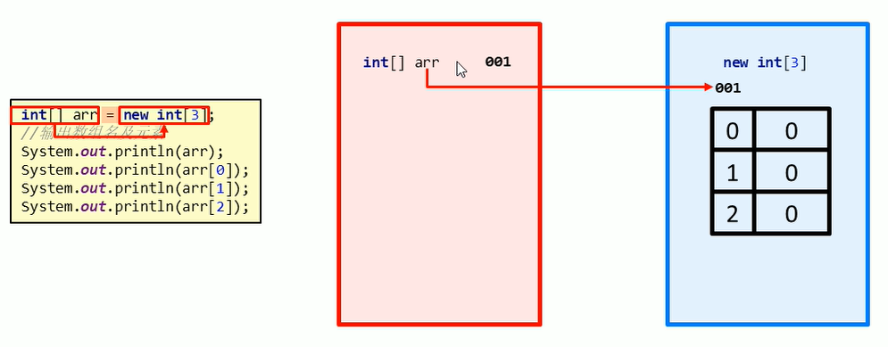

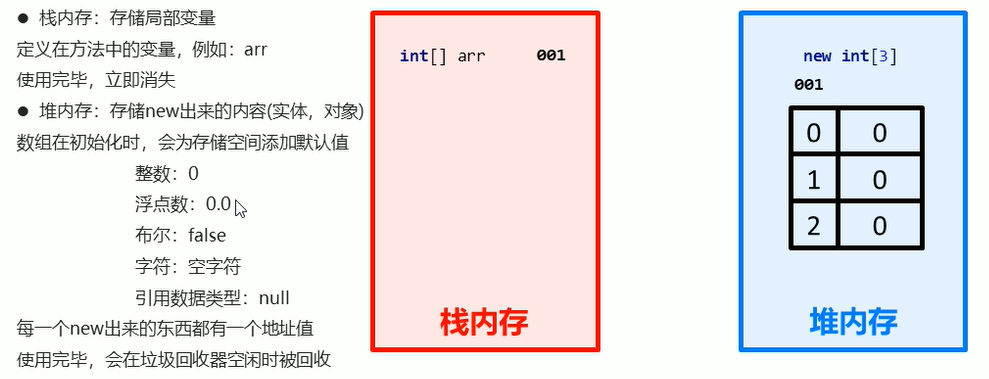

### 数组内存

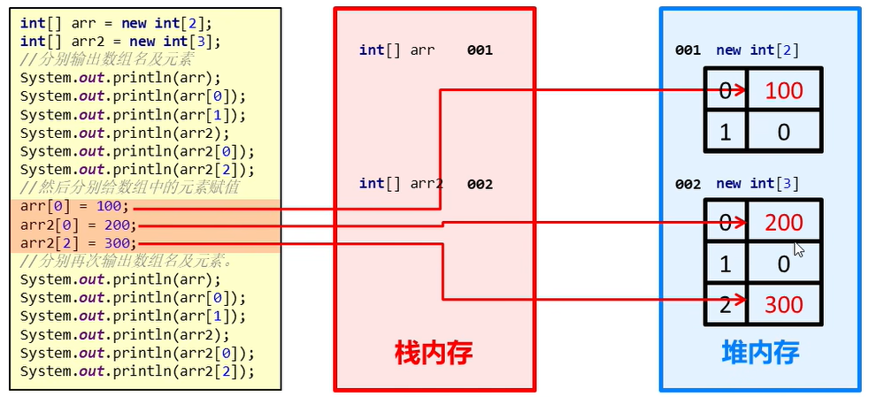

#### 数组指向地址相同的情况

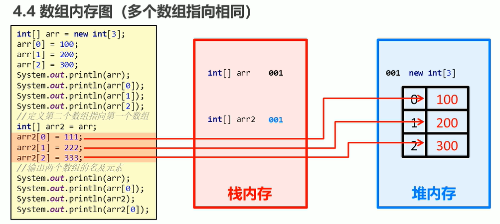

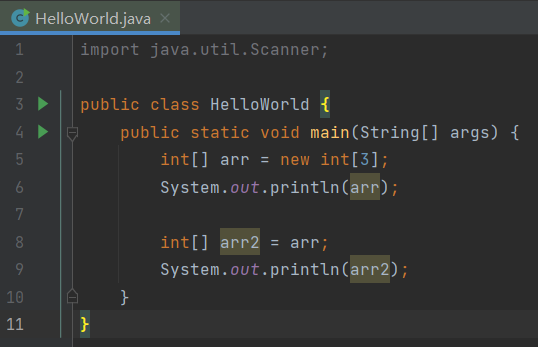

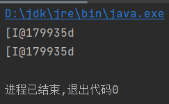

## 遍历

```java
int[] arr = {1,2,3,4,5};
for(int x = 0; x < 5; x++){
    System.out.println(arr[x]);
}
```

### 获取数组元素的个数


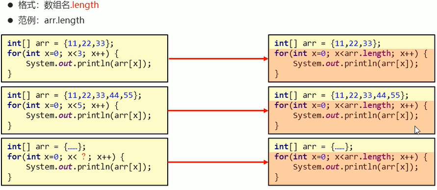

## 最值

```java
int[] arr = {1,2,3,4,5};
int max = arr[0];
for(int x = 1; x < 5; x++){
    if (arr[x] > max){
        max = arr[x];
    }
}
System.out.println(max);
```

## 方法method

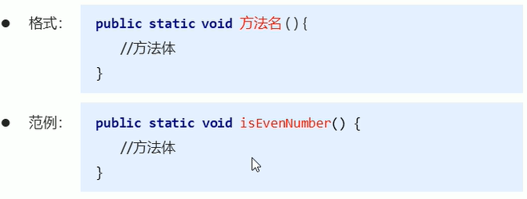

### 带参数调用

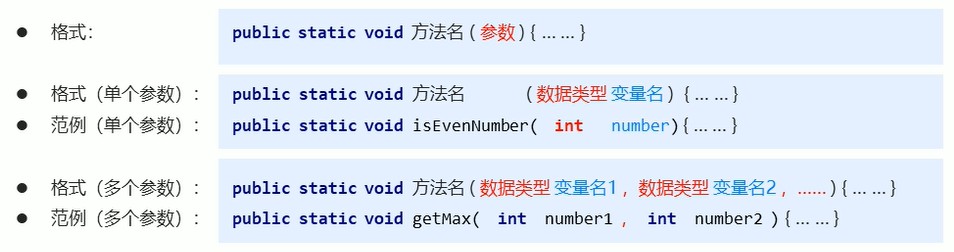

### 带返回值调用


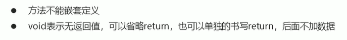

### 方法重载

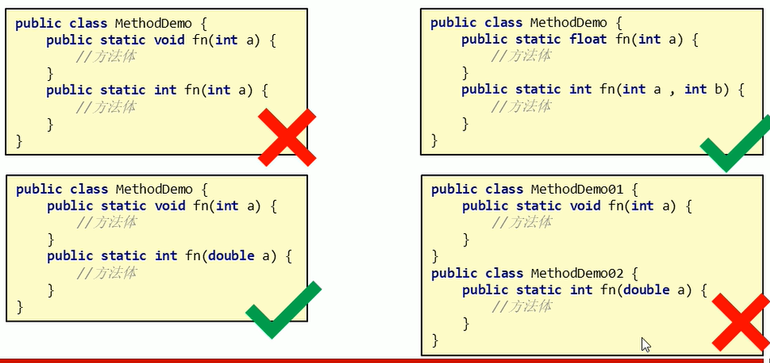

**与返回值类型无关，必须在同一方法内**

### 方法参数传递

#### 基础类型

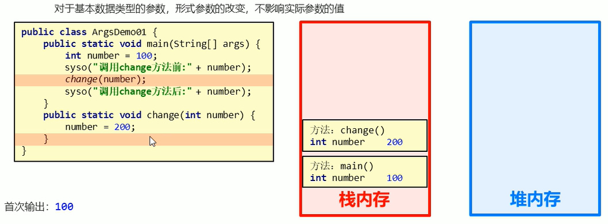

#### 引用类型

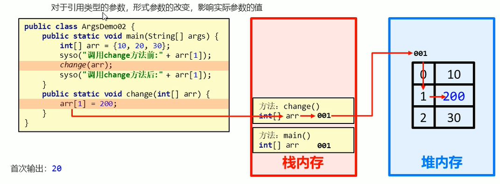

**引用类型参数是用的是内存中的地址，所以会影响**