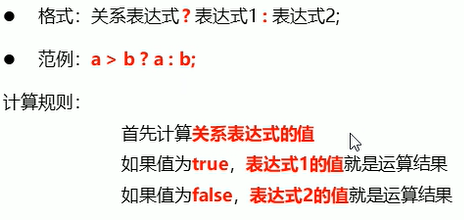
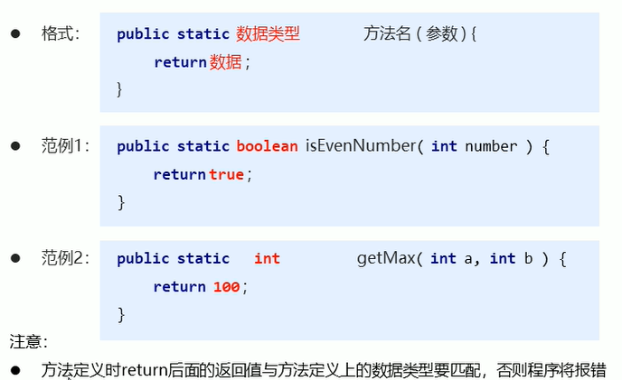

## 跨平台原理


**JVM虚拟机**

## 数据类型

**Java是强类型语言**


## 标识符定义规则


## 类型转换

### 自动类型转换


## 运算符


**自动提升后，需要用高优先级的数据类型来接收**


### 赋值运算


**+=会自动强制转换数据类型**


### 关系运算


### 逻辑运算


### 短路逻辑运算


### 三元运算



## 特殊符号

\t：制表符，补齐8个空格字符，用以对齐数据


## 数据输入


## 流程控制


### switch语句


## Random随机


## 数组

### 数组定义格式


### 动态初始化


### 静态初始化


### 索引越界

访问了未分配的索引地址


### 空指针异常


## 内存分配


### 数组内存


#### 数组指向地址相同的情况


## 遍历

```java
int[] arr = {1,2,3,4,5};
for(int x = 0; x < 5; x++){
    System.out.println(arr[x]);
}
```

### 获取数组元素的个数


## 最值

```java
int[] arr = {1,2,3,4,5};
int max = arr[0];
for(int x = 1; x < 5; x++){
    if (arr[x] > max){
        max = arr[x];
    }
}
System.out.println(max);
```

## 方法method


### 带参数调用


### 带返回值调用




### 方法重载


**与返回值类型无关，必须在同一方法内**

### 方法参数传递

#### 基础类型


#### 引用类型


**引用类型参数是用的是内存中的地址，所以会影响**