## tomcat

tomcat的本质是web服务器和servlet容器的集合体，Tomcat是运行在JVM中的一个进程。它定义为【中间件】，顾名思义，是一个在Java项目与JVM之间的中间容器。

### 原理

Tomcat主要组件：

- 服务器Server
- 服务Service
- 连接器Connector（核心）
- 容器Container（核心）

服务器server提供服务环境，作为java网站的web支持；service为服务，为外提供服务能力；

**Connector**

负责监听某个指定端口上的客户请求，接收浏览器发送的tcp请求；接收请求后创建一个request和response对象分别用于和请求端交换数据；然后创建一个线程用于处理request和response对象，并将这两个对象传递给Connector中的Engine，Engine获得响应response并返回给客户

Tomcat中有两个经典的Connector，一个直接侦听来自Browser的HTTP请求，另外一个来自其他的WebServer请求。

- HTTP/1.1 Connector在端口8080处侦听来自客户Browser的HTTP请求
- AJP/1.3 Connector在端口8009处侦听其他Web Server（其他的HTTP服务器）的Servlet/JSP请求

Connector 最重要的功能就是接收连接请求然后分配线程让 Container 来处理这个请求，所以这必然是多线程的，多线程的处理是 Connector 设计的核心。

**Container**

Container是容器的父接口，该容器的设计用的是典型的责任链的设计模式，它由四个子容器组件构成，分别是Engine、Host、Context、Wrapper。

- Engine 容器比较简单，它只定义了一些基本的关联关系。
- Host 容器是 Engine 的子容器，一个 Host 在 Engine 中代表一个虚拟主机，这个虚拟主机的作用就是运行多个应用，它负责安装和展开这些应用，并且标识这个应用以便能够区分它们。它的子容器通常是 Context，它除了关联子容器外，还有就是保存一个主机应该有的信息。
- Context 容器代表 Servlet 的 Context，它具备了 Servlet 运行的基本环境，理论上只要有 Context 就能运行 Servlet 了。简单的 Tomcat 可以没有 Engine 和 Host。Context 最重要的功能就是管理它里面的 Servlet 实例，Servlet 实例在 Context 中是以 Wrapper 出现的，还有一点就是 Context 如何才能找到正确的 Servlet 来执行它呢？ Tomcat5 以前是通过一个 Mapper 类来管理的，Tomcat5 以后这个功能被移到了 request 中，在前面的时序图中就可以发现获取子容器都是通过 request 来分配的。
- Wrapper 容器代表一个 Servlet，它负责管理一个 Servlet，包括的 Servlet 的装载、初始化、执行以及资源回收。Wrapper 是最底层的容器，它没有子容器了，所以调用它的 addChild 将会报错。 Wrapper 的实现类是 StandardWrapper，StandardWrapper 还实现了拥有一个 Servlet 初始化信息的 ServletConfig，由此看出 StandardWrapper 将直接和 Servlet 的各种信息打交道。

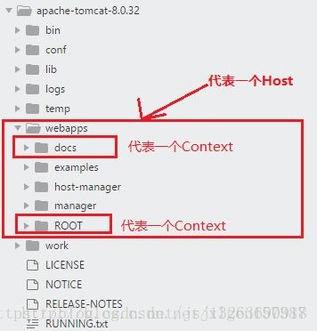

**其他组件**

  Tomcat 还有其它重要的组件，如安全组件 security、logger 日志组件、session、mbeans、naming 等其它组件。这些组件共同为 Connector 和 Container 提供必要的服务。

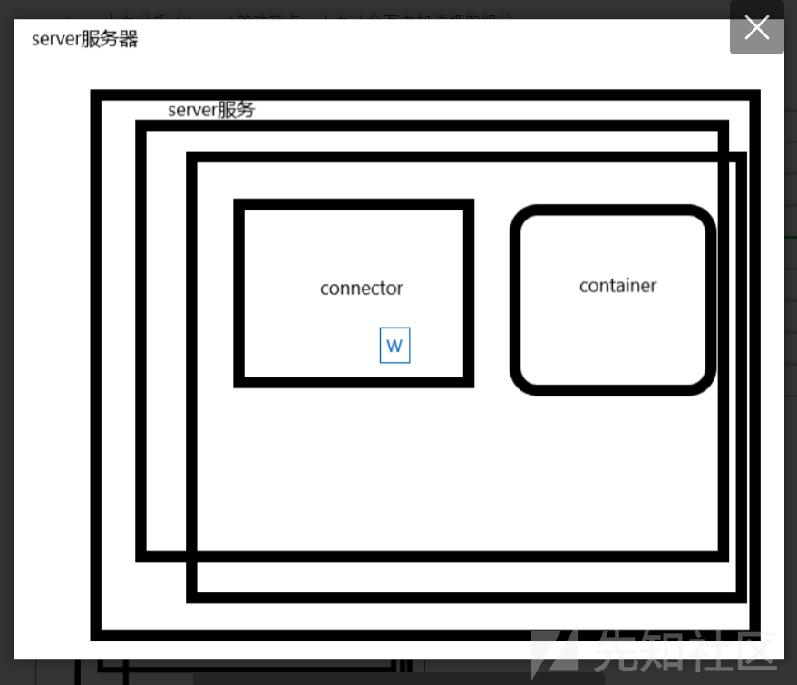

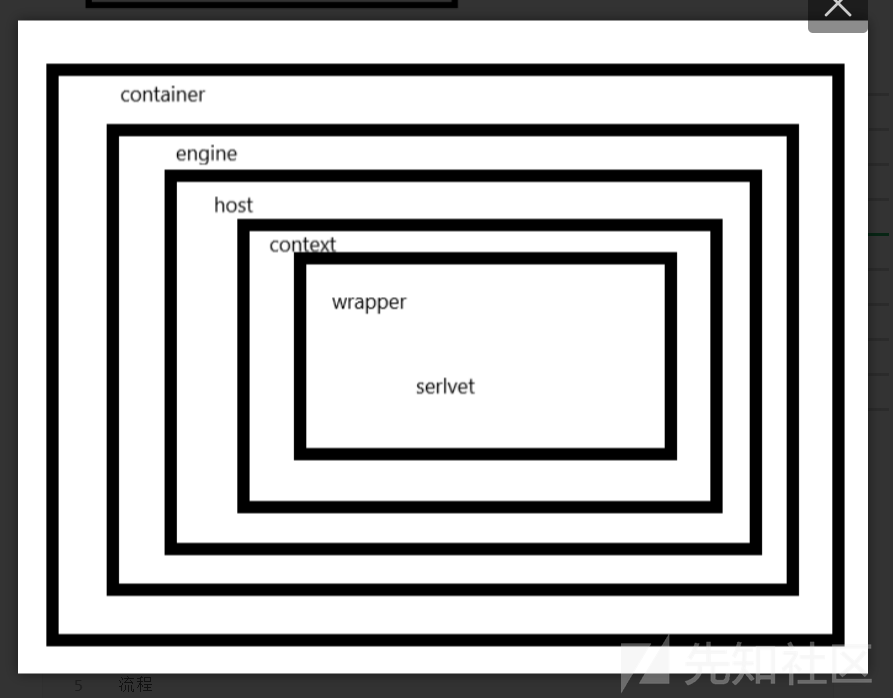


## jsp原理

**jsp执行流程**

首先服务端会将jsp翻译成`.java`文件，再编译成class文件，最后执行class文件

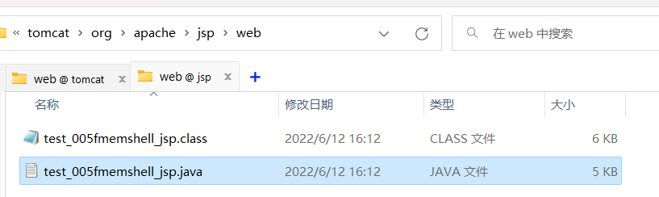

早期只有Servlet文件

由于Servlet文件编写太过麻烦，所以出现了JSP文件


## tomcat内存马

### 三大组件

上面也提到了，tomcat本质上是web服务器和servlet容器的结合体，而servlet又有三大组件

```sh
Servlet -> Filter -> Listener
```

- Servlet：最基础的组件，用于处理浏览器传递过来的请求，相当于每个Servlet都是一个java程序；生命周期：从容器启动开始到服务器停止
- Filter：filter本质上是一种特殊的servlet，它是一种起过滤作用的特殊servlet，过滤请求（非法请求），通过filterChain链式调用doFilter方法；生命周期：同上
- Listener：监听器，一共有三种类型ServletContextListener、HttpSessionListener、ServletRequestListener，均继承于EventListener，以ServletRequestListener为例，ServletRequestListener主要用于监听ServletRequest对象的创建和销毁,一个ServletRequest可以注册多个ServletRequestListener接口（都有request来都会触发这个）。生命周期：同上

### Context对象获取

tomcat的web应用中的context组件一般为org.apache.catalina.core.StandardContext对象，通过动态注册servlet组件实现内存马时，需要先获取context对象，即StandardContext对象。

#### 有request

我查了一下资料，发现tomcat中web应用获取到的context为ApplicationContextFacade，而不是直接获取context，这里需要提到tomcat的设计模式-**门面模式(facade)**

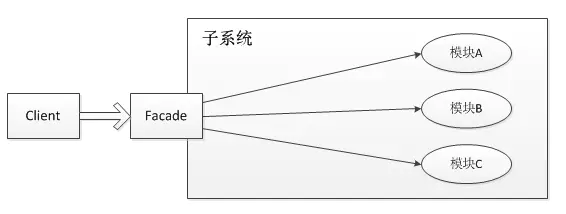

简单来说就是通过一个门面对象来访问子系统内的对象，提供一个更高层次的接口，使得子系统更易于使用

##### 门面模式

RequestFacade作为Request的门面，内部包含Request对象。

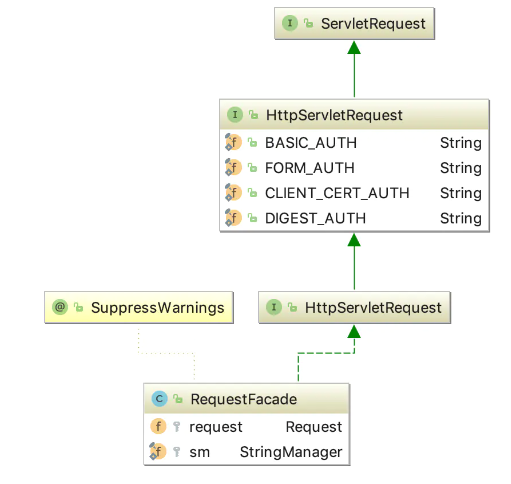

ResponseFacade作为Response的门面，内部包含Response对象。

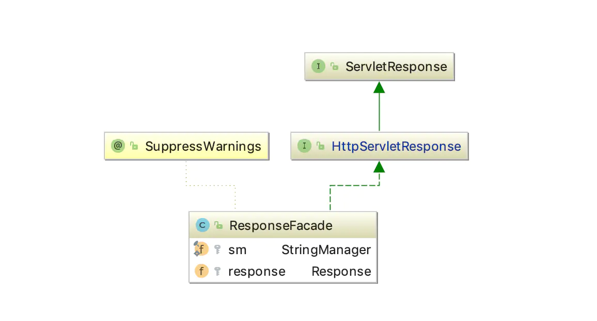

StandardSessionFacade作为HttpSession的门面，内部包含HttpSession对象。

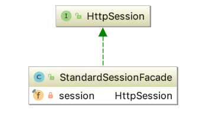


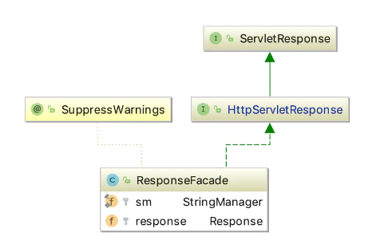

ApplicationContextFacade作为ApplicationContext的门面，内部包含ApplicaitonContext对象。

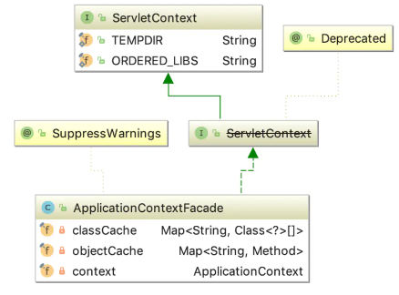

知道了门面模式的设计理念，我们来逐步分析一下获取context的过程：

也就是说，tomcat的web应用中使用`request.getServletContext`获取到的实际上是`ApplicationContextFacade`对象

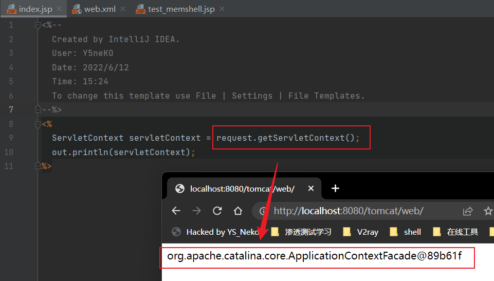

而`ApplicationContextFacade`对象又对`ApplicationContext`进行了封装，但要注意是私有类型

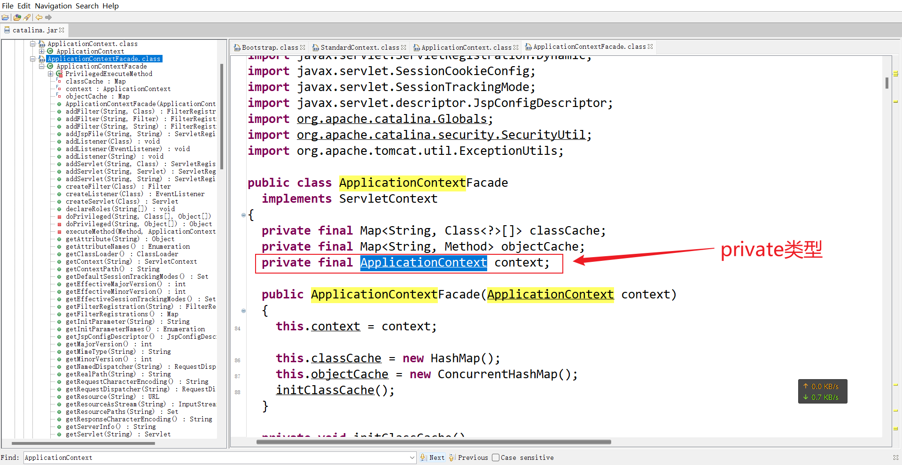

`ApplicationContext`中又包含了`StandardContext`实例

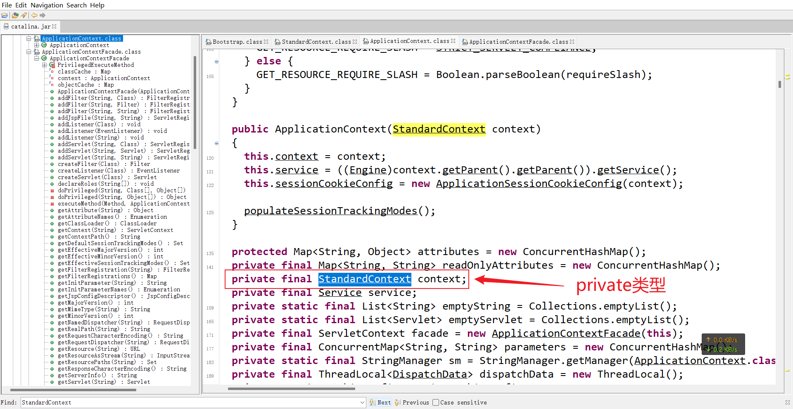

经由以上分析可知，当request存在时，我们可以通过`ApplicationContextFacade`对象来反射获取`StandardContext`对象

有关反射，我们可以简单分析一下

使用Field类的`getDeclaredField(String field_name)`方法 

```java
ServletContext servletContext = request.getServletContext();	//此时通过request获取到ApplicationContext门面
out.println("ApplicationContext门面对象为：" + servletContext);
Field fieldApplicationContext = servletContext.getClass().getDeclaredField("context");	//field通过反射获取context字段，返回一个Field对象fieldApplicationContext用于操作
out.println(fieldApplicationContext);
```

首先通过getClass方法获得`servletContext`的类为：org.apache.catalina.core.ApplicationContextFacade

通过getDeclaredField("context")方法获得三个值：

- 字段属性：private final
- 对象名称：org.apache.catalina.core.ApplicationContext
- 字段名称：org.apache.catalina.core.ApplicationContextFacade.context

同时返回Field对象用于操作

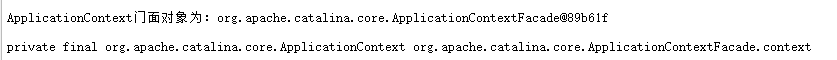

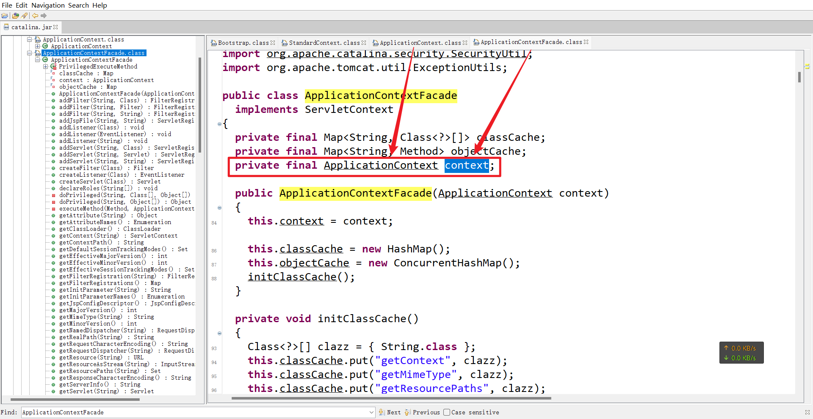

接着刚刚的代码

```java
ServletContext servletContext = request.getServletContext();	//此时通过request获取到ApplicationContext门面
out.println("ApplicationContext门面对象为：" + servletContext);
Field fieldApplicationContext = servletContext.getClass().getDeclaredField("context");	//field通过反射获取context字段，返回一个Field对象fieldApplicationContext用于操作
out.println(fieldApplicationContext);
fieldApplicationContext.setAccessible(true);	//使用setAccessible方法将ApplicationContext私有属性设置为可读取
ApplicationContext applicationContext = (ApplicationContext);
`
```


### listener内存马

