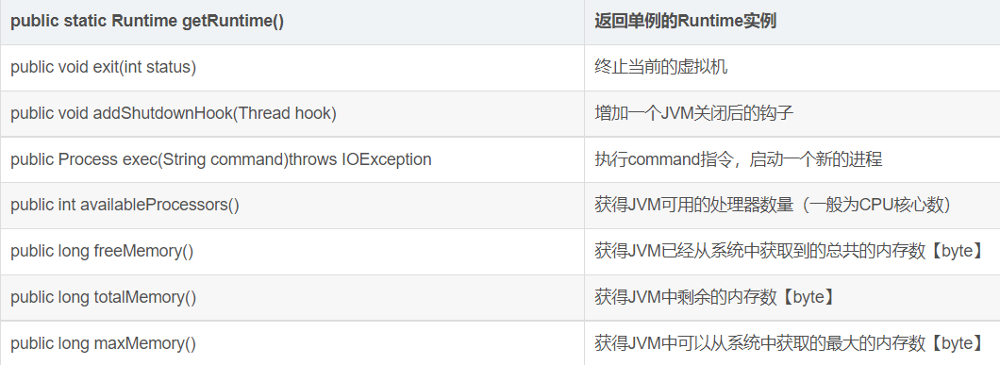
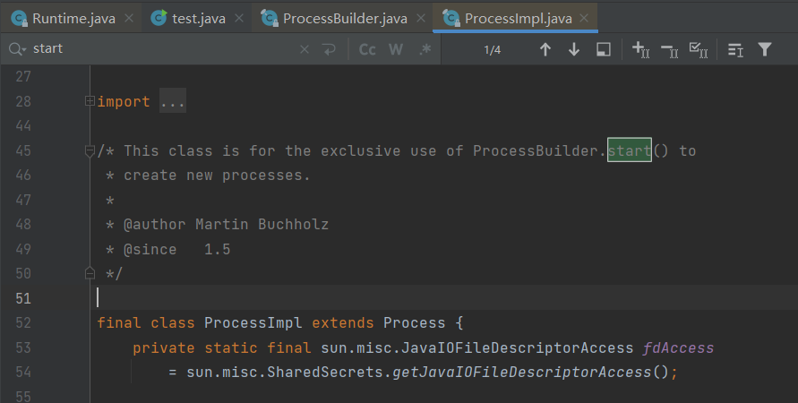

# Java安全

## 命令执行

常用的是 `java.lang.Runtime#exec()`和 `java.lang.ProcessBuilder#start()`，除此之外，还有更为底层的`java.lang.ProcessImpl#start()`，他们的调用关系如下图所示：


其中，ProcessImpl类是Process抽象类的具体实现，且该类的构造函数使用private修饰，所以无法在java.lang包外直接调用，只能通过反射调用ProcessImpl#start()方法执行命令。


### Runtime

比较通常用的一种命令执行方法，Runtime.getRuntime中的exec方法

```java
import java.io.IOException;
public class test {
    public static void main(String args[]) throws IOException{
        Runtime.getRuntime().exec("calc.exe");
    }
}
```

Runtime.getRuntime().exec 用于调用外部可执行程序或系统命令，并重定向外部程序的标准输入、标准输出和标准错误到缓冲池。功能和windows“运行”类似

> Runtime.exec不是shell环境，不能直接调用shell命令，需要对不同的操作系统调用不同的命令解释器，Windows的cmd，Linux的/bin/bash或/bin/sh等

#### 简介

Java中，Runtime类提供了许多的API来与`java runtime environment`进行交互，如：

- 执行一个进程。
- 调用垃圾回收。
- 查看总内存和剩余内存。

Runtime是单例的，可以通过`Runtime.getRuntime()`得到这个单例。

#### API列表

一些常见的API



这里详细分析exec的调用链

#### exec调用链

首先找到接口位置，位于`java.lang`的`Runtime`类

首先通过`getRuntime`方法获取一个Runtime对象


紧接着调用exec方法，可以看到exec一共有六个重载方法


其中完整的参数有三个，command、envp、dir，位置和类型如上，其中command为必须，envp和dir为可选；envp为环境变量，没有envp参数或许为null，那么新发动的进程就承继当时java进程的环境变量；dir为工作目录，没有dir参数或许为null，那么新发动的进程就承继当时java进程的工作目录；我们按顺序来看

##### java.lang.Runtime.java:347


第一个重载方法是在只传入一个String类型时执行的方法，此时envp和dir参数为null，官方的注释为：在单独的进程中执行指定的字符串命令。

##### java.lang.Runtime.java:387


第二个重载方法只有dir参数为空，官方的注释为：在具有指定环境的单独进程中执行指定的字符串命令。

##### java.lang.Runtime.java:441


第三个重载方法三个参数都有，官方的注释为：在具有指定环境和工作目录的单独进程中执行指定的字符串命令。

这个方法用到了`StringTokenizer`类，作用是根据某些字符做间隔进行分割字符，具体形式后面再具体分析；最后转变为cmdarray数组传入了exec方法

##### 省略

中间两个重载方法同上，只是command参数变成了直接接受cmdarray数组，中间会调用cmdarray的处理方法，暂时先不看

##### java.lang.Runtime.java:620

接下来来到重点最后一个重载方法


上面的方法return到最后一个重载方法，此时准备好调用`ProcessBuilder`类创建process

> Process类将持有该程序返回 Java VM 的引用。这个procss类是一个抽象类，具体子类的实现依赖于不同的底层操作系统。

而这个process类型需要通过`ProcessBuilder.start()`方法进行创建

##### java.lang.ProcessBuilder.java:1029

跟进到`ProcessBuilder.start()`方法，通过上面的步骤对cmdarray数组进行解析，取出cmdarray[0]赋值给prog,如果安全管理器SecurityManager开启,会调用SecurityManager#checkExec()对执行程序prog进行检查，检查通过后调用`ProcessImpl`类的`start`方法


##### java.lang.ProcessImpl.java:87

跟进到`java.lang.ProcessImpl.java`，根据官方注释，`ProcessImpl`类仅用于`ProcessBuilder.start()`创建新Process



我们继续跟进到`ProcessBuilder.start()`方法，Windows下会调用`ProcessImpl`类的构造方法，如果是Linux环境，则会调用`java.lang.UNIXProcess#init<>`


##### java.lang.ProcessImpl.java:314

这里以Windows为例，跟进`ProcessImpl`类构造方法


构造方法内，通过`SecurityManager`类进行安全校验，通过`allowAmbiguousCommands`变量作为是否允许调用本地进程的开关，只有当两种检查都通过的时候，则进入`Legacy mode(传统模式)`


传统模式调用`needsEscaping`，这一步是为了对没有被双引号包裹的空格进行处理，最后通过`createCommandLine`拼接成字符串


##### java.lang.ProcessImpl.java:386

最后通过`ProcessImpl.create`方法创建进程


##### ProcessImpl.create

这是一个Native方法（Java调用非Java代码的接口），根据JNI命名规则，会调用`ProcessImpl_md.c`中的`Java_Java_lang_ProcessImpl_create`，我们来看看`ProcessImpl_md.c`的源码

> ProcessImpl_md.c源码：
>
> http://hg.openjdk.java.net/lambda/lambda/jdk/file/e6aeeec33e53/src/windows/native/java/lang/ProcessImpl_md.c


可以看到接受来自java的参数，而在216行，我们可以看到调用了Windows的api函数`CreateProcessW()`，他的作用是用来创建一个Windows进程


我们来看看Windows官方的定义

> https://learn.microsoft.com/zh-cn/windows/win32/api/processthreadsapi/nf-processthreadsapi-createprocessw


##### 总结

通过观察上面的整个流程，我们可以总结出`Runtime.exec`的整个调用链

```java
//传入参数
Runtime.getRuntime().exec(cmd);

//六个重载函数，根据传入不同的数据类型和参数个数进入，最终都处理成‘String[] cmdarray, String[] envp, File dir’的形式，调用最后一个重载函数
java.lang.Runtime.java:620
    
//调用ProcessBuilder类的start函数
java.lang.ProcessBuilder.java:1029
    
//根据操作系统类区分，如果是Windows则进入ProcessImpl类的构造方法，如果是Linux则调用java.lang.UNIXProcess#init<>；以Windows为例

```


#### Windows下调用cmd

```java
String [] cmd = {"cmd","/C","calc.exe"};
Process proc = Runtime.getRuntime().exec(cmd);
```

#### Linux下调用/bin/bash

```java
String [] cmd = {"/bin/bash","-c","ls"};
Process proc = Runtime.getRuntime().exec(cmd);
```

#### 根据系统选择合适的解释器

```java
System.getProperty("os.name");
```


## 反射

