# 计算机网络

## OSI七层模型

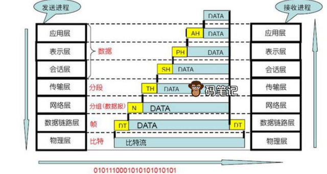

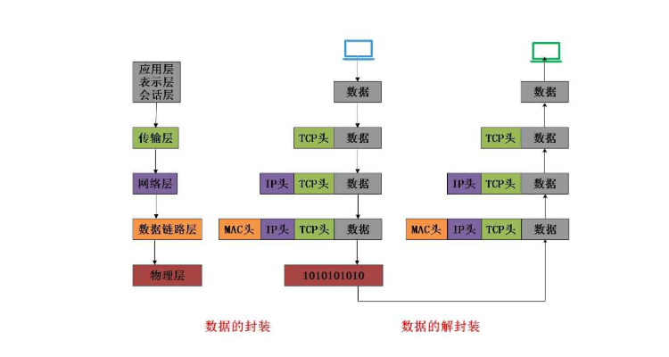

### 物理层

理解：七层模型的最底层，因此采用**bit流**传输，也就是计算机信息传输的本质，二进制传输，例如计算机的机器指令（因为直接与物理设备进行交互）；利用传输介质为**数据链路层**提供物理连接

介质类型一般是线缆（光信号或电信号，有线或无线）

采用的协议有：Rj45（有线标准协议，常见的水晶头），802.3，802.11n（常见的无线协议）

设备：网卡，网络适配器，网线，调制解调器（光猫，将数字信号翻译为模拟信号，并将模拟信号解析成数字信号；例如，光纤传输过来光信号，但是路由器并不能直接解析光信号，需要光猫进行调制解调，再将电信号通过网线传输给路由器进行设备分配，当然也存在猫和路由器一体的机型）

### 数据链路层

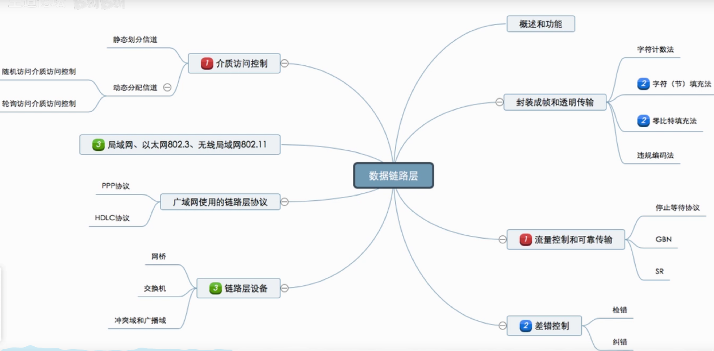

理解：用以和物理层对接，将物理层传递过来的数据组装成数据帧（根据协议的不同，数据帧封装格式有所不同），差错控制功能也在其中，通过物理地址/mac地址进行通信（注意此时没有ip地址参与）

不同协议的数据帧格式：

以太网：

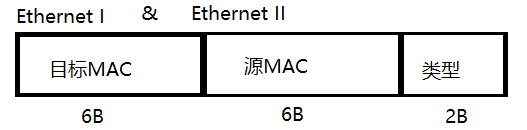

802.3/802.2/SNAP：

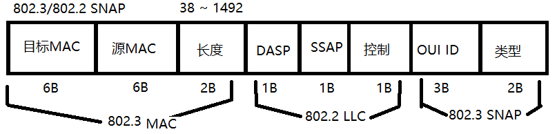

采用的协议有：PPP点对点协议，ETH以太网协议，HDLC高级链路控制协议，等等。

设备有：网桥，**交换机**（注意和路由器的区别）

#### 交换机原理（方便理解数据链路层）

交换机由网桥的原理发展而来

**冲突域**：数据必然发送到的区域，同一时间只有一台设备发送信息的范围，说白了就是一次只有一个设备发送信息，其他的只能等待。这很糟糕，因为如果同一个物理网段中的 两台设备同时传输数据，将发生冲突（即两台设备的数字信号将在线路上相互干扰），导致设备必须在以后重传数据。冲突对网络性能有严重的负面影响，因此绝对要避免冲突。

 以太网中，冲突域是由hub组织的，HUB是无智能的信号驱动器，有入必出，整个由HUB组成的网络是一个冲突域，一个hub就是一个冲突域。交换机的每个端口都是一个冲突域。网段，又叫潜在冲突域

**广播域**：广播是一种信息的传播方式，指网络中的某一设备同时向网络中所有的其它设备发送数据，这个数据所能广播到的范围即为广播域(Broadcast Domain)。简单点说，广播域就是指网络中所有能接收到同样广播消息的设备的集合

> 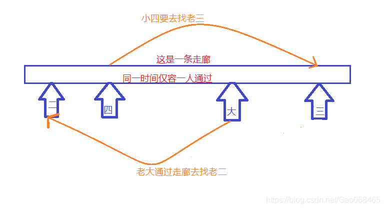
>
> HUB 所有端口都在同一个广播域，冲突域内。Switch所有端口都在同一个广播域内，而每一个端口就是一个冲突域
>
> 摘自csdn：话说老王头有四个儿子，分别是老大、老二、老三和老四。老王忙活了一辈子，东拼西凑给四个儿子买了一间“跑道房”，何为跑道房呢？就是四个儿子共用一条**同时仅容一人通过**的走廊，虽然不太方便，好歹也算是有房子的人了。在一个阳光明媚的早晨，老二在自己的房门口大喊了一句：有人去爬山吗？共用这一条走廊的所有人都听见了老二的喊话，这就是“**广播域**”，然后老大回答说我也去，老大就顺着这条走廊出发去找老二；
>
> 接着，老三在自己的房门口又喊了一句：有人去滑冰吗？小四听见了就回话说我也去。然后就很偶然的出现的一个问题:老大和小四竟然在路上相遇了。前面我们已经说过了，这个走廊同一时间仅容一人通过，所以谁也过不去了，这就是“**冲突域**”
>
> 如何尽最大可能避免冲突域呢？
>
> 为了有效避免冲突，局域网中使用交换机（Switch）来分割冲突域。对网络进行分割的原因是为了分离流量并创建更小的冲突域来使用户获得更高的带宽，否则同一时刻数据太多容易导致网络拥挤形成阻塞。
>
> **交换机分割冲突域，路由器分割广播域**

**地址表**：端口地址表记录了端口下包含主机的MAC地址。端口地址表是交换机上电后自动建立的，保存在RAM中，并且自动维护。交换机隔离冲突域的原理是根据其端口地址表和转发决策决定的。

**转发策略**：三种，丢弃、转发及扩散，每个操作都会记录下发包的mac地址

**生存期**：生存期是端口地址列表中表项的寿命。每个表项在建立后开始进行倒计时，每次发送数据都要刷新记时。对于长期不发送数据的主机，其MAC地址的表项在生存期结束时删除。所以端口地址表记录的总是最活跃的主机的MAC地址。

### 网络层

理解：包括了寻址、路由选择、连接控制等功能。

分组与交换：把从传输层接收到的数据报文封装成分组（Packet，也称为“包”）再向下传送到数据链路层。

涉及到的协议众多，重要的有：IP协议，ICMP协议，ARP协议等。

**IP协议**

IP协议的主要功能有：无连接数据报传输、数据报路由选择和差错控制

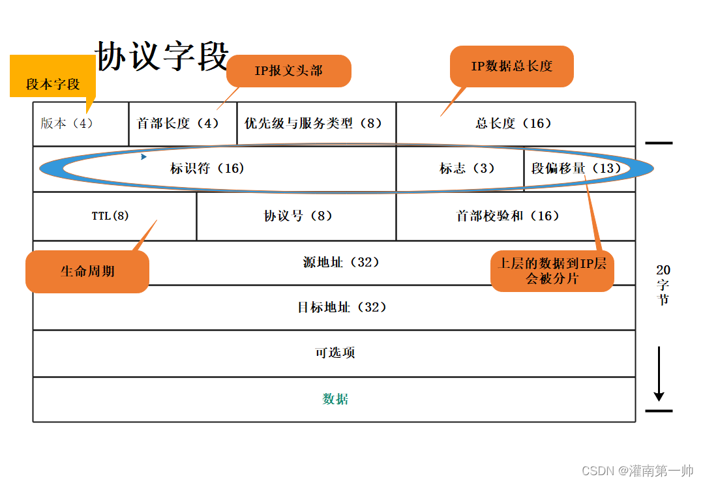

**ICMP协议**

ICMP报文有两种类型:差错报告报文和查询报文，ping命令和tracert使用到了ICMP协议，封装过程如下

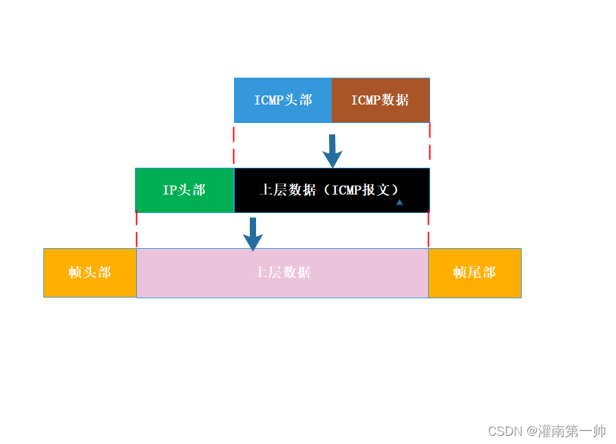

**ARP协议**

将主机的ip地址和相应的数据链路层mac地址相对应，不管网络层使用的是什么协议，在实际网络的链路上传送数据帧时，最终还是必须使用MAC地址

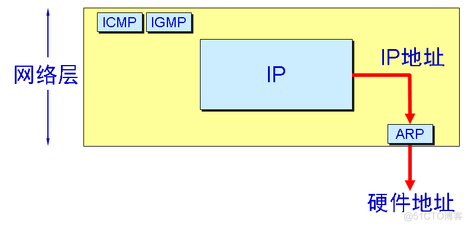

每一个主机都设有一个ARP高速缓存，里面有所在局域网上的各主机和路由器的 IP 地址到MAC地址的映射表（ARP欺骗）

常见的设备有：路由器（注意和交换机的不同），三层交换机

#### 路由器原理（方便理解网络层）

路由器的本质就是一台电脑，通常插两张网卡，网卡一，连接广域网的WAN口，IP地址由上一级网络分配，另一张网卡LAN，连接局域网，IP地址可以自己配置，路由器通常工作在OSI模型中（OSI模型）的第三层，即三层设备，是网络传输的交通枢纽，有**路由**和**转发**功能。网络中的设备相互通信主要是用它们的IP地址，路由器只能根据具体的IP地址来转发数据。

网络层的作用从表面看上去非常简单，即将**分组**从一台主机移动到另外一台主机。为了实现这个功能，网络层需要两种功能

转发：因为在互联网中有很多路由器的存在，而路由器是构成互联网的根本，路由器最重要的一个功能就是分组转发，当一个分组到达某路由器的一条输入链路时，该路由器会将分组移动到适当的输出链路

路由选择：当分组由发送方流向接收方时，网络层必须选择这些分组的路径。计算这些路径选择的算法被称为 路由选择算法(routing algorithm)。

也就是说，转发是指将分组从一个输入链路转移到适当输出链路接口的路由器本地动作。而路由选择是指确定分组从源到目的地所定位的路径的选择。我们后面会经常提到转发和路由选择这两个名词。

> 那么此处就有一个问题，路由器怎么知道有哪些路径可以选择呢？

每台路由器都有一个关键的概念就是 **转发表(forwarding table)**。路由器通过检查数据包标头中字段的值，来定位转发表中的项来实现转发。标头中的值即对应着转发表中的值，这个值指出了分组将被转发的路由器输出链路。如下图所示

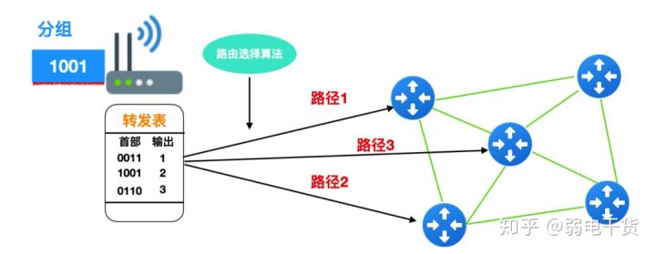

下面是一个路由器体系结构图，路由器主要是由 4 个组件构成的

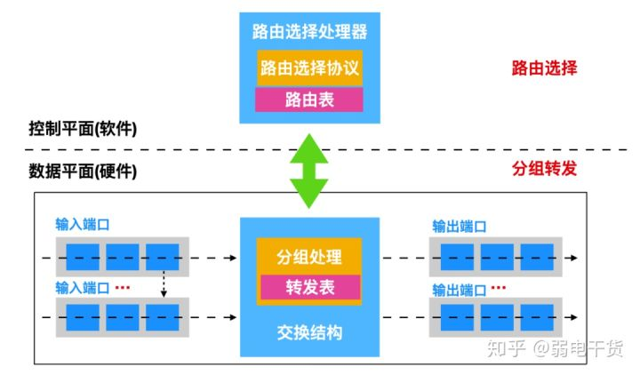

> **二层交换机看MAC，三层交换机看IP**

### 传输层

理解：用于区分上层应用（决定数据包给谁<QQ或者微信等>处理），负责两个主机进程之间的通讯，即端到端的通讯。传输单位是报文段或用户数据报。最关键的一层，向拥护提供可靠的端到端(End-to-End)服务，它屏蔽了下层的数据通信细节，让用户及应用程序不需要考虑实际的通信方法。

定义的协议：TCP（可靠连接，特点是精准，但是消耗较大，一般的连接都是tcp）、UDP（不可靠连接，特点是报文简单，节约带宽，所以消耗较少，一般用于语音、视频等对速率要求高但连接质量要求不是特别高的情况）

> TCP与UDP都有端口号这个概念。传输层如何区分上层应用？主要就是这个端口号。不同的端口号，对应不同的上层应用。端口号的取值范围：0-65535，共有65535个端口。

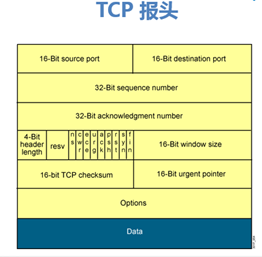

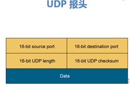

TCP vs UDP（可靠性≠安全性）：

*TCP三次握手看对方有没有回复（同步请求），有重传机制

*UDP一般用于语音流和视频流，但没有任何重传机制

***TCP报头前16个字节范围（0-65535）

***TCP三次握手（ACK=序列号+1）

***PC机同名不会导致TCP三次握手发的ACK冲突

### 会话层

理解：会话层（Session Layer），是在发送方和接收方之间进行通信时创建、维持、之后终止或断开连接的地方，与电话通话有点相似。会话层定义了一种机制，允许发送方和接收方启动或停止请求会话，以及当双方发生拥塞时仍然能保持对话。

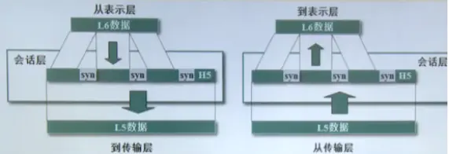

会话层包含了一种称为检查点（Checkpoint）的机制来维持可靠会话。检查点定义了一个最接近成功通信的点，并且定义了当发生内容丢失或损坏时需要回滚以便恢复丢失或损坏数据的点，即断点下载的原理。

会话层还定义了当会话出现不同步时，需要重新同步化的机制。

会话层的主要任务是负责两个网络参与者之间进行的通信，这两个网络参与者在通信过程中通常交换一系列的消息或PDU（协议数据单元）。例如：用户登录到数据库上（建立阶段），输入一连串的查询（数据交换阶段），完成任务后退出登录（断开阶段）。