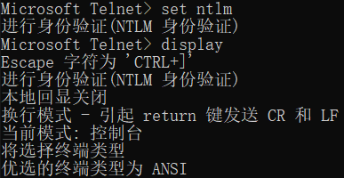
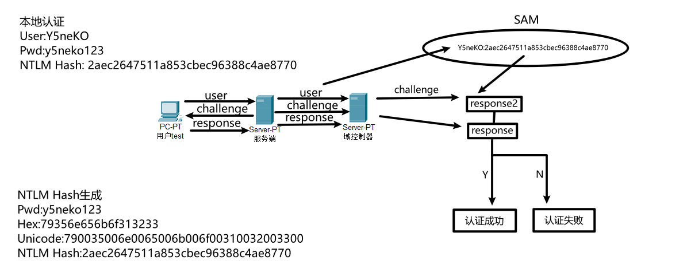
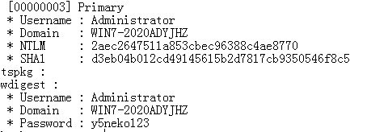
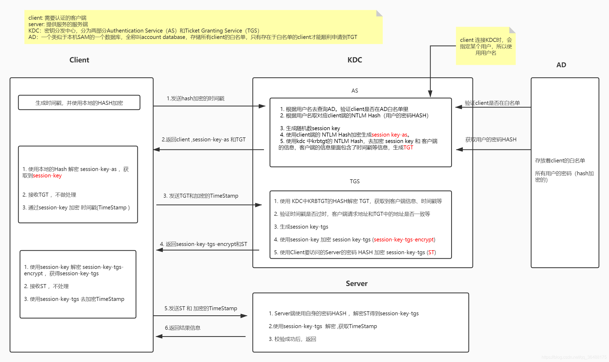

# NTLM及Kerberos认证流程

## NTLM认证

### 1.概念

NTLM是NT LAN Manager的缩写，NTLM 是指 telnet 的一种验证身份方式，即问询/应答身份验证协议，是 Windows NT 早期版本的标准安全协议，Windows 2000 支持 NTLM 是为了保持向后兼容。Windows 2000内置三种基本安全协议之一。



### 2.认证流程



①使用用户名和密码登录客户端，进行**本地认证**

②客户端首先在本地加密当前用户的密码为密码散列，即**NTLM Hash**[^1]

③确认双方协议版本，客户端向服务器明文发送自己的账号

④服务器生成一个16位的随机数字发送给客户端，即**challenge**

⑤客户端使用**NTLM Hash**来加密**challenge**，生成的结果即**response**

⑥服务器将**明文的用户名**、**challenge**、**response**发给域控制器(DC)

⑦域控制器用这个用户名在**SAM密码管理库**[^2]中找到此用户对应的**NTLM Hash**，并使用这个值来加密**challenge**，生成的结果记为**response2**

⑧域控制器对**response**和**response2**进行比较，如果一样则认证成功，反之则失败

#### 本地认证

Windows不会储存用户的明文密码，而是将明文密码加密后储存在SAM中

本地认证的过程中，用户登录时，系统会将用户输入的明文密码加密成**NTLM Hash**，然后和SAM中的**NTLM Hash**进行比较从而完成认证

用户进行任何注销操作（注销登录，重启，锁屏等），**winlogon**进程会显示密码输入界面，接受用户输入密码后交给**lsass**进程，这个进程中会保存一份明文密码，然后加密成**NTLM Hash**

```sh
winlogon.exe -> 接收用户输入 -> lsass.exe -> 本地认证
```

#### NTLM Hash的生成

- 用户明文密码：`y5neko123`
- 十六进制转换为：`79356e656b6f313233`
- 转换为Unicode码，相当于在每个字节后添加一个0x00：`790035006e0065006b006f00310032003300`
- 以十六进制进行MD4加密：`2aec2647511a853cbec96388c4ae8770`




## Kerberos认证

### 1.概念

Kerberos 是一种由 MIT（麻省理工大学）提出的一种网络身份验证协议。它旨在通过使用密钥加密技术为客户端/服务器应用程序提供强身份验证。

Kerberos 主要是用在域环境下的身份认证协议。

### 2.认证流程



Kerberos 协议中主要有四个角色的存在：

1. 访问服务的 Client
2. 提供服务的 Server
3. KDC（Key Distribution Center）密钥分发中心[^3]
4. AD（Account Database）

------

#### KDC的构成

**Authentication Service**：认证服务器，以下简称AS，作用就是验证 Client 端的身份，验证通过会发送一张**TGT（Ticket Granting Ticket）**[^4]票据给 Client

**Ticket Granting Service**：票据分发服务器，以下简称TGS，作用是通过 AS 发送给 Client 的票据（TGT）换取**ST（ServiceTicket**）[^5]，也被称为**TGS Ticket**

------

Kerberos认证大体上分为三个流程：

1. The Authentication Service Exchange：Client 与 AS 的交互
2. The Ticket-Granting Service (TGS) Exchange：Client 与 TGS 的交互
3. The Client/Server Authentication Exchange：Client 与 Server 的交互

------

#### 一、Authentication Service Exchange

**KRB_AS_REQ（请求）**

Client --> AS：客户端向KDC的AS发送**Authenticator1**，内容包含：

- Pre-authentication data：包含用以证明自己身份的信息，一般它的内容是一个被Client hash加密过的时间戳
- Client name & realm：用户信息
- TGS的Server name

**KRB_AS_REP（响应）**

AS --> Client：AS根据用户名在AD中判断是否在白名单中，接着进行验证发送方是否为Client name中声称的用户

也就是需要验证发送方是否知道该用户名的密码，此时只需要从AD中使用相应的**NTLM Hash**对请求包中的**Pre-authentication data**进行解密，如果是一个合法的时间戳，则说明提供的密钥无误

验证成功后提取相应的**NTLM Hash**[^1]，此时会生成一个随机数**SessionKey**，然后使用提取的**NTLM Hash**来加密**SessionKey**，生成**SessionKey-as**作为AS数据，再返回一个**TGT**[^4]

> 简述：在 KDC(AD) 中存储了域中所有用户的密码 HASH，当 AS 接收到 Client 的请求之后会根据 KDC 中存储的密码来解密，解密成功并且验证信息，验证成功后返回给Client两个数据，由 Client 密码 HASH 加密的SessionKey-as和TGT。

Client收到KRB_AS_REP，通过自己的**NTLM Hash**对返回的**SessionKey-as**进行解密得到**SessionKey**后，即可携带**TGT**进入下一步骤

------

#### 二、Ticket-Granting Service (TGS) Exchange

**KRB_TGS_REQ（请求）**

Client --> TGS：Client向KDC的TGS发送**Authenticator2**，内容包含：

- TGT
- Authenticator：用以证明当初TGT的拥有者是自己，使用SessionKey来进行加密，其中包含有客户端信息和时间戳
- Client name & realm
- Server name & realm：Client要访问的Server

**KRB_TGS_REP（响应）**

TGS --> Client：TGS首先通过自己的NTLM Hash（krbtgt账户的NTLM Hash）对Client提供的TGT进行解密，即可得到**SessionKey**，再通过这个SessionKey解密Client提供的**Authenticator**来进行验证，此时生成一个**SessionKey-tgs**

验证成功后向对方发送两个数据：

- 使用SessionKey加密**SessionKey-tgs**生成**SessionKey-tgs-encrypt**，用于Client和Server的认证
- 使用Server的NTLM Hash加密**SessionKey-tgs**生成**ST**[^5]

Client收到KRB_TGS_REP，使用SessionKey对返回的**SessionKey-tgs-encrypt**进行解密得到**SessionKey-tgs**，有了**SessionKey-tgs**和**ST**，Client就可以和Server交互了，至此TGS的任务完成

------

#### 三、Client/Server Authentication Exchange

**KRB_AP_REQ（请求）**

Client --> Server：Client向Server发送**Authenticator3**，内容包含：

- ST
- Authenticator：用以证明当初TGT的拥有者是自己，使用SessionKey来进行加密，其中包含有客户端信息和时间戳
- Flag：用于表示Client是否需要进行双向验证

**KRB_AP_REP（响应）**

Server --> Client：Server首先通过自己的NTLM Hash对收到的ST进行解密，即可得到**SessionKey-tgs**，再通过这个**SessionKey-tgs**解密收到的**Authenticator**即可验证身份，原理同上

此时连接建立成功。

> 对于需要进行双向验证，Server从Authenticator提取Timestamp，使用**SessionKey(Server-Client)**进行加密，并将其发送给Client用于Client验证Server的身份。
>


[^1]: 通常意义上的NTLM Hash指存储在SAM数据库及NTDS数据库中对密码进行 Hash摘要计算后的结果，这类 Hash可以直接用于 PTH，并且通常存在于LSASS进程中，便于 SSP（NTLM 安全支持提供程序）使用。
[^2]: Security Account Manager Database，安全账号管理数据库
[^3]: KDC 服务默认会安装在一个域的域控中，KDC 服务框架中包含一个 KRBTGT 账户，它是在创建域时系统自动创建的一个账号，是一个无法登陆的账号，在发放票据时会使用到它的密码 HASH 值。
[^4]: TGT包含：使用KDC中krbtgt账户的NTLM Hash加密的SessionKey、Client name & realm以及End Time：TGT的到期时间
[^5]: 可以用来访问 Server 端的票据，包含：SessionKey-tgs、Client name & realm以及End Time：ST的到期时间

