## Q&A

Q1：不出网有什么方法，正向shell方法出了reg之类的，还有什么？

A1：

Q2：redis攻击面

A2：

Q3：Mysql攻击面

A3：

Q4：AMSI怎么绕过

A4：

## 内网渗透 - 不出网情况

一般，遇到webshell不出网的情况，目标主机可能使用了反向代理，例：

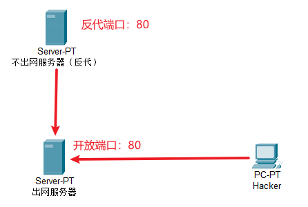

当然可能还会有更复杂的情况，我们可以在拿到webshell后通过ping外网主机来判断

### 环境复现

（ps：为了方便我这里就用宝塔自带的反代）

**不出网服务器WIN7**：

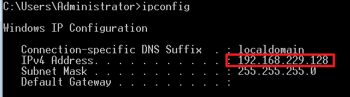

**出网服务器Ubuntu**：

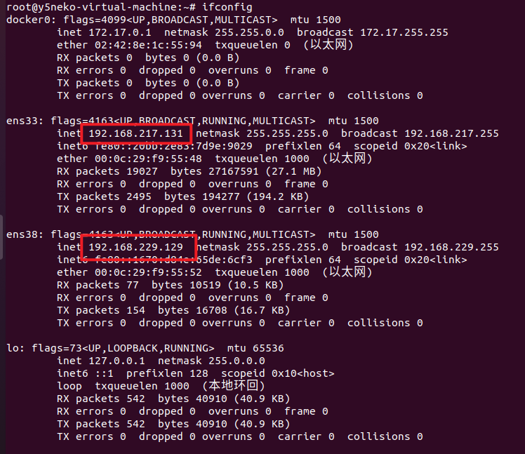

反代设置：

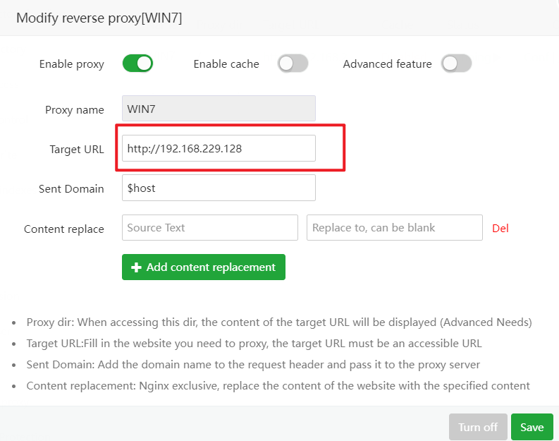

成功搭建：

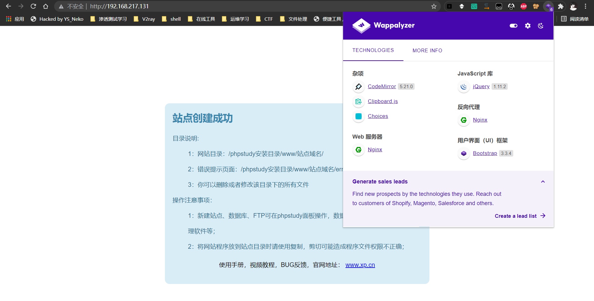

webshell：

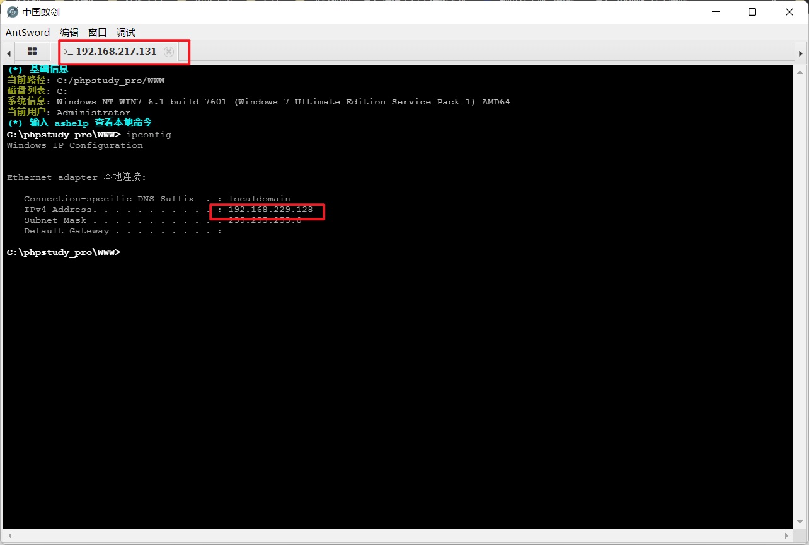

测试出网情况：

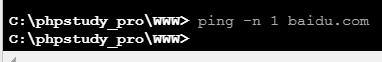

### 渗透方法

像这种不出网的情况下，一般是不能直接进内网的，如果要进行内网渗透，一般有以下几种操作：

#### reG正向代理

在不出网的情况下，使用reG比较多，类似的方法还有webshell形式的http代理

这里以reG为例子，首先下载reG上传到目标主机，全部正常后访问显示如下：

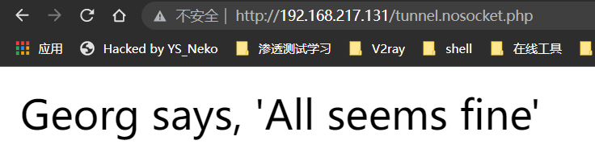

接着使用reg自带的连接工具进行正向连接：

```sh
python H:\学习记录\学习记录Markdown\安全学习\第三周\reGeorg-master\reGeorgSocksProxy.py -u http://192.168.217.131/tunnel.nosocket.php -p 1080
```

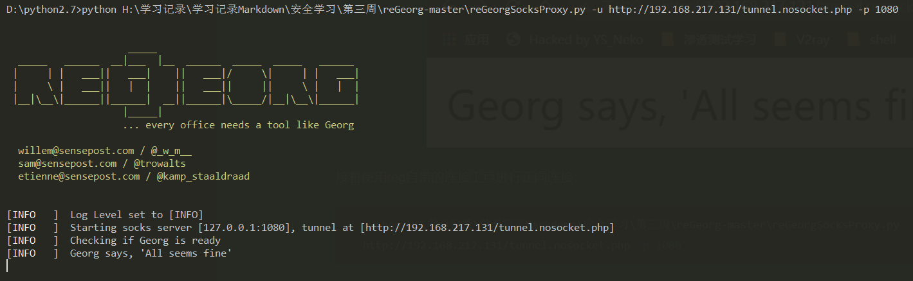

这样就开放了一个socks的端口，即1080，使用socks客户端进行连接

这里我使用哥斯拉自带的代理功能直接连接不出网主机：

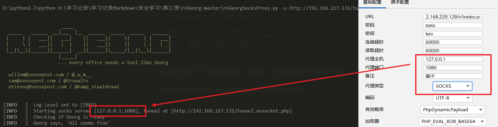

成功连接：

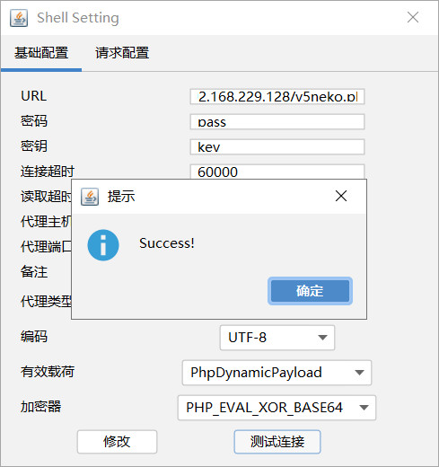

#### pystinger

可以通过webshell实现内网SOCK4代理

首先把对应脚本文件上传到目标服务器

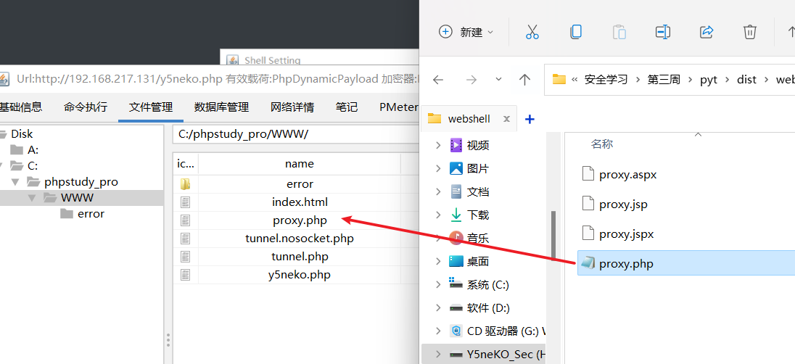

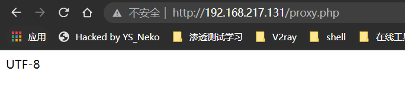

接着把stinger的服务端上传到目标主机

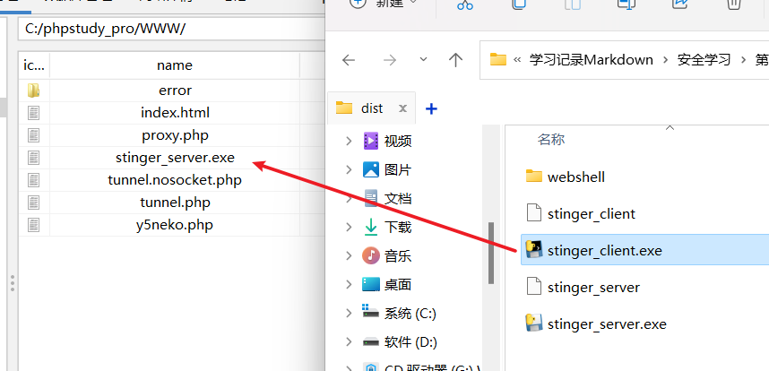

执行命令：

```sh
stinger_server.exe 0.0.0.0	#监听本地所有端口
```

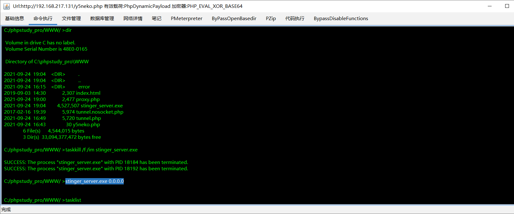

上传stinger客户端到vps上（这里以本机为例）

执行命令

```sh
stinger_client.exe -w http://192.168.217.131/proxy.php -l 0.0.0.0 -p 60000
```

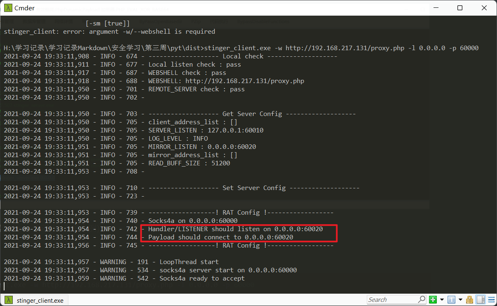

此时

