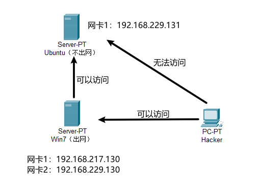
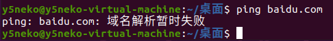
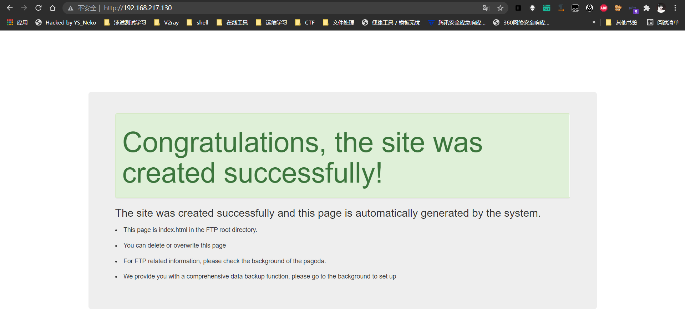
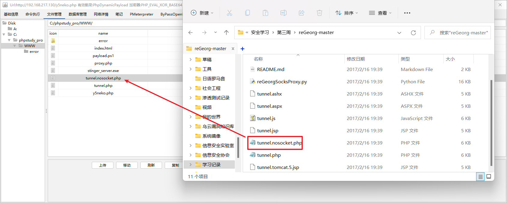
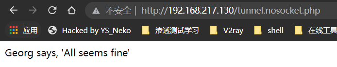
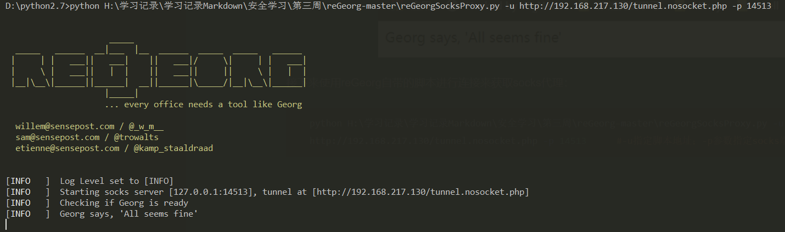
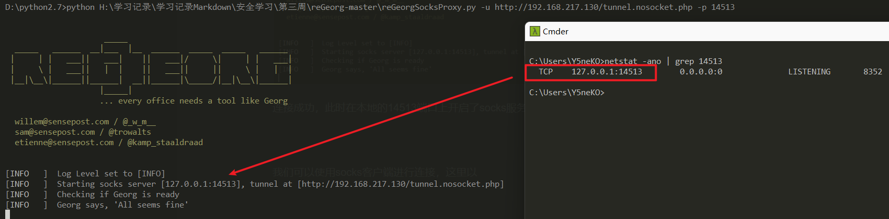

## Q&A

Q1：不出网有什么方法，正向shell方法出了reg之类的，还有什么？

A1：

Q2：redis攻击面

A2：

Q3：Mysql攻击面

A3：

Q4：AMSI怎么绕过

A4：

## 内网渗透 - webshell不出网情况

#### 环境搭建



**Win7（跳板机，出网）**

网卡1（NAT）：192.168.217.130

网卡2（仅主机）：192.168.229.130

环境：宝塔

------

**Ubuntu（目标机，不出网）**

网卡1（仅主机）：192.168.229.131

环境：宝塔国际版



> 跳板机Win7设置两个网卡，**网卡一NAT**用以出网，**网卡二仅主机**用以与内网不出网主机连接
>
> 目标机Ubuntu设置一个网卡，**网卡一仅主机**用以表示内网不出网的情况

为了模拟webshell不出网的情况，我们使用反向代理，利用**跳板机Win7**反代**目标机Ubuntu**的80端口：

跳板机Win7反向代理配置如下


访问跳板机Win7：



成功反代目标机Ubuntu的80端口。

#### 渗透方式

##### reGeorg正向代理

假设已经拿到了webshell权限


首先上传reGeorg对应的脚本文件到跳板机上：



访问显示如下表示成功：

```sh
http://192.168.217.130/tunnel.nosocket.php
```



接下来使用reGeorg自带的脚本进行连接来获取socks代理：

```sh
python H:\学习记录\学习记录Markdown\安全学习\第三周\reGeorg-master\reGeorgSocksProxy.py -u http://192.168.217.130/tunnel.nosocket.php -p 14513		#-u指定脚本地址；-p参数指定socks端口
```



连接成功，此时在本地的14513端口上开启了socks服务



我们可以使用socks客户端进行连接，这里以**proxychains**为例：

