## Q&A

Q1：pth在什么情况下能成功、哈希传递受到什么限制、什么情况下不能传递？

A1：①pth在获取到目标机器中**RID为500的内置管理员账户**或**在目标机器本地管理员组的域成员账户**的hash值的情况下能成功；②哈希传递会受到目标系统上的UAC的限制，如果不是RID=500的内置账户则不会以完全管理员权限登录系统；③若目标系统完全禁止了所有用户的远程登录权限（包括RID为500的内置管理员），则无法进行传递。

Q2：安装补丁KB2871997后影响

A2：见文章中`KB2871997补丁 --> 补丁对PTH攻击的影响` 

Q3：黄金白银票据

A3：见文章中`黄金白银票据`

Q4：黄金白银票据区别

A4：见文章中`黄金白银票据 --> 黄金白银票据的区别`

Q5：一个有普通权限的webshell，在无法提权但有hash时如何进行权限提升和内网横向渗透

A5：首先我们如果拿到了管理员hash，并且目标的445端口开放，那么我们可以使用msf的`exploit/windows/smb/psexec`进行pth远程登录，从而进行横向移动，直到拿到域管理员权限为止。


------


## PTH（Pass The Hash）攻击

### 概述

由于在进行认证的时候，是通过用户hash加密时间戳，即使在使用密码进行登录的情况下，也是先把密码加密成hash，再进行认证。因此在只有用户hash，没有明文密码的情况下也是可以进行认证的。

### 原理

由NTLM和Kerberos的认证过程可知，在认证过程中的第一步，都是使用用户hash来加密一段值

由于Server 2012后的系统中都无法直接抓取明文密码，又因为密码安全意识的提升，在很多情况下会遇到拿到hash值却无法破解的情况。

通过这个认证机制的逻辑漏洞，我们无需破解明文密码也可以直接使用hash值进行认证

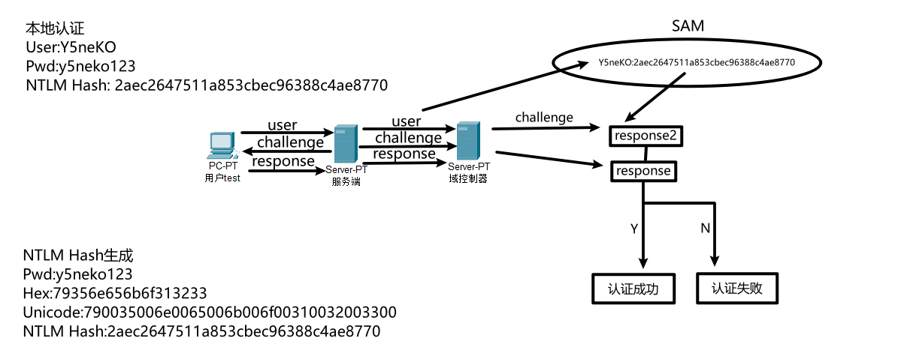

### 利用

利用条件：

> 1.被pth攻击的计算机未打补丁(KB2871997)
>
> 2.拿到一台域成员主机并且拿到管理员组的域用户的NTML
>
> 3.对方主机存在相同账号并且是管理员组成员

这里以域环境下使用`Mimikatz`工具对IPC连接验证进行绕过

DC：

`name：SERVER2016DC`

`ip：192.168.5.1`

`domain：Y5NEKOAD`

`user：Administrator`

`password：y5neko@dc123`

假设我们已经拿到域内主机权限和hash值，并且密码与DC相同的情况下，即：

`NTLM Hash：85dafeeae5eacd3be1e561eea0a064ca`

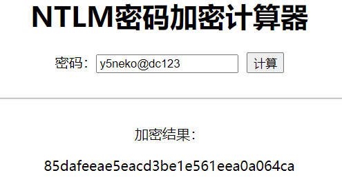

使用mimikatz工具的pth功能

```sh
privilege::debug	#提升权限
token::elevate
sekurlsa::pth /user:Administrator /domain:Y5NEKOAD /ntlm:85dafeeae5eacd3be1e561eea0a064ca
```

成功传递后会弹出一个cmd窗口，我们可以使用这个hash值登录域内的其他同等hash的账户

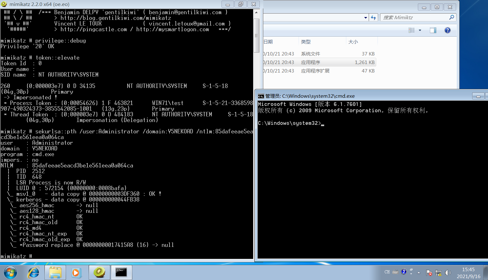

正常情况：

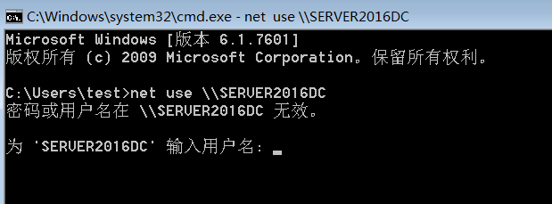

PTH攻击：

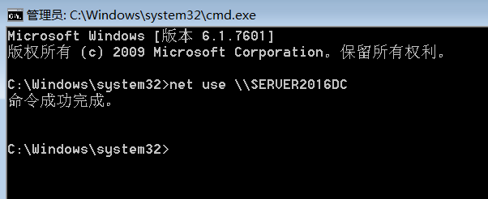

### 限制

user account control(UAC) token filtering in the context of remote access(UAC 远程限制)

UAC是window Vista的新安全组件，影响的版本有：Windows 7, Windows Server 2008, Windows Server 2008 R2, Windows Server 2012, Windows Server 2012 R2s及以上版本

> “管理员”组的成员具有两个令牌。一个具有标准用户权限，另一个具有管理员权限。默认情况下，当管理员执行任务时，它是在标准的受限上下文中完成的。另一方面，如果需要管理任务，那么Windows将显示的这个此称为UAC（用户帐户控制）。

对PTH攻击产生影响的功能有如下两个：

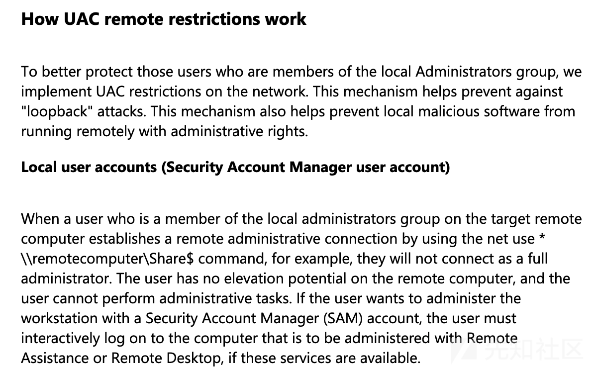

UAC为了更好地保护属于本地Administrators组成员的那些用户，在网络上实施了UAC的限制，例如：

> 当作为目标远程计算机上**本地管理员组成员**的用户通过使用net use \\\\SERVERNAME\\C$命令建立远程管理连接时，他们将不会以完全管理员身份进行连接。用户在远程计算机上没有潜在的提升权限，并且用户无法执行管理任务。如果用户要使用安全帐户管理器（SAM）帐户管理工作站，则用户必须以交互方式登录到要通过远程协助或远程桌面管理的计算机。

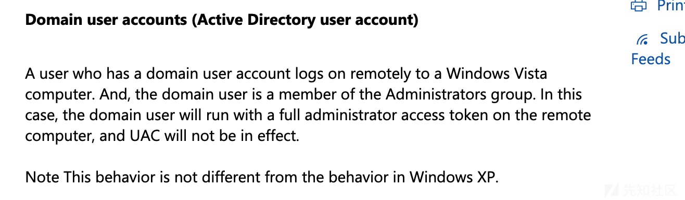

> 具有**域用户帐户**的用户可以远程登录Windows Vista计算机。并且，域用户是Administrators组的成员。在这种情况下，域用户将在远程计算机上使用完整的管理员访问令牌运行，并且UAC无效。

总结两个功能：在使用本地用户进行远程登录时不会使用完全管理员权限（full administrator），但是在域用户被加入到本地管理员组之后，域用户可以使用完全管理员（full administrator）的Access Token运行，并且UAC不会生效。

这两个特定的限制组合在一起，就形成了一种神奇的效果：

自window vista之后，无法使用RID非500的本地管理员用户来进行Pass The Hash攻击， 但是如果是域用户且该域用户属于本地Administrators组的成员却仍然可以进行pass the hash攻击。由于一些巧合，很多人一度认为这个现象是受KB2871997补丁的影响，实际上是因为UAC功能。

### 防御

经过以上分析我们可以知道，pth攻击成功可以通过RID为500的本地管理员账户、属于本地Administrators组的域账户，因此到这里，防止Pass The Hash类型的横向移动的方法也很明显了：

- 限制RID为500的本地管理员账户远程登录

#### FilterAdministratorToken

FilterAdministratorToken（管理员批准模式）是UAC的注册表中一个注册表键值，默认情况下为Disable。

在UAC的控制策略中对于内置administrator帐户和域账户运行程序时会直接赋予**完全管理权限（fulladministrative privilege）**。这就是本地帐户administrator和域帐户成功，而RID非500的本地管理员帐户失败的原因。

在DC中查看本地安全策略中的“用户帐户控制：以管理员批准模式运行所有的管理员”确实是默认开启的。

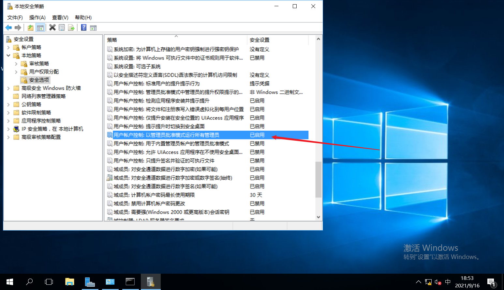

如果要限制Administrator的远程登录，我们把注册表项FilterAdministratorToken的值设置为1就可以

注册表路径为：`HKEY_LOCAL_MACHINE\SOFTWARE\Microsoft\Windows\CurrentVersion\Policies\System`，它的默认值是0

- 如果为0，则内置管理员帐户（RID 500）可以在没有UAC的情况下执行管理任务，该密钥不影响其他帐户。
- 如果将其设置为1，则内置管理员帐户（RID 500）也将受UAC的约束，除非**LocalAccountTokenFilterPolicy**将其设置为1。

我们把它改成1，修改之后Administrator的远程连接也会被拒绝。

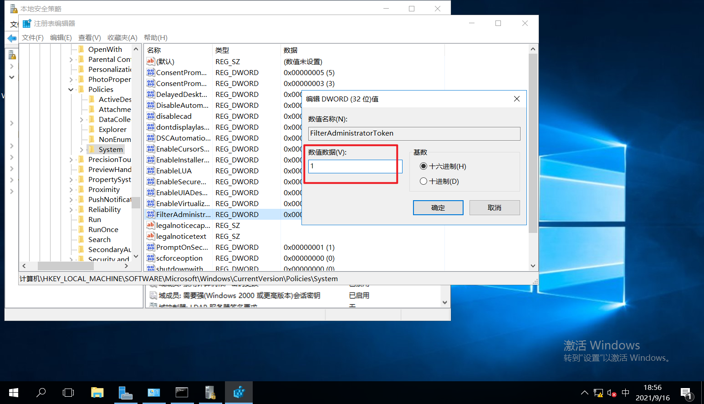

#### LocalAccountTokenFilterPolicy

刚刚也提到了一种特殊情况，就是在LocalAccountTokenFilterPolicy的值为1的时候，在默认情况下它的值是0

- 如果将其设置为“ 0”（默认值），则只有**内置管理员帐户（RID 500）**能够在没有UAC的情况下执行管理任务。由于将启用UAC，因此其他管理员帐户（即由用户创建然后添加为本地管理员的管理员帐户）将无法执行远程管理任务，因此它们只能使用其受限的访问令牌
- 如果将其设置为1，则“管理员”组中的**所有帐户**都可以执行内置或不内置的远程管理任务

并且这条注册表项的优先级在FilterAdministratorToken之上，用表格表示所有可能性如下：

| LocalAccountTokenFilterPolicy | FilterAdministratorToken | RID=500的内置管理员 | 其他管理员 |
| :---------------------------: | :----------------------: | :-----------------: | :--------: |
|               0               |            0             |         能          |    不能    |
|               0               |            1             |        不能         |    不能    |
|               1               |            0             |         能          |     能     |
|               1               |            1             |         能          |     能     |


------


## KB2871997补丁

该补丁主要包括以下几个内容：

1. 支持“Protected Users”组；
2. Restricted Admin RDP模式的远程桌面客户端支持；
3. 注销后删除LSASS中的凭据；
4. 添加两个新的SID；
5. LSASS中只允许wdigest存储明文密码。

**支持“Protected Users”组**

“Protected Users”组是Windows Server 2012 R2域中的安全组，“Protected Users”组的成员会被强制使用Kerberos身份验证，并且对Kerberos强制执行AES加密。

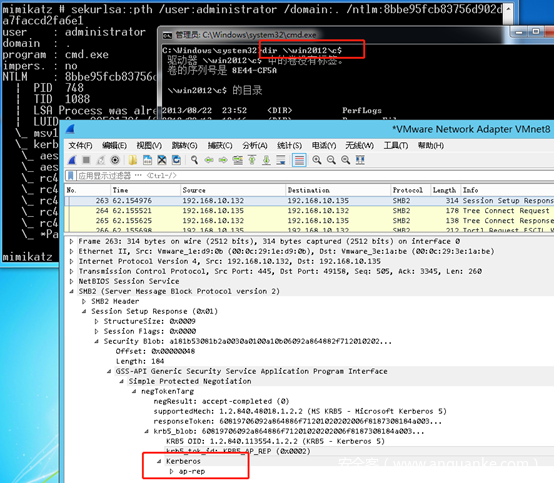

**Restricted Admin RDP模式的远程桌面客户端支持**

Restricted Admin RDP模式是为了避免将Client端的凭据暴露给远程系统，这个功能只支持Windows server 2012和Windows8.1

**注销后删除LSASS中的凭据**

在这个更新之前，只要用户登录系统，Windows就会在lsass中缓存用户的凭据，包括用户的明文密码、LM/NTLM HASH、Kerberos的TGT票据/Session Key。

**添加两个新的SID**

- 本地帐户，LOCAL_ACCOUNT（S-1-5-113），所有本地帐户继承自此SID；

- 本地帐户和管理组成员，LOCAL_ACCOUNT_AND_MEMBER_OF_ADMINISTRATORS_GROUP（S-1-5-114），所有管理员组的本地用户继承此SID。

**LSASS中删除了明文凭证**

由于兼容性原因，默认情况下禁用。明文密码存储在内存（LSASS）中，主要支持WDigest身份验证。

### 补丁对PTH攻击的影响

通过打补丁前后的对比来了解影响：

DC本地管理员中有以下两个账户：

- Administrator是RID为500的本地管理员账号（密码y5neko@dc123）
- pthtest是域账户（密码y5neko@pthtest）

**打补丁前：**

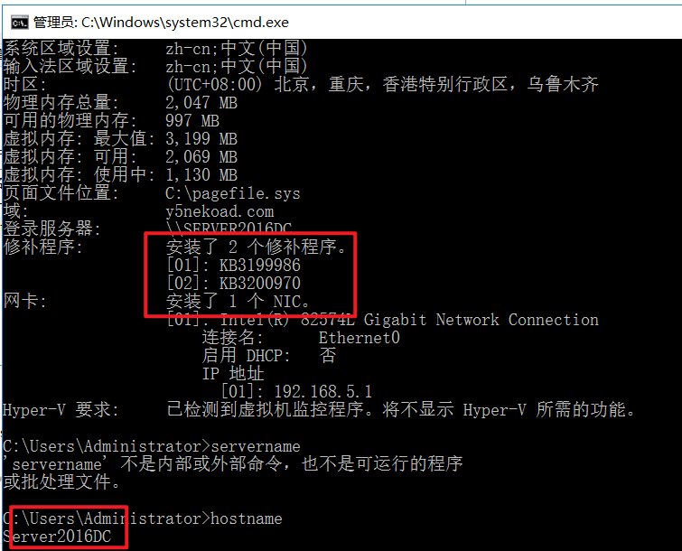

使用RID为500的账户Administrator：

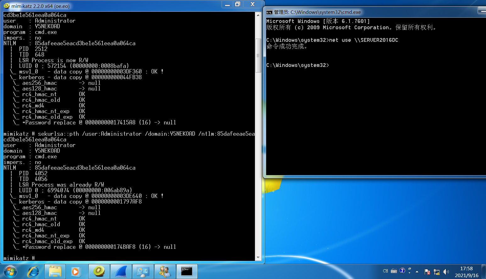

使用域账户pthtest：

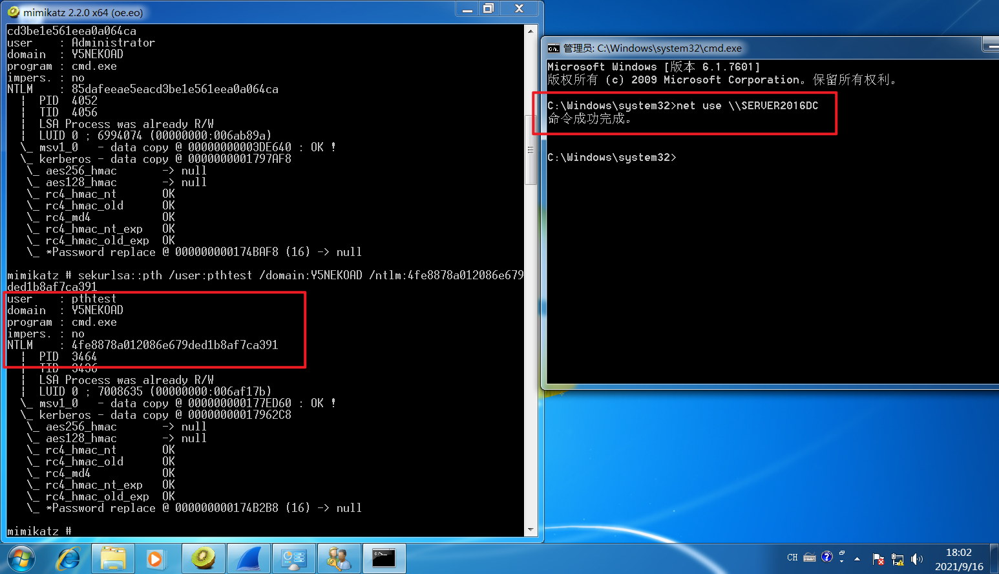

**打补丁后：**

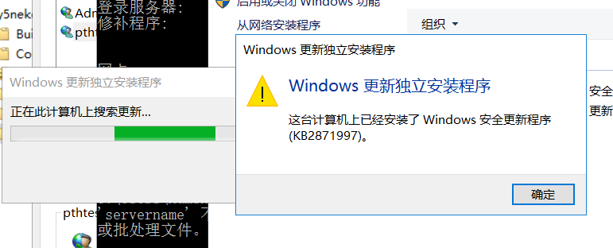

使用RID为500的账户Administrator：

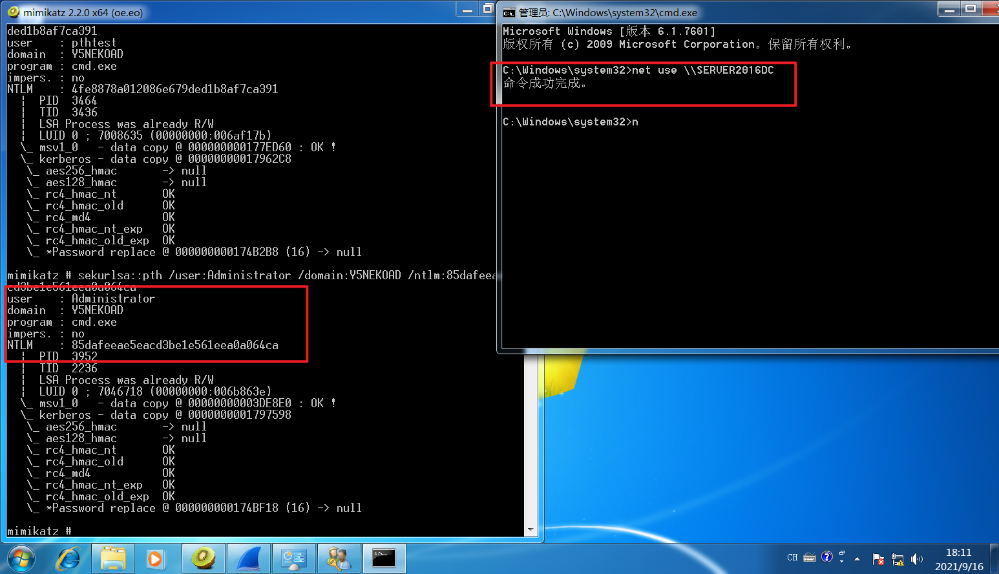

使用域账户pthtest：

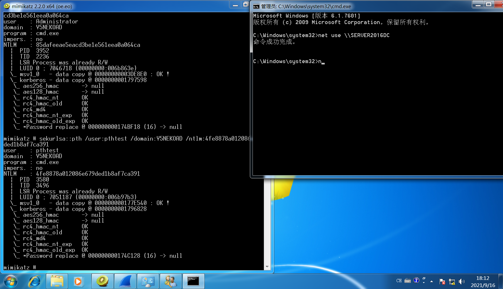

经过对比我们可以看到，打补丁前后pth攻击的结果是没有任何区别的。

通过结合之前KB2871997补丁的作用进行分析，我们可以得出结论：

> KB2871997并没有对pth攻击起到实际的限制作用，只是起到了一定的缓和作用。


------


## 黄金白银票据

首先贴一张Kerberos认证的流程图

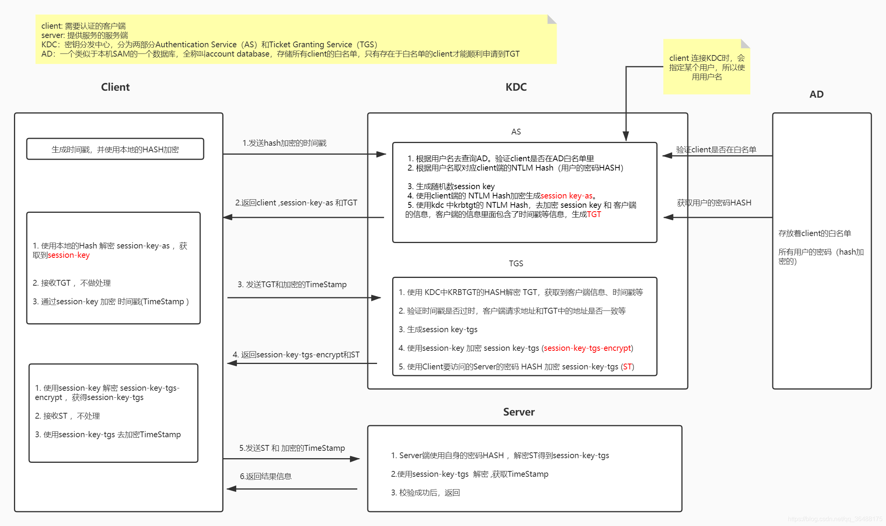

### 黄金票据

#### 原理

黄金票据就是伪造krbtgt用户的TGT票据，krbtgt用户是域控中用来管理发放票据的用户，拥有了该用户的权限，就可以伪造系统中的任意用户。

#### 利用条件

- 拿到域控权限（鸡肋，，，适合权限维持的时候使用）
- 拿到krbtgt用户的hash值（AES或者NTLM,要看算法要求）
- 拿到域名和域的SID值
- 伪造的用户名

#### 利用

**首先获取制作黄金票据需要的信息**

①获取域名

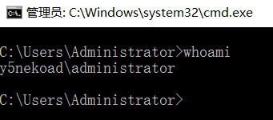

②获取域的SID

注意：域的SID是域用户ID去掉最后一个编号，即：

`S-1-5-21-1272869298-2579316034-2461789828`

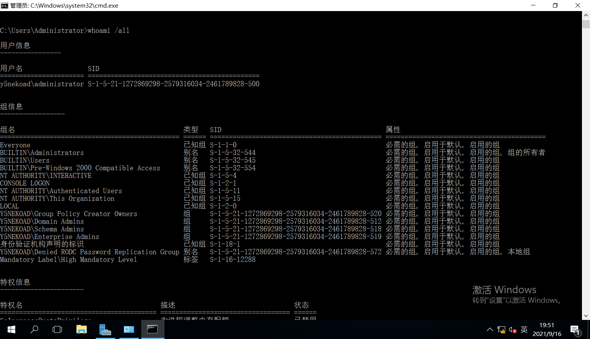

③获取krbtgt的hash值（mimikatz）

```sh
lsadump::dcsync /domain:域名 /user:krbtgt /csv
```

即：

`c6c752f26fddb1fa1e8826403fcf4eb2`

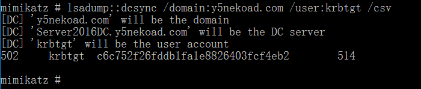

④伪造用户

首先`net group "Domain Admins"`查看域管账户

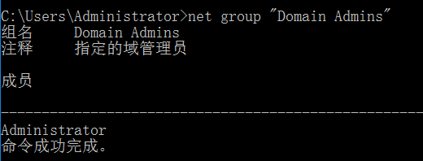

**获取到所有要用的信息后开始制作黄金票据**

①清除系统中所有缓存的票据

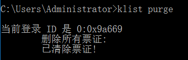

②使用Mimikatz制作黄金票据并注入到内存中

```sh
kerberos::golden  /admin:Administrator  /domain:y5nekoad.com  /sid:S-1-5-21-1272869298-2579316034-2461789828 /krbtgt:c6c752f26fddb1fa1e8826403fcf4eb2  /ptt			#若需要aes则将krbtgt换成aes256
```

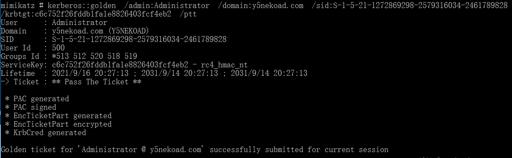

③制作成功，使用`klist`查看注入的票据

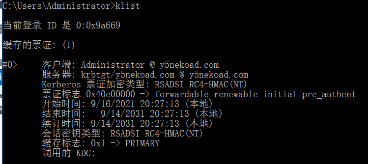

④我们还可以制作黄金票据并保存为golden_ticket.kirbi文件

```sh
kerberos::golden /admin:Administrator /domain:y5nekoad.com /sid:S-1-5-21-1272869298-2579316034-2461789828 /krbtgt:c6c752f26fddb1fa1e8826403fcf4eb2 /ticket:golden_ticket.kirbi		#若需要aes则将krbtgt换成aes256
```

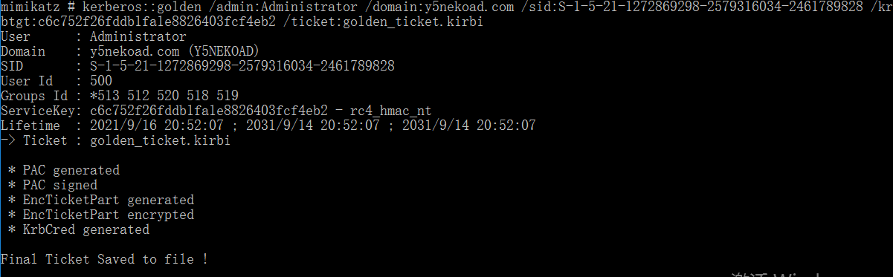

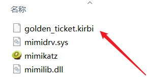

现在就可以使用这张黄金票据在域内任意一台机器上ptt访问DC了。

### 白银票据

#### 原理

白银票据是伪造ST，这样的好处是门票不会经过KDC，从而更加隐蔽，伪造的门票是专门给部分服务用的（参考kerberos认证流程中ST的作用），如cifs（文件共享服务），mssql，winrm（windows远程管理），DNS等等。

白银票据是出现在TGS_REQ & TGS_REP过程中的。在TGS_REP中，不管Client是否有权限访问特殊服务，只要Client发送的TGT票据是正确的，那么就会返回服务hash加密的tgs票据。如果我们有了服务hash，就可以签发tgs票据。

#### 利用条件

- 拿到目标机器的hash（和黄金票据不同，黄金票据需要拿到域控）
- 域名和域SID
- 目标服务器FQDN
- 可利用的服务
- 目标server账号的NTML HASH
- 需要伪造的用户名

能够利用的服务：

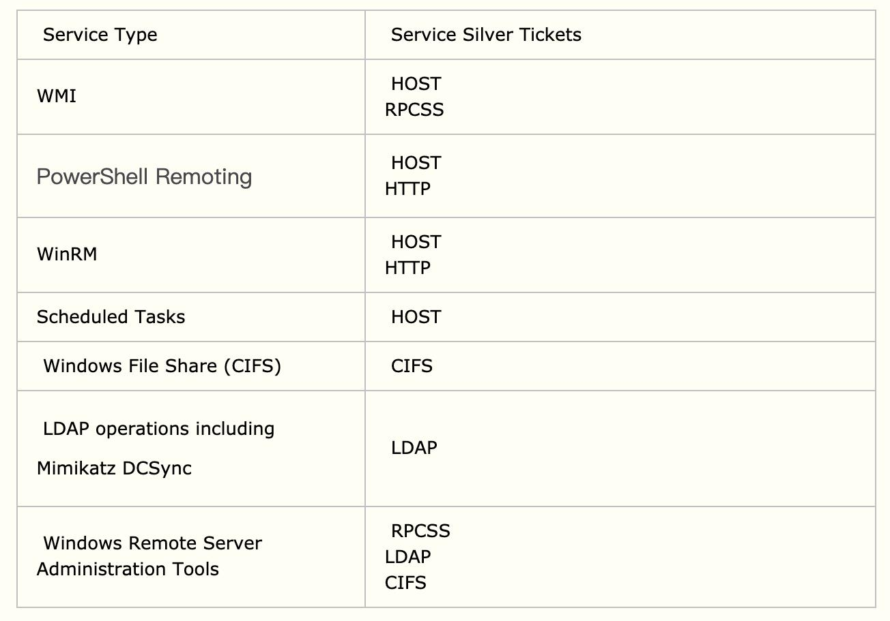

#### 利用

**首先获取制作白银票据需要的信息**

①获取域名

`y5nekoad.com`

②获取域的SID

`S-1-5-21-1272869298-2579316034-2461789828`

③获取目标机器的FQDN（完整域名）

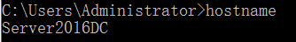

这里以域控为例，就是hostname＋域名：`SERVER2016DC.y5nekoad.com`

④获取目标上可利用的kerberos服务

以CIFS(磁盘共享的服务)为例

⑤server账号的hash（带$符号的hash）

```sh
mimikatz.exe privilege::debug sekurlsa::logonpasswords exit >> hash.txt
```

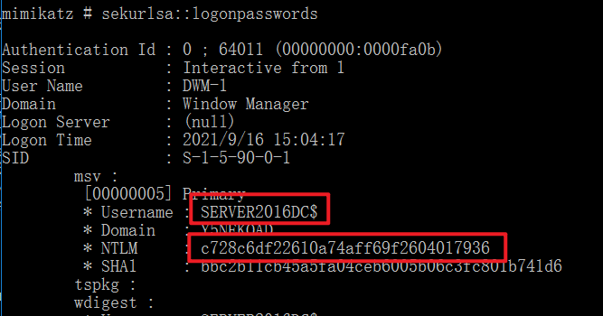

这里以域控为例，即：`c728c6df22610a74aff69f2604017936`

⑥伪造用户

这里以域控的账户为例`SERVER2016DC$`

**获取到所有要用的信息后开始制作白银票据**

①清除系统中所有缓存的票据

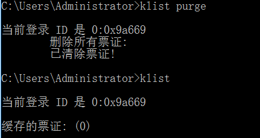

②使用Mimikatz制作白银票据并注入到内存中

```
kerberos::golden /domain:y5neko.com /sid:S-1-5-21-1272869298-2579316034-2461789828 /target:SERVER2016DC.y5nekoad.com /service:cifs /rc4:c728c6df22610a74aff69f2604017936 /user:SERVER2016DC$ /ptt
```

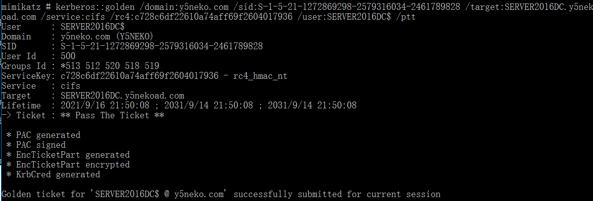

③制作成功，使用klist查看注入的票据

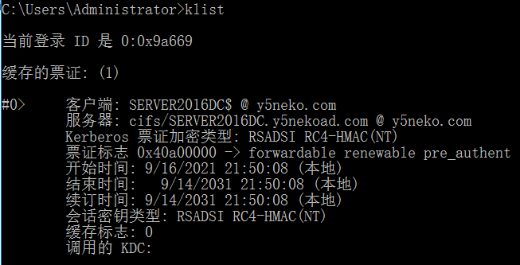

现在我们可以使用这张白银票据任意访问目标服务了

### 黄金白银票据的区别

主要有三个方面的区别

#### 获取的权限

- 黄金票据：通过伪造TGT票据，可以获取任意Kerberos的访问权限
- 白银票据：通过伪造ST票据，只能访问指定的服务，如CIFS等

#### 认证流程

- 黄金票据：与KDC交互，不与AS交互
- 白银票据：不与KDC交互，直接访问Server服务

#### 加密方式

- 黄金票据：通过 krbtgt 的 NTLM Hash 加密
- 白银票据：通过服务账号的 NTLM Hash 加密
