#### 分析

**漏洞环境**：这里我是直接用的vulhub的shiro550demo

##### 普通登录

我们直接下断点在登陆判定

然后回到web正常登录试试

可以看到在这里获取了三个登陆参数的值，然后带入`UsernamePasswordToken`类进行处理，跟进看一下这个类做了什么

从文档了解到这个类是封装了提交的用户名密码以及`rememberMe`是否勾选，继续跟进

这里设置好了四个字段，回到`UserController`类

可以看到把`UsernamePasswordToken`对象传入了`subject`的`login`方法，这里的`subject`对象实际上获取到的是`WebDelegatingSubject`对象

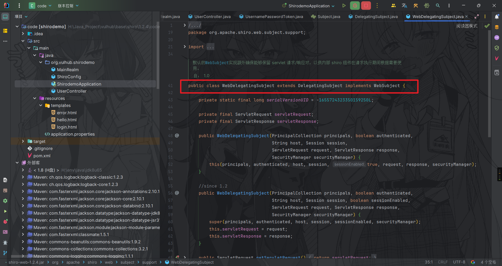

而`WebDelegatingSubject`对象是`DelegatingSubject`的子类，跟进到`DelegatingSubject`的`login`方法

这里又调用了`securityManager`的`login`方法来对token进行校验，即`DefaultSecurityManager`的login方法，判断是否有这个用户

login方法通过抽象类`AuthenticatingSecurityManager`的`authenticate`方法进行验证

这里包装的`authenticator`是`ModularRealmAuthenticator`，跟进

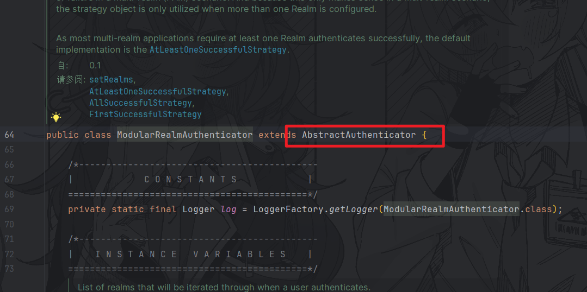

继承自`AbstractAuthenticator`，跟进到`authenticate`方法，中间又调用了`doAuthenticate`方法

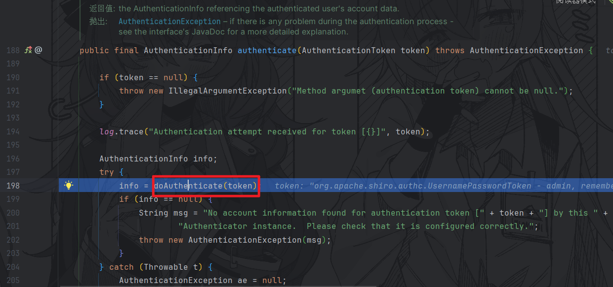

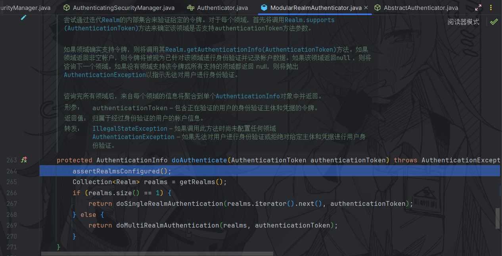

跟进到`doAuthenticate`方法，这个方法是通过迭代Realm的内部集合来验证token，如果realm有多个，会多个迭代验证，如果realm只有一个，则直接调用`doSingleRealmAuthentication`

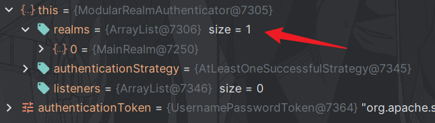

可以看到我们只有一个`MainRealm`，那么直接跟进到`MainRealm`的`Authenticator`

验证账号密码，通过则返回一个`SimpleAuthenticationInfo`，失败则抛出报错，最后将登录验证后的信息全部return，回到`UserController`

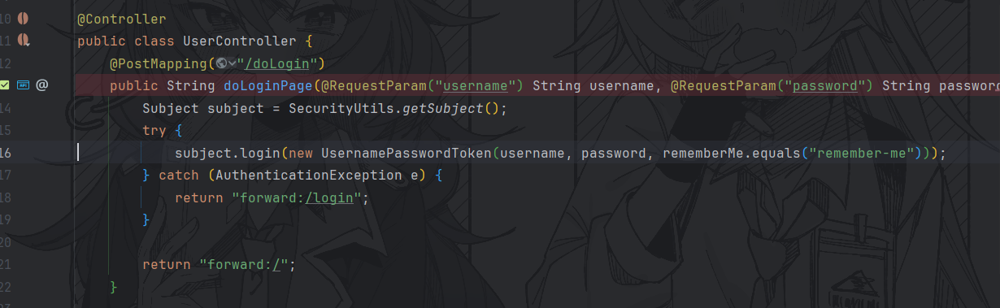

至此整个普通登录流程分析完毕

##### 勾选rememberMe登录，产生rememberMe

shiro550的主要漏洞点是rememberMe参数，我们来看看勾选了rememberMe后的登录流程

其他步骤和普通登录一样，我们直接跟到`UsernamePasswordToken`

回到`UserController`，跟进`DelegatingSubject`的login方法

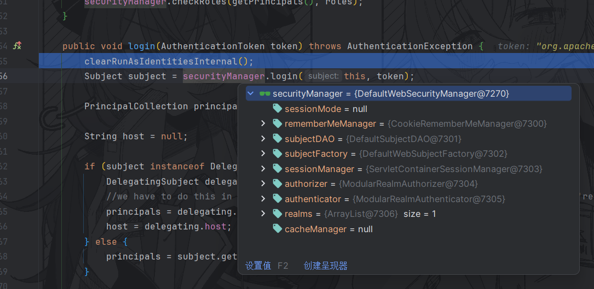

跟进到`DefaultSecurityManager`的login方法，完成了验证之后会调用`onSuccessfulLogin`方法

跟进到`onSuccessfulLogin`方法

调用了`rememberMeSuccessfulLogin`方法，继续跟进

此时rmm通过`getRememberMeManager`方法获取到了一个`RememberMeManager`对象

我们来看看`RememberMeManager`对象是怎么来的

跟进`RememberMeManager`，一共有两处实现了这个接口

回到`ShiroConfig`类，我们可以看到这里是通过`cookieRememberMeManager`作为RememberMeManager

直接跟进到`cookieRememberMeManager`类

跟进到父类`AbstractRememberMeManager`

这里是base64编码后的硬编码key

实例化时设置了默认的序列化器、设置加密服务为AES以及密钥，参数如下

此时我们获取到了一个完整的`cookieRememberMeManager`

回到`rememberMeSuccessfulLogin`方法

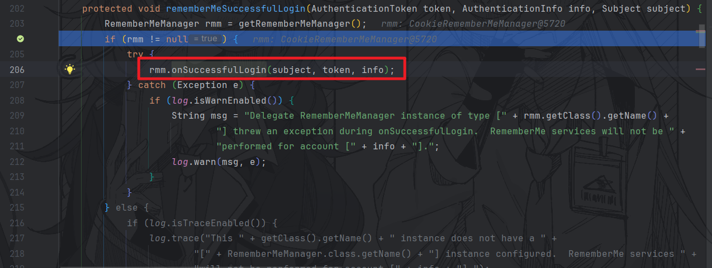

调用了rmm的`onSuccessfulLogin`方法

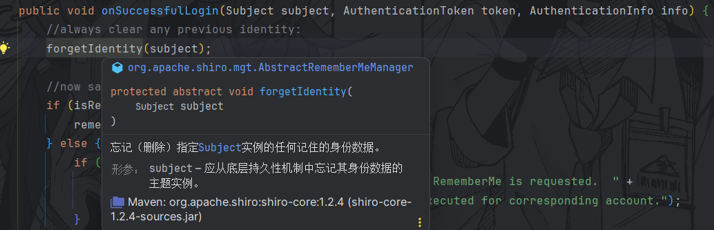

删除身份数据后，通过`isRememberMe`来判断是否启用了rememberMe

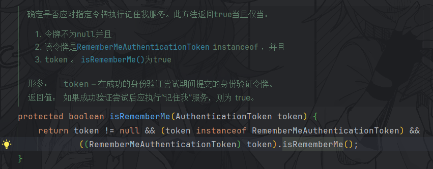

如果为true则进入`rememberIdentity`流程，先从authcInfo获取了账号主体，这一步是通过LinkedHashMap来追踪账号主体

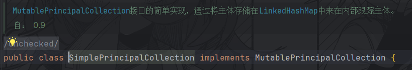

接着带着subject和主体进入下一个重载方法

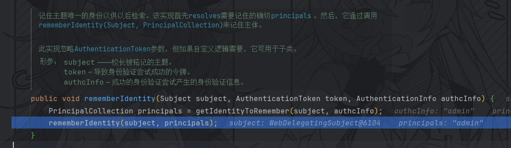

将帐户主体converting成字节数组的这一步就是我们的重点，直接跟进

通过文档了解到这一步是为了把主体集合转换成“记住登录”的数组，首先通过serialize将主体序列化为字节数组

接着调用`getCipherService`获取加密服务对字节数组进行加密，也就是之前提到的AES加密流程

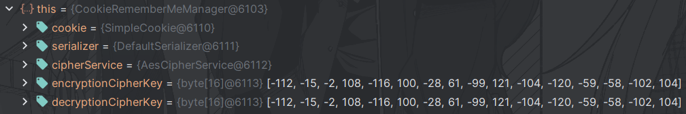

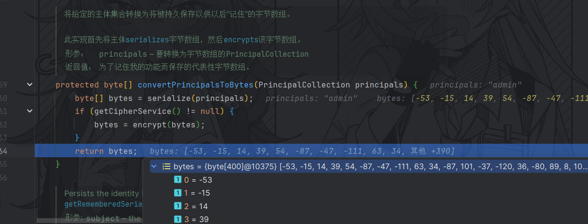

接着返回加密后的字节数组，回到`rememberIdentity`方法，进入最后一步`rememberSerializedIdentity`

在此处实现

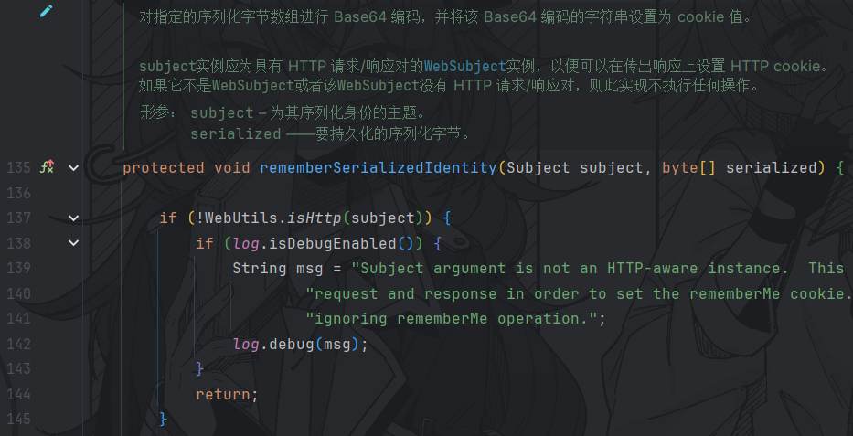

后面的步骤就很好理解了，先对传入的加密后的字节数组进行一次Base64编码，然后获取cookie模板创建一个SimpleCookie对象，接着通过操作SimpleCookie对象，把最终的rememberMe放进HTTP请求中的cookie

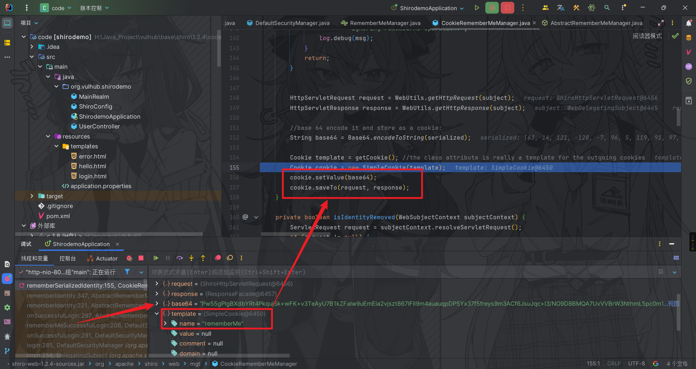

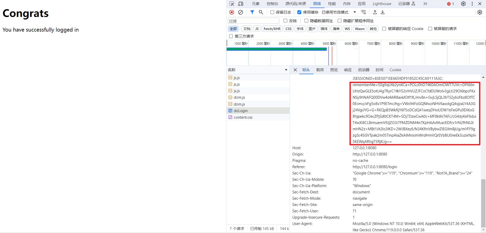

至此，整个产生rememberMe的流程分析完毕

##### rememberMe自动登录

上面分析了rememberMe产生的过程，接下来我们带着rememberMe直接访问，还是在登录判断处下断点

一路跟进到`DefaultSecurityManager`的login方法，在验证完token之后会通过`createSubject`创建登录后的Subject对象

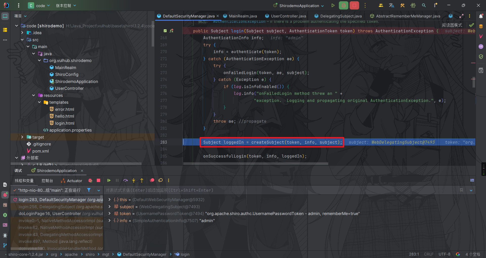

我们直接跟进到`createSubject`方法

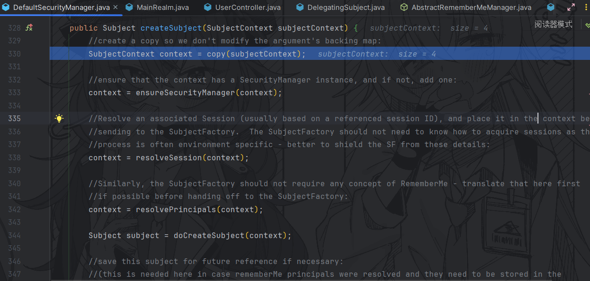

带着注释简单分析一下过程，首先通过`ensureSecurityManager`补充上SecurityManager实例，然后通过`resolveSession`解析Session，接着通过`resolvePrincipals`方法解析用户主体，最后再用context创建Subject实例

触发点就在解析用户主体的过程中，我们直接跟进

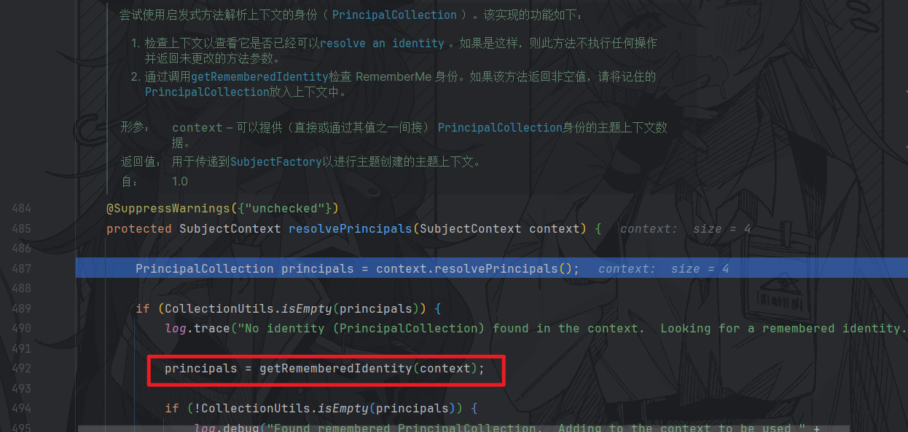

在这个过程中，先解析了主体，如果主体为空再通过调用`getRememberedIdentity`检查rememberMe身份，跟进

这里首先获取`RememberMeManager`，如果不为空则调用rmm的`getRememberedPrincipals`方法，跟进到`CookieRememberMeManager`的`getRememberedPrincipals`方法

这其中一共有两个重要方法`getRememberedSerializedIdentity`和`convertBytesToPrincipals`，我们首先看第一个

通过`getCookie().readValue()`获取cookie中rememberMe的值

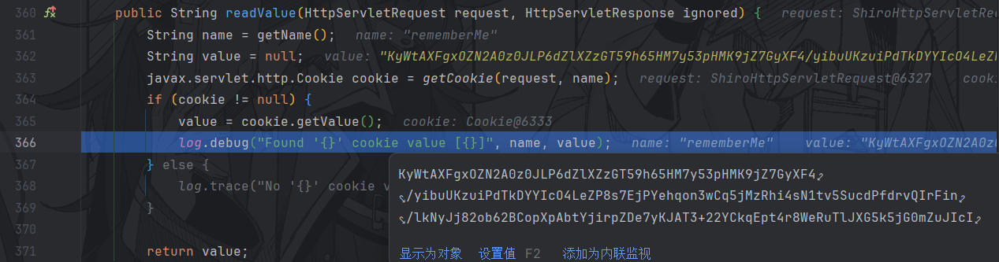

把value返回后在`getRememberedSerializedIdentity`中进行base64解码，然后转为字节数组并return

回到`getRememberedPrincipals`，如果返回的字节数组不为空则继续下一步`convertBytesToPrincipals`

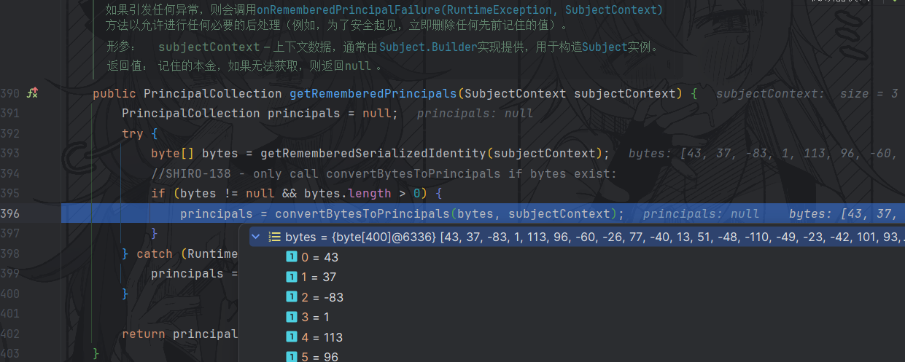

这里是获取解密服务，步骤和前面一样，通过AES解密字节数组，最后交给`deserialize`进行反序列化

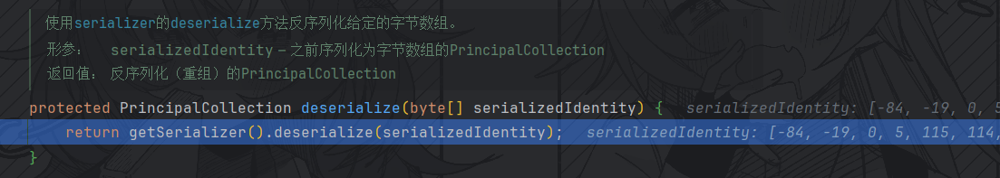

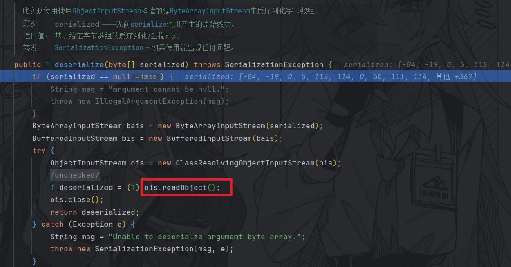

这就是最终触发反序列化的地方，返回一个账号主体

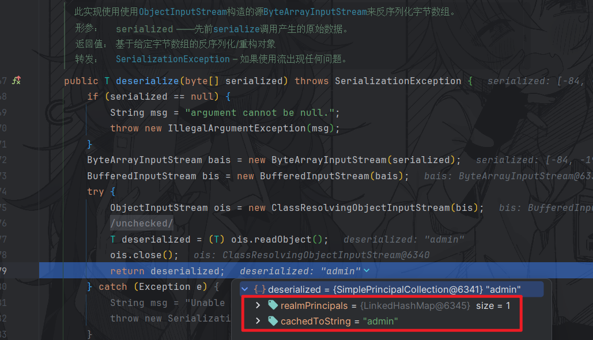

至此，整个rememberMe自动登录的过程分析完毕