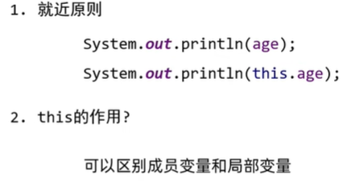

# Java

## Intellij快捷关键字

sout：快速生成system.out输出语句

100.fori：以变量i为计数快速生成循环100次的for循环

数组名.fori：以变量i为计数快速生成遍历数组的循环

psvm：快速生成静态main方法

Ctrl + Alt + M：快速从代码中提取方法并生成方法

Alt + INSERT -> Constructor：快速生成构造函数

Alt + INSERT -> getter and setter：快速生成JavaBean的设置器和获取器


## 运算符

### 加

**数字相加：**直接运算，遵从隐式转换规则；

**字符串相加：**只要有字符串参与运算时，就变成连接符，不再进行加运算；从左到右逐个执行；

**字符相加：**字符之间或与数字进行运算时，会先转换为对应的ascii码值再进行运算：`1 + 'a' = 98`；

### 自增自减

- 单独一行使用时++a和a++相同
- 参与了计算时，++a先运算再赋值，a++先赋值再运算

### 拓展赋值运算符+=、-=等

- 先将左边与右边进行运算，再赋值给左边：`a += 1`  》 `a = a + 1`
- 包含了强制类型转换：`short a = 1; a += 1;` 相当于 `a = (short)(a + 1);`

### 关系运算符

- ==、!=、>=、<=等
- 最后的值都是布尔类型

### 逻辑运算符

- `&`：两边都true才为true；`|`：两边都false才为false；`^`：两边相同则为false，不同则为true；`!`：取相反值；

### 短路逻辑运算

- `&&`和`||`，先判断左边的条件，如果已经能确定最终结果了（注意：逻辑与，左边为false，则整句为false；逻辑或，左边为true，则整句为true），则右边直接不参与执行（如果有自增运算符则不会生效），起到了短路的效果，可以提高程序运行效率


### 运算符优先级


- 小括号优先级最高

### 原码补码反码

- 原码：十进制数据的二进制表现，最左边一位符号位（0正1负），计算规则：`8(00001000) + 1 = 9(00001001)`；但在计算负数时`-1(10000001) + 1 = -2(10000010)`会产生错误的结果

- 反码：为了解决原码计算负数会出错的问题，计算规则：正数反码不变，负数符号位不变，数值取反（0/1互换），原码`-7(10000111)`取反码`-7(11111000)`计算`-7(11111000) + 1 = (11111001)`再取反码`-6(10000110)`，最终得到正确结果；但在跨零的时候`-0(10000000) + 1 = +0(00000000)`仍然会产生错误的结果
- 补码：解决0有两种表现形式（10000000/00000000）产生的报错，计算规则：在反码的基础上往前进1，原码`-4(10000100)`反码`11111011`补码`-4(11111100) + 5 = 1(00000001)`；特殊：-128只有补码，没有原码和补码；计算机中的存储和计算都是以补码的形式

### 按位运算符

- 逻辑与：按二进制位进行逻辑与运算，位数不够补0，`200 & 10 = 11001000 & 00001010 = 00001000 = 8`；逻辑或同理
- 左移：二进制位向左移动，低位补零：`200 << 2 = 0000|11001000 << 2 = 0011|00100000 = 800`；右移反之，高位补0或者1（正负数不同）；无符号右移一律补零


## 隐式类型转换

- 自动数据转换，取值范围小的数据类型自动向取值范围大的数据类型转换
- `byte < shot < int < long < float < double`

- byte、short、char类型进行运算时都会先转换成int类型再进行运算

## 强制类型转换

- int a = (int)String
- 数据会有一定程度的损失

## 流程控制

### switch语句


- default为默认的分支，可以写在任意位置，但需要保证程序可读性
- break可以跳出switch分支，如果不写可能导致case穿透（执行完了对应case没有break，会继续向下执行case里面的语句，直到结束或发现break），但在某些情况下也可以利用case穿透来简化代码，例如上图
- JDK12新特性：可以在case后面使用`case 1 -> {语句}`，可以省略break只执行大括号里的语句

### 循环语句中的思想

- 循环次数快速判断：`i = 1; i <= 5; i++;`时循环五次，`i = 1; i < 5; i++;`时循环四次；**带等加一，不等不变**；
- 累加思想；设定一个统计变量用以计数，如count，决定循环次数
- 知道循环次数用for，不确定循环次数可以用while

### while循环和for循环


### 算法练习——回文数


- 获取对应位数上的数字，个位：`x % 10`，十位：`x / 10 % 10`，百位：`x / 100 % 10`，以此类推
- 获取倒序数字：

```java
public class javaStudy {
    public static void main(String[] args) {
        int x = 12345;
        int num = 0;
        while(x != 0){              //通过循环，从右到左逐位获取数字
            int ge = x % 10;        //获取个位数，此时ge=5
            x = x / 10;             //获取倒数第二个数字，这一步是为了去掉已经记录的个位数，此时x=1234
            num = num * 10 + ge;    //这一步乘10是为了把最右边的个位数换到最前面，此时num=5
        }
        System.out.println("x的倒序数为：" + num);
    }
}
```

### 算法练习——不使用*/%求商和余数


- 思路：可以使用循环来递减，通过减的次数来得到商和余数，只要被除数≥除数就一直循环

```java
public class javaStudy {
    public static void main(String[] args) {
        int chued = 101;
        int chu = 10;
        int shang = 0;
        int yu = 0;
        while (chued >= chu){
            chued = chued - chu;
            yu = chued;
            shang++;
        }
        System.out.println("商：" + shang);
        System.out.println("余数：" + yu);
    }
}
```

### 跳转控制语句

- continue：停止本次循环，直接进入下次循环
- break：停止整个循环

### 算法练习——求平方根


- 思路：从1开始循环，用i的平方跟目标数字进行比较，如果一样就是平方根；如果小于就继续往后判断；如果大于，那么前一个数字i-1就是平方根的整数部分

### 算法练习——判断质数

- 思路：质数只能被1和本身整除；写一个循环，从2开始，到number-1为止，一直用这个数和number求余，遇到余数为0的时候就说明能被其他数整除，结束整个循环，并说明该数不是质数，否则一直循环下去直到自然结束，说明该数是质数；**设置一个flag**，初始为true，用以确认循环中是否有某一次被其他数整除，如果有就标记flag为false，最后通过flag进行判断

```java
public class javaStudy {
    public static void main(String[] args) {
        int number = 11;
        boolean flag = true;
        for (int i = 2; i < number; i++) {
            if (number % i == 0){
                flag = false;
                System.out.println(number+"不是质数");
                break;
            }
        }
        if (flag){
            System.out.println(number+"是质数");
        }
    }
}
```

### 算法练习——猜随机数

随即生成1~100的随机数，并判断猜测得对不对

- 思路：导入random包，限制随机数范围（包头不包尾，包左不包右）；`random.nextInt(101)`只能限定范围0到100，要生成1~100，可以使用`random.nextInt(100) + 1`即可生成

```java
import java.util.Scanner;
import java.util.Random;

public class javaStudy {
    public static void main(String[] args) {
        Random random = new Random();
        int random_number = random.nextInt(100) + 1;

        Scanner s = new Scanner(System.in);

        while (true){
            System.out.print("请输入你猜测的数字：");
            int number = s.nextInt();

            if (number > random_number){
                System.out.println("猜测结果过大");
            } else if (number < random_number) {
                System.out.println("猜测结果过小");
            } else {
                System.out.println("生成的随机数为：" + random_number);
                System.out.println("猜测成功");
                break;
            }
        }

    }
}
```


## 数组

- 定义：一种容器，可以用来存储同种类型的不同数据


### 初始化

**静态初始化**

完整格式：`数据类型[] 数组名 = new 数据类型[] {1, 2, 3}`

简化格式：`数据类型[] 数组名 =  {1, 2, 3}`

**动态初始化**

完整格式：`数据类型[] 数组名 = new 数据类型[数组的长度];`

默认初始化值：引用数据null，整数数据0，小数数据0.0，字符类型`\u0000`，布尔类型false

**区别**


### 访问数组元素

- 索引从0开始，访问第几个元素，索引就要减一
- 访问格式：`System.out.println(arr[0]);`
- 赋值同理：`arr[0] = 100;`
- 数组的长度属性调用方式：`数组名.length`

### 数组遍历

```java
public class javaStudy {
    public static void main(String[] args) {
        int [] arr1 = {1,2,3,4,5};
        for (int i = 0; i < 5; i++) {
            System.out.println(arr1[i]);
        }
    }
}

```

### 数组的常见操作

**求最值**

- 思路：遍历数组获取每一个元素；定义max变量依次与每个元素比较，如果比max大则用max记录；max的值应该是数组里的值，否则如果全是负数，最终获取到的值可能是0；

```java
public class javaStudy {
    public static void main(String[] args) {
        int[] arr1 = {1, 2, 3, 4, 5};
        int max = arr1[0];

        for (int i = 0; i < arr1.length; i++) {
            if (arr1[i] > max){
                max = arr1[i];
            }
        }

        System.out.println("数组中的最大值是：" + max);
    }
}
```

**遍历随机数数组求和**

- 思路：先定义并动态初始化一个数组；循环生成十个随机数，依次遍历数组元素并赋值；定义sum变量循环求和

```java
import java.util.Random;

public class javaStudy {
    public static void main(String[] args) {
        int[] arr1 = new int[10];
        Random r = new Random();

        for (int i = 0; i < arr1.length; i++) {
            arr1[i] = r.nextInt(100) + 1;
            System.out.println(arr1[i]);
        }

        int sum = 0;
        for (int i = 0; i < arr1.length; i++) {
            sum = sum + arr1[i];
        }
        System.out.println("10个随机数的和为：" + sum);
    }
}
```

**遍历随机数数组求平均值**

- 思路：在求和的基础上除以数组的长度

**求数组中小于平均值的数据个数**

- 

- 思路：定义一个count变量，循环，如果比平均值小，则count++，最后打印count

**交换数组首尾索引对应的元素**

- 思路：定义两个变量`i = 0,j = arr1.length - 1;`先交换首尾（索引为0和索引为数组长度-1），再交换第二个和倒数第二个（索引为1和索引为数组长度-2），此时i++，j--，直到i不再小于j为止；最后遍历数组打印出来即可

```java
public class javaStudy {
    public static void main(String[] args) {
        int[] arr1 = new int[] {1,2,3,4,5};

        for (int i = 0,j = arr1.length - 1; i < j; i++, j--){
            int temp = arr1[i];
            arr1[i] = arr1[j];
            arr1[j] = temp;
        }

        for (int i = 0; i < arr1.length; i++) {
            System.out.print(arr1[i] + " ");
        }
    }
}
```


### 数组地址值

```java
public class javaStudy {
    public static void main(String[] args) {
        int [] arr1 = {1,2,3};
        double [] arr2 = {1.1,2.2,3.3};
        System.out.println(arr1);
        System.out.println(arr2);
    }
}
```


- [：代表该地址是个数组类型
- I，D：i代表int类型，d代表double类型
- @：间隔符号
- 最后的八位：数组真正的十六进制地址值

### 数组的内存

**Java内存分配**


例：


- 流程：首先定义main方法时载入栈内存，通过`int[] arr`定义一个数组，可以记录一个int数组的**地址值**，而直接定义变量记录的是**真实的数据**，因此我们使用输出语句直接打印arr时，输出的只是int数组的地址值；new关键字则在**堆内存**中创建一段内存，通过赋值运算符，将这一段内存地址值赋值给刚刚的arr数组；最后通过arr的索引，先找到arr数组记录的地址，再通过索引找到堆内存中对应地址的数据值：`arr[0] -> [I10f87f48[0] -> 0`


## 方法

- 方法是程序中最小的执行单元

### 方法重载


- 同一个类中，方法名相同，参数不同（个数，类型，顺序）的方法都构成重载关系，与返回值无关

### 方法的内存


- 先进栈的方法后出栈

**方法传递基本数据类型的内存原理**


**方法传递引用数据类型的内存原理**


**区别**


### 方法的值传递


- 方法传递基本数据类型时，传递的是真实的数据，形参改变不影响实参的值（因为每个方法使用的都是独立的栈内存，方法执行完毕就出栈，不影响其他方法栈内存里的值）


- 方法传递引用数据类型是，传递的是地址值，真正改变的是堆内存中的值，如果有另一个方法也调用了这个地址，那么结果就会受影响（例如`main.arr[0] -> I[@001[0] -> 200`，则`change.arr[0] -> I[@001[0] -> 200`）


## 综合练习


## 面向对象


### 定义类


### 封装

- 对象代表什么，就得封装对应的数据，并提供数据相对应的行为


- 例如String对象，封装了`.length()`，`.toUpperCase()`等方法，可以直接调用：`String s = "abcd"; sout(s.length()); -> 4`

#### private关键字

- 权限修饰符，只有所在类可以访问

#### this关键字



### 构造方法

- 在创建对象的时候给成员变量进行赋值


- 如果没有写任何构造方法，虚拟机会自动加上一个空参构造方法（看不到），如果已经定义了构造方法，那么虚拟机将不再构造，无法再调用无参构造方法，如需无参构造方法则需要自行定义


- 带参数的构造方法和无参的构造方法，方法名相同，参数不同，称作构造方法的重载
- 系统会根据参数的个数自动选择重载方法


### 标准JavaBean类


**主类**

```java
package com.JavaStudy.test;

public class javaStudy {
    public static void main(String[] args) {
        User u = new User("Y5neKO", "男", 21);
        u.setName("YS_Neko");
        System.out.println(u.getName());
    }
}
```

**User类**

```java
package com.JavaStudy.test;

public class User {
    private String name;
    private String sex;
    private int age;

    //空参构造方法
    public User(){
        System.out.println("空参构造方法");
    }

    //带全部参数的构造方法
    public User(String name, String sex, int age){
        this.name = name;
        this.sex = sex;
        this.age = age;
    }

    //get和set方法
    public void setName(String name) {
        this.name = name;
    }

    public void setSex(String sex) {
        this.sex = sex;
    }

    public void setAge(int age) {
        this.age = age;
    }

    public String getName(){
        return this.name;
    }

    public String getSex(){
        return this.sex;
    }

    public int getAge(){
        return this.age;
    }
}
```

### 对象的内存图

- 创建对象时的过程：

`加载class字节码 -> 申明局部变量 -> 在堆内存中开辟一块空间 -> 默认初始化 -> 显示初始化 -> 构造方法初始化 -> 将堆内存中的地址值赋值给栈内存中的局部变量`

**一个对象的内存图**


### this的内存图

- 本质：代表方法调用者本身的地址值

### 成员变量和局部变量

- 成员变量：在类中且在方法外的变量
- 局部变量：方法中的变量

**区别**


